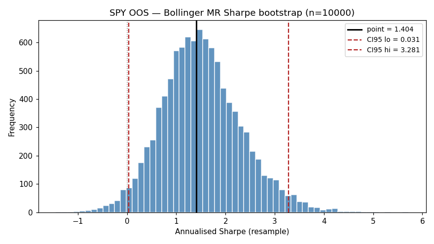
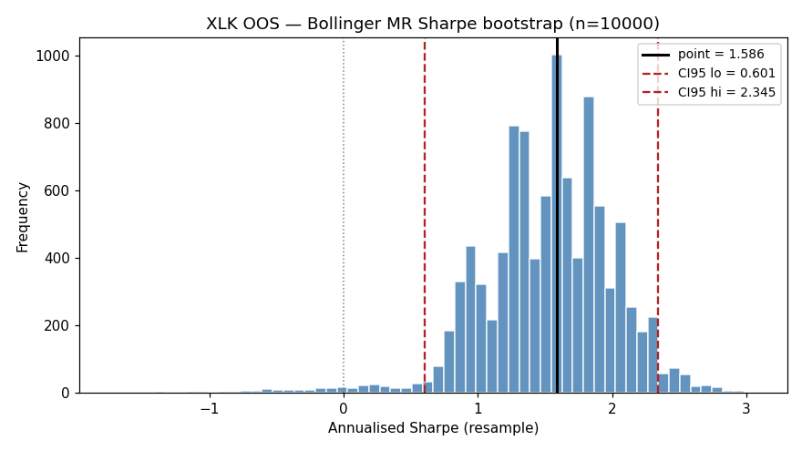
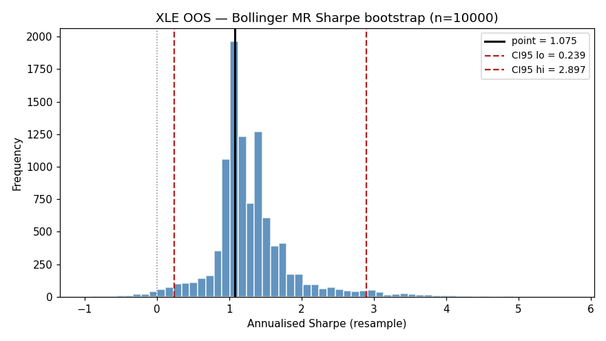

# Bollinger MR — MC Bootstrap CI (Politis-Romano stationary)

Bootstrap params: `block_mean=5`, `n_resamples=10000`, `seed=42`.
OOS window: `2025-01-01 → 2026-04-15`. Cash: $100,000. risk_pct: 0.95.

**Sharpe** is annualised from per-trade price returns (`(exit-entry)/entry`, signed by side); **CAGR** and **MaxDD** compound returns at `risk_pct × ret` per trade — matches `BollingerMRStrategy`'s sizing.
Sharpe is leverage-invariant (risk_pct cancels in `mean/std`); CAGR/MaxDD scale with `risk_pct`.

Citations: `[advances_fin_ml, p.196-202, ch.11]` — Sharpe CI; Politis & Romano (1994) — stationary bootstrap.

## Per-ticker OOS Sharpe / CAGR / MaxDD with 95% CI

| Ticker | N | Years | Sharpe (point) | Sharpe CI95 | CAGR (point) | CAGR CI95 | MaxDD (point) | MaxDD CI95 |
|---|---|---|---|---|---|---|---|---|
| SPY | 59 | 1.26 | 1.404 | [0.031, 3.280] | 16.74% | [-0.36%, 36.02%] | -11.16% | [-15.47%, -2.53%] |
| XLK | 59 | 1.24 | 1.586 | [0.601, 2.345] | 400.54% | [7.41%, 2602.08%] | -13.40% | [-20.99%, -4.96%] |
| XLE | 50 | 1.21 | 1.075 | [0.239, 2.897] | 106.99% | [2.44%, 568.84%] | -10.41% | [-18.27%, -3.04%] |

## Train (2021-2024) baseline for comparison

| Ticker | N | Years | Sharpe (point) | Sharpe CI95 | CAGR (point) | CAGR CI95 | MaxDD (point) | MaxDD CI95 |
|---|---|---|---|---|---|---|---|---|
| SPY | 158 | 3.95 | 1.310 | [0.489, 2.206] | 14.67% | [5.02%, 24.80%] | -12.18% | [-17.22%, -4.44%] |
| XLK | 173 | 3.95 | 1.858 | [1.313, 2.350] | 793.60% | [207.27%, 2838.48%] | -13.85% | [-18.35%, -6.22%] |
| XLE | 165 | 3.92 | 1.547 | [1.026, 1.990] | 469.11% | [118.21%, 1524.90%] | -16.16% | [-30.67%, -11.07%] |

## Verdict

Lower bound of OOS Sharpe CI95 must be `> 0` for the edge to be statistically
non-trivial even before López de Prado deflation (DSR). If any ticker fails this,
its single-block OOS validation rests on luck, not reproducible structure.

## Histograms

