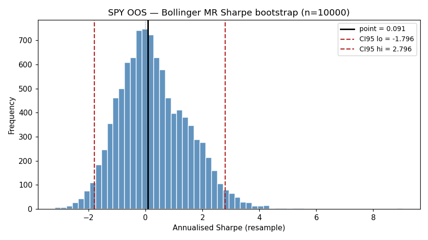

# Bollinger MR — MC Bootstrap CI (Politis-Romano stationary)

Bootstrap params: `block_mean=5`, `n_resamples=10000`, `seed=42`.
OOS window: `2025-01-01 → 2026-04-14`. Cash: $100,000. risk_pct: 0.95.

**Sharpe** is annualised from per-trade price returns (`(exit-entry)/entry`, signed by side); **CAGR** and **MaxDD** compound returns at `risk_pct × ret` per trade — matches `BollingerMRStrategy`'s sizing.
Sharpe is leverage-invariant (risk_pct cancels in `mean/std`); CAGR/MaxDD scale with `risk_pct`.

Citations: `[advances_fin_ml, p.196-202, ch.11]` — Sharpe CI; Politis & Romano (1994) — stationary bootstrap.

## Per-ticker OOS Sharpe / CAGR / MaxDD with 95% CI

| Ticker | N | Years | Sharpe (point) | Sharpe CI95 | CAGR (point) | CAGR CI95 | MaxDD (point) | MaxDD CI95 |
|---|---|---|---|---|---|---|---|---|
| SPY | 37 | 1.21 | 0.091 | [-1.796, 2.796] | 0.40% | [-16.18%, 15.86%] | -10.60% | [-22.27%, -2.37%] |

## Train (2021-2024) baseline for comparison

| Ticker | N | Years | Sharpe (point) | Sharpe CI95 | CAGR (point) | CAGR CI95 | MaxDD (point) | MaxDD CI95 |
|---|---|---|---|---|---|---|---|---|
| SPY | 151 | 5.06 | 0.716 | [-0.134, 1.728] | 6.24% | [-1.75%, 14.49%] | -16.57% | [-25.79%, -6.99%] |

## Verdict

Lower bound of OOS Sharpe CI95 must be `> 0` for the edge to be statistically
non-trivial even before López de Prado deflation (DSR). If any ticker fails this,
its single-block OOS validation rests on luck, not reproducible structure.

## Histograms

