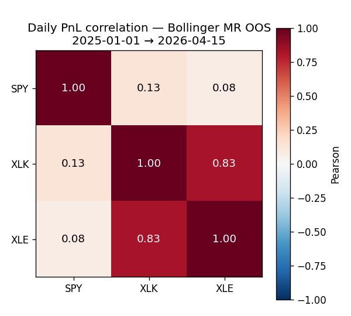

# Bollinger MR — Cross-Asset Trade Overlap (SPY / XLK / XLE)

OOS window: `2025-01-01 → 2026-04-15`. Trade counts: SPY=59, XLK=59, XLE=50.
Trading days with at least one PnL event: **112**.

## Jaccard similarity of entry bars (1h granularity)

| Pair | Jaccard |
|---|---|
| SPY-XLK | 0.2041 |
| SPY-XLE | 0.0686 |
| XLK-XLE | 0.0583 |

Interpretation: Jaccard ∈ [0, 1]. 0 = no shared entry bars; 1 = identical entry timing.
0.7+ would mean the strategy fires nearly simultaneously across assets — strong common driver.

## Daily PnL correlation

|  | SPY | XLK | XLE |
|---|---|---|---|
| SPY | 1.000 | 0.128 | 0.076 |
| XLK | 0.128 | 1.000 | 0.825 |
| XLE | 0.076 | 0.825 | 1.000 |

Effective N (participation ratio of eigenvalues) = **2.043** (max = 3 for fully independent assets, = 1 for rank-1 single-factor returns).

## Per-asset Sharpe vs equal-weight portfolio Sharpe

| | Sharpe (daily, ann.) |
|---|---|
| SPY | 2.383 |
| XLK | 2.518 |
| XLE | 2.006 |
| **Mean of 3** | **2.302** |
| **Equal-weight portfolio** | **2.540** |

Diversification lift = portfolio_sharpe / mean_sharpe = **1.103**.
(Theoretical max = √N = 1.732 for perfectly uncorrelated assets; min = 1 for perfectly correlated.)

## Verdict

Decision rule from the plan:
- correlation > 0.7 ⇒ '3 winners' is really 1 edge × 3 assets; portfolio diversification illusory.
- correlation < 0.4 ⇒ genuine diversification.
- between 0.4 and 0.7 ⇒ partial — discount the portfolio Sharpe by the lift.

## Citation

- `[advances_fin_ml, p.40-44, ch.3]` — purged correlation discipline.