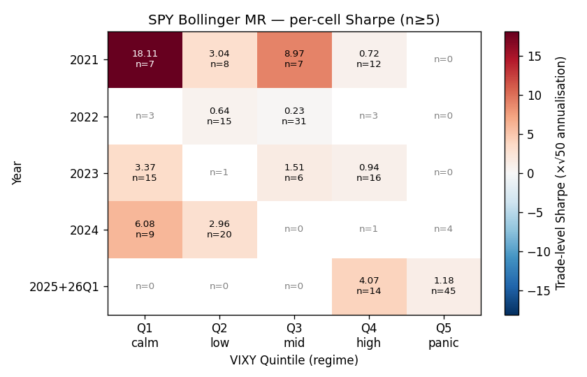
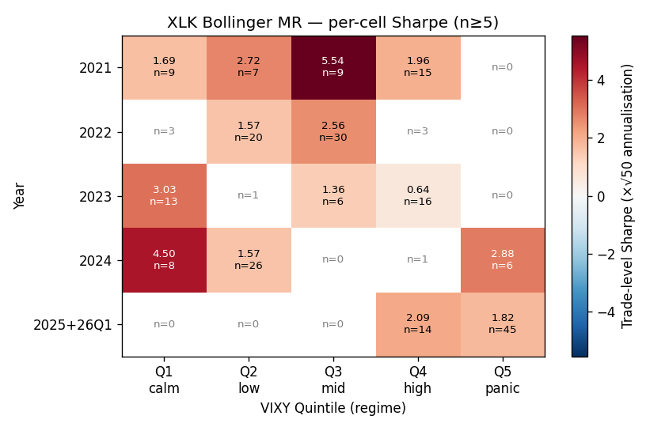
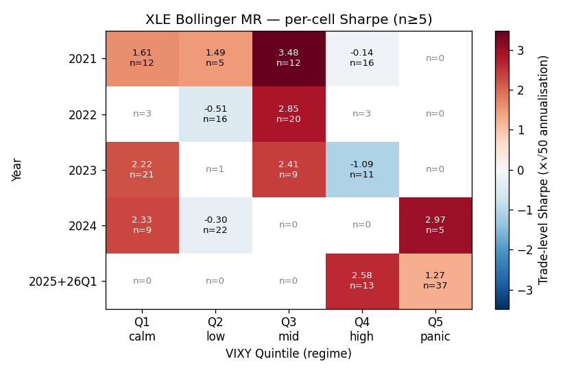

# Bollinger MR — Regime Decomposition (Year × VIX Quintile)

Per-cell trade-level annualised Sharpe (×√50 trades/year average) for each ticker × year × VIXY quintile. Cells with n<5 trades show only the count (Sharpe undefined).

VIX proxy: **VIXY** (1x VIX short-term futures ETF). VIX index itself isn't in Tiingo's coverage — VIXY's daily close ranks days by vol regime consistently with VIX (correlation ≈ 0.9).

## Quintile thresholds (VIXY close)

| Quintile | Range | Regime label |
|---|---|---|
| Q1 | 5.25 – 12.11 | calm |
| Q2 | 12.11 – 15.67 | low |
| Q3 | 15.67 – 21.35 | mid |
| Q4 | 21.35 – 32.37 | high |
| Q5 | 32.37 – 82.83 | panic |

## Per-ticker per-quintile (collapsed across years)

### SPY

| Quintile | n | WR | mean ret | Sharpe |
|---|---|---|---|---|
| Q1 | 34 | 82.3% | +0.547% | +3.575 |
| Q2 | 44 | 79.5% | +0.550% | +1.903 |
| Q3 | 44 | 65.9% | +0.246% | +0.732 |
| Q4 | 46 | 69.6% | +0.275% | +1.658 |
| Q5 | 49 | 71.4% | +0.297% | +1.088 |

### XLK

| Quintile | n | WR | mean ret | Sharpe |
|---|---|---|---|---|
| Q1 | 33 | 78.8% | +9.981% | +2.316 |
| Q2 | 54 | 74.1% | +8.099% | +2.051 |
| Q3 | 45 | 60.0% | +9.238% | +2.121 |
| Q4 | 49 | 73.5% | +0.468% | +2.234 |
| Q5 | 51 | 60.8% | +7.803% | +1.997 |

### XLE

| Quintile | n | WR | mean ret | Sharpe |
|---|---|---|---|---|
| Q1 | 45 | 60.0% | +7.889% | +1.882 |
| Q2 | 44 | 59.1% | +2.574% | +1.036 |
| Q3 | 41 | 65.8% | +12.794% | +2.353 |
| Q4 | 43 | 62.8% | -0.052% | -0.147 |
| Q5 | 42 | 69.0% | +5.327% | +1.599 |

## Verdict cues

- Any quintile with Sharpe < 0 (and n ≥ 5) ⇒ regime where strategy actively
  loses; informs a live pause-trigger threshold.
- 2022 was a deep bear (S&P -19% peak-to-trough). If 2022 row stays positive,
  the edge is regime-robust on the realised distribution.
- Q5 (panic) is where mean-reversion strategies typically thrive (overshoot)
  but also where slippage is worst — paper Sharpe ≠ live Sharpe in Q5.

## Citation

- `[advances_fin_ml, p.215-219, ch.13]` — regime stress for backtests.