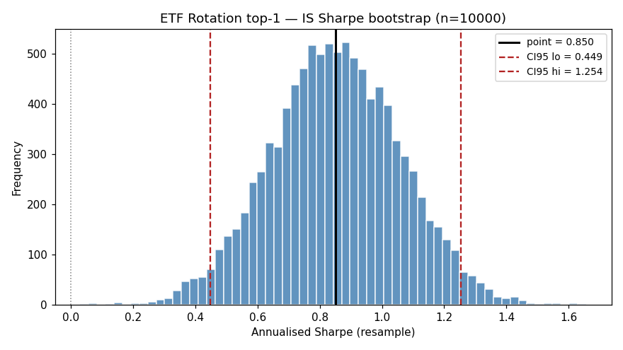
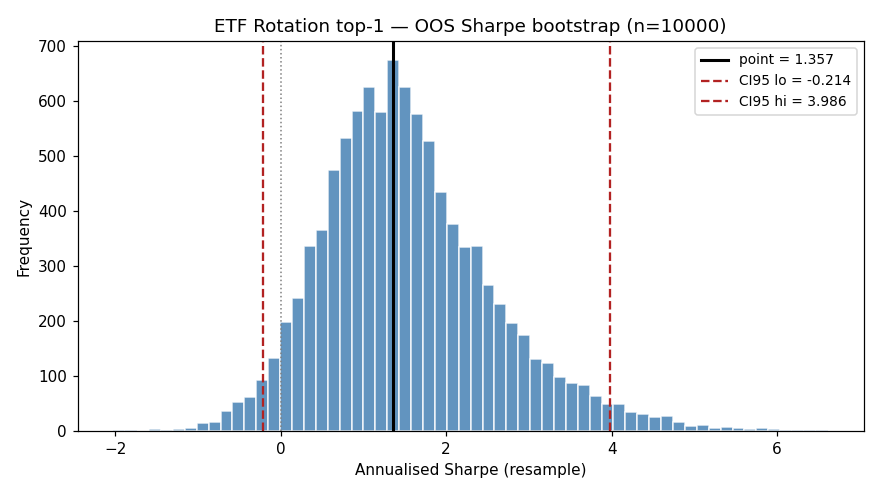

# ETF Rotation top-1 — MC Bootstrap CI (Politis-Romano stationary)

Bootstrap params: `block_mean=3` (quarterly), `n_resamples=10000`, `seed=42`.
IS: `2003-01-02 → 2024-12-31`. OOS: `2025-01-01 → 2026-04-14`.

**Monthly returns** resampled from equity curve end-of-month. Sharpe annualised with `periods_per_year=12`.

Citations: `[advances_fin_ml, p.196-202, ch.11]` — bootstrap CI; `[stocks_on_the_move, p.81, p.66-67]` — strategy.

| Period | N months | Sharpe (pt) | Sharpe CI95 | CAGR (pt) | CAGR CI95 | MaxDD (pt) | MaxDD CI95 |
|---|---|---|---|---|---|---|---|
| IS | 263 | 0.850 | [0.449, 1.254] | 11.06% | [5.18%, 17.45%] | -17.63% | [-37.87%, -13.87%] |
| OOS | 15 | 1.357 | [-0.214, 3.986] | 25.76% | [-5.31%, 67.54%] | -11.05% | [-21.67%, -2.19%] |

## Verdict

IS lower bound must be > 0 for robust edge. OOS CI will be wide (15 months).

## Histograms

