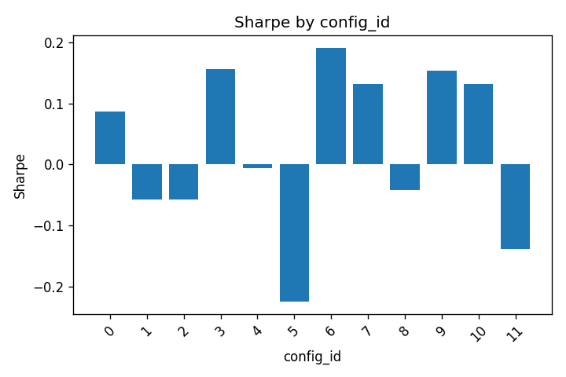

# Grid Report — `grid_vol_expansion_20260415-2301` (FAIL)

- **Run:** 2026-04-15T23:01
- **Data source:** `tiingo`
- **Total trials:** 12 (ok: 12, error: 0)

> ⚠️ **Survivorship bias warning.** This grid uses a data source that contains survivorship bias: companies delisted or bankrupted during the test period are not represented. Reported returns are systematically **overstated**. See ROADMAP §"Deferred decisions — Data source". Migrating to a survivorship-free source (Tiingo SF, Norgate, EOD) is the ROADMAP gate for trusting any verdict from this report.

## Gate verdict — FAIL

| Gate | Value | Verdict |
|---|---|---|
| PBO | 0.687 | `reject` (gate: < 0.5) |
| DSR | 0/12 configs with p < 0.05 | `reject` |
| Walk-forward | 0/12 configs pass | `reject` |

## Failure modes

### `PBO_HIGH` (critical)

PBO = 0.687 ≥ 0.5. Probability of Backtest Overfitting too high — IS-best configs lose their rank out-of-sample. Look for a smaller grid or fundamentally different hypothesis, not more parameters.

### `DSR_ALL_FAIL` (critical)

No config cleared DSR p-value < 0.05. After deflating for N=12 multiple tests, the observed Sharpes are compatible with selection bias rather than skill. Either the edge is small or noise dominates at this sample size.

### `WF_INSUFFICIENT` (critical)

No config passes the walk-forward gate (≥6/8 profitable windows, max DD ≤ 25%). OOS generalization is broken — drill into the per-window breakdown to identify which regimes killed the strategy.

### `COMBINED` (critical)

Multiple gates failed simultaneously. The grid does not exhibit edge in any dimension — either the hypothesis is wrong for this universe/timeframe, or the data source (survivorship residual, data quality) is the limiting factor.

## Best config so far (ignoring gates)

| Field | Value |
|---|---|
| config_id | 6 |
| Sharpe (annualized) | 0.191 |
| CAGR | 0.39% |
| Max drawdown | 5.67% |
| Walk-forward | 4/8 profitable |

## PBO logit distribution

PBO logits over 252 splits: mean=-0.468, std=0.893, min=-2.485, max=1.705. PBO = 0.687.

## Per-config metrics

| config_id | sharpe | cagr | max_drawdown | dsr_pvalue | dsr_pass | wf_verdict | status |
| --- | --- | --- | --- | --- | --- | --- | --- |
| 0 | 0.086 | 0.002 | 0.121 | 0.890 | False | reject | ok |
| 1 | -0.057 | -0.002 | 0.151 | 0.976 | False | reject | ok |
| 2 | -0.057 | -0.003 | 0.193 | 0.974 | False | reject | ok |
| 3 | 0.155 | 0.004 | 0.089 | 0.807 | False | reject | ok |
| 4 | -0.006 | -0.000 | 0.142 | 0.955 | False | reject | ok |
| 5 | -0.224 | -0.013 | 0.359 | 0.999 | False | reject | ok |
| 6 | 0.191 | 0.004 | 0.057 | 0.755 | False | reject | ok |
| 7 | 0.132 | 0.002 | 0.115 | 0.833 | False | reject | ok |
| 8 | -0.042 | -0.003 | 0.203 | 0.971 | False | reject | ok |
| 9 | 0.153 | 0.003 | 0.078 | 0.811 | False | reject | ok |
| 10 | 0.131 | 0.002 | 0.118 | 0.833 | False | reject | ok |
| 11 | -0.138 | -0.008 | 0.314 | 0.995 | False | reject | ok |

## Walk-forward breakdown

| config_id | n_windows | n_profitable | max_dd | verdict |
| --- | --- | --- | --- | --- |
| 0 | 8 | 3 | 6.55% | reject |
| 1 | 8 | 5 | 12.56% | reject |
| 2 | 8 | 4 | 10.65% | reject |
| 3 | 8 | 4 | 5.57% | reject |
| 4 | 8 | 4 | 13.35% | reject |
| 5 | 8 | 2 | 20.50% | reject |
| 6 | 8 | 4 | 4.24% | reject |
| 7 | 8 | 4 | 8.96% | reject |
| 8 | 8 | 3 | 16.94% | reject |
| 9 | 8 | 5 | 5.87% | reject |
| 10 | 8 | 5 | 9.28% | reject |
| 11 | 8 | 3 | 17.83% | reject |

## Sharpe heatmap

## Recommendation

Grid did not pass gates. Failure modes: COMBINED, DSR_ALL_FAIL, PBO_HIGH, WF_INSUFFICIENT.

Best config by Sharpe (ignoring gates): config_id=6, Sharpe=0.191, CAGR=0.004, max_dd=0.057.

PBO_HIGH: grid is overfit — don't expand the grid. Consider a different hypothesis family (Ehlers DSP, AFML meta-label, mean reversion) or a universe shift (Nasdaq100, liquidity filter).

WF_INSUFFICIENT: drill into the per-window breakdown above — if failures cluster on specific regimes (2020 H1, 2022 bear), a regime filter or position sizing change might save the edge. If failures scatter, the edge isn't durable.

Next step: bring this diagnostic report back and we'll choose between paid-data ablation, universe shift, and strategy pivot together.
