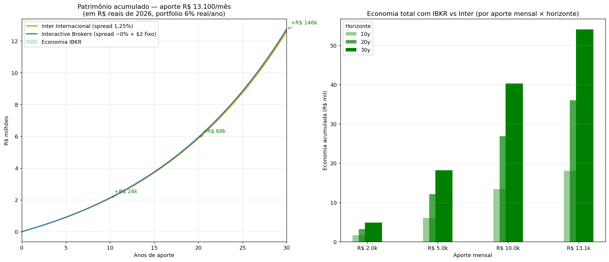

# Análise adicional — BTGD vs RSSX + Inter vs IBKR + DARF USD

> Três perguntas do usuário 2026-04-23 (pós projeção v3).

---

## 1. 📊 DARF em dólar não-repatriado — Lei 14.754/2023

### Resposta direta: SIM, você paga DARF mesmo sem repatriar

**Fato gerador** sob a Lei 14.754/2023 (vigente desde 01/01/2024):

> "Rendimentos auferidos no exterior, como lucros com a venda de ações,
> são tributáveis no Brasil, **independentemente de terem sido repatriados
> ou não**."

Ou seja, no momento da **venda/alienação/liquidação** da aplicação, já há
fato gerador. Não importa se:
- O USD ficou na conta do broker
- Você vai reinvestir em outro ETF
- Você não converteu pra BRL ainda

### Regras atualizadas (vigência 2024+)

| Item | Valor/regra |
|---|---|
| **Alíquota** | **15% fixo** (era progressivo 15-22,5% até 2023) |
| **Fato gerador** | Venda, amortização, resgate, vencimento ou liquidação |
| **Periodicidade** | **Anual** (antes era mensal via GCAP) |
| **Declaração** | IRPF anual (não mais GCAP nem carnê-leão) |
| **Câmbio** | PTAX do dia da venda (não do dia da repatriação) |
| **Compensação** | Imposto pago no exterior pode ser deduzido |

### Como isso impacta o V3.5

A boa notícia: **se você fizer rebalanceamento por APORTES** (comprar o que
está abaixo do target, nunca vender), você **não gera fato gerador**.
Isso é a estratégia recomendada no V3.5.

Ação com fato gerador:
- ❌ Vender um ETF com lucro (gera DARF mesmo em USD)
- ❌ Receber dividendos em USD (antes era carnê-leão; agora anual IRPF)
- ✅ Comprar mais de um ETF abaixo do target (zero DARF)
- ✅ Continuar holdando (zero DARF)

**Só 2 momentos geram fato gerador com certeza:**
1. Rebalanceamento por VENDA (evite se possível)
2. Retirada pra uso (aposentadoria começando)

### Declaração anual simplificada (pós Lei 14.754)

No IRPF anual (ano seguinte), você:
1. Declara saldo do broker em USD (valor em 31/12, convertido pela PTAX)
2. Declara vendas do ano com ganho/perda (FIFO, PTAX do dia da venda)
3. Paga DARF 15% sobre ganho líquido até último dia útil de Maio
4. Se houve prejuízo, pode compensar com ganhos futuros

**Fontes:**
- [Lei 14.754/2023 — Planalto](https://www.planalto.gov.br/ccivil_03/_ato2023-2026/2023/lei/L14754.htm)
- [Mazutti Ribas Stern — Lei 14.754/2023 análise](https://mrsadvogados.com/lei-n-14-754-2023-tributacao-de-rendimentos-no-exterior-e-fundos-de-investimento/)
- [Trench Rossi Watanabe — English summary](https://www.trenchrossi.com/en/legal-alerts/law-14754-2023-was-published-which-changes-the-taxation-of-investments-controlled-entities-and-trusts-abroad-held-by-individuals-who-are-tax-residents-in-brazil-and-investment-funds-in-brazil/)
- [Rolmy Juncontabilidade — IRPF 2026 investimentos exterior](https://rolmyjuncontabilidade.com.br/imposto-de-renda/como-declarar-investimentos-exterior-irpf-2026/)
- [Prestacon — Guia Lei 14.754](https://www.prestacon.com.br/blog/investimentos-exterior-imposto-de-renda-2026-lei-14754)

---

## 2. 🔄 BTGD vs RSSX — trocar ou manter?

### Composição comparada

| Item | BTGD (atual V3.5) | RSSX (alternativa) |
|---|---|---|
| Estrutura | 100% BTC + 100% Gold (2× leverage stacked) | 100% SPY + 80% Gold + 20% BTC (2× stacked) |
| Emissor | Quantify / Tidal Trust II | Newfound / ReSolve / Tidal |
| TER | 1,05% | 0,68% |
| AUM | ~$50-70M | ~$60-64M |
| Inception | out/2024 (1,5 ano) | mai/2025 (**<1 ano**) |
| Alocação 5% dá | **5% BTC + 5% Gold** notional | **5% SPX + 4% Gold + 1% BTC** notional |

### Backtest comparativo

**Standalone 2014-2026 (proxy sintéticos):**

| ETF | CAGR | Sharpe | MDD |
|---|---:|---:|---:|
| BTGD_syn 100% | **58,5%** | 0,89 | -73% |
| RSSX_syn 100% | 48,1% | **1,15** | -58% |

BTGD tem CAGR maior (puro scarcity hedge); RSSX tem Sharpe melhor (equity
diversifica vol).

**Dentro da V3.5 (5% allocation):**

| Carteira | CAGR | Sharpe | MDD |
|---|---:|---:|---:|
| V3.5 com BTGD | **15,32%** | **0,83** | -27,2% |
| V3.5 com RSSX | 14,31% | 0,78 | **-26,7%** |
| Δ | -1,01pp | -0,05 | +0,5pp |

BTGD ganha em CAGR e Sharpe. RSSX marginal em MDD.

### O problema estrutural de RSSX no V3.5

V3.5 já tem MUITO US equity:
- GDE 22,5% (stacked)
- AVUS 12%
- AVUV 10%
- SPMO 7%
- **Total: 52% US equity notional**

Se trocar BTGD por RSSX 5%, adiciona mais 5% US equity → **57% US total**.
**Redundante** com o que já está lá.

Já BTGD 5% adiciona return streams DIFERENTES (BTC + extra gold), sem
inflacionar US equity.

### Recomendação honesta

**Mantém BTGD.** Três razões:

1. **Estruturalmente melhor pro V3.5**: adiciona BTC exposure (5% pure) +
   extra gold, sem redundância US equity.
2. **CAGR +1pp no backtest**: apesar do TER maior (1,05% vs 0,68%), o
   portfolio ganha mais.
3. **BTGD tem track record 1,5 ano vs RSSX <1 ano**: ainda curto, mas
   melhor que nada.

**Quando RSSX faria sentido:**
- Se você quer REDUZIR exposição BTC (de 5% pra 1%) por conservadorismo
- Se Sharpe standalone importa mais que CAGR (não importa no contexto V3.5)
- Se AUM RSSX crescer pra >$500M (ainda $60M)

### Alternativa híbrida

Se quiser reduzir BTC sem redundância US:
- **BTGD 3% + GLDM 2%** em vez de BTGD 5%
  - Notional: 3% BTC + 3% gold (via BTGD) + 2% gold (via GLDM) = 3% BTC + 5% gold total
  - Mesma gold exposure, menos BTC
  - MAS: volta a ter gold standalone (princípio pure stacking violado)

**Recomendação final: mantém BTGD 5%.** RSSX não é upgrade pro V3.5.

---

## 3. 📈 Inter Internacional vs Interactive Brokers — quanto custa o spread?

### Premissas

| Broker | Spread FX | Fee trading | Fee conversão |
|---|---|---|---|
| Inter Internacional | 1,25% médio (0,99-1,50%) | $0 | — |
| IBKR Pro | ~0,02% (interbank + 2 bps) | $0,005/share (mín $1) | **$2 fixo** |

### 📊 Gráfico: patrimônio acumulado 30 anos

**Esquerda:** curvas quase sobrepostas (diferença 1,16%), com annotations
mostrando economia em 10/20/30 anos.

**Direita:** economia total em R$ por aporte mensal × horizonte (cresce
linearmente com aporte e composita-se com horizonte).

### Tabela resultados (aporte R$ 13.100/mês)

| Horizonte | Inter (R$) | IBKR (R$) | Diferença | Diff % |
|---|---:|---:|---:|---:|
| 10 anos | R$ 2,10M | R$ 2,13M | **+R$ 24,4k** | +1,16% |
| 15 anos | R$ 3,71M | R$ 3,75M | +R$ 43,1k | +1,16% |
| 20 anos | R$ 5,87M | R$ 5,93M | +R$ 68,1k | +1,16% |
| 25 anos | R$ 8,75M | R$ 8,85M | +R$ 101,5k | +1,16% |
| 30 anos | R$ 12,61M | **R$ 12,75M** | **+R$ 146,3k** | +1,16% |

**30 anos com R$ 13.100/mês: economia IBKR = R$ 146k.**

### Break-even (aporte onde IBKR começa a ganhar)

| Aporte/mês | 20y Inter | 20y IBKR | Winner |
|---|---:|---:|---|
| R$ 500 | - | - | **Inter** (fee fixo $2 IBKR pesa demais) |
| **R$ 1.000** | break-even | **IBKR** (marginal) |
| R$ 2.000 | - | **+0,69%** | IBKR |
| R$ 5.000 | - | **+1,02%** | IBKR |
| R$ 13.100 | - | **+1,16%** | IBKR |

**Break-even: ~R$ 1.000/mês.** Abaixo disso, o fee fixo $2 de IBKR por
conversão mata a vantagem do spread menor.

### Quando faz sentido migrar?

| Situação | Recomendação |
|---|---|
| Aporte < R$ 1k/mês | **Inter** (simples, zero fee fixo, spread não dói) |
| Aporte R$ 1-5k/mês | IBKR é marginal (+0,1 a +1%) — **preferência** |
| Aporte > R$ 5k/mês | **IBKR claramente** (spread domina, +R$ 50k+ em 30y) |
| Aporte R$ 13,1k (seu plano) | **IBKR vale R$ 146k em 30 anos** |

### Considerações além do spread

**Inter Internacional vantagens:**
- Conta BR + US mesmo banco → transfer interna sem fee
- App em português, suporte BR
- Onboarding simples (docs BR)
- Declaração IRPF mais fácil (reports em português)
- **Zero fee fixo** — vale ser menor aporte

**IBKR Pro vantagens:**
- Spread FX ~interbank (0,02%)
- Acesso a UCITS irlandeses (crítico pra **US Estate Tax mitigation**)
- Acesso a ações individuais (não só ETFs), opções, futures
- Portfolio margin (leverage mais barata se precisar)
- Mais ETFs disponíveis

**Ponto crítico: UCITS irlandeses.** Se você quer mitigar US Estate Tax
(capítulo §8 do ANALYSIS.md), precisa comprar CSPX/IWDA/VWCE/EIMI que NÃO
são disponíveis no Inter. IBKR é o único caminho viável.

### Migração sugerida

1. **Fase 1 (2026 — plano caixinhas):** começa no **Inter** (simples, mesmo
   banco do BR)
2. **Fase 2 (quando aporte consolidar >R$ 3-5k/mês):** abre conta IBKR
   paralela, mantém ambas por 3-6 meses pra testar
3. **Fase 3 (migração):** ACAT do Inter pro IBKR (transferência in-kind,
   gratuita/barata). Não precisa vender → zero DARF trigger.
4. **Fase 4 (long-term):** IBKR como principal, Inter fica pra conta-corrente
   USD se houver

### Alternativa: Avenue

Bem parecido com Inter (spread 0,35-1%, zero fees trading, suporte BR). Se
você não gosta da IBKR pela complexidade, **Avenue é meio-termo**. Mas não
tem UCITS irlandeses.

---

## Consolidado das 3 respostas

| Pergunta | Resposta |
|---|---|
| **DARF em USD não-repatriado?** | **SIM**, Lei 14.754/2023: fato gerador é venda, não repatriação. 15% fixo anual. Rebalancear por APORTES evita DARF. |
| **Trocar BTGD por RSSX?** | **Não** (recomendação). BTGD adiciona BTC+gold puros; RSSX dilui em +5% US equity redundante. BTGD ganha +1pp CAGR e Sharpe 0,05 maior no V3.5. |
| **Inter ou IBKR?** | **IBKR quando aporte >R$ 3-5k/mês** — economia R$ 146k em 30 anos (aporte R$ 13,1k). Começa Inter, migra via ACAT sem DARF trigger. |

---

## Arquivos relacionados

- `inter_vs_ibkr.png` — gráfico 30 anos comparativo + economia por aporte
- `inter_vs_ibkr_all.csv` — dados tabulados todos cenários
- `scripts/11_inter_vs_ibkr.py` — código reprodutível
- `ANALYSIS.md §8` — US Estate Tax mitigation (UCITS irlandeses via IBKR)
- `TLDR.md` — portfolio V3.5 completo
- `RESPOSTA_V3.md` — projeção Victor final

## Sources — Lei 14.754/2023

- [Planalto — Lei 14.754/2023 oficial](https://www.planalto.gov.br/ccivil_03/_ato2023-2026/2023/lei/L14754.htm)
- [Mazutti Ribas Stern — Análise Lei 14.754/2023](https://mrsadvogados.com/lei-n-14-754-2023-tributacao-de-rendimentos-no-exterior-e-fundos-de-investimento/)
- [Trench Rossi Watanabe — Legal alert (EN)](https://www.trenchrossi.com/en/legal-alerts/law-14754-2023-was-published-which-changes-the-taxation-of-investments-controlled-entities-and-trusts-abroad-held-by-individuals-who-are-tax-residents-in-brazil-and-investment-funds-in-brazil/)
- [Rolmy Juncontabilidade — IRPF 2026 investimentos exterior](https://rolmyjuncontabilidade.com.br/imposto-de-renda/como-declarar-investimentos-exterior-irpf-2026/)
- [Prestacon — Guia investimentos exterior IR 2026](https://www.prestacon.com.br/blog/investimentos-exterior-imposto-de-renda-2026-lei-14754)
- [Nomad Global — Imposto investimento exterior](https://www.nomadglobal.com/portal/artigos/imposto-investimento-exterior)
