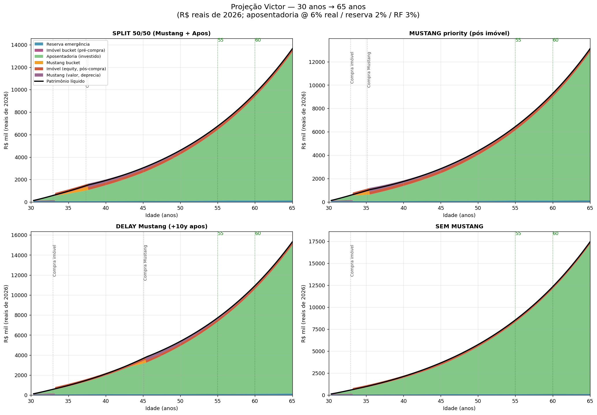
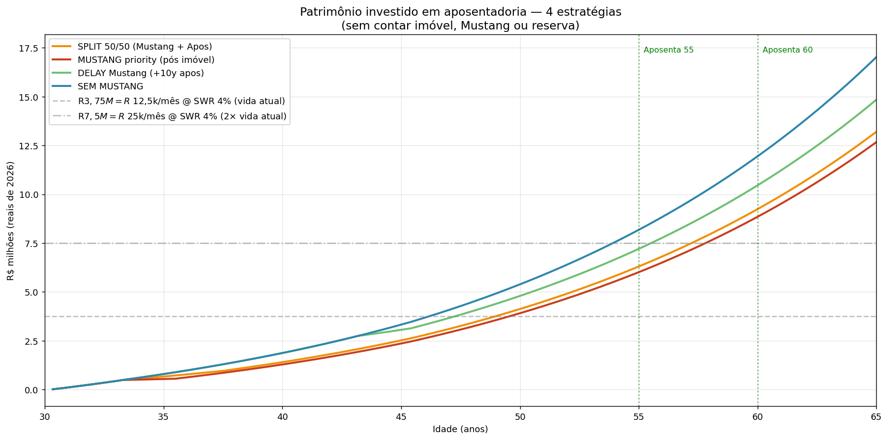
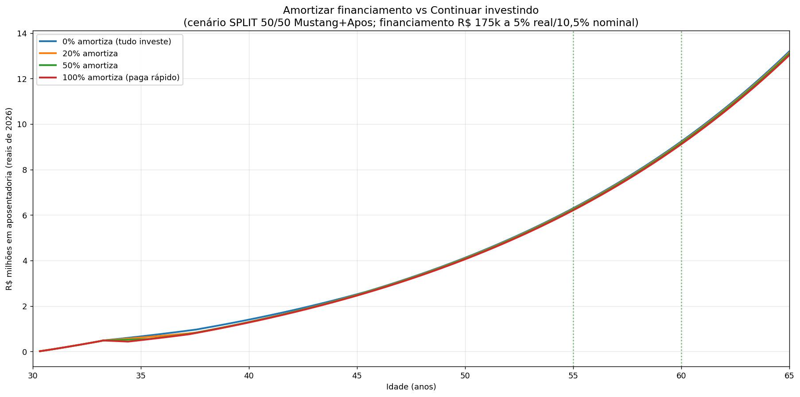

# Projeção de Vida Financeira — Victor (30 anos → 65 anos)

> Análise integrada dos 3 objetivos — imóvel, Ford Mustang, aposentadoria —
> partindo de R\$ 120k atual + aportes R\$ 12.500-13.100/mês (plano
> `caixinhas 2026-04-21`) com o portfolio V3_1 v3.5.

---

## TL;DR (resumo de 30 segundos)

1. **Os 3 objetivos cabem sem apertar.** Todos os cenários testados entregam
   **mínimo de R\$ 20k/mês aos 55 anos** (1,6× sua vida atual de R\$ 12,5k).
2. **Mustang viável entre 35-38 anos** dependendo da estratégia. Meu default:
   **SPLIT 50/50 pós-imóvel** → Mustang aos 37-38 anos, aposentadoria mantém
   R\$ 21k/mês aos 55 anos.
3. **Amortizar financiamento vs investir: NÃO importa muito no caso BR.**
   Diferença entre amortizar 100% e 0%: só **R\$ 90k em 25 anos**. Recomendação:
   **continuar investindo** os aportes mensais, usar 13º/bônus pra amortizações
   pontuais se quiser o conforto psicológico.

---

## 1. Premissas

### Capital inicial e aportes

| Item | Valor |
|---|---|
| Capital atual | R\$ 120.000 |
| Reserva emergência | R\$ 75.000 (locked) |
| Imóvel bucket | R\$ 45.000 |
| Aposentadoria | R\$ 0 |
| Aporte Fase 1 (Mai-Out/26) | R\$ 12.500/mês |
| Aporte Fase 2 (Nov/26+) | R\$ 13.100/mês |

### Retornos reais (pós-inflação)

| Bucket | Return real/ano | Veículo |
|---|---:|---|
| Aposentadoria (V3_1 v3.5) | **6%** | Portfolio USD equity + gold stacked |
| Reserva emergência | **2%** | CDI líquido pós-IR |
| RF imóvel/Mustang | **3%** | Pré-fixado bom emissor |
| Mustang físico | **-8%** | Depreciação (carro usado) |

**Todos os valores abaixo em R\$ reais de 2026 (descontando inflação 5%/ano).**

### Objetivos

| Objetivo | Valor hoje | Timing |
|---|---|---|
| Imóvel R\$ 500k (Victor 50%) | R\$ 75k entrada + R\$ 175k financiamento | ~2029 (3 anos) |
| Ford Mustang 2018 | R\$ 320k à vista + R\$ 2,5k/mês manutenção | Pós-imóvel (variável) |
| Aposentadoria qualidade ≥ atual | R\$ 12,5k/mês mínimo | 55-60 anos |

---

## 2. Cenários testados (4 estratégias Mustang)

### 📊 Gráfico 1: 4 cenários integrados

### Resultado compacto

| Estratégia | Mustang aos | Apos 55y | Apos 60y | Renda aposent. 55y |
|---|---:|---:|---:|---:|
| **SPLIT 50/50 Mustang+Apos** ⭐ | 37,7 anos | R\$ 6,30M | R\$ 9,24M | **R\$ 21,0k/mês** (1,7× vida) |
| MUSTANG priority (antes apos) | 35,5 anos | R\$ 6,01M | R\$ 8,85M | R\$ 20,0k/mês (1,6×) |
| DELAY Mustang +10y (apos primeiro) | 45,4 anos | R\$ 7,21M | R\$ 10,46M | R\$ 24,0k/mês (1,9×) |
| SEM MUSTANG | nunca | R\$ 8,18M | R\$ 11,95M | R\$ 27,3k/mês (2,2×) |

**Todos entregam aposentadoria com qualidade ACIMA da vida atual.**

### 📊 Gráfico 2: só aposentadoria comparativa

A linha pontilhada em R\$ 3,75M = vida atual (R\$ 12,5k/mês com SWR 4%).
Todos os cenários cruzam essa linha **muito antes dos 55 anos** — você vai
"poder se aposentar" na casa dos 50 anos se quiser, não depender dos 55.

---

## 3. Minha recomendação: SPLIT 50/50

### Por que SPLIT é o ponto ótimo pra você

| Dimensão | SPLIT 50/50 | Custo vs SEM MUSTANG |
|---|---|---|
| Mustang aos | 37,7 anos | — |
| Apos 55y renda | R\$ 21,0k/mês | -R\$ 6,3k/mês (perdeu 23%) |
| Apos 60y renda | R\$ 30,8k/mês | -R\$ 9,0k/mês |
| "Paga" pelo sonho | R\$ 6k/mês perdidos na aposentadoria | — |

**Como interpretar:** você "paga" cerca de R\$ 6k/mês do seu futuro eu
(aposentadoria reduzida de R\$ 27k pra R\$ 21k) em troca de dirigir o Mustang
por **20+ anos a partir dos 38 anos**.

Anualizando: **R\$ 72k/ano perdido na aposentadoria × 20 anos de Mustang =
R\$ 1,44M de "custo psicológico-financeiro" do sonho.**

Em compensação: ainda aposenta com renda 1,7× a vida atual aos 55. **Não é
apertado** — é confortável com folga.

### Mecânica do SPLIT 50/50

Ano a ano:
- **Mai/26 a Abr/29 (3 anos):** fase atual do plano caixinhas
  - R\$ 833/mês imóvel bucket
  - R\$ 11.667-12.267/mês aposentadoria
- **Abr/29: compra imóvel** — gasta R\$ 75k entrada, abre financiamento R\$ 175k
- **Abr/29 a Abr/33 (~4 anos): SPLIT 50/50**
  - R\$ ~5.750/mês pra Mustang bucket (metade do aporte pós-parcela-financ)
  - R\$ ~5.750/mês pra aposentadoria
  - Mustang bucket cresce R\$ 5.750 + juros 3% real
- **~Abr/33: Mustang atinge R\$ 320k** → compra!
- **Pós-Mustang:** 100% do aporte residual vai pra aposentadoria
  - Mas perde R\$ 2.500/mês pra manutenção do carro
  - Aporte efetivo aposentadoria: R\$ ~9.000/mês
- **Aos 55 anos (2051):** R\$ 6,3M nest egg → R\$ 21k/mês renda

### Por que não MUSTANG priority?

Você compra o Mustang 2 anos antes (35,5 vs 37,7 anos), mas:
- Renda aposentadoria 55y cai R\$ 1k/mês (R\$ 20 vs R\$ 21k)
- Você paga "juros" compostos por pular 2 anos de compounding inicial

**O ganho de tempo (2 anos) é pequeno vs o custo (vida inteira de renda
aposentadoria menor).** SPLIT é mais eficiente.

### Por que não DELAY 10 anos?

DELAY entrega Mustang aos 45,4 anos (vs 37,7 do SPLIT) em troca de:
- +R\$ 3k/mês na aposentadoria (R\$ 24 vs R\$ 21k aos 55)

Mas você **perde 8 anos de dirigir o Mustang** (45-55 vs 37-55 = 18 vs 10 anos).

Pra mim, essa troca favorece o SPLIT. 8 anos extras de diversão > R\$ 3k/mês
extras na aposentadoria. Mas é preferência — se você prioriza segurança,
DELAY tem mérito.

---

## 4. Amortizar financiamento vs Continuar investindo

### 📊 Gráfico 3: linhas praticamente SOBREPOSTAS

### Os números chocantes

Aposentadoria aos 55 anos (cenário SPLIT 50/50):

| Estratégia | Nest egg | Renda/mês |
|---|---:|---:|
| 0% amortiza (tudo investe) | R\$ 6,30M | R\$ 21,0k |
| 20% amortiza | R\$ 6,27M | R\$ 20,9k |
| 50% amortiza | R\$ 6,25M | R\$ 20,8k |
| 100% amortiza (paga rápido) | R\$ 6,21M | R\$ 20,7k |

**Diferença 0% vs 100% amortizar: apenas R\$ 90k em 25 anos (1,4%).**

### Por que a diferença é tão pequena?

A matemática:
- Financiamento imobiliário: ~10,5% a.a. nominal (TR + juros) = **~5% real**
- Aposentadoria V3_1 v3.5 esperado: **~6% real**
- Diferencial: apenas **+1pp a favor de investir**

Em R\$ 175k de saldo devedor Victor, 1pp × 25 anos = R\$ 90k de vantagem do
investir. Pequeno.

### Minha recomendação

**Continue investindo os aportes mensais regulares.** Não redirecione aporte
fixo pra amortização extra. Razões:

1. **Retorno esperado marginal +1pp** favorece investir matematicamente (mas é
   margem pequena).
2. **Liquidez preservada** — aposentadoria é líquida; amortização é
   irreversível.
3. **Dollar-cost averaging preservado** — aporte mensal consistente no
   mercado captura dips (compounding de longo prazo).
4. **Psicológico/financeiro:** use **13º salário + bônus + surplus do
   Geoinova** pra amortizações pontuais, se quiser. Isso dá sensação de
   progresso sem quebrar DCA.

### Quando amortizar FAZ sentido

- **Financiamento extra-caro** (>15% nominal, ex. cheque especial): amortize TUDO
- **Antes dos últimos 5 anos da aposentadoria**: pode amortizar pra "entregar
  livre de dívida" ao retirar (psicológico; mas mesmo isso é opcional)
- **Período de mercado em bear/lateral longo:** se você não acredita no
  retorno esperado do portfolio, amortizar vira mais atrativo (mas aí o
  problema é sua confiança no portfolio, não o financiamento)

### Simulação: se as taxas mudarem

| Cenário | Decisão |
|---|---|
| Financ 10,5% nom / 5% real + Apos 6% real (base) | **Investir** (+1pp) |
| Financ 14% nom / 8% real + Apos 6% real | **Amortizar** (-2pp pra investir) |
| Financ 8% nom / 3% real + Apos 6% real | **Investir fortemente** (+3pp) |

Revisar anualmente. Se Selic subir muito e seu financiamento pegar TR+juros
caros, vira amortizar. Se Selic cair, fica melhor investir.

---

## 5. Aposentadoria — qualidade de vida projetada

### Comparação cenários vs vida atual

Vida atual = R\$ 12,5k/mês de lifestyle (plano caixinhas). SWR conservador 4%.

| Cenário | Nest 55y | Renda/mês | Múltiplo vs hoje |
|---|---|---|---|
| SEM Mustang | R\$ 8,18M | R\$ 27,3k | **2,2× vida atual** |
| DELAY Mustang | R\$ 7,21M | R\$ 24,0k | **1,9×** |
| **SPLIT 50/50** ⭐ | R\$ 6,30M | R\$ 21,0k | **1,7×** |
| MUSTANG priority | R\$ 6,01M | R\$ 20,0k | **1,6×** |

**Todos batem o objetivo "qualidade ≥ hoje".** Pior caso (MUSTANG priority)
entrega 60% mais do que você gasta hoje.

### Se SWR for mais conservador (3,5%)

| Cenário | Renda/mês 55y | Múltiplo vs hoje |
|---|---|---|
| SEM | R\$ 23,9k | 1,9× |
| **SPLIT** | R\$ 18,4k | **1,5×** |

Ainda confortável.

### Aposentar antes dos 55

Pelo gráfico 2, o nest egg do SPLIT cruza R\$ 3,75M (= R\$ 12,5k/mês SWR 4%)
aos **~50 anos**. Você pode "se aposentar" aos 50 com vida igual atual, **ou
continuar trabalhando pra ampliar**. Flexibilidade real.

---

## 6. Caveats honestos

1. **Retorno real 6%/ano é PREMISSA, não garantia.** V3_1 v3.5 em backtest
   histórico (1926+ via proxies) entrega 6-8% real USD. Traduzido pra BRL
   real via FX depreciação estrutural, 5-7% é razoável. **Se só entregar
   4% real: nest egg aos 55 cai ~30%** (R\$ 4,5M em vez de R\$ 6,3M).
2. **Mustang não é investimento.** Depreciação 8%/ano + manutenção
   R\$ 2,5k/mês = consumo. Valor residual aos 55 (dirigido 18 anos): ~R\$ 70k
   real. **Por isso tratamos separado do bucket "aposentadoria".**
3. **Financiamento imobiliário real 5%** assume TR manso + Selic estável.
   **Se Selic disparar (ex. 2015 ciclo 14%+):** amortizar vira mais atrativo.
4. **Salário estagnado.** Assumi aporte R\$ 12,5-13,1k/mês **em termos reais**.
   Se você tiver promoções (CLT cresce, Geoinova escala), a projeção subestima.
5. **Vida real = eventos.** Filhos, divórcio, doença, carreira muda.
   Re-rodar o plano a cada 2-3 anos. Este gráfico é ponto de partida, não
   roteiro rígido.
6. **Mustang 2018 depreciando:** o preço R\$ 320k hoje pode ser R\$ 280k em
   2033 (carro envelhece). Você poderia comprar MAIS NOVO com menos dinheiro,
   ou MAIS VELHO com ainda menos. Revisitar o target no momento da compra.
7. **US Estate Tax** continua risco não-mitigado se você morrer com grande
   patrimônio em ETFs US-domiciliados. Ver `ANALYSIS.md` §8.

---

## 7. Decisões que você precisa tomar

1. **Qual estratégia Mustang?** Meu default SPLIT 50/50 é razoável, mas:
   - Se Mustang é URGENTE (quero aos 35): MUSTANG priority
   - Se aposentadoria é PRIMEIRO: DELAY ou SEM
   - Se não quer Mustang de fato: SEM (aposentadoria 2,2× vida atual aos 55)
2. **Amortizar financiamento com 13º/bônus?** Matemática neutra. Preferência
   psicológica.
3. **Imóvel R\$ 500k é realmente o target?** Em 2029 inflation terá
   corrigido. Verificar se sua renda cresce compatível.
4. **Aposenta aos 55 ou 60?** Aos 55 = R\$ 21k/mês (SPLIT); Aos 60 = R\$ 31k.
   5 anos extras de trabalho dobram praticamente a renda aposentadoria.
5. **Esposa alinhada com plano?** 50% entrada imóvel + parcela 50% depende
   da renda dela. Cross-check o plano dela.

---

## Próximos passos sugeridos

1. **Agora:** validar com esposa o plano imóvel (entrada R\$ 150k total, 50/50)
2. **Mai-Out/26 (Fase 1):** executar plano caixinhas como está — R\$ 833
   imóvel + R\$ 11.667 aposentadoria
3. **Nov/26 (Fase 2):** aumentar aposentadoria pra R\$ 12.267
4. **Abr/27:** revisar este plano anualmente — ajustar premissas se
   salário, inflação, taxa financ mudaram
5. **Abr/29:** compra imóvel, decidir estratégia Mustang (SPLIT recomendado)
6. **~Abr/33 (aos 37-38):** compra Mustang se SPLIT; redireciona 100%
   aportes pra aposentadoria
7. **45 anos (2041):** iniciar glidepath V3_1 → V3_3 (adicionar BR FI)

---

## Arquivos relacionados

- `scripts/10_projection_victor.py` — código da projeção
- `projecao_4_cenarios.png` — gráfico 4 estratégias Mustang
- `aposentadoria_comparativa.png` — só bucket aposentadoria
- `amortizar_vs_investir.png` — 4 estratégias de amortização
- `scenarios_summary.csv` — dados tabulados

Portfolio V3_1 v3.5 detalhado em:
- `reports/portfolio_aposentadoria_v2/TLDR.md`
- `reports/portfolio_aposentadoria_v2/ANALYSIS.md`
- `docs/plans/2026-04-21-caixinhas.md` (plano de caixinhas original)
