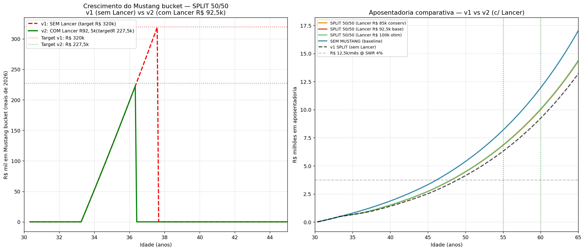

# Projeção v2 — com Lancer HL-T 2018 na equação

> Atualização da projeção após informação do Lancer HL-T 2018 modificado
> (FIPE R\$ 70k, venda estimada R\$ 85-100k pelas modificações).
>
> Versão anterior (sem Lancer): `RESPOSTA.md`

---

## Nova premissa

| Item | Valor |
|---|---|
| FIPE Lancer HL-T 2018 (fev/2026) | R\$ 69-71k |
| Modificações investidas (não recuperáveis) | R\$ 80k |
| Venda realista (conservador / base / otimista) | R\$ 85k / R\$ 92,5k / R\$ 100k |
| **Target Mustang bucket** (era R\$ 320k) | **R\$ 220-235k** |
| **Manutenção Mustang incremental vs Lancer** (era R\$ 2.500 absoluto) | **R\$ 1.500/mês** |

Lógica: Lancer já está no seu lifestyle (~R\$ 1k/mês manutenção). Ao substituir
por Mustang (~R\$ 2,5k absoluto), o incremental é R\$ 1-1,5k/mês. O R\$ 85-100k
da venda entra no momento da compra do Mustang, reduzindo a necessidade de
acumular no bucket.

---

## Resultados v2 (4 cenários principais)

| Cenário | Mustang aos | v1 (sem Lancer) | v2 (c/ Lancer) | Apos 55y v2 | vs v1 |
|---|---|---|---|---|---|
| **SPLIT 50/50** ⭐ | 36,4 anos | (era 37,7) | **-1,3y mais cedo** | **R\$ 22,8k/mês** | +R\$ 1,8k/mês |
| MUSTANG priority | 34,9 anos | (era 35,5) | -0,6y | R\$ 22,4k/mês | +R\$ 2,4k/mês |
| DELAY +10y | 44,8 anos | (era 45,4) | -0,6y | R\$ 25,0k/mês | +R\$ 1,0k/mês |
| SEM MUSTANG | — | — | — | R\$ 27,3k/mês | = (sem mudança) |

### O que mudou

1. **Mustang comprado 1-1,3 anos mais cedo** em todos cenários (Lancer
   R\$ 92,5k reduz target do bucket)
2. **Renda aposentadoria +R\$ 1,0-2,4k/mês aos 55** — manutenção incremental
   menor (R\$ 1,5k vs R\$ 2,5k) preserva R\$ 1k/mês que vai pra aposentadoria
3. **"Custo do Mustang" reduzido:** SPLIT v2 = R\$ 22,8k/mês aos 55 vs
   R\$ 27,3k SEM Mustang = **custa só R\$ 4,5k/mês de aposentadoria** (era
   R\$ 6,3k em v1). Redução de 29% no "preço do sonho".

---

## 📊 Gráfico v1 vs v2

**Esquerda:** crescimento do Mustang bucket — v1 precisa atingir R\$ 320k
(linha vermelha tracejada); v2 precisa só R\$ 227,5k (linha verde). Com
Lancer, bucket cresce e cruza o target bem mais rápido.

**Direita:** evolução da aposentadoria. v2 SPLIT (laranja sólido) fica
ACIMA do v1 SPLIT (preto tracejado) por ~R\$ 600k aos 55 anos.

---

## Recomendação atualizada

**SPLIT 50/50 com venda do Lancer no momento da compra.** Mais eficiente que
antes:

- **Mustang aos 36-37 anos** (uma década + de diversão pré-aposentadoria)
- **Aposentadoria R\$ 22,8k/mês aos 55** (1,82× vida atual de R\$ 12,5k)
- **R\$ 30M aos 60** se continuar trabalhando (2,7× vida atual)

### Mecânica operacional

1. **Agora → 2029:** execute plano caixinhas (já confirmado)
2. **Abr/2029:** compra imóvel com R\$ 75k entrada + financ R\$ 175k
3. **2029 → ~Jun/2033:** SPLIT 50/50 aporta Mustang bucket + aposentadoria
4. **~Jun/2033 (aos 36,4 anos):** quando bucket atinge R\$ 235k:
   - Vende Lancer HL-T (~R\$ 92,5k)
   - Bucket R\$ 235k + R\$ 92,5k Lancer = **R\$ 327,5k** disponível
   - Compra Mustang R\$ 320k
   - Sobra R\$ 7,5k vai pra aposentadoria
5. **Pós-Mustang:** 100% do aporte líquido (R\$ ~9.500/mês pós-financ pós-
   manutenção incremental) pra aposentadoria
6. **Aos 55 (2051):** R\$ 6,84M nest egg → R\$ 22,8k/mês renda

### Vantagem tática: timing da venda

Você NÃO precisa vender o Lancer antes. Espera o mercado estar favorável.
Dicas:

- **Anúncio com 2-3 meses de antecedência** à compra do Mustang
- **Enthusiast communities:** fóruns Lancer, grupos FB de modificados
- **Apresentar notas fiscais/história das mods** — justifica premium vs FIPE
- **Backup: vender ao preço FIPE + pequeno ágio** (R\$ 75k) se mods não
  encontrarem buyer premium → Mustang ainda viável, só 2-3 meses mais
  tarde

---

## Resumo das 3 perguntas (atualizado)

### 1. 🚗 Mustang — viável aos 36-37 anos (com Lancer)

Best default: **SPLIT 50/50 com venda do Lancer ao comprar o Mustang**:
- Mustang aos **36,4 anos** (2033)
- Aposentadoria 55y: **R\$ 22,8k/mês** (1,82× vida atual)
- Aposentadoria 60y: **R\$ 33,5k/mês** (2,68× vida atual)

### 2. 🏠 Amortizar vs Investir — inalterado

Lancer não muda essa conta (é sobre imóvel, não carro). Recomendação
mantida: **continuar investindo**, amortizar com 13º/bônus se quiser
conforto psicológico.

### 3. 🏖️ Aposentadoria qualidade ≥ atual — garantida com folga

**v2 melhora ainda mais**. Todos os cenários agora entregam:
- Aos 55y: R\$ 22,4-27,3k/mês (**1,8-2,2× vida atual**)
- Aos 60y: R\$ 32,9-39,8k/mês (**2,6-3,2× vida atual**)

---

## Caveat honestos (mantidos + novos)

1. **Venda do Lancer R\$ 92,5k é expectativa, não garantia.** Se vender só
   FIPE (R\$ 70k), Mustang atrasa ~6 meses e apos 55y cai pra ~R\$ 22,4k/mês
   (ainda bom).
2. **Depreciação do Lancer até 2033.** FIPE 2033 do Lancer 2018 será bem
   menor que 2026. Carro modificado pode preservar valor nominal melhor se
   comunidade enthusiast, mas realmente **quanto mais cedo vender, melhor
   o preço**. Considerar vender antes da compra do Mustang não é viável
   (precisa do carro).
3. **Mustang 2018 em 2033 será 15 anos velho.** Preço pode cair também —
   você pode acabar pagando R\$ 250k em vez de R\$ 320k. Ajustar target no
   momento da compra.
4. **Manutenção Mustang incremental estimada R\$ 1,5k/mês.** Mustang GT V8
   pode custar mais (seguro, combustível premium, peças importadas). Se
   real for R\$ 2,5k incremental, aposentadoria 55y cai ~R\$ 1k/mês.

---

## Arquivos

- `RESPOSTA.md` — v1 (sem Lancer)
- **`RESPOSTA_V2.md`** — este arquivo (com Lancer) ⭐ atual
- `PROJECAO.md` — análise completa v1
- `projecao_v2_com_lancer.png` — gráfico comparativo v1 vs v2
- `scenarios_v2_summary.csv` — dados v2 tabulados
- `scripts/10b_projection_with_lancer.py` — código v2

## Fontes

- [Tabela FIPE Lancer HL-T 2018 — CarroSP](https://carrosp.com.br/tabela-fipe/carros/mitsubishi/2018-1/lancer-hl-t-2.0-16v-160cv-aut./)
- [NaPista — Lancer 2018 FIPE](https://napista.com.br/tabela-fipe/mitsubishi-lancer-2018)
- [Webmotors — Lancer HL-T 2018](https://www.webmotors.com.br/tabela-fipe/carros/mitsubishi/lancer/2018/20-hl-t-16v-gasolina-4p-automatico)
