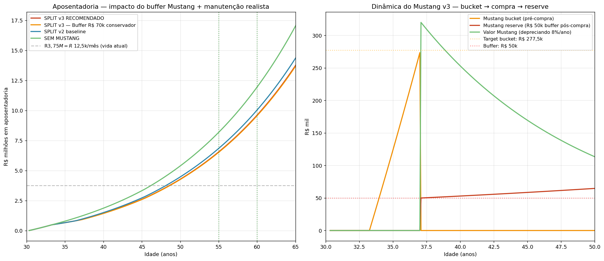

# Projeção v3 — buffer R$ 50k Mustang + manutenção realista

> v3 = v2 atualizada com: (1) buffer R\$ 50k pra imprevistos Mustang e
> (2) manutenção incremental R\$ 2.000/mês (mais realista que v2 R\$ 1.500).

---

## Sobre o buffer R\$ 50k — é suficiente?

### Custos mensais operação Mustang 2018 (realistas)

| Item | R\$/mês |
|---|---:|
| Seguro (carro esportivo importado) | 700-1.250 |
| IPVA (4% FIPE mensal equiv) | 800-1.200 |
| Combustível (V8 faz 6-8 km/L premium, 1000 km/mês) | 900-1.400 |
| Manutenção regular (óleo, filtros, freios) | 300-500 |
| Pneus (amortizado, 30-40k km) | 200-300 |
| **Total mensal** | **R\$ 2.900-4.650** |

Lancer HL-T 2018 operação: ~R\$ 1-1,5k/mês (já no lifestyle atual).

**Incremental Mustang vs Lancer: R\$ 1,9-3,1k/mês.** v2 assumi R\$ 1,5k — otimista.
v3 usa **R\$ 2.000/mês** (middle-realistic).

### Imprevistos típicos em Mustang 2018 chegando aos 15 anos (2033)

| Evento | Custo típico |
|---|---:|
| Câmbio automático (problema clássico Fords auto) | R\$ 15-30k |
| Turbo queimado (EcoBoost) | R\$ 10-15k |
| Suspensão completa | R\$ 5-10k |
| Colisão leve (funilaria + pintura) | R\$ 10-30k |
| Peças eletrônicas importadas | R\$ 5-15k |
| Retífica motor (V8 desgastado) | R\$ 30-60k |

### Veredicto sobre R\$ 50k buffer

| Critério | R\$ 50k buffer |
|---|---|
| Cobre 1 evento major (câmbio, colisão) | ✅ SIM |
| Cobre 2 eventos simultâneos | ❌ Insuficiente |
| Em 20 anos de posse, 2-3 majors são esperados | ⚠️ Precisa repor |

**R\$ 50k = mínimo defensável**, mas requer disciplina:
1. Se gastar R\$ 30k em conserto → repor com 13º/bônus ASAP
2. Durante "ano bom" (sem gastos), R\$ 50k fica líquido em CDI rendendo 2% real

Alternativas mais seguras:
- **R\$ 70-80k buffer** (conservador, atrasa Mustang ~2 meses)
- **R\$ 50k + sinking fund R\$ 500-1000/mês** (acumula extra pra surprises)

---

## Comparação quantitativa v2 vs v3

### 📊 Gráfico: impacto do buffer + manutenção realista

**Esquerda:** todas as opções cruzam a linha de "vida atual" (R\$ 12,5k/mês)
antes dos 50 anos. v3 (vermelho) fica levemente abaixo de v2 (azul) mas
acima de tudo o que realmente importa.

**Direita:** dinâmica do Mustang v3. Bucket sobe até R\$ 278k (aos ~37 anos),
compra Mustang R\$ 320k com R\$ 92,5k Lancer, separa R\$ 50k em reserve.
Depois reserve mantém estável (amortecendo imprevistos); Mustang deprecia
8%/ano.

### Tabela resultados

| Cenário | Mustang aos | Buffer | Manut | Apos 55y | Apos 60y |
|---|---:|---:|---:|---:|---:|
| v2 baseline (sem buffer + manut otim R\$ 1.5k) | 36,4 | R\$ 0 | 1.500 | R\$ 22,8k/mês | R\$ 33,5k/mês |
| **v3 RECOMENDADO (R\$ 50k + R\$ 2k)** ⭐ | **37,1** | **R\$ 50k** | **2.000** | **R\$ 21,8k/mês** | **R\$ 32,0k/mês** |
| v3 conservador (R\$ 70k + R\$ 2k) | 37,3 | R\$ 70k | 2.000 | R\$ 21,7k/mês | R\$ 31,9k/mês |
| v3 + sinking fund (R\$ 50k + R\$ 2,5k) | 37,1 | R\$ 50k | 2.500 | R\$ 21,2k/mês | R\$ 31,1k/mês |
| SEM MUSTANG | — | — | — | R\$ 27,3k/mês | R\$ 39,8k/mês |

### O custo real do Mustang (v3 RECOMENDADO vs SEM)

- **Aposentadoria 55y: R\$ 21,8k vs R\$ 27,3k = -R\$ 5,5k/mês** (custa 20% do nest)
- **Ainda 1,75× vida atual** (R\$ 12,5k)
- **Confortável com folga**

---

## Comparação v1 → v2 → v3 (evolução realismo)

| Versão | Premissa | Mustang aos | Apos 55y |
|---|---|---:|---:|
| v1 (original) | Sem Lancer, manut R$ 2,5k/mês absoluto | 37,7 | R\$ 21,0k/mês |
| v2 (+ Lancer) | Lancer R\$ 92,5k, manut R\$ 1,5k incr | 36,4 | R\$ 22,8k/mês |
| **v3 (+ buffer + manut real)** | **Lancer + R\$ 50k buffer + R\$ 2k incr** | **37,1** | **R\$ 21,8k/mês** |

**v3 é o mais realista.** Ficou entre v1 e v2 — próximo do v1 original, mas
com a mecânica correta (Lancer entra na conta + buffer + manut incremental).

---

## Mecânica operacional v3 (versão realista)

### Timeline

1. **Mai/26 → Abr/29 (Fase 1 + 2):** execute plano caixinhas (R\$ 833 imóvel + resto aposentadoria)
2. **Abr/29 (aos 33 anos):** compra imóvel R\$ 500k, entrada R\$ 75k + financ R\$ 175k
3. **Abr/29 → ~Mai/2034 (aos 37,1 anos):** SPLIT 50/50
   - ~R\$ 5.750/mês pra Mustang bucket
   - ~R\$ 5.750/mês pra aposentadoria
   - Bucket cresce com juros 3% real
4. **~Mai/2034:** Mustang bucket atinge R\$ 278k
   - Anuncia Lancer (mercado modificado, 2-3 meses)
   - Vende Lancer R\$ 92,5k
   - **Compra Mustang R\$ 320k + separa R\$ 50k em reserve CDI**
   - Total usado: R\$ 370k (R\$ 278k bucket + R\$ 92,5k Lancer)
   - Sobra pequena vai pra aposentadoria
5. **Pós-Mustang:**
   - Aporte líquido: R\$ 13.100 - R\$ 1.600 parcela - R\$ 2.000 manut = **R\$ 9.500/mês pra aposentadoria**
   - R\$ 50k reserve rende CDI (2% real), disponível pra imprevistos
6. **Aos 55 (2051):** R\$ 6,55M nest → **R\$ 21,8k/mês renda** (SWR 4%) = 1,75× vida atual

### Regras do buffer R\$ 50k

- **Fica em CDI liquidez diária** (Inter, Nubank) — zero risco, acessível
- **Consumido em imprevistos** (não é investimento)
- **Repor quando cair abaixo de R\$ 40k** — usar 13º/bônus ou pausa parcial aposentadoria (1-2 meses)
- **Crescimento natural** 2% real/ano compensa pequeno gasto de manutenção extra anual
- **Revisar anualmente** — se buffer não foi usado por 3+ anos, considerar reduzir ou mover parte pra aposentadoria

---

## Resumo das 3 perguntas (atualizado v3)

### 1. 🚗 Mustang viável aos 37 anos

**SPLIT 50/50 com Lancer + Buffer R\$ 50k + manut realista:**
- Mustang aos **37,1 anos** (2033-2034)
- Aposentadoria 55y: **R\$ 21,8k/mês** (1,75× vida atual)
- Aposentadoria 60y: **R\$ 32,0k/mês** (2,56× vida atual)
- Buffer R\$ 50k pra imprevistos cobre 1 evento major

**R\$ 50k buffer é defensável com disciplina de reposição.** Se você é do
tipo que reempilha via 13º/bônus, suficiente. Se prefere dormir tranquilo
com cushion extra, R\$ 70-80k.

### 2. 🏠 Amortizar vs Investir — inalterado

Diferença segue sendo microscópica. **Continue investindo** os aportes
mensais; amortize com 13º/bônus se quiser conforto psicológico.

### 3. 🏖️ Aposentadoria qualidade ≥ atual — garantida

**v3 realista:**
- Aos 55y: R\$ 21,8k/mês (1,75× lifestyle atual)
- Aos 60y: R\$ 32,0k/mês (2,56×)
- Aos 50y (opcional): já cruza R\$ 12,5k/mês SWR (aposentar antes possível)

---

## Caveats honestos v3

1. **Buffer R\$ 50k tem que ter DISCIPLINA de reposição.** Se gastar e
   não repor, próximo imprevisto fica sem cushion → consome
   aposentadoria.
2. **Manutenção R\$ 2k/mês incr é MEDIANA.** Pode ser R\$ 1,5k em anos
   tranquilos e R\$ 3-4k em anos com problemas. Buffer absorve.
3. **Mustang 2018 depreciando até 2033:** 15 anos velho, preço pode cair
   pra R\$ 250k. Ajustar target no momento.
4. **Venda do Lancer modificado NÃO É GARANTIA** — enthusiast market é
   volátil. Plano B: aceitar FIPE ~R\$ 60k em 2033 → atrasa Mustang 6
   meses, apos 55y fica R\$ 21,2k/mês.
5. **Retorno 6% real da aposentadoria é PREMISSA.** Se só entregar 4%:
   nest 55y cai pra ~R\$ 4,6M → R\$ 15,3k/mês (ainda 1,2× vida atual,
   apertado mas viável).
6. **Vida real = eventos.** Filhos, divórcio, carreira → revisar plano
   cada 2-3 anos.

---

## Arquivos

- **`RESPOSTA_V3.md`** ⭐ — este arquivo (realista, recomendado)
- `RESPOSTA_V2.md` — com Lancer, manut otimista
- `RESPOSTA.md` — v1 original (sem Lancer)
- `projecao_v3_buffer.png` — gráfico v3
- `scenarios_v3_summary.csv` — dados v3
- `scripts/10c_projection_v3_buffer.py` — código v3
