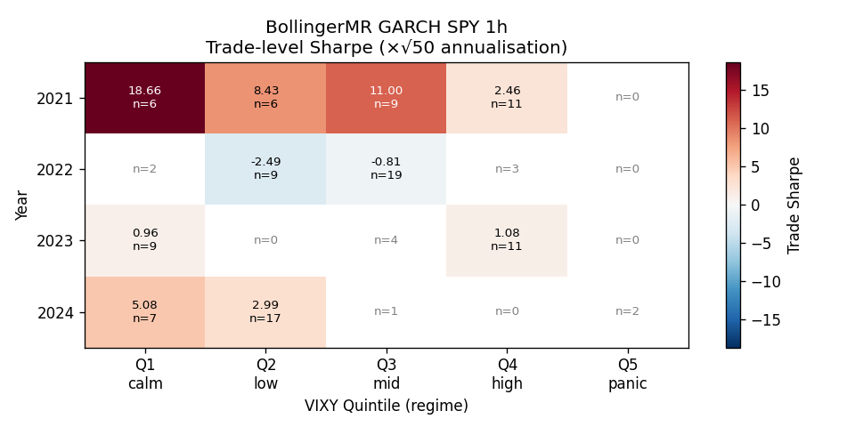
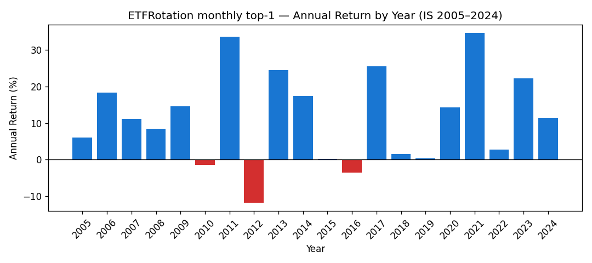

# Phase B Lead #6 — Regime Decomposition

Analyses both Phase A winners by year and VIX regime (VIXY proxy).
**Goal:** identify pause-trigger conditions for live trading.

VIX proxy: **VIXY** daily close (Tiingo storage, 2021-01-04 onward).
VIXY quintile edges computed over 2021–2026 universe.

## Quintile thresholds (VIXY close)

| Quintile | VIXY range | Regime |
|---|---|---|
| Q1 | 5.25 – 12.11 | calm |
| Q2 | 12.11 – 15.67 | low |
| Q3 | 15.67 – 21.35 | mid |
| Q4 | 21.35 – 32.37 | high |
| Q5 | 32.37 – 82.83 | panic |

---

## BollingerMR GARCH SPY 1h  [SHORT-HOLD CFD, Path A]

IS trades: 151  |  Trades with VIXY data (2021+): 116

### Year decomp (all IS years, no VIX requirement)

| Year | n | WR | Mean ret | Sharpe(×√50) |
|---|---|---|---|---|
| 2019 | 2 | 100.0% | +0.264% | n/a |
| 2020 | 33 | 63.6% | +0.279% | +0.837 |
| 2021 | 32 | 90.6% | +0.786% | +6.337 |
| 2022 | 33 | 51.5% | -0.473% | -1.431 |
| 2023 | 24 | 66.7% | +0.155% | +0.988 |
| 2024 | 27 | 77.8% | +0.424% | +3.069 |

### VIXY quintile decomp (2021-2026 IS trades)

| Quintile | Range | n | WR | Mean ret | Sharpe(×√50) |
|---|---|---|---|---|---|
| Q1 calm | 5.2–12.1 | 24 | 79.2% | +0.478% | +3.234 |
| Q2 low | 12.1–15.7 | 32 | 75.0% | +0.162% | +0.813 |
| Q3 mid | 15.7–21.4 | 33 | 72.7% | +0.181% | +0.590 |
| Q4 high | 21.4–32.4 | 25 | 64.0% | +0.127% | +0.718 |
| Q5 panic | 32.4–82.8 | 2 | 0.0% | -0.566% | n/a (low n) |

**✅ No losing quintiles (n≥5, Sharpe<0) in IS.** Strategy edge holds across all VIX regimes.
**⚠️ Losing years:** 2022.0

---

## ETFRotation monthly top-1  [SWING BROKER, Path B]

IS months: 239 (2005–2024)  |  Months with VIXY data (2021+): 47

### Year decomp (all IS years)

| Year | n_months | Annual ret | Sharpe(ann) |
|---|---|---|---|
| 2005 | 11 | +6.0% | +0.523 |
| 2006 | 12 | +18.3% | +1.465 |
| 2007 | 12 | +11.2% | +1.535 |
| 2008 | 12 | +8.4% | +1.000 |
| 2009 | 12 | +14.6% | +1.142 |
| 2010 | 12 | -1.4% | +0.026 |
| 2011 | 12 | +33.6% | +1.954 |
| 2012 | 12 | -11.7% | -0.985 |
| 2013 | 12 | +24.5% | +1.881 |
| 2014 | 12 | +17.5% | +1.561 |
| 2015 | 12 | +0.1% | +0.088 |
| 2016 | 12 | -3.5% | -0.263 |
| 2017 | 12 | +25.6% | +2.771 |
| 2018 | 12 | +1.5% | +0.170 |
| 2019 | 12 | +0.3% | +0.094 |
| 2020 | 12 | +14.3% | +0.586 |
| 2021 | 12 | +34.7% | +2.073 |
| 2022 | 12 | +2.7% | +0.293 |
| 2023 | 12 | +22.2% | +1.341 |
| 2024 | 12 | +11.5% | +1.051 |

### VIXY quintile decomp (2021-2024 months)

| Quintile | Range | n_months | Ann. ret | Sharpe(ann) |
|---|---|---|---|---|
| Q1 calm | 5.2–12.1 | 13 | +21.7% | +1.429 |
| Q2 low | 12.1–15.7 | 12 | +18.4% | +1.743 |
| Q3 mid | 15.7–21.4 | 11 | +17.2% | +1.118 |
| Q4 high | 21.4–32.4 | 10 | +10.8% | +0.782 |
| Q5 panic | 32.4–82.8 | 1 | -35.4% | n/a (low n) |

**✅ No losing quintiles (n≥3) in IS 2021-2024 window.**
**⚠️ Losing years (IS):** 2012.0, 2016.0

---

## Cross-winner regime concordance

Do both strategies lose in the same VIX quintiles?  
If so, the portfolio blend offers no diversification in that regime.

**✅ Neither strategy has a losing quintile (n-sufficient) → full regime robustness.**

## Citations

- `[advances_fin_ml, p.215-219, ch.13]` — regime stress / partitioning
- `[machine_trading, p.126-127]` — EWMA-GARCH vol sizing
- `[stocks_on_the_move, p.81/66/95]` — ETFRotation canonical params