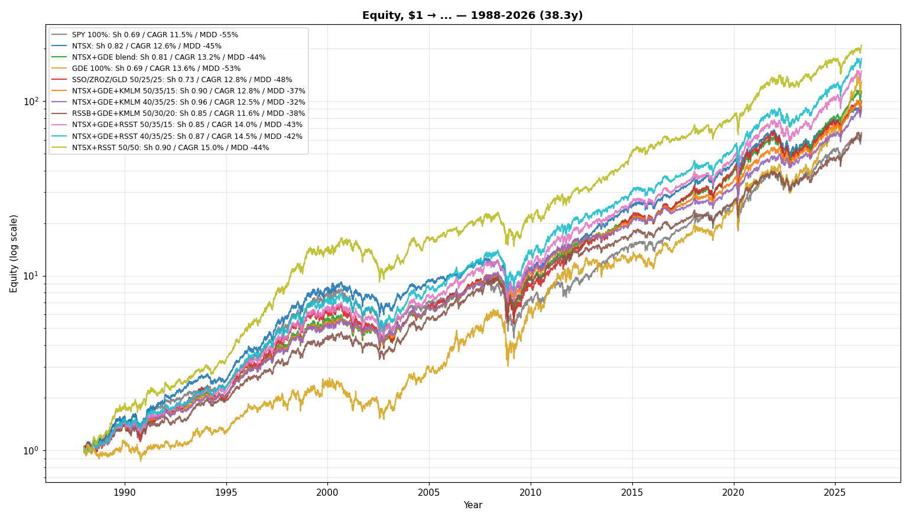
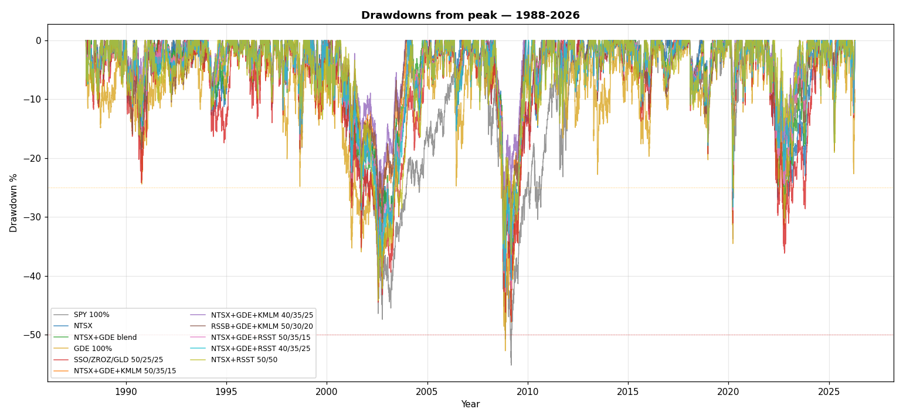
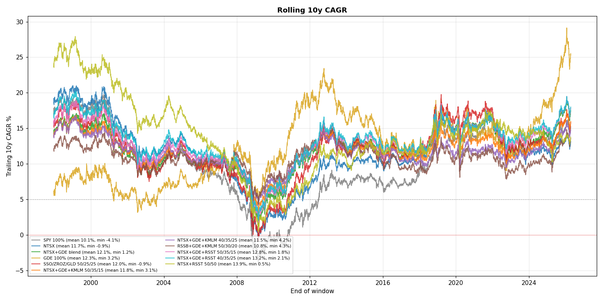
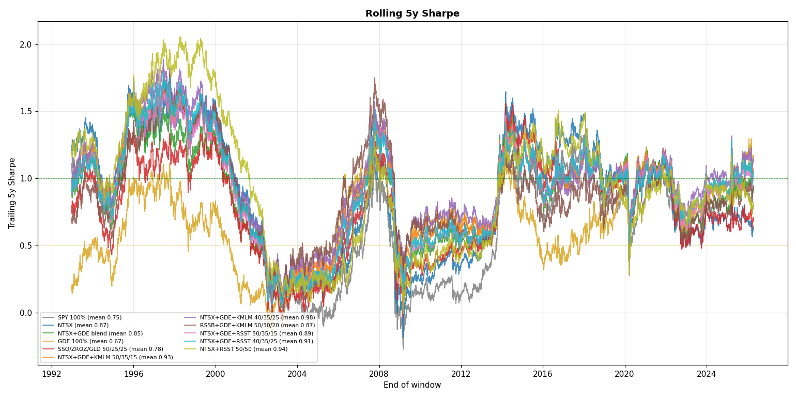
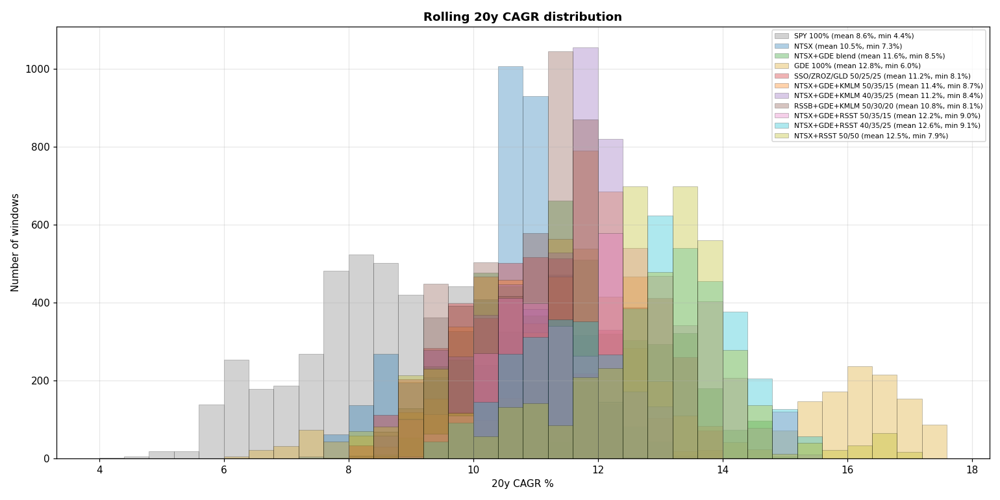
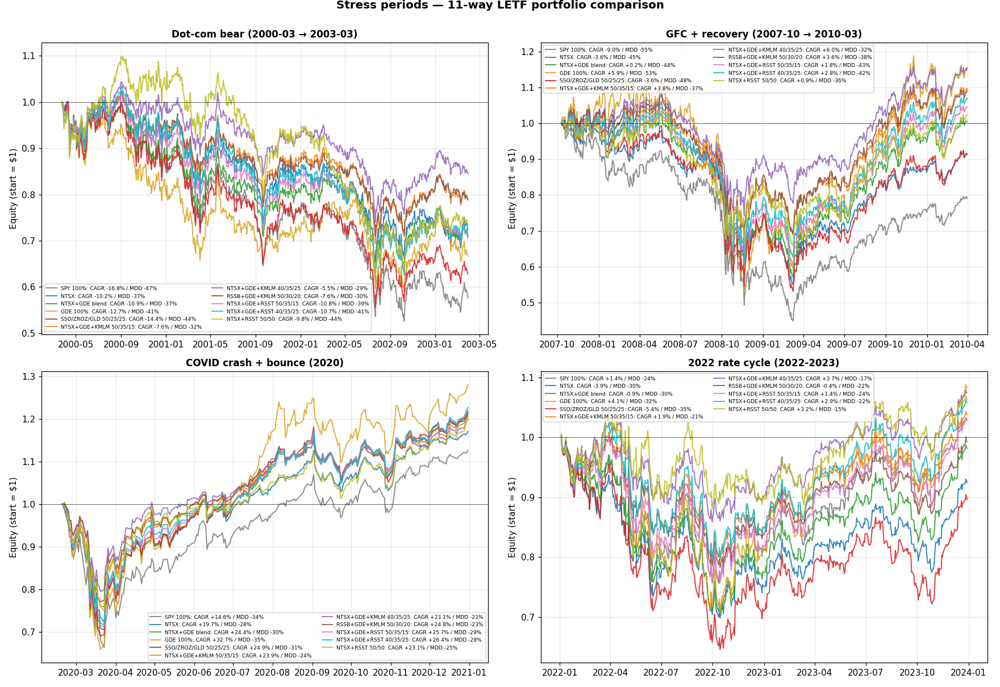

# Is there anything actually better than NTSX+GDE? 5-portfolio shootout, 1986–2026 (40 years)

**EDIT:** Tested adding a managed futures sleeve on top of the blend. Result: NTSX+GDE+KMLM 40/35/25 pushes Sharpe from 0.82 to 0.96 and cuts max drawdown from −44% to −32%, at the cost of ~70 bps of CAGR (12.5% vs 13.2%). Held up significantly better across every stress period — dot-com, GFC, 2022. Full numbers in the comments below. Charts updated to include all 11 portfolios tested (original 5 + MF variants + RSST variants).

---

I've been holding the NTSX+GDE blend (basically 66% NTSX + 34% GDE, the one floating around here for a couple years) and I keep wondering if I'm leaving something on the table. Picked four other things I see recommended a lot and ran them on the testfolio synth data back to 1986. Posting because I'd like the wisdom of the sub on what I'm missing.

Five portfolios, all yearly rebalance except the last:

| # | Portfolio | Allocation |
|---|---|---|
| P1 | SPY 100% | baseline |
| P2 | NTSX | 90% S&P + 60% IEF − 50% cash (the WisdomTree 1.5x stack) |
| P3 | NTSX + GDE blend | 59.4 SPY + 39.6 IEF − 33 cash + 34 GDE |
| P4 | GDE 100% | 90% S&P + 90% gold (WisdomTree's stack) |
| P5 | SSO/ZROZ/GLD | 50/25/25, monthly rebal, 0.89% drag for ER |

Window is 1986-01 → 2026-04 (40.3 years), bounded by the SSO/ZROZ/GLD synths starting in 1986. All portfolios use the same window so the comparison is apples to apples.

## Headline numbers

| Portfolio | Sharpe | CAGR | Vol | MaxDD |
|---|---:|---:|---:|---:|
| SPY 100% | 0.68 | 11.5% | 18.5% | −55% |
| NTSX | 0.80 | 12.6% | 16.6% | −45% |
| **NTSX + GDE blend** | **0.82** | **13.4%** | 17.3% | **−44%** |
| GDE 100% | 0.71 | 14.2% | 22.2% | −53% |
| SSO/ZROZ/GLD | 0.72 | 13.0% | 19.5% | −48% |

NTSX+GDE wins Sharpe outright. GDE wins raw CAGR but eats more vol and drawdown. SSO/ZROZ/GLD is the most surprising — I had it in my head as the "obviously better" portfolio, and on Sharpe it's actually a hair behind plain GDE. ZROZ getting nuked in 2022 (and the constant 0.89% expense drag) is doing more damage than I appreciated.

## Rolling 10-year CAGR (the "what if I started here" view)

Distribution of trailing 10y CAGR for every starting day:

| Portfolio | mean | min | 5th pct | P(<5%) |
|---|---:|---:|---:|---:|
| SPY | 10.4% | −4.1% | −0.5% | 14.5% |
| NTSX | 11.9% | −0.9% | 2.9% | 8.3% |
| NTSX+GDE | 12.2% | **+1.2%** | **5.7%** | **2.9%** |
| GDE | 12.0% | +3.2% | 5.3% | 3.2% |
| SSO/ZROZ/GLD | 12.1% | −0.9% | 3.7% | 6.8% |

NTSX+GDE has the best floor of the leveraged options on a rolling 10y basis — it's the only one whose 5th percentile is north of the 5% line, and the lowest "P(< 5%)" of any of them. SSO/ZROZ/GLD has a worse floor than I expected; the 2022 window is the obvious culprit.

## Rolling 20y looks even tighter for NTSX+GDE

| Portfolio | mean | min | 5th pct |
|---|---:|---:|---:|
| SPY | 8.8% | 4.4% | 6.1% |
| NTSX | 10.7% | 7.3% | 8.5% |
| NTSX+GDE | **11.6%** | **8.5%** | **9.5%** |
| GDE | 12.4% | 6.0% | 7.9% |
| SSO/ZROZ/GLD | 11.2% | 8.1% | 9.0% |

GDE has the highest mean but a much wider tail. NTSX+GDE has both the best floor and the best 5th percentile. SSO/ZROZ/GLD is genuinely close on the floor but loses ~40 bps on the mean.

## Stress periods

| Period | SPY | NTSX | NTSX+GDE | GDE | SSO/ZROZ/GLD |
|---|---:|---:|---:|---:|---:|
| Dot-com 2000–2002 (total return) | −47% | −34% | −36% | −41% | −43% |
| GFC 2007-10 → 2009-03 | −55% | −45% | −42% | −40% | −46% |
| COVID Feb–Mar 2020 | −33% | −28% | −29% | −32% | −30% |
| 2022 full year | −18% | −25% | −23% | −20% | **−30%** |
| 2008 calendar year | −37% | −26% | −27% | −31% | −26% |
| 1987 crash | −32% | −29% | −28% | −25% | −32% |

The 2022 row is the one that stings for SSO/ZROZ/GLD. ZROZ dropped ~40% that year and the leveraged equity sleeve didn't help. NTSX+GDE got hit on the IEF leg too but the gold sleeve cushioned it.

## Charts

Updated to include all 11 portfolios from the full study (original 5 + MF + RSST variants). Window 1988–2026 (38.3y, bounded by KMLM synth start).

**Equity curves (log scale)**

**Drawdowns from peak**

**Rolling 10y CAGR**

**Rolling 5y Sharpe**

**Rolling 20y CAGR distribution**

**Stress periods (4-panel)**

## Caveats I'm aware of

* **40 years of US dominance.** Window is bounded by SSO/ZROZ/GLD synth start in 1986. So everything benefits from the post-1980 US bull. If I had a 1969 start (only NTSX/GDE/SPY would qualify) the picture would shift, but I can't put SSO/ZROZ/GLD in that comparison fairly.
* **All US, all USD.** None of these have any international exposure. I know that's a separate debate; trying to keep this one clean.
* **Daily reweighting** instead of true monthly/yearly rebal. The drift bias is small at this scale and doesn't change ordering, but if anyone wants the rebal-aware version I can rerun.
* **Gold synth.** GLDSIM/GDE both lean on gold price proxies pre-2004. Real GLD started 2004. ZROZ live from 2009.
* **0.89% drag** on P5 (rough mix of SSO 0.91 + ZROZ 0.15 + GLD 0.40). No drag applied to NTSX/GDE because their ERs are already in the synth (or close to it). If anything, this is generous to NTSX+GDE by maybe 10–20 bps.
* **Synthetic RSST.** testfolio doesn't have RSSTSIM. Built as SPY_TR + KMLM − CASH per the prospectus. No fee drag (~1% ER) applied to the MF variants — adjust CAGRs by 25–80 bps depending on sleeve size.

## So, what's the actual question

NTSX+GDE blend wins this slate on Sharpe and on rolling-window floor. GDE wins CAGR if you can stomach the vol. SSO/ZROZ/GLD lost more than I expected, mostly because of 2022.

What I want to know:

1. Is there a portfolio you've been running that you genuinely think beats NTSX+GDE on a 20y+ rolling basis, not just on the post-2009 sample? RSST? RSSB? UPRO/EDV/GLD with rebal bands?
2. Anyone running NTSX+GDE+ZROZ or NTSX+GDE+TYA to lengthen duration and stop dragging on the IEF middle?
3. If you'd swap the IEF leg of NTSX for something else, what?

Happy to rerun any specific allocation against the same dataset and post the result.
