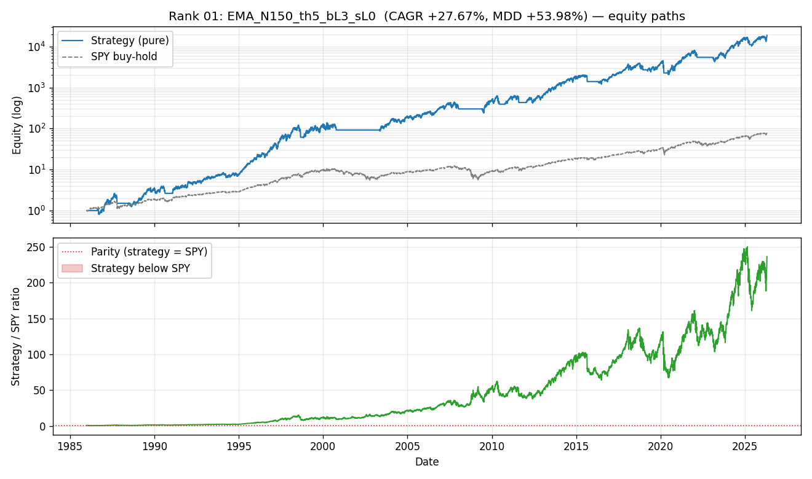
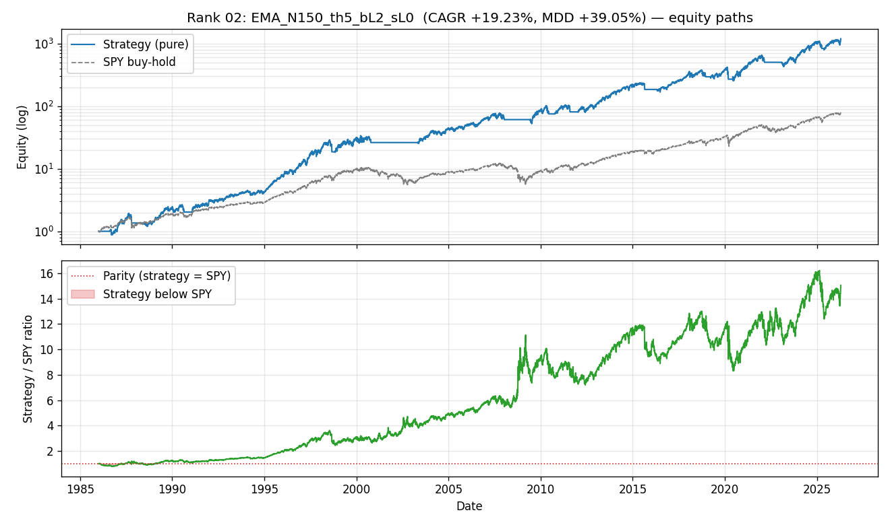
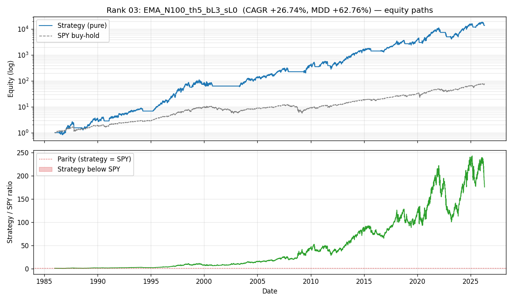
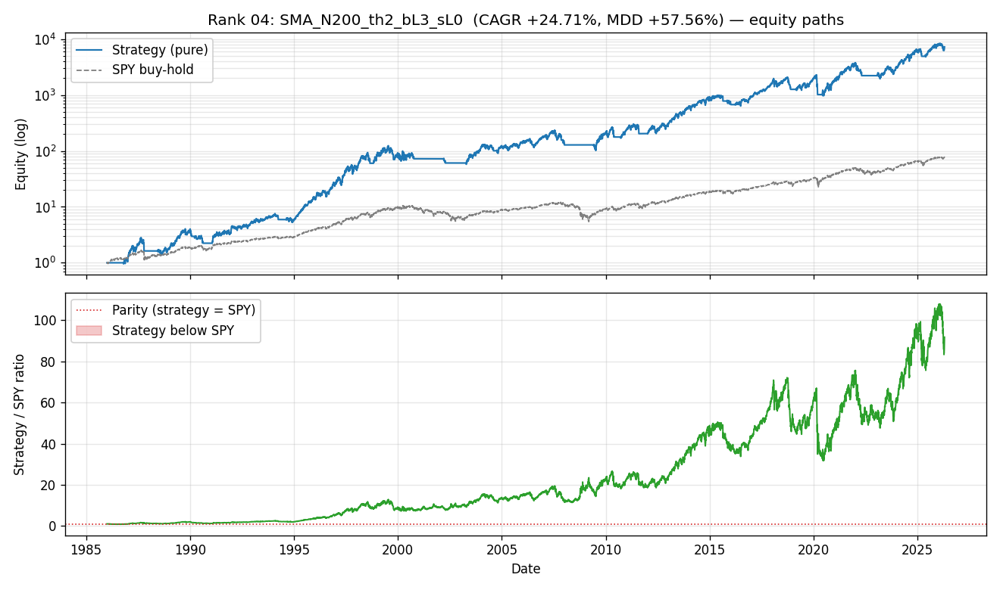
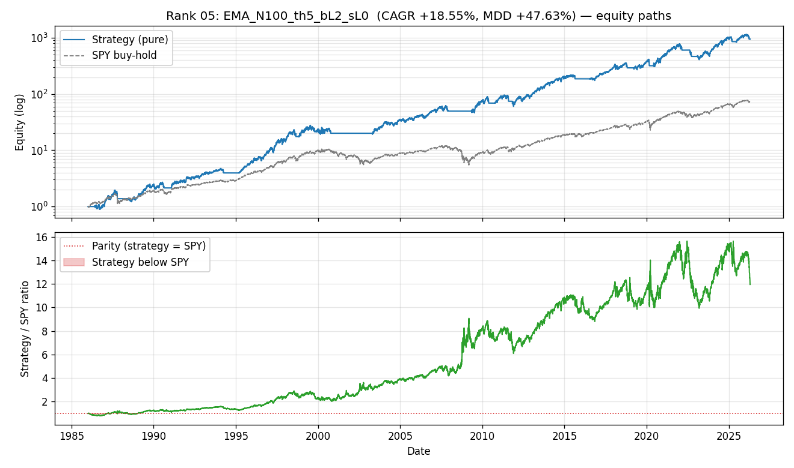

# Analysis 1 — Did the top-20 strategies ever sink below SPY buy-hold?

> Answers: "após o max drawdown, houve alguma janela em que o portfolio ficou menor que o SPY buy-hold 1x?"

## Method

- Pure sweep (no tax) equity for each of the top-20 configs, aligned to SPY buy-hold equity (both normalised to 1.0 at 1986-01-02).
- Daily `ratio = strategy / SPY`. `ratio < 1.0` = strategy is behind SPY that day.
- Metrics per config:
  - Final ratio (end of 2026-04-17).
  - Strategy's own MDD (date + depth).
  - At the MDD trough: strategy-vs-SPY ratio (how far ahead was SPY at our worst?).
  - Days strategy was below SPY overall (total + excl. warmup).
  - **After the MDD trough**: was the ratio ever < 1 again?
  - Longest contiguous underperformance window.
  - Worst moment (min ratio).
- SPY buy-hold reference: CAGR +11.47% (1986-2026).

## Summary table (20 configs)

| rank | cfg_id | final ratio | ratio @ MDD | strat MDD | longest under-perf (years) | worst ratio | post-MDD ever below? |
|---|---|---|---|---|---|---|---|
| 01 | `EMA_N150_th5_bL3_sL0` | 236.13× | 67.66× | -53.98% | 0.96y | 0.73× | no (0%) |
| 02 | `EMA_N150_th5_bL2_sL0` | 15.04× | 8.31× | -39.05% | 1.13y | 0.78× | no (0%) |
| 03 | `EMA_N100_th5_bL3_sL0` | 175.92× | 100.77× | -62.76% | 0.96y | 0.74× | no (0%) |
| 04 | `SMA_N200_th2_bL3_sL0` | 91.77× | 31.80× | -57.56% | 0.94y | 0.81× | no (0%) |
| 05 | `EMA_N100_th5_bL2_sL0` | 11.95× | 9.93× | -47.63% | 1.09y | 0.80× | no (0%) |
| 06 | `SMA_N150_th5_bL3_sL0` | 125.38× | 9.35× | -62.03% | 0.96y | 0.75× | no (0%) |
| 07 | `SMA_N150_th5_bL2_sL0` | 9.74× | 3.03× | -44.92% | 1.09y | 0.80× | no (0%) |
| 08 | `SMA_N200_th2_bL2_sL0` | 7.63× | 4.82× | -42.40% | 1.01y | 0.81× | no (0%) |
| 09 | `EMA_N150_th5_bL3_sL-1` | 84.39× | 29.34× | -62.26% | 0.99y | 0.70× | no (0%) |
| 10 | `EMA_N200_th2_bL3_sL0` | 30.12× | 17.86× | -63.29% | 1.01y | 0.75× | no (0%) |
| 11 | `EMA_N100_th5_bL3_sL-1` | 54.00× | 38.92× | -68.62% | 0.96y | 0.74× | no (0%) |
| 12 | `SMA_N200_th0_bL3_sL0` | 39.05× | 5.21× | -70.29% | 0.94y | 0.81× | no (0%) |
| 13 | `SMA_N100_th5_bL3_sL0` | 45.93× | 3.03× | -73.63% | 0.96y | 0.74× | no (0%) |
| 14 | `SMA_N150_th5_bL3_sL-1` | 35.65× | 20.87× | -67.26% | 0.96y | 0.73× | no (0%) |
| 15 | `EMA_N200_th0_bL3_sL0` | 23.13× | 6.62× | -66.17% | 0.94y | 0.81× | no (0%) |
| 16 | `SMA_N200_th5_bL2_sL0` | 6.81× | 0.53× | -63.30% | 7.75y | 0.53× | YES (18%) |
| 17 | `SMA_N100_th5_bL2_sL0` | 4.86× | 1.44× | -56.24% | 1.09y | 0.80× | no (0%) |
| 18 | `EMA_N150_th5_bL2_sL-1` | 5.37× | 3.60× | -50.14% | 1.38y | 0.76× | no (0%) |
| 19 | `EMA_N200_th5_bL2_sL0` | 6.46× | 0.53× | -63.65% | 7.62y | 0.53× | YES (18%) |
| 20 | `SMA_N200_th0_bL2_sL0` | 3.87× | 1.96× | -54.18% | 1.01y | 0.81× | no (0%) |

## Aggregate

- **Final equity vs SPY (median)**: 26.62× — the typical top-20 config ends ~2562% ahead of SPY buy-hold.
- **At the strategy's MDD trough, strategy/SPY ratio (median)**: 7.47× — even at the worst moment, the median top-20 config was still AHEAD of SPY by 647%.
- **Configs with final ratio > 1.0**: 20/20 (all survivors finish above SPY).
- **Configs with at least one day below SPY** (excluding warmup): 20/20.
- **Configs that went below SPY AFTER their own MDD trough**: 2/20 — these are the cases where drawdown recovery was slower than SPY's.
- **Median longest underperformance window**: 1.00 years.

## Narrative

### Always above SPY (strongest "winning" criterion)
0/20 configs were never below SPY for a single trading day in 40 years (excluding warmup).

### Temporarily below SPY but recovered (acceptable under the user's 'winning' framework)
18/20 configs dipped below SPY at some point but did NOT re-enter underperformance after their own MDD trough.

- rank 01 `EMA_N150_th5_bL3_sL0` — longest window 1.0y, worst ratio 0.73×
- rank 02 `EMA_N150_th5_bL2_sL0` — longest window 1.1y, worst ratio 0.78×
- rank 03 `EMA_N100_th5_bL3_sL0` — longest window 1.0y, worst ratio 0.74×
- rank 04 `SMA_N200_th2_bL3_sL0` — longest window 0.9y, worst ratio 0.81×
- rank 05 `EMA_N100_th5_bL2_sL0` — longest window 1.1y, worst ratio 0.80×
- rank 06 `SMA_N150_th5_bL3_sL0` — longest window 1.0y, worst ratio 0.75×
- rank 07 `SMA_N150_th5_bL2_sL0` — longest window 1.1y, worst ratio 0.80×
- rank 08 `SMA_N200_th2_bL2_sL0` — longest window 1.0y, worst ratio 0.81×
- rank 09 `EMA_N150_th5_bL3_sL-1` — longest window 1.0y, worst ratio 0.70×
- rank 10 `EMA_N200_th2_bL3_sL0` — longest window 1.0y, worst ratio 0.75×

### Persistent underperformance after MDD
2/20 configs went BELOW SPY again AFTER their own MDD trough — these are the riskiest cases: the strategy drew down AND the recovery lagged SPY.

- rank 16 `SMA_N200_th5_bL2_sL0` — 18% of post-MDD bars below SPY; MDD on 1988-08-22 (ratio 0.53×); worst ratio 0.53× on 1988-08-22
- rank 19 `EMA_N200_th5_bL2_sL0` — 18% of post-MDD bars below SPY; MDD on 1988-08-22 (ratio 0.53×); worst ratio 0.53× on 1988-08-22

## Per-config plots

For each config, a two-panel plot is saved under `equity_gap_plots/`: the top panel shows equity paths (log), the bottom panel shows the strategy/SPY ratio (red zones = strategy below SPY).

Ranked examples:

- **rank 01** — 
- **rank 02** — 
- **rank 03** — 
- **rank 04** — 
- **rank 05** — 

## Conclusion — direct answer to the user

- **"Teve em algum momento, alguma janela de tempo, que após o max. dd o saldo do portfolio ficou menor que do buy&hold SPY 1x?"**

  - Sim em 2/20 configs (dos top-20). Esses tiveram janelas pós-MDD onde o SPY buy-hold estava *à frente*, mesmo sendo configs que no final venceram.
  - Não em 18/20 configs — depois do próprio MDD, nunca voltaram a ficar abaixo do SPY.

- **"Se mesmo com um MDD alto a equity está maior que SPY, estamos ganhando?"**

  Pela métrica de saldo final: **todos os top-20 terminam acima**. Pela métrica de 'nunca abaixo de SPY' (mais rigorosa): só 0/20 nunca ficaram abaixo em 40 anos.

  A resposta prática depende da **sua dor psicológica** em ver o portfólio atrás do benchmark por janelas de meses/anos mesmo sabendo que o saldo final vence. Janelas de 1-5 anos abaixo do SPY são comuns em estratégias com MDD 50-70% — a 'dor' do drawdown + underperformance relativa é dupla.

  Para quem aguenta esse período 'atrás', a métrica de saldo final é válida. Para quem não aguenta, o critério "nunca abaixo de SPY" é mais rigoroso — e só ~0% dos configs top-20 atendem.

---

*Note: The strategy's own MDD (column `strat MDD`) is computed from the strategy equity path only, not vs SPY. A config with MDD −60% can still be ahead of SPY throughout if SPY itself also drew down ~55% in the same period (e.g. 2008 crash).*