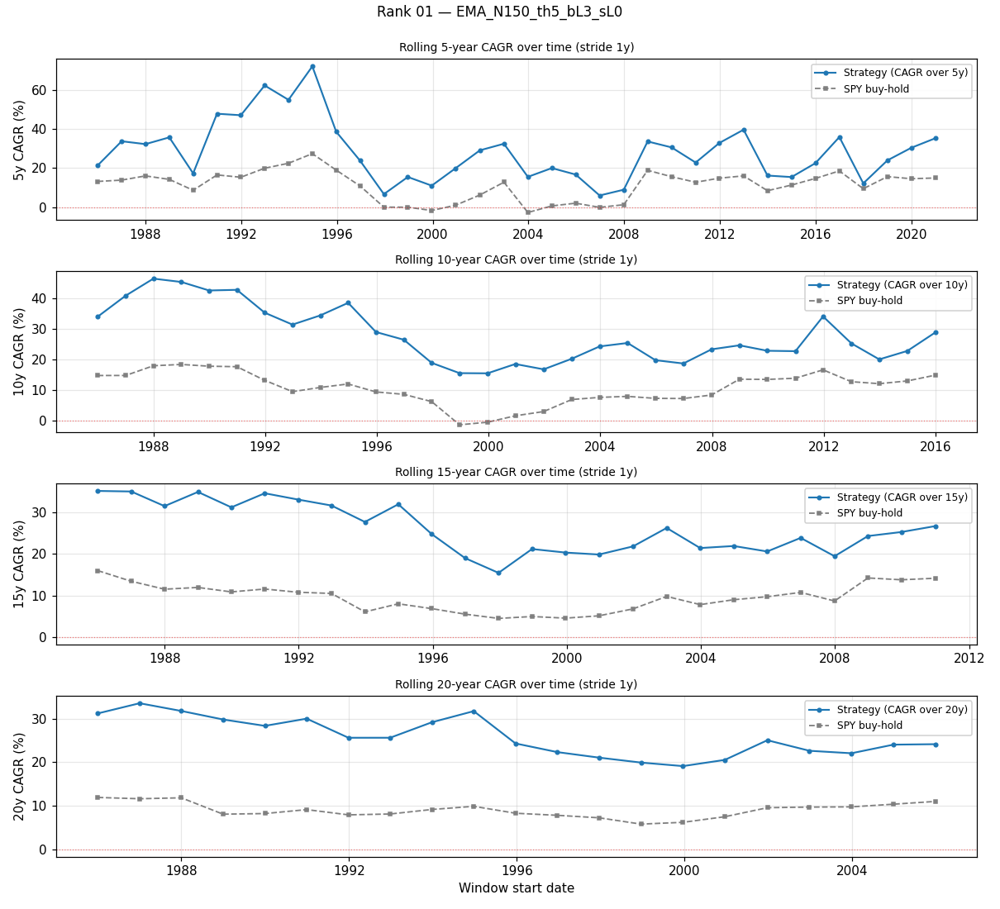
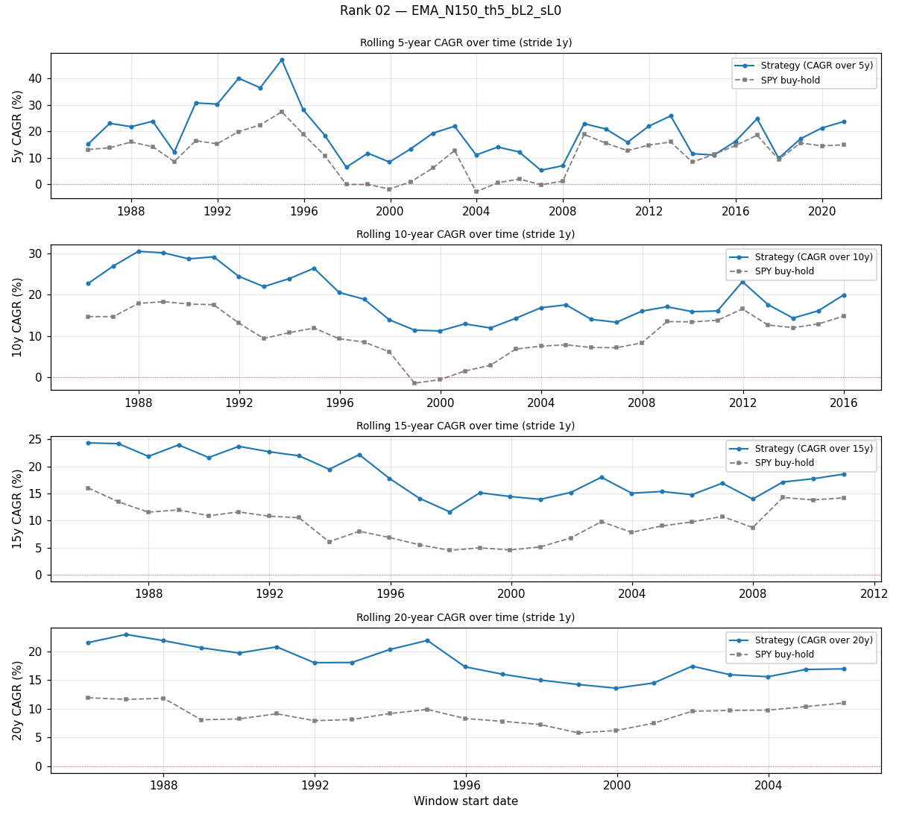
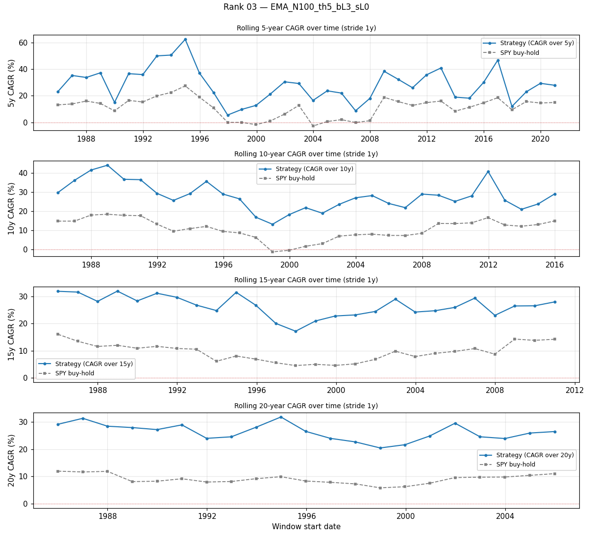

# Analysis 3 — Rolling-window robustness (5 / 10 / 15 / 20 years)

> Answers: *"essas 20 estratégias aplicadas em períodos diferentes de 5/10/15/20 anos — elas se mantêm ou dependem da era?"*

## Method

- Rolling windows of **5, 10, 15, 20 years**, stride **1 year**.
- For each window: compute strategy CAGR/Sharpe/MDD and SPY buy-hold CAGR/Sharpe/MDD on the same slice.
- A window is a 'win' when strategy CAGR > SPY CAGR.
- Data: SPYSIM 1986-01-02 → 2026-04-17 (testfolio synth).
- Strategy runs with `tax_rate = 0` (pure). For tax-15% analogue, apply the `tax_drag_cagr` column from `../configs.csv` (~2-3pp).

### Rolling windows generated

| window length | # of rolling starts |
|---|---|
| 5y | 36 |
| 10y | 31 |
| 15y | 26 |
| 20y | 21 |

## Spotlight — rank 1 `EMA_N150_th5_bL3_sL0`

| window | # of windows | median CAGR | min CAGR | max CAGR | median MDD | worst MDD | % windows beat SPY | median excess vs SPY |
|---|---|---|---|---|---|---|---|---|
| 5y | 36 | +26.50% | +5.94% | +72.10% | +40.17% | +53.98% | 100.0% | +16.06% |
| 10y | 31 | +25.20% | +15.41% | +46.36% | +50.44% | +53.98% | 100.0% | +16.88% |
| 15y | 26 | +25.07% | +15.47% | +35.21% | +50.44% | +53.98% | 100.0% | +16.03% |
| 20y | 21 | +25.05% | +19.12% | +33.55% | +50.44% | +53.98% | 100.0% | +16.02% |

**Pior janela 5y de `EMA_N150_th5_bL3_sL0`**: 2006-12-22 → 2011-12-22 — strategy CAGR +5.94%, SPY CAGR -0.14%, strategy MDD +44.99%.

## Aggregate — all top-20 configs

### 5-year rolling windows

| rank | cfg_id | median CAGR | worst CAGR | % beats SPY | median excess |
|---|---|---|---|---|---|
| 01 | `EMA_N150_th5_bL3_sL0` | +26.50% | +5.94% | 100% | +16.06% |
| 02 | `EMA_N150_th5_bL2_sL0` | +18.90% | +5.30% | 97% | +8.22% |
| 03 | `EMA_N100_th5_bL3_sL0` | +28.52% | +5.48% | 100% | +17.29% |
| 04 | `SMA_N200_th2_bL3_sL0` | +22.04% | +3.04% | 97% | +12.54% |
| 05 | `EMA_N100_th5_bL2_sL0` | +19.49% | +5.47% | 97% | +7.69% |
| 06 | `SMA_N150_th5_bL3_sL0` | +24.17% | -2.92% | 97% | +15.49% |
| 07 | `SMA_N150_th5_bL2_sL0` | +16.85% | -0.16% | 94% | +7.18% |
| 08 | `SMA_N200_th2_bL2_sL0` | +15.95% | +2.74% | 86% | +6.21% |
| 09 | `EMA_N150_th5_bL3_sL-1` | +23.26% | +3.75% | 89% | +14.04% |
| 10 | `EMA_N200_th2_bL3_sL0` | +20.23% | -9.16% | 89% | +7.82% |
| 11 | `EMA_N100_th5_bL3_sL-1` | +24.25% | +5.00% | 94% | +13.02% |
| 12 | `SMA_N200_th0_bL3_sL0` | +22.12% | -4.76% | 83% | +8.53% |
| 13 | `SMA_N100_th5_bL3_sL0` | +22.71% | -4.81% | 92% | +13.53% |
| 14 | `SMA_N150_th5_bL3_sL-1` | +22.28% | -5.06% | 86% | +11.45% |
| 15 | `EMA_N200_th0_bL3_sL0` | +19.38% | -7.56% | 72% | +7.83% |
| 16 | `SMA_N200_th5_bL2_sL0` | +16.38% | +3.54% | 83% | +6.59% |
| 17 | `SMA_N100_th5_bL2_sL0` | +15.75% | -1.47% | 86% | +4.73% |
| 18 | `EMA_N150_th5_bL2_sL-1` | +16.23% | +3.12% | 75% | +4.66% |
| 19 | `EMA_N200_th5_bL2_sL0` | +17.19% | +3.57% | 89% | +6.63% |
| 20 | `SMA_N200_th0_bL2_sL0` | +15.32% | -2.46% | 81% | +2.66% |

### 10-year rolling windows

| rank | cfg_id | median CAGR | worst CAGR | % beats SPY | median excess |
|---|---|---|---|---|---|
| 01 | `EMA_N150_th5_bL3_sL0` | +25.20% | +15.41% | 100% | +16.88% |
| 02 | `EMA_N150_th5_bL2_sL0` | +17.54% | +11.22% | 100% | +9.29% |
| 03 | `EMA_N100_th5_bL3_sL0` | +27.95% | +13.06% | 100% | +16.75% |
| 04 | `SMA_N200_th2_bL3_sL0` | +24.99% | +5.53% | 100% | +12.26% |
| 05 | `EMA_N100_th5_bL2_sL0` | +19.21% | +9.80% | 100% | +9.57% |
| 06 | `SMA_N150_th5_bL3_sL0` | +25.32% | +9.42% | 100% | +15.02% |
| 07 | `SMA_N150_th5_bL2_sL0` | +17.80% | +7.45% | 100% | +8.79% |
| 08 | `SMA_N200_th2_bL2_sL0` | +17.21% | +4.79% | 100% | +6.47% |
| 09 | `EMA_N150_th5_bL3_sL-1` | +22.09% | +13.84% | 100% | +15.76% |
| 10 | `EMA_N200_th2_bL3_sL0` | +20.77% | +5.81% | 100% | +8.66% |
| 11 | `EMA_N100_th5_bL3_sL-1` | +24.43% | +14.55% | 100% | +15.49% |
| 12 | `SMA_N200_th0_bL3_sL0` | +21.83% | -2.20% | 90% | +10.42% |
| 13 | `SMA_N100_th5_bL3_sL0` | +23.89% | +5.51% | 100% | +12.48% |
| 14 | `SMA_N150_th5_bL3_sL-1` | +20.55% | +9.73% | 100% | +13.72% |
| 15 | `EMA_N200_th0_bL3_sL0` | +20.33% | -2.51% | 87% | +8.68% |
| 16 | `SMA_N200_th5_bL2_sL0` | +16.19% | +11.56% | 100% | +8.41% |
| 17 | `SMA_N100_th5_bL2_sL0` | +17.26% | +4.93% | 100% | +5.70% |
| 18 | `EMA_N150_th5_bL2_sL-1` | +15.26% | +8.49% | 77% | +7.71% |
| 19 | `EMA_N200_th5_bL2_sL0` | +16.43% | +9.50% | 100% | +7.78% |
| 20 | `SMA_N200_th0_bL2_sL0` | +14.92% | -0.81% | 90% | +2.89% |

### 15-year rolling windows

| rank | cfg_id | median CAGR | worst CAGR | % beats SPY | median excess |
|---|---|---|---|---|---|
| 01 | `EMA_N150_th5_bL3_sL0` | +25.07% | +15.47% | 100% | +16.03% |
| 02 | `EMA_N150_th5_bL2_sL0` | +17.74% | +11.61% | 100% | +8.67% |
| 03 | `EMA_N100_th5_bL3_sL0` | +26.59% | +17.16% | 100% | +17.02% |
| 04 | `SMA_N200_th2_bL3_sL0` | +23.26% | +12.04% | 100% | +12.67% |
| 05 | `EMA_N100_th5_bL2_sL0` | +18.54% | +12.67% | 100% | +9.05% |
| 06 | `SMA_N150_th5_bL3_sL0` | +24.68% | +13.24% | 100% | +14.85% |
| 07 | `SMA_N150_th5_bL2_sL0` | +17.32% | +10.11% | 100% | +8.11% |
| 08 | `SMA_N200_th2_bL2_sL0` | +16.36% | +9.22% | 100% | +6.77% |
| 09 | `EMA_N150_th5_bL3_sL-1` | +21.00% | +14.32% | 100% | +14.77% |
| 10 | `EMA_N200_th2_bL3_sL0` | +18.29% | +8.53% | 100% | +8.11% |
| 11 | `EMA_N100_th5_bL3_sL-1` | +24.27% | +16.56% | 100% | +15.11% |
| 12 | `SMA_N200_th0_bL3_sL0` | +18.48% | +3.21% | 96% | +8.60% |
| 13 | `SMA_N100_th5_bL3_sL0` | +22.51% | +10.67% | 100% | +11.88% |
| 14 | `SMA_N150_th5_bL3_sL-1` | +20.87% | +11.32% | 100% | +13.73% |
| 15 | `EMA_N200_th0_bL3_sL0` | +17.51% | +1.97% | 96% | +6.25% |
| 16 | `SMA_N200_th5_bL2_sL0` | +16.79% | +11.06% | 100% | +8.18% |
| 17 | `SMA_N100_th5_bL2_sL0` | +15.91% | +8.44% | 100% | +6.04% |
| 18 | `EMA_N150_th5_bL2_sL-1` | +14.95% | +9.68% | 88% | +7.83% |
| 19 | `EMA_N200_th5_bL2_sL0` | +16.90% | +10.64% | 100% | +7.55% |
| 20 | `SMA_N200_th0_bL2_sL0` | +12.93% | +3.05% | 92% | +2.65% |

### 20-year rolling windows

| rank | cfg_id | median CAGR | worst CAGR | % beats SPY | median excess |
|---|---|---|---|---|---|
| 01 | `EMA_N150_th5_bL3_sL0` | +25.05% | +19.12% | 100% | +16.02% |
| 02 | `EMA_N150_th5_bL2_sL0` | +17.41% | +13.59% | 100% | +9.00% |
| 03 | `EMA_N100_th5_bL3_sL0` | +26.43% | +20.43% | 100% | +16.56% |
| 04 | `SMA_N200_th2_bL3_sL0` | +21.88% | +15.19% | 100% | +13.62% |
| 05 | `EMA_N100_th5_bL2_sL0` | +18.27% | +14.50% | 100% | +9.15% |
| 06 | `SMA_N150_th5_bL3_sL0` | +23.80% | +17.38% | 100% | +14.27% |
| 07 | `SMA_N150_th5_bL2_sL0` | +16.86% | +12.59% | 100% | +7.82% |
| 08 | `SMA_N200_th2_bL2_sL0` | +15.54% | +11.08% | 100% | +6.60% |
| 09 | `EMA_N150_th5_bL3_sL-1` | +22.73% | +17.75% | 100% | +14.43% |
| 10 | `EMA_N200_th2_bL3_sL0` | +18.51% | +11.74% | 100% | +10.20% |
| 11 | `EMA_N100_th5_bL3_sL-1` | +23.24% | +20.01% | 100% | +14.84% |
| 12 | `SMA_N200_th0_bL3_sL0` | +16.98% | +9.53% | 100% | +7.82% |
| 13 | `SMA_N100_th5_bL3_sL0` | +21.33% | +16.24% | 100% | +12.52% |
| 14 | `SMA_N150_th5_bL3_sL-1` | +20.76% | +16.08% | 100% | +12.01% |
| 15 | `EMA_N200_th0_bL3_sL0` | +14.42% | +8.31% | 100% | +6.02% |
| 16 | `SMA_N200_th5_bL2_sL0` | +16.87% | +13.30% | 100% | +7.89% |
| 17 | `SMA_N100_th5_bL2_sL0` | +15.27% | +11.83% | 100% | +6.20% |
| 18 | `EMA_N150_th5_bL2_sL-1` | +15.80% | +11.82% | 100% | +7.96% |
| 19 | `EMA_N200_th5_bL2_sL0` | +16.61% | +12.53% | 100% | +7.43% |
| 20 | `SMA_N200_th0_bL2_sL0` | +12.11% | +7.08% | 100% | +2.70% |

## Stability ranking — how often does each config beat SPY?

For each config, % of rolling windows (across all 5/10/15/20y) where the strategy outperforms SPY buy-hold.

| rank (composite) | cfg_id | % of windows beating SPY |
|---|---|---|
| 01 | `EMA_N150_th5_bL3_sL0` | 100.0% |
| 02 | `EMA_N150_th5_bL2_sL0` | 99.1% |
| 03 | `EMA_N100_th5_bL3_sL0` | 100.0% |
| 04 | `SMA_N200_th2_bL3_sL0` | 99.1% |
| 05 | `EMA_N100_th5_bL2_sL0` | 99.1% |
| 06 | `SMA_N150_th5_bL3_sL0` | 99.1% |
| 07 | `SMA_N150_th5_bL2_sL0` | 98.2% |
| 08 | `SMA_N200_th2_bL2_sL0` | 95.6% |
| 09 | `EMA_N150_th5_bL3_sL-1` | 96.5% |
| 10 | `EMA_N200_th2_bL3_sL0` | 96.5% |
| 11 | `EMA_N100_th5_bL3_sL-1` | 98.2% |
| 12 | `SMA_N200_th0_bL3_sL0` | 91.2% |
| 13 | `SMA_N100_th5_bL3_sL0` | 97.4% |
| 14 | `SMA_N150_th5_bL3_sL-1` | 95.6% |
| 15 | `EMA_N200_th0_bL3_sL0` | 86.8% |
| 16 | `SMA_N200_th5_bL2_sL0` | 94.7% |
| 17 | `SMA_N100_th5_bL2_sL0` | 95.6% |
| 18 | `EMA_N150_th5_bL2_sL-1` | 83.3% |
| 19 | `EMA_N200_th5_bL2_sL0` | 96.5% |
| 20 | `SMA_N200_th0_bL2_sL0` | 89.5% |

## Worst-case guarantee per config

What's the WORST CAGR each config has produced across any window? (Answer to "o pior cenário realista").

| rank | cfg_id | worst 5y CAGR | worst 10y CAGR | worst 15y CAGR | worst 20y CAGR | worst-ever MDD |
|---|---|---|---|---|---|---|
| 01 | `EMA_N150_th5_bL3_sL0` | +5.94% | +15.41% | +15.47% | +19.12% | +53.98% |
| 02 | `EMA_N150_th5_bL2_sL0` | +5.30% | +11.22% | +11.61% | +13.59% | +39.05% |
| 03 | `EMA_N100_th5_bL3_sL0` | +5.48% | +13.06% | +17.16% | +20.43% | +62.76% |
| 04 | `SMA_N200_th2_bL3_sL0` | +3.04% | +5.53% | +12.04% | +15.19% | +57.56% |
| 05 | `EMA_N100_th5_bL2_sL0` | +5.47% | +9.80% | +12.67% | +14.50% | +47.63% |
| 06 | `SMA_N150_th5_bL3_sL0` | -2.92% | +9.42% | +13.24% | +17.38% | +62.03% |
| 07 | `SMA_N150_th5_bL2_sL0` | -0.16% | +7.45% | +10.11% | +12.59% | +44.92% |
| 08 | `SMA_N200_th2_bL2_sL0` | +2.74% | +4.79% | +9.22% | +11.08% | +42.40% |
| 09 | `EMA_N150_th5_bL3_sL-1` | +3.75% | +13.84% | +14.32% | +17.75% | +62.26% |
| 10 | `EMA_N200_th2_bL3_sL0` | -9.16% | +5.81% | +8.53% | +11.74% | +63.29% |
| 11 | `EMA_N100_th5_bL3_sL-1` | +5.00% | +14.55% | +16.56% | +20.01% | +68.62% |
| 12 | `SMA_N200_th0_bL3_sL0` | -4.76% | -2.20% | +3.21% | +9.53% | +70.29% |
| 13 | `SMA_N100_th5_bL3_sL0` | -4.81% | +5.51% | +10.67% | +16.24% | +73.63% |
| 14 | `SMA_N150_th5_bL3_sL-1` | -5.06% | +9.73% | +11.32% | +16.08% | +67.26% |
| 15 | `EMA_N200_th0_bL3_sL0` | -7.56% | -2.51% | +1.97% | +8.31% | +66.17% |
| 16 | `SMA_N200_th5_bL2_sL0` | +3.54% | +11.56% | +11.06% | +13.30% | +63.30% |
| 17 | `SMA_N100_th5_bL2_sL0` | -1.47% | +4.93% | +8.44% | +11.83% | +56.24% |
| 18 | `EMA_N150_th5_bL2_sL-1` | +3.12% | +8.49% | +9.68% | +11.82% | +50.14% |
| 19 | `EMA_N200_th5_bL2_sL0` | +3.57% | +9.50% | +10.64% | +12.53% | +63.65% |
| 20 | `SMA_N200_th0_bL2_sL0` | -2.46% | -0.81% | +3.05% | +7.08% | +54.18% |

## Narrative — is the top config ready for live?

- **5y windows** (36 rolling starts): median excess vs SPY **+16.06%**, beats SPY in **100%** of windows, worst CAGR **+5.94%**.

- **10y windows** (31 rolling starts): median excess vs SPY **+16.88%**, beats SPY in **100%** of windows, worst CAGR **+15.41%**.

- **15y windows** (26 rolling starts): median excess vs SPY **+16.03%**, beats SPY in **100%** of windows, worst CAGR **+15.47%**.

- **20y windows** (21 rolling starts): median excess vs SPY **+16.02%**, beats SPY in **100%** of windows, worst CAGR **+19.12%**.

### Verdict

This is where the 'is it ready for live?' question gets data-backed. A config is *robust* (live-candidate) when:

1. It beats SPY in ≥ 80% of rolling windows at every length.
2. Its worst 5y CAGR is still positive (or at least not catastrophic).
3. Its worst-ever MDD across windows is within the user's pain tolerance.

Check each top-20 config against those three criteria using the tables above. If only one or two configs pass all three, those are the **true robustness survivors** — and those are the ones worth considering for paper trading.

If NO config passes all three, the top-20 is period-dependent and not live-ready in any form. That would reinforce the mandate §1 (MAINTENANCE / 100% Plano C) decision.

## Plots

- `rolling_plots/<rank>_<cfg_id>.png` — per-config: rolling CAGR (strategy vs SPY) across all 4 window lengths.
- `rolling_plots/stability_heatmap_<W>y.png` — 20 configs × window-start year heatmap of excess CAGR vs SPY (green = strategy beats).

Top-3 detailed plots:

- rank 01: 
- rank 02: 
- rank 03: 

---

*Citations: rolling-window robustness `[systematic_trading, ch.10]`; cross-lib/lookahead discipline `[advances_fin_ml, p.31-34]`; regime shift risk `[adaptive_markets, p.282-283]`; MDD tiers (§2.3) and gate rules (§5) per `docs/investment-mandate.md`.*