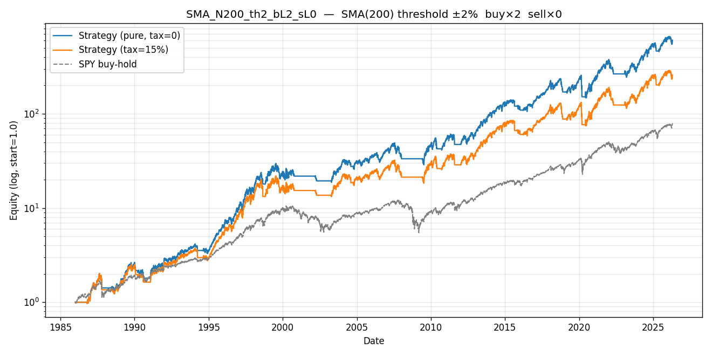

# Config SMA_N200_th2_bL2_sL0 — rank 8/384

> Educational sweep — not a production strategy. Ranking by composite `0.4·rank(CAGR) + 0.4·rank(Sharpe) + 0.2·rank(1/|MDD|)` on the PURE (tax=0) sweep.

## Parameters

| param | value | citation |
|---|---|---|
| MA filter | SMA | `[leverage_for_the_long_run, p.8]` |
| lookback | 200 bars | `[leverage_for_the_long_run, p.14, Table 6]` |
| threshold | ±2% | `[leverage_for_the_long_run, p.11]` |
| buy leg | ×2 long synth LETF | `[leverage_for_the_long_run, p.17, Table 8]` |
| sell leg | ×0 (cash) | `[leverage_for_the_long_run, p.21]` |
| annual fee | 0.95% | `[leverage_for_the_long_run, p.16, fn.23]` |
| switch cost | 15 bps/transition | mirror `letf_rotation.py` |

## Metrics — pure (tax=0) vs tax=15% vs SPY buy-hold

| metric | pure | tax=15% | SPY buy-hold | tax drag |
|---|---|---|---|---|
| CAGR | +17.24% | +14.78% | +11.47% | +2.46% |
| Sharpe | 0.78 | 0.68 | 0.68 | 0.10 |
| Max Drawdown | +42.40% | +43.52% | +55.14% | — |
| Calmar | 0.41 | 0.34 | 0.21 | — |
| Sortino | 1.09 | 0.93 | 0.96 | — |
| Volatility | +24.23% | +24.76% | +18.46% | — |
| n_switches | 56 | 56 | 0 | — |

*Tax drag = +2.46% CAGR = 14.3% of the pure edge.*

## Gates (informational, not blocking; evaluated on PURE sweep)

| gate | verdict | citation |
|---|---|---|
| G1 PBO < 0.5 | PASS | `[advances_fin_ml, p.208-211]` |
| G2 DSR p < 0.05 | PASS | `[advances_fin_ml, p.222-223]` |
| G3 Walk-Forward 6/8 + MDD<25% | FAIL | `[advances_fin_ml, ch.12]` |
| G4 OOS 70/30 Sharpe > 0 | PASS | `mandate §5` |
| G5 FWD stress post-2020 Sharpe > 0 | PASS | `mandate §5` |
| G6 Bootstrap 99.9% CI low > 0 | PASS | `[advances_fin_ml, p.196-202]` |
| G7 Cross-lib ±3pp CAGR | PASS | `[advances_fin_ml, p.31-34]` |

**Gates passed: 6/7**

> Strong gate-passer: noise-robust by multiple independent criteria. Still educational, still not production.

## Trade summary (regime blocks)

- **Total trades**: 57 (29 long, 28 short/cash)
- **Long-leg profitable**: 19/29 (65.5%)
- **Short-leg profitable**: 0/28 (0.0%)
- **Avg hold — long**: 268 bars (1.1 years)
- **Avg hold — short/cash**: 78 bars (0.3 years)
- **Cumulative tax paid (tax=15%)**: 53.2937 (absolute equity units)

See `trades.csv` for the complete regime-block ledger with pure vs tax15 equity paths.

## Plot

---

*Citations: signal `[leverage_for_the_long_run, p.13]`; synth formula `[p.16, fn.22]`; band `[p.11]`; honest alignment `[advances_fin_ml, p.31-34]`; gates — see table above.*
