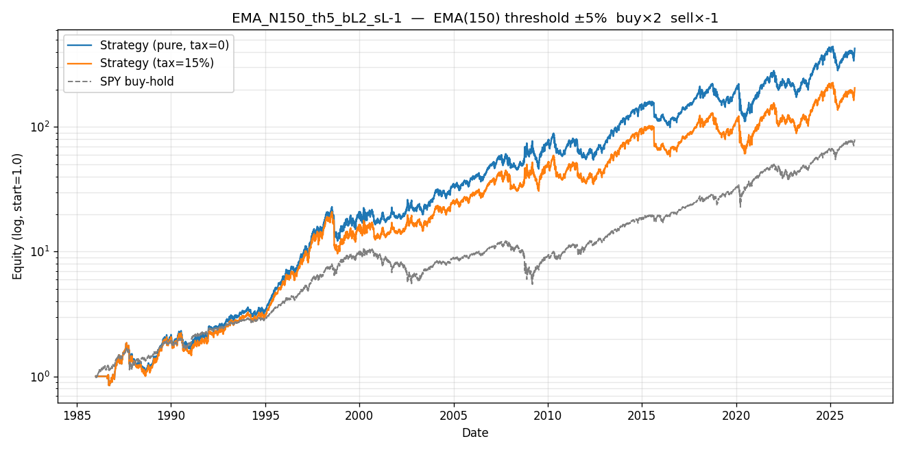

# Config EMA_N150_th5_bL2_sL-1 — rank 18/384

> Educational sweep — not a production strategy. Ranking by composite `0.4·rank(CAGR) + 0.4·rank(Sharpe) + 0.2·rank(1/|MDD|)` on the PURE (tax=0) sweep.

## Parameters

| param | value | citation |
|---|---|---|
| MA filter | EMA | `[leverage_for_the_long_run, p.8]` |
| lookback | 150 bars | `[leverage_for_the_long_run, p.14, Table 6]` |
| threshold | ±5% | `[leverage_for_the_long_run, p.11]` |
| buy leg | ×2 long synth LETF | `[leverage_for_the_long_run, p.17, Table 8]` |
| sell leg | ×-1 (synth inverse LETF) | `[leverage_for_the_long_run, p.21]` |
| annual fee | 0.95% | `[leverage_for_the_long_run, p.16, fn.23]` |
| switch cost | 15 bps/transition | mirror `letf_rotation.py` |

## Metrics — pure (tax=0) vs tax=15% vs SPY buy-hold

| metric | pure | tax=15% | SPY buy-hold | tax drag |
|---|---|---|---|---|
| CAGR | +16.23% | +14.14% | +11.47% | +2.09% |
| Sharpe | 0.67 | 0.60 | 0.68 | 0.07 |
| Max Drawdown | +50.14% | +53.92% | +55.14% | — |
| Calmar | 0.32 | 0.26 | 0.21 | — |
| Sortino | 0.94 | 0.83 | 0.96 | — |
| Volatility | +28.35% | +28.93% | +18.46% | — |
| n_switches | 25 | 25 | 0 | — |

*Tax drag = +2.09% CAGR = 12.9% of the pure edge.*

## Gates (informational, not blocking; evaluated on PURE sweep)

| gate | verdict | citation |
|---|---|---|
| G1 PBO < 0.5 | PASS | `[advances_fin_ml, p.208-211]` |
| G2 DSR p < 0.05 | FAIL | `[advances_fin_ml, p.222-223]` |
| G3 Walk-Forward 6/8 + MDD<25% | FAIL | `[advances_fin_ml, ch.12]` |
| G4 OOS 70/30 Sharpe > 0 | PASS | `mandate §5` |
| G5 FWD stress post-2020 Sharpe > 0 | PASS | `mandate §5` |
| G6 Bootstrap 99.9% CI low > 0 | PASS | `[advances_fin_ml, p.196-202]` |
| G7 Cross-lib ±3pp CAGR | PASS | `[advances_fin_ml, p.31-34]` |

**Gates passed: 5/7**

> Partial gate-passer: key statistical checks pass but one or more critical filters reject.

## Trade summary (regime blocks)

- **Total trades**: 26 (13 long, 13 short/cash)
- **Long-leg profitable**: 12/13 (92.3%)
- **Short-leg profitable**: 2/13 (15.4%)
- **Avg hold — long**: 610 bars (2.4 years)
- **Avg hold — short/cash**: 159 bars (0.6 years)
- **Cumulative tax paid (tax=15%)**: 39.5510 (absolute equity units)

See `trades.csv` for the complete regime-block ledger with pure vs tax15 equity paths.

## Plot

---

*Citations: signal `[leverage_for_the_long_run, p.13]`; synth formula `[p.16, fn.22]`; band `[p.11]`; honest alignment `[advances_fin_ml, p.31-34]`; gates — see table above.*
