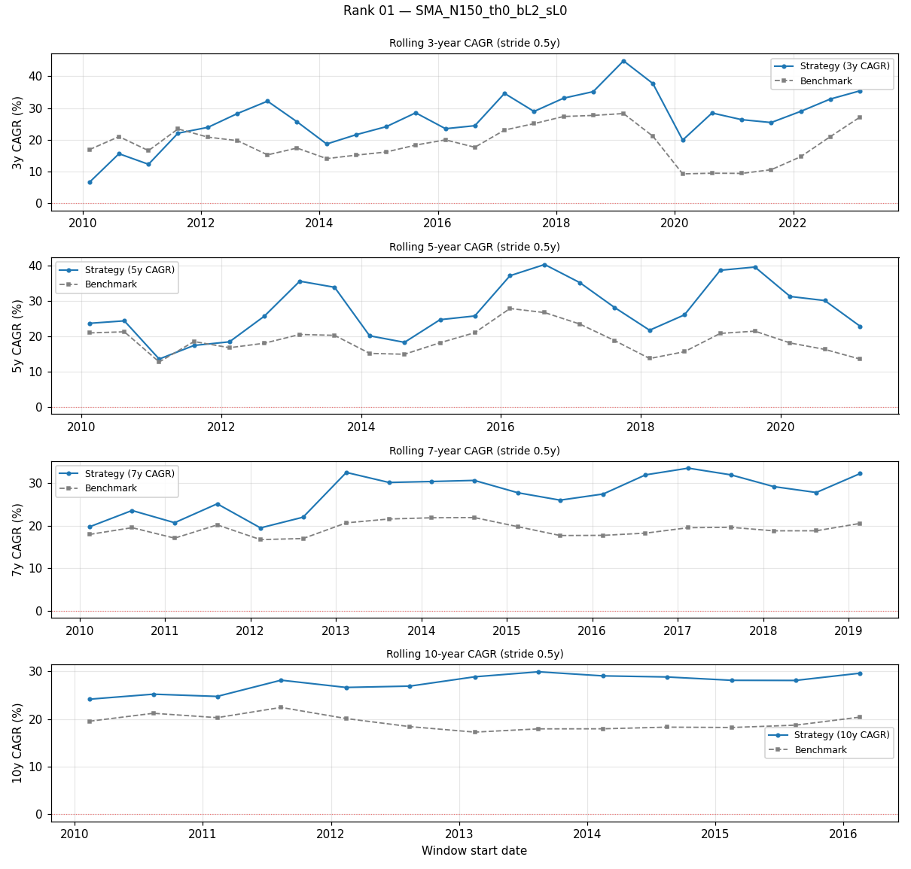
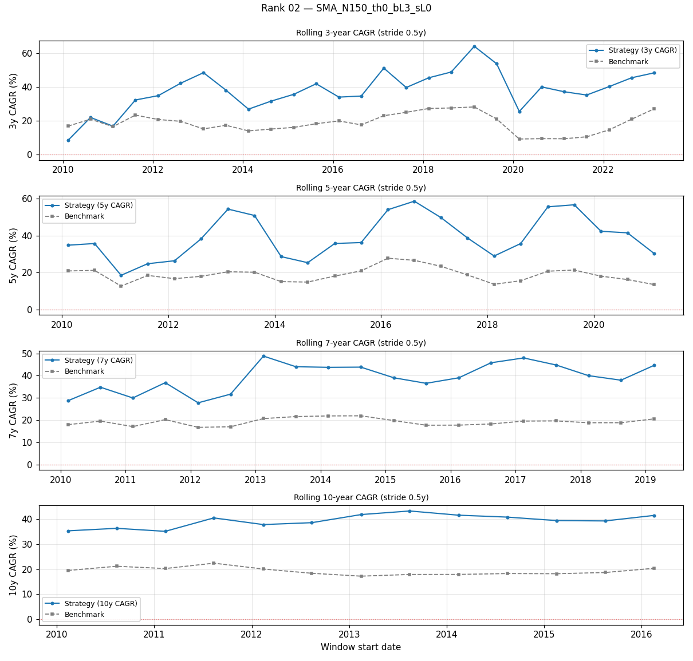
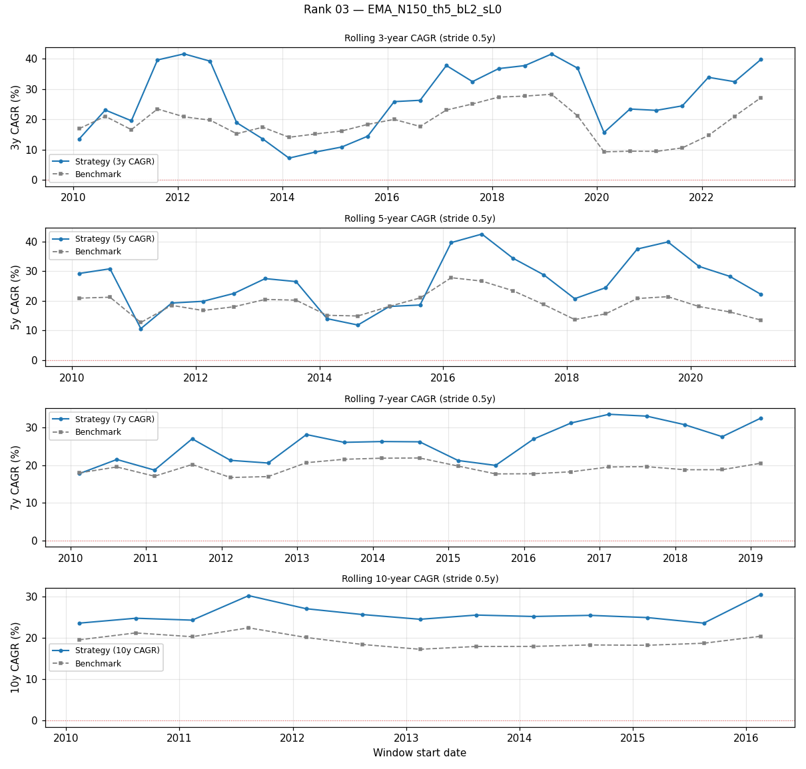

# Analysis 3 — Rolling-window robustness (3, 5, 7, 10 years)

> Real-data window: **2010-02-12 → 2026-04-20** (4070 bars ~ 16.2y).  
> Benchmark: QQQ buy-hold over the same slice.  
> Stride: 0.5y between windows.

## Rolling windows generated

| window length | # of rolling starts |
|---|---|
| 3y | 27 |
| 5y | 23 |
| 7y | 19 |
| 10y | 13 |

## Spotlight — rank 1 `SMA_N150_th0_bL2_sL0`

| window | # | median CAGR | min CAGR | max CAGR | median MDD | worst MDD | % beats bench | median excess |
|---|---|---|---|---|---|---|---|---|
| 3y | 27 | +26.35% | +6.64% | +44.88% | +28.70% | +40.53% | 85.2% | +8.27% |
| 5y | 23 | +25.68% | +13.53% | +40.21% | +37.26% | +40.53% | 95.7% | +9.26% |
| 7y | 19 | +27.80% | +19.47% | +33.53% | +40.53% | +40.53% | 100.0% | +8.60% |
| 10y | 13 | +28.10% | +24.14% | +29.89% | +40.53% | +40.53% | 100.0% | +9.22% |

### 3-year rolling windows — all top-20

| rank | cfg_id | median CAGR | worst CAGR | % beats QQQ | median excess |
|---|---|---|---|---|---|
| 01 | `SMA_N150_th0_bL2_sL0` | +26.35% | +6.64% | 85% | +8.27% |
| 02 | `SMA_N150_th0_bL3_sL0` | +38.23% | +8.53% | 96% | +20.81% |
| 03 | `EMA_N150_th5_bL2_sL0` | +25.86% | +7.21% | 78% | +9.42% |
| 04 | `EMA_N150_th0_bL2_sL0` | +23.69% | +1.09% | 81% | +6.67% |
| 05 | `EMA_N150_th0_bL3_sL0` | +33.67% | +0.14% | 89% | +17.61% |
| 06 | `EMA_N150_th5_bL3_sL0` | +37.12% | +8.61% | 89% | +21.78% |
| 07 | `SMA_N150_th2_bL2_sL0` | +23.82% | +3.67% | 67% | +6.09% |
| 08 | `SMA_N150_th2_bL3_sL0` | +33.05% | +3.19% | 85% | +15.48% |
| 09 | `SMA_N200_th0_bL2_sL0` | +21.79% | +1.40% | 67% | +3.44% |
| 10 | `EMA_N150_th2_bL2_sL0` | +21.83% | -0.72% | 85% | +6.01% |
| 11 | `SMA_N200_th0_bL3_sL0` | +30.40% | -0.11% | 89% | +12.98% |
| 12 | `SMA_N150_th0_bL1_sL0` | +14.86% | +3.45% | 22% | -4.31% |
| 13 | `EMA_N100_th0_bL3_sL0` | +26.01% | +13.33% | 89% | +7.56% |
| 14 | `EMA_N150_th2_bL3_sL0` | +30.81% | -3.32% | 89% | +13.68% |
| 15 | `EMA_N150_th5_bL1_sL0` | +14.74% | +4.71% | 19% | -4.76% |
| 16 | `EMA_N200_th2_bL2_sL0` | +22.32% | +3.11% | 89% | +4.25% |
| 17 | `EMA_N150_th0_bL1_sL0` | +12.81% | +0.76% | 19% | -5.28% |
| 18 | `EMA_N200_th2_bL3_sL0` | +31.24% | +1.82% | 93% | +13.78% |
| 19 | `SMA_N150_th0_bL3_sL-1` | +32.78% | -0.63% | 85% | +13.06% |
| 20 | `SMA_N150_th2_bL1_sL0` | +13.84% | +2.64% | 19% | -7.48% |

### 5-year rolling windows — all top-20

| rank | cfg_id | median CAGR | worst CAGR | % beats QQQ | median excess |
|---|---|---|---|---|---|
| 01 | `SMA_N150_th0_bL2_sL0` | +25.68% | +13.53% | 96% | +9.26% |
| 02 | `SMA_N150_th0_bL3_sL0` | +36.27% | +18.54% | 100% | +20.01% |
| 03 | `EMA_N150_th5_bL2_sL0` | +26.48% | +10.62% | 78% | +8.31% |
| 04 | `EMA_N150_th0_bL2_sL0` | +22.19% | +9.52% | 83% | +6.39% |
| 05 | `EMA_N150_th0_bL3_sL0` | +31.22% | +12.35% | 96% | +15.47% |
| 06 | `EMA_N150_th5_bL3_sL0` | +37.98% | +12.61% | 91% | +18.20% |
| 07 | `SMA_N150_th2_bL2_sL0` | +23.86% | +8.87% | 78% | +6.61% |
| 08 | `SMA_N150_th2_bL3_sL0` | +33.29% | +10.69% | 96% | +13.90% |
| 09 | `SMA_N200_th0_bL2_sL0` | +22.09% | +10.07% | 74% | +2.75% |
| 10 | `EMA_N150_th2_bL2_sL0` | +22.74% | +6.45% | 83% | +5.52% |
| 11 | `SMA_N200_th0_bL3_sL0` | +31.67% | +12.77% | 96% | +11.81% |
| 12 | `SMA_N150_th0_bL1_sL0` | +13.97% | +7.28% | 13% | -4.50% |
| 13 | `EMA_N100_th0_bL3_sL0` | +25.99% | +12.47% | 96% | +9.42% |
| 14 | `EMA_N150_th2_bL3_sL0` | +29.88% | +6.97% | 91% | +13.18% |
| 15 | `EMA_N150_th5_bL1_sL0` | +14.23% | +6.75% | 17% | -5.64% |
| 16 | `EMA_N200_th2_bL2_sL0` | +22.64% | +12.65% | 96% | +4.65% |
| 17 | `EMA_N150_th0_bL1_sL0` | +12.47% | +5.35% | 9% | -5.52% |
| 18 | `EMA_N200_th2_bL3_sL0` | +31.10% | +16.20% | 100% | +11.97% |
| 19 | `SMA_N150_th0_bL3_sL-1` | +30.19% | +12.77% | 96% | +14.18% |
| 20 | `SMA_N150_th2_bL1_sL0` | +12.83% | +5.56% | 0% | -5.34% |

### 7-year rolling windows — all top-20

| rank | cfg_id | median CAGR | worst CAGR | % beats QQQ | median excess |
|---|---|---|---|---|---|
| 01 | `SMA_N150_th0_bL2_sL0` | +27.80% | +19.47% | 100% | +8.60% |
| 02 | `SMA_N150_th0_bL3_sL0` | +39.03% | +27.76% | 100% | +21.20% |
| 03 | `EMA_N150_th5_bL2_sL0` | +26.28% | +17.73% | 95% | +4.56% |
| 04 | `EMA_N150_th0_bL2_sL0` | +25.67% | +16.20% | 95% | +6.30% |
| 05 | `EMA_N150_th0_bL3_sL0` | +34.62% | +23.13% | 100% | +16.45% |
| 06 | `EMA_N150_th5_bL3_sL0` | +36.76% | +24.46% | 100% | +15.20% |
| 07 | `SMA_N150_th2_bL2_sL0` | +25.01% | +14.26% | 84% | +4.46% |
| 08 | `SMA_N150_th2_bL3_sL0` | +34.51% | +19.51% | 100% | +14.39% |
| 09 | `SMA_N200_th0_bL2_sL0` | +24.89% | +15.19% | 79% | +3.25% |
| 10 | `EMA_N150_th2_bL2_sL0` | +25.12% | +14.17% | 84% | +6.20% |
| 11 | `SMA_N200_th0_bL3_sL0` | +32.84% | +21.16% | 100% | +12.84% |
| 12 | `SMA_N150_th0_bL1_sL0` | +15.86% | +10.12% | 0% | -4.65% |
| 13 | `EMA_N100_th0_bL3_sL0` | +26.81% | +21.17% | 100% | +7.07% |
| 14 | `EMA_N150_th2_bL3_sL0` | +34.80% | +19.29% | 100% | +15.30% |
| 15 | `EMA_N150_th5_bL1_sL0` | +14.64% | +9.86% | 0% | -5.58% |
| 16 | `EMA_N200_th2_bL2_sL0` | +24.23% | +16.37% | 95% | +5.45% |
| 17 | `EMA_N150_th0_bL1_sL0` | +14.68% | +8.43% | 0% | -5.68% |
| 18 | `EMA_N200_th2_bL3_sL0` | +31.45% | +22.49% | 100% | +13.66% |
| 19 | `SMA_N150_th0_bL3_sL-1` | +32.58% | +20.83% | 100% | +13.69% |
| 20 | `SMA_N150_th2_bL1_sL0` | +14.33% | +7.97% | 0% | -6.29% |

### 10-year rolling windows — all top-20

| rank | cfg_id | median CAGR | worst CAGR | % beats QQQ | median excess |
|---|---|---|---|---|---|
| 01 | `SMA_N150_th0_bL2_sL0` | +28.10% | +24.14% | 100% | +9.22% |
| 02 | `SMA_N150_th0_bL3_sL0` | +39.40% | +35.12% | 100% | +20.57% |
| 03 | `EMA_N150_th5_bL2_sL0` | +25.16% | +23.55% | 100% | +7.15% |
| 04 | `EMA_N150_th0_bL2_sL0` | +25.73% | +20.48% | 100% | +6.73% |
| 05 | `EMA_N150_th0_bL3_sL0` | +36.05% | +29.56% | 100% | +16.93% |
| 06 | `EMA_N150_th5_bL3_sL0` | +34.69% | +31.35% | 100% | +16.76% |
| 07 | `SMA_N150_th2_bL2_sL0` | +24.69% | +20.25% | 100% | +5.31% |
| 08 | `SMA_N150_th2_bL3_sL0` | +34.19% | +28.45% | 100% | +14.88% |
| 09 | `SMA_N200_th0_bL2_sL0` | +23.22% | +18.49% | 85% | +4.21% |
| 10 | `EMA_N150_th2_bL2_sL0` | +25.09% | +20.89% | 100% | +5.53% |
| 11 | `SMA_N200_th0_bL3_sL0` | +32.32% | +25.95% | 100% | +13.86% |
| 12 | `SMA_N150_th0_bL1_sL0` | +15.26% | +12.52% | 0% | -3.83% |
| 13 | `EMA_N100_th0_bL3_sL0` | +27.56% | +23.69% | 100% | +7.53% |
| 14 | `EMA_N150_th2_bL3_sL0` | +34.72% | +29.47% | 100% | +15.61% |
| 15 | `EMA_N150_th5_bL1_sL0` | +14.24% | +12.89% | 0% | -4.22% |
| 16 | `EMA_N200_th2_bL2_sL0` | +23.61% | +20.47% | 100% | +5.34% |
| 17 | `EMA_N150_th0_bL1_sL0` | +14.07% | +10.80% | 0% | -4.70% |
| 18 | `EMA_N200_th2_bL3_sL0` | +32.60% | +28.58% | 100% | +13.82% |
| 19 | `SMA_N150_th0_bL3_sL-1` | +32.99% | +26.30% | 100% | +14.14% |
| 20 | `SMA_N150_th2_bL1_sL0` | +13.63% | +11.16% | 0% | -4.79% |

## Stability — % windows beating QQQ

| rank | cfg_id | % of windows beating benchmark |
|---|---|---|
| 01 | `SMA_N150_th0_bL2_sL0` | 93.9% |
| 02 | `SMA_N150_th0_bL3_sL0` | 98.8% |
| 03 | `EMA_N150_th5_bL2_sL0` | 85.4% |
| 04 | `EMA_N150_th0_bL2_sL0` | 87.8% |
| 05 | `EMA_N150_th0_bL3_sL0` | 95.1% |
| 06 | `EMA_N150_th5_bL3_sL0` | 93.9% |
| 07 | `SMA_N150_th2_bL2_sL0` | 79.3% |
| 08 | `SMA_N150_th2_bL3_sL0` | 93.9% |
| 09 | `SMA_N200_th0_bL2_sL0` | 74.4% |
| 10 | `EMA_N150_th2_bL2_sL0` | 86.6% |
| 11 | `SMA_N200_th0_bL3_sL0` | 95.1% |
| 12 | `SMA_N150_th0_bL1_sL0` | 11.0% |
| 13 | `EMA_N100_th0_bL3_sL0` | 95.1% |
| 14 | `EMA_N150_th2_bL3_sL0` | 93.9% |
| 15 | `EMA_N150_th5_bL1_sL0` | 11.0% |
| 16 | `EMA_N200_th2_bL2_sL0` | 93.9% |
| 17 | `EMA_N150_th0_bL1_sL0` | 8.5% |
| 18 | `EMA_N200_th2_bL3_sL0` | 97.6% |
| 19 | `SMA_N150_th0_bL3_sL-1` | 93.9% |
| 20 | `SMA_N150_th2_bL1_sL0` | 6.1% |

## Worst-case CAGR per config, per window length

| rank | cfg_id | worst 3y | worst 5y | worst 7y | worst 10y | worst-ever MDD |
|---|---|---|---|---|---|---|
| 01 | `SMA_N150_th0_bL2_sL0` | +6.64% | +13.53% | +19.47% | +24.14% | +40.53% |
| 02 | `SMA_N150_th0_bL3_sL0` | +8.53% | +18.54% | +27.76% | +35.12% | +55.08% |
| 03 | `EMA_N150_th5_bL2_sL0` | +7.21% | +10.62% | +17.73% | +23.55% | +41.45% |
| 04 | `EMA_N150_th0_bL2_sL0` | +1.09% | +9.52% | +16.20% | +20.48% | +41.04% |
| 05 | `EMA_N150_th0_bL3_sL0` | +0.14% | +12.35% | +23.13% | +29.56% | +55.33% |
| 06 | `EMA_N150_th5_bL3_sL0` | +8.61% | +12.61% | +24.46% | +31.35% | +56.28% |
| 07 | `SMA_N150_th2_bL2_sL0` | +3.67% | +8.87% | +14.26% | +20.25% | +40.71% |
| 08 | `SMA_N150_th2_bL3_sL0` | +3.19% | +10.69% | +19.51% | +28.45% | +55.30% |
| 09 | `SMA_N200_th0_bL2_sL0` | +1.40% | +10.07% | +15.19% | +18.49% | +42.72% |
| 10 | `EMA_N150_th2_bL2_sL0` | -0.72% | +6.45% | +14.17% | +20.89% | +43.53% |
| 11 | `SMA_N200_th0_bL3_sL0` | -0.11% | +12.77% | +21.16% | +25.95% | +56.96% |
| 12 | `SMA_N150_th0_bL1_sL0` | +3.45% | +7.28% | +10.12% | +12.52% | +22.34% |
| 13 | `EMA_N100_th0_bL3_sL0` | +13.33% | +12.47% | +21.17% | +23.69% | +47.41% |
| 14 | `EMA_N150_th2_bL3_sL0` | -3.32% | +6.97% | +19.29% | +29.47% | +58.93% |
| 15 | `EMA_N150_th5_bL1_sL0` | +4.71% | +6.75% | +9.86% | +12.89% | +23.11% |
| 16 | `EMA_N200_th2_bL2_sL0` | +3.11% | +12.65% | +16.37% | +20.47% | +46.11% |
| 17 | `EMA_N150_th0_bL1_sL0` | +0.76% | +5.35% | +8.43% | +10.80% | +22.85% |
| 18 | `EMA_N200_th2_bL3_sL0` | +1.82% | +16.20% | +22.49% | +28.58% | +61.11% |
| 19 | `SMA_N150_th0_bL3_sL-1` | -0.63% | +12.77% | +20.83% | +26.30% | +61.57% |
| 20 | `SMA_N150_th2_bL1_sL0` | +2.64% | +5.56% | +7.97% | +11.16% | +22.79% |

## Top-3 detail plots

- rank 01: 
- rank 02: 
- rank 03: 

---

*Real data: Tiingo parquet cache. Citations: rolling-window robustness `[systematic_trading, ch.10]`; synth-vs-real LETF drag `[leverage_for_the_long_run, p.21, Table 12]`; honest alignment `[advances_fin_ml, p.31-34]`.*