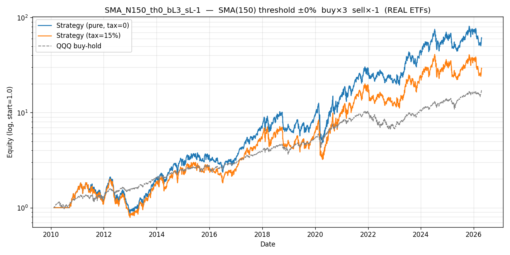

# Config SMA_N150_th0_bL3_sL-1 — rank 19/384  (REAL QQQ (NASDAQ-100))

> Real-ETF validation of the SPYSIM synth study. Buy leg uses **real Tiingo returns**; sell leg is cash or synth inverse (inverse LETFs absent from cache). Educational — not production.

## Parameters

| param | value | source |
|---|---|---|
| MA filter | SMA | `[leverage_for_the_long_run, p.8]` |
| lookback | 150 bars | `[leverage_for_the_long_run, p.14, Table 6]` |
| threshold | ±0% | `[leverage_for_the_long_run, p.11]` |
| buy leg | ×3 = **TQQQ** (real Tiingo) | Tiingo storage |
| sell leg | ×-1 = synth ×-1 inverse of QQQ | synth via `[p.16, fn.22]` if <0 |
| annual fee (synth sell only) | 0.95% | `[p.16, fn.23]` |
| switch cost | 15 bps/transition | mirror `letf_rotation.py` |

## Metrics — pure vs tax=15% vs QQQ buy-hold

| metric | pure | tax=15% | QQQ B&H | tax drag |
|---|---|---|---|---|
| CAGR | +28.99% | +23.23% | +19.18% | +5.76% |
| Sharpe | 0.78 | 0.68 | 0.96 | 0.10 |
| Max Drawdown | +61.57% | +61.79% | +35.12% | — |
| Calmar | 0.47 | 0.38 | 0.55 | — |
| Sortino | 1.09 | 0.93 | 1.36 | — |
| Volatility | +46.36% | +47.18% | +20.60% | — |
| n_switches | 98 | 98 | 0 | — |

*Tax drag = +5.76% CAGR = 19.9% of the pure edge.*

## Gates (informational; evaluated on PURE sweep, signal returns = real QQQ)

| gate | verdict | citation |
|---|---|---|
| G1 PBO < 0.5 | PASS | `[advances_fin_ml, p.208-211]` |
| G2 DSR p < 0.05 | FAIL | `[advances_fin_ml, p.222-223]` |
| G3 Walk-Forward 6/8 + MDD<25% | FAIL | `[advances_fin_ml, ch.12]` |
| G4 OOS 70/30 Sharpe > 0 | PASS | `mandate §5` |
| G5 FWD stress post-2020 Sharpe > 0 | PASS | `mandate §5` |
| G6 Bootstrap 99.9% CI low > 0 | PASS | `[advances_fin_ml, p.196-202]` |
| G7 Cross-lib ±3pp CAGR | FAIL | `[advances_fin_ml, p.31-34]` |

**Gates passed: 4/7**

## Trade summary (regime blocks)

- **Total trades**: 99 (50 long, 49 short/cash)
- **Long-leg profitable**: 17/50 (34.0%)
- **Short-leg profitable**: 2/49 (4.1%)
- **Avg hold — long**: 65 bars (0.3 years)
- **Avg hold — short/cash**: 13 bars (0.1 years)
- **Cumulative tax paid (tax=15%)**: 7.7044 (absolute equity units)

See `trades.csv` for the complete regime-block ledger.

## Plot

---

*Real-data source: Tiingo daily prices for TQQQ (buy) + QQQ (signal). Inverse LETFs absent from cache → synth fallback for sell_leverage < 0.*