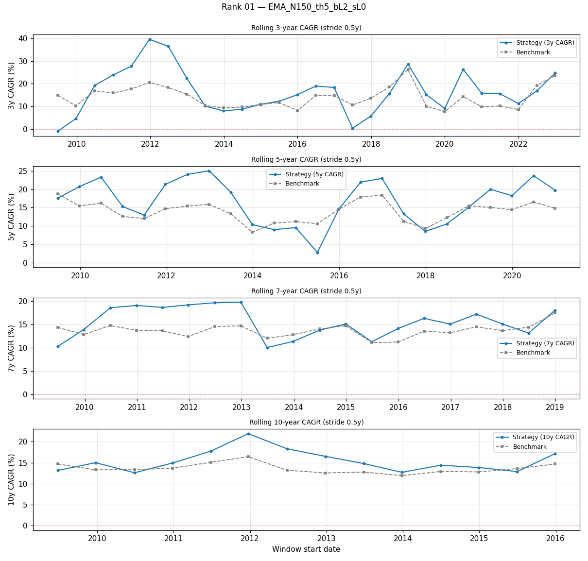
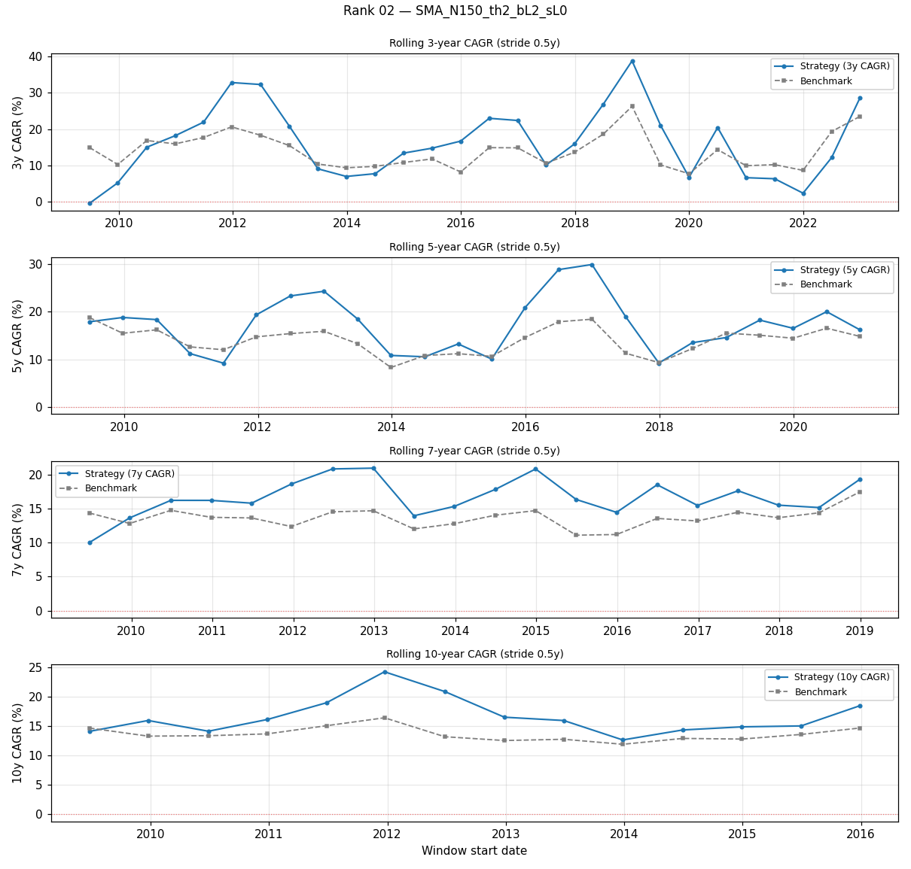
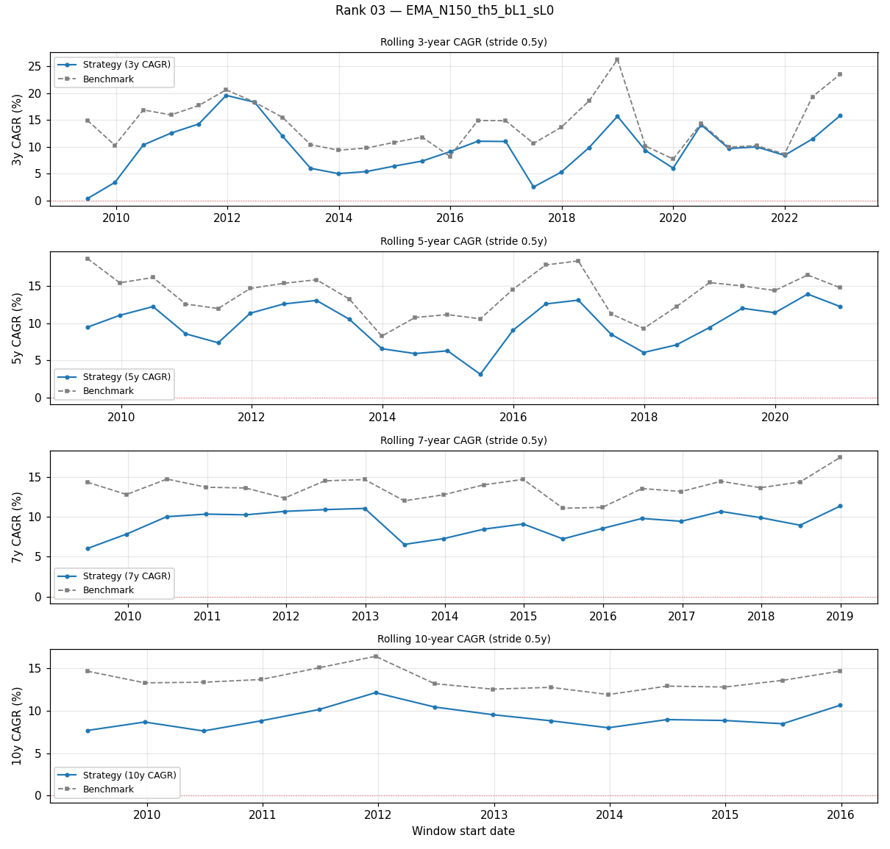

# Analysis 3 — Rolling-window robustness (3, 5, 7, 10 years)

> Real-data window: **2009-06-26 → 2026-04-20** (4229 bars ~ 16.8y).  
> Benchmark: SPY buy-hold over the same slice.  
> Stride: 0.5y between windows.

## Rolling windows generated

| window length | # of rolling starts |
|---|---|
| 3y | 28 |
| 5y | 24 |
| 7y | 20 |
| 10y | 14 |

## Spotlight — rank 1 `EMA_N150_th5_bL2_sL0`

| window | # | median CAGR | min CAGR | max CAGR | median MDD | worst MDD | % beats bench | median excess |
|---|---|---|---|---|---|---|---|---|
| 3y | 28 | +15.64% | -0.86% | +39.52% | +28.61% | +39.11% | 67.9% | +2.43% |
| 5y | 24 | +17.88% | +2.81% | +25.01% | +31.69% | +39.11% | 70.8% | +3.24% |
| 7y | 20 | +15.06% | +10.00% | +19.73% | +39.11% | +39.11% | 75.0% | +1.64% |
| 10y | 14 | +14.87% | +12.61% | +21.92% | +39.11% | +39.11% | 78.6% | +1.59% |

### 3-year rolling windows — all top-20

| rank | cfg_id | median CAGR | worst CAGR | % beats SPY | median excess |
|---|---|---|---|---|---|
| 01 | `EMA_N150_th5_bL2_sL0` | +15.64% | -0.86% | 68% | +2.43% |
| 02 | `SMA_N150_th2_bL2_sL0` | +15.49% | -0.37% | 57% | +2.43% |
| 03 | `EMA_N150_th5_bL1_sL0` | +9.80% | +0.38% | 7% | -4.11% |
| 04 | `EMA_N150_th5_bL3_sL0` | +20.79% | -3.10% | 86% | +9.17% |
| 05 | `SMA_N150_th2_bL3_sL0` | +20.67% | -2.83% | 71% | +8.55% |
| 06 | `SMA_N150_th2_bL1_sL0` | +9.34% | +0.21% | 7% | -4.52% |
| 07 | `SMA_N200_th2_bL2_sL0` | +12.73% | -2.14% | 71% | +1.82% |
| 08 | `EMA_N100_th5_bL2_sL0` | +15.25% | +2.02% | 64% | +1.95% |
| 09 | `SMA_N100_th0_bL3_sL0` | +15.93% | -3.49% | 64% | +2.06% |
| 10 | `SMA_N200_th0_bL2_sL0` | +15.53% | -10.33% | 75% | +2.74% |
| 11 | `SMA_N150_th0_bL2_sL0` | +11.03% | -4.95% | 46% | -0.67% |
| 12 | `EMA_N100_th5_bL1_sL0` | +8.88% | +1.91% | 14% | -4.26% |
| 13 | `SMA_N200_th2_bL1_sL0` | +8.03% | -0.30% | 4% | -3.50% |
| 14 | `SMA_N200_th0_bL3_sL0` | +22.08% | -16.56% | 82% | +9.87% |
| 15 | `SMA_N100_th0_bL2_sL0` | +11.36% | -2.10% | 39% | -1.28% |
| 16 | `EMA_N150_th2_bL1_sL0` | +8.81% | -0.51% | 7% | -4.59% |
| 17 | `SMA_N150_th5_bL1_sL0` | +9.77% | +0.39% | 21% | -3.90% |
| 18 | `EMA_N150_th2_bL2_sL0` | +15.37% | -5.82% | 57% | +3.05% |
| 19 | `SMA_N150_th5_bL2_sL0` | +16.55% | -1.22% | 61% | +1.82% |
| 20 | `SMA_N200_th2_bL3_sL0` | +17.24% | -6.48% | 75% | +6.83% |

### 5-year rolling windows — all top-20

| rank | cfg_id | median CAGR | worst CAGR | % beats SPY | median excess |
|---|---|---|---|---|---|
| 01 | `EMA_N150_th5_bL2_sL0` | +17.88% | +2.81% | 71% | +3.24% |
| 02 | `SMA_N150_th2_bL2_sL0` | +18.05% | +9.19% | 71% | +2.33% |
| 03 | `EMA_N150_th5_bL1_sL0` | +10.02% | +3.14% | 0% | -3.96% |
| 04 | `EMA_N150_th5_bL3_sL0` | +24.49% | +1.53% | 96% | +9.20% |
| 05 | `SMA_N150_th2_bL3_sL0` | +24.95% | +11.11% | 96% | +8.36% |
| 06 | `SMA_N150_th2_bL1_sL0` | +10.05% | +5.31% | 0% | -4.00% |
| 07 | `SMA_N200_th2_bL2_sL0` | +16.37% | +2.19% | 62% | +1.78% |
| 08 | `EMA_N100_th5_bL2_sL0` | +18.37% | +8.10% | 75% | +3.99% |
| 09 | `SMA_N100_th0_bL3_sL0` | +19.36% | +3.16% | 67% | +4.08% |
| 10 | `SMA_N200_th0_bL2_sL0` | +16.63% | +7.30% | 67% | +3.31% |
| 11 | `SMA_N150_th0_bL2_sL0` | +16.30% | -0.91% | 46% | -0.67% |
| 12 | `EMA_N100_th5_bL1_sL0` | +10.65% | +5.56% | 0% | -3.78% |
| 13 | `SMA_N200_th2_bL1_sL0` | +9.53% | +2.68% | 0% | -4.73% |
| 14 | `SMA_N200_th0_bL3_sL0` | +22.47% | +8.94% | 92% | +9.62% |
| 15 | `SMA_N100_th0_bL2_sL0` | +13.57% | +2.59% | 38% | -2.10% |
| 16 | `EMA_N150_th2_bL1_sL0` | +9.11% | +5.57% | 0% | -3.96% |
| 17 | `SMA_N150_th5_bL1_sL0` | +10.06% | +2.63% | 0% | -4.08% |
| 18 | `EMA_N150_th2_bL2_sL0` | +14.51% | +7.91% | 62% | +2.12% |
| 19 | `SMA_N150_th5_bL2_sL0` | +17.36% | +1.87% | 67% | +2.79% |
| 20 | `SMA_N200_th2_bL3_sL0` | +22.32% | +0.57% | 83% | +7.18% |

### 7-year rolling windows — all top-20

| rank | cfg_id | median CAGR | worst CAGR | % beats SPY | median excess |
|---|---|---|---|---|---|
| 01 | `EMA_N150_th5_bL2_sL0` | +15.06% | +10.00% | 75% | +1.64% |
| 02 | `SMA_N150_th2_bL2_sL0` | +16.18% | +10.01% | 95% | +2.51% |
| 03 | `EMA_N150_th5_bL1_sL0` | +9.61% | +6.02% | 0% | -3.81% |
| 04 | `EMA_N150_th5_bL3_sL0` | +19.85% | +12.66% | 95% | +6.52% |
| 05 | `SMA_N150_th2_bL3_sL0` | +22.74% | +13.12% | 95% | +8.59% |
| 06 | `SMA_N150_th2_bL1_sL0` | +9.57% | +5.72% | 0% | -3.76% |
| 07 | `SMA_N200_th2_bL2_sL0` | +14.02% | +9.34% | 45% | -0.19% |
| 08 | `EMA_N100_th5_bL2_sL0` | +16.25% | +12.77% | 90% | +2.65% |
| 09 | `SMA_N100_th0_bL3_sL0` | +16.76% | +7.24% | 75% | +3.51% |
| 10 | `SMA_N200_th0_bL2_sL0` | +16.75% | +5.63% | 90% | +2.77% |
| 11 | `SMA_N150_th0_bL2_sL0` | +12.06% | +6.48% | 20% | -1.30% |
| 12 | `EMA_N100_th5_bL1_sL0` | +9.93% | +7.71% | 0% | -3.76% |
| 13 | `SMA_N200_th2_bL1_sL0` | +8.50% | +6.10% | 0% | -5.13% |
| 14 | `SMA_N200_th0_bL3_sL0` | +23.43% | +6.82% | 90% | +9.30% |
| 15 | `SMA_N100_th0_bL2_sL0` | +11.91% | +5.34% | 30% | -1.38% |
| 16 | `EMA_N150_th2_bL1_sL0` | +9.33% | +5.85% | 0% | -3.99% |
| 17 | `SMA_N150_th5_bL1_sL0` | +9.40% | +6.07% | 0% | -4.11% |
| 18 | `EMA_N150_th2_bL2_sL0` | +16.21% | +9.89% | 75% | +2.95% |
| 19 | `SMA_N150_th5_bL2_sL0` | +14.65% | +9.28% | 60% | +1.30% |
| 20 | `SMA_N200_th2_bL3_sL0` | +18.64% | +11.30% | 85% | +4.08% |

### 10-year rolling windows — all top-20

| rank | cfg_id | median CAGR | worst CAGR | % beats SPY | median excess |
|---|---|---|---|---|---|
| 01 | `EMA_N150_th5_bL2_sL0` | +14.87% | +12.61% | 79% | +1.59% |
| 02 | `SMA_N150_th2_bL2_sL0` | +15.97% | +12.66% | 93% | +2.56% |
| 03 | `EMA_N150_th5_bL1_sL0` | +8.84% | +7.62% | 0% | -4.16% |
| 04 | `EMA_N150_th5_bL3_sL0` | +20.20% | +16.36% | 100% | +6.96% |
| 05 | `SMA_N150_th2_bL3_sL0` | +22.17% | +16.77% | 100% | +8.73% |
| 06 | `SMA_N150_th2_bL1_sL0` | +9.27% | +7.84% | 0% | -4.10% |
| 07 | `SMA_N200_th2_bL2_sL0` | +14.54% | +11.12% | 57% | +1.21% |
| 08 | `EMA_N100_th5_bL2_sL0` | +16.23% | +12.77% | 93% | +2.34% |
| 09 | `SMA_N100_th0_bL3_sL0` | +15.13% | +11.18% | 79% | +2.09% |
| 10 | `SMA_N200_th0_bL2_sL0` | +15.41% | +10.16% | 79% | +2.10% |
| 11 | `SMA_N150_th0_bL2_sL0` | +11.34% | +7.98% | 29% | -1.88% |
| 12 | `EMA_N100_th5_bL1_sL0` | +9.15% | +7.88% | 0% | -4.05% |
| 13 | `SMA_N200_th2_bL1_sL0` | +8.53% | +7.15% | 0% | -4.79% |
| 14 | `SMA_N200_th0_bL3_sL0` | +21.28% | +13.69% | 93% | +7.97% |
| 15 | `SMA_N100_th0_bL2_sL0` | +10.84% | +8.22% | 7% | -2.04% |
| 16 | `EMA_N150_th2_bL1_sL0` | +9.06% | +7.03% | 0% | -4.36% |
| 17 | `SMA_N150_th5_bL1_sL0` | +8.78% | +7.21% | 0% | -4.37% |
| 18 | `EMA_N150_th2_bL2_sL0` | +15.75% | +11.05% | 79% | +2.19% |
| 19 | `SMA_N150_th5_bL2_sL0` | +14.53% | +11.81% | 79% | +1.55% |
| 20 | `SMA_N200_th2_bL3_sL0` | +19.75% | +14.12% | 100% | +6.35% |

## Stability — % windows beating SPY

| rank | cfg_id | % of windows beating benchmark |
|---|---|---|
| 01 | `EMA_N150_th5_bL2_sL0` | 72.1% |
| 02 | `SMA_N150_th2_bL2_sL0` | 75.6% |
| 03 | `EMA_N150_th5_bL1_sL0` | 2.3% |
| 04 | `EMA_N150_th5_bL3_sL0` | 93.0% |
| 05 | `SMA_N150_th2_bL3_sL0` | 88.4% |
| 06 | `SMA_N150_th2_bL1_sL0` | 2.3% |
| 07 | `SMA_N200_th2_bL2_sL0` | 60.5% |
| 08 | `EMA_N100_th5_bL2_sL0` | 77.9% |
| 09 | `SMA_N100_th0_bL3_sL0` | 69.8% |
| 10 | `SMA_N200_th0_bL2_sL0` | 76.7% |
| 11 | `SMA_N150_th0_bL2_sL0` | 37.2% |
| 12 | `EMA_N100_th5_bL1_sL0` | 4.7% |
| 13 | `SMA_N200_th2_bL1_sL0` | 1.2% |
| 14 | `SMA_N200_th0_bL3_sL0` | 88.4% |
| 15 | `SMA_N100_th0_bL2_sL0` | 31.4% |
| 16 | `EMA_N150_th2_bL1_sL0` | 2.3% |
| 17 | `SMA_N150_th5_bL1_sL0` | 7.0% |
| 18 | `EMA_N150_th2_bL2_sL0` | 66.3% |
| 19 | `SMA_N150_th5_bL2_sL0` | 65.1% |
| 20 | `SMA_N200_th2_bL3_sL0` | 83.7% |

## Worst-case CAGR per config, per window length

| rank | cfg_id | worst 3y | worst 5y | worst 7y | worst 10y | worst-ever MDD |
|---|---|---|---|---|---|---|
| 01 | `EMA_N150_th5_bL2_sL0` | -0.86% | +2.81% | +10.00% | +12.61% | +39.11% |
| 02 | `SMA_N150_th2_bL2_sL0` | -0.37% | +9.19% | +10.01% | +12.66% | +43.43% |
| 03 | `EMA_N150_th5_bL1_sL0` | +0.38% | +3.14% | +6.02% | +7.62% | +21.15% |
| 04 | `EMA_N150_th5_bL3_sL0` | -3.10% | +1.53% | +12.66% | +16.36% | +54.23% |
| 05 | `SMA_N150_th2_bL3_sL0` | -2.83% | +11.11% | +13.12% | +16.77% | +58.21% |
| 06 | `SMA_N150_th2_bL1_sL0` | +0.21% | +5.31% | +5.72% | +7.84% | +24.06% |
| 07 | `SMA_N200_th2_bL2_sL0` | -2.14% | +2.19% | +9.34% | +11.12% | +42.13% |
| 08 | `EMA_N100_th5_bL2_sL0` | +2.02% | +8.10% | +12.77% | +12.77% | +49.71% |
| 09 | `SMA_N100_th0_bL3_sL0` | -3.49% | +3.16% | +7.24% | +11.18% | +50.23% |
| 10 | `SMA_N200_th0_bL2_sL0` | -10.33% | +7.30% | +5.63% | +10.16% | +38.96% |
| 11 | `SMA_N150_th0_bL2_sL0` | -4.95% | -0.91% | +6.48% | +7.98% | +42.66% |
| 12 | `EMA_N100_th5_bL1_sL0` | +1.91% | +5.56% | +7.71% | +7.88% | +28.27% |
| 13 | `SMA_N200_th2_bL1_sL0` | -0.30% | +2.68% | +6.10% | +7.15% | +23.52% |
| 14 | `SMA_N200_th0_bL3_sL0` | -16.56% | +8.94% | +6.82% | +13.69% | +52.42% |
| 15 | `SMA_N100_th0_bL2_sL0` | -2.10% | +2.59% | +5.34% | +8.22% | +36.68% |
| 16 | `EMA_N150_th2_bL1_sL0` | -0.51% | +5.57% | +5.85% | +7.03% | +30.75% |
| 17 | `SMA_N150_th5_bL1_sL0` | +0.39% | +2.63% | +6.07% | +7.21% | +23.93% |
| 18 | `EMA_N150_th2_bL2_sL0` | -5.82% | +7.91% | +9.89% | +11.05% | +52.64% |
| 19 | `SMA_N150_th5_bL2_sL0` | -1.22% | +1.87% | +9.28% | +11.81% | +43.26% |
| 20 | `SMA_N200_th2_bL3_sL0` | -6.48% | +0.57% | +11.30% | +14.12% | +57.43% |

## Top-3 detail plots

- rank 01: 
- rank 02: 
- rank 03: 

---

*Real data: Tiingo parquet cache. Citations: rolling-window robustness `[systematic_trading, ch.10]`; synth-vs-real LETF drag `[leverage_for_the_long_run, p.21, Table 12]`; honest alignment `[advances_fin_ml, p.31-34]`.*