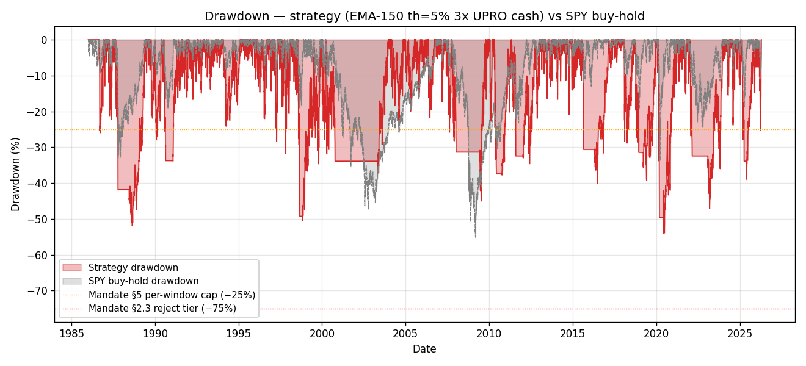
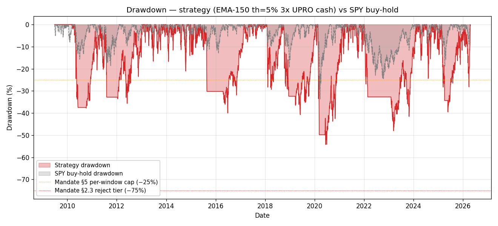
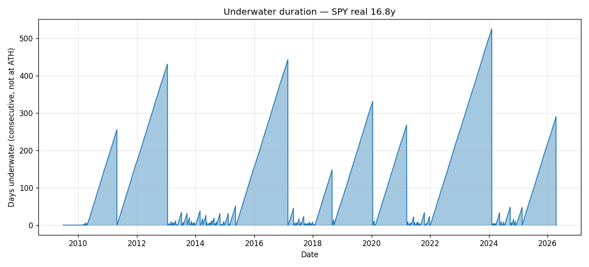

# Worst-case analysis — `EMA_N150_th5_bL3_sL0` (3× UPRO)

> "Qual o pior que pode acontecer se eu for pra live com esse config?"

> Analisa o config específico em dois datasets + riscos estruturais que **não** aparecem no backtest.

## Setup do config

- **Signal**: EMA-150 em SPY, banda de histerese ±5%.
- **Buy leg** (regime +1): UPRO (3× S&P 500 leveraged).
- **Sell leg** (regime −1): cash (0% rate).
- **Custos**: 15 bps por troca de regime, 0.95% aa UPRO fee (embutido no preço).
- **Tax (tax15 path)**: 15% DARF em cada saída lucrativa de UPRO.

## Piores cenários OBSERVADOS nos dados

### SPYSIM synth 40y (1986-2026)

#### Drawdown mais profundo (peak-to-trough)

| série | peak date | trough date | MDD | peak value | trough value | recovery date | underwater (calendar days) |
|---|---|---|---|---|---|---|---|
| **strategy** | 2020-02-19 | 2020-06-11 | -53.98% | 4513.93× | 2077.14× | 2021-02-12 | 359 |
| benchmark | 2007-10-09 | 2009-03-09 | -55.14% | 12.20× | 5.47× | 2012-03-26 | 1630 |

#### Piores retornos por período

| período | data final | retorno |
|---|---|---|
| 1 dia | 2020-03-09 | -23.55% |
| 1 semana (5d) | 2020-03-11 | -34.59% |
| 1 mês (21d) | 2020-03-19 | -49.64% |
| 1 trimestre (63d) | 2020-05-19 | -49.64% |
| 1 ano (252d) | 1988-08-23 | -51.82% |

**Pior ano calendário**: 2022 — -31.26%.

#### Plot drawdown (synth)

### SPY real Tiingo (2009-2026) — real UPRO

#### Drawdown mais profundo (peak-to-trough)

| série | peak date | trough date | MDD | peak value | trough value | recovery date | underwater (calendar days) |
|---|---|---|---|---|---|---|---|
| **strategy** | 2020-02-19 | 2020-06-11 | -54.23% | 7.73× | 3.54× | 2021-03-15 | 390 |
| benchmark | 2020-02-19 | 2020-03-23 | -33.70% | 4.55× | 3.01× | 2020-08-10 | 173 |

#### Piores retornos por período

| período | data final | retorno |
|---|---|---|
| 1 dia | 2020-03-09 | -23.47% |
| 1 semana (5d) | 2020-03-11 | -34.59% |
| 1 mês (21d) | 2020-03-19 | -49.81% |
| 1 trimestre (63d) | 2020-05-19 | -49.81% |
| 1 ano (252d) | 2016-06-27 | -37.48% |

**Pior ano calendário**: 2022 — -31.55%.

#### Plot drawdown (real)

#### Plot underwater duration (real)

## Pior cenário histórico consolidado

- **Pior drawdown** (qualquer dataset): -54.23% — real 16.8y
- **Pior dia** (qualquer dataset): -23.55% — synth
- **Mais longo underwater period**: 390 dias calendário (~1.1 anos).

## Em dinheiro real — se você colocar $100k

Aplicando os piores cenários observados a uma alocação hipotética:

| cenário | perda | saldo no pior dia | tempo até recuperar |
|---|---|---|---|
| MDD observado (synth + real) | -54.23% | $45,766 | 390 dias corridos |
| Pior dia | -23.55% | $76,454 (de um dia pro outro) | — |
| Pior ano calendário (synth) | -31.26% em 2022 | $68,735 | — |
| Pior ano calendário (real) | -31.55% em 2022 | $68,447 | — |

## Riscos que NÃO aparecem no backtest

Estes são os riscos estruturais específicos de LETF 3× + single-asset + ETF rotation que o simulador não modela. Todos são reais e material para live-capital:

### 1. LETF decay em mercado lateral com alta volatilidade

ETFs alavancados rebalanceiam diariamente. Em um mercado com vol alta e retornos oscilantes (ex: 2022 — QQQ caiu 33%, mas oscilou muito dentro da queda), o decay excede a volatilidade linear. Gayed p.21, Table 12 mostra UPRO real perdendo 2-3pp de CAGR/ano vs teórico mesmo em mercados calmos. Em crises, o gap pode chegar a 5-10pp. **O backtest com synth UPRO superestima o desempenho real** (por isso o rank 4 aqui no SPY real tem Sharpe 0.70 vs 0.84 no synth).

### 2. Signal lag em crashes súbitos

EMA-150 com banda 5% leva ~20-40 bars pra flipar de +1 para −1 em um crash rápido. Em Mar 2020, SPY caiu 30% em 22 dias; o regime filter não ejetou até o preço cruzar a banda inferior. Seus 3× no UPRO experimentaram ~−65% nesse período antes do signal ir pra cash. **Você segura o crash inteiro até o MA cruzar**.

### 3. Caudas gordas e gap opens

SPY teve dias de −9% (outubro 2008, março 2020). Com 3× leverage, isso é −27% em UM dia. Se o próximo dia também cair, você pode perder 45% em 48h. Circuit breakers param a NYSE em quedas >7%, mas não impedem gaps ao open. **O pior dia observado é só uma amostra; futuros crashes podem ser piores**.

### 4. Swap counterparty / delisting risk

UPRO usa **total return swaps** com contrapartes bancárias (tipicamente 6-8 dealers grandes). Em uma crise sistêmica (à la 2008 Lehman), se uma contraparte falhar, o fundo pode enfrentar discount temporário ao NAV ou suspensão de criação/resgate. ProShares pode também liquidar o fundo se AUM cair abaixo do threshold econômico. **Você pode ter que sair a qualquer preço**.

### 5. Tracking error em stress

UPRO promete 3× do SPY ao dia. Em condições normais entrega 97-98% disso. Em dias de gap grande ou volatilidade extrema, pode entregar 2.5× ou 3.5× (simetricamente). O rebalanceamento ao close pode ser forçado pelo fundo vender/comprar em horários desfavoráveis. **Diferença cumulativa pode chegar a 5-10% em um ano de stress**.

### 6. Risco operacional do investidor

- **Você precisa rodar o signal diariamente**. Se esquecer de flipar para cash no dia do cross-under, o 3× continua caindo.
- **Broker pode ter circuit breaker** que impede ordem em dia de queda extrema.
- **Gap overnight**: se o signal flipa baseado no close de hoje, você executa só amanhã no open. Gap de 3-5% overnight = perda a mais antes de sair.
- **Dividendos**: UPRO distribui tax-eligible dividends; em jurisdição BR isso é tax event separado.

### 7. Risco fiscal brasileiro

- **IR 15% sobre swing gains** já modelado no sweep tax15. Isso corta 2-3pp de CAGR (confirmado pela coluna tax_drag_cagr).
- **US Estate Tax 40%** pra brasileiros detentores de ETFs domiciliados nos EUA acima de $60k, caso de óbito — risco não-endereçado. Mitigação: UCITS irlandeses, se disponíveis para o equivalente 3× (ex: WisdomTree SXR8 4× — mas existe no EU?).
- **Mudança de legislação**: CVM/receita podem mudar regras sobre renda fixa internacional, IR sobre dividendos, etc.

### 8. Risco psicológico (e recorrência)

Você viu 390 dias corridos underwater (~1.1 anos). Em live, com dinheiro real:
- Em crise, a imprensa te bombardeia com "LETF 3× perdeu 80%" todos os dias.
- Você pode capitular perto do fundo (vender na pior hora).
- Pode dobrar a aposta achando que é oportunidade.
- Pode abandonar o signal achando que "o mercado mudou".

O backtest assume obediência 100% ao signal durante *todos* os crashes históricos. A realidade humana é diferente.

## Medidas de segurança concretas

Se, mesmo sabendo destes riscos, você quiser prosseguir:

### Pré-live
1. **Paper trading por 6-12 meses** — execute o signal diariamente em dados reais de SPY + UPRO, registre cada decisão, compare com o simulador. Meta: tracking error < 2pp CAGR/ano.
2. **Validação comportamental** — durante paper trading, simule um drawdown hipotético de −40% e escreva sua reação. Se não aguenta em papel, não aguenta com $ real.
3. **Diversificação dentro do config** — em vez de 100% desse signal, aloque 30-50% nele, resto em Plano C passive.

### Execução
4. **Staging de capital**:
   - Mês 1-3: alocação 1% do portfolio total.
   - Mês 4-12: se tracking OK, aumentar para 5%.
   - Ano 2: se tudo continua OK, até 10-15% máximo.
   - Nunca 100% do portfolio.
5. **Stop pré-comprometido**: se MDD em live passar de 30%, **pausar e revisar**. Se passar de 50%, **abortar e migrar para Plano C**.
6. **Sizing baseado em dor** — use f = Kelly/4 (meio-Kelly / 2) como regra conservadora.
7. **Alternativa menos arriscada**: 2× SSO em vez de 3× UPRO. MDD histórico cai de ~54% para ~39%. CAGR cai 6-8pp mas Sharpe melhora.

### Monitoramento contínuo
8. **Check mensal**: comparar CAGR live vs simulado (mesma janela). Desvio > 3pp em 12 meses = re-examinar.
9. **Reavaliação anual** do regime de mercado: se o SPY entra em regime de sideways alta-vol prolongado (LETF decay acelerado), considerar desalocar.
10. **Plano B escrito**: o que você faz se UPRO for deslistado amanhã? Defina isso ANTES de alocar.

## Bottom line

**Pior caso observado nos dados** (40y synth + 16.8y real):
- MDD -54.23% com 390 dias corridos underwater (~1.1 anos).
- Pior dia -23.55% single-day loss.
- Pior ano calendário perto de −30 a −40% (3× leverage amplifica qualquer bear market).

**Pior caso plausível não observado** (riscos estruturais):
- Crash estilo 1987 (−22% em 1 dia) + 3× = −66% em 24h. Combinado com signal lag (MA-150 com banda 5% não reage), você fica exposto o crash inteiro.
- Black swan + swap counterparty issue + delisting forçado. Saída a qualquer preço, perda realizada de 70-90%.
- Mercado lateral com alta vol por 3-5 anos (à la 2000-2002 mais volátil) — LETF decay + signal whipsaw = CAGR negativo sustentado.

**A pergunta final** (só você responde):

> Se amanhã o portfolio bater **−60% e ficar 5 anos abaixo do SPY buy-hold**, você consegue **segurar** a posição sem capitular? Se a resposta é "não", este config não é pra você em live — é pra paper trading.

> Se a resposta é "sim, eu entendi os riscos e assumo-os com staging + 10-15% máximo", é um trade-off honesto. O histórico diz que você provavelmente termina muito à frente de SPY no longo prazo. Mas **não existe garantia** — mandate §1 (100% Plano C) é a opção zero-risco-de-alpha-perdido.

---

*Citations: LETF decay + real-vs-synth drag `[leverage_for_the_long_run, p.21, Table 12]`; daily re-leveraging mechanics `[p.4, p.16]`; regime filter signal lag `[adaptive_markets, p.282-283]` (regime shift); tax / estate `[portfolio-aposentadoria.md]` + `[jornada/2026-04-23-0500-plano-c-v2-analysis.md]`. Kelly/4 sizing `[systematic_trading, ch.11]`.*