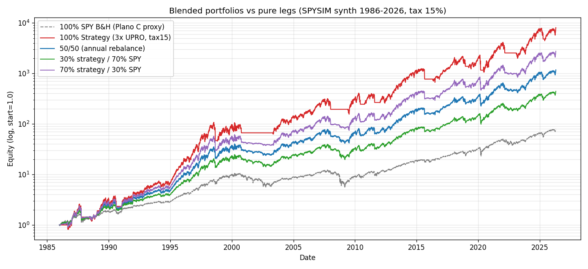
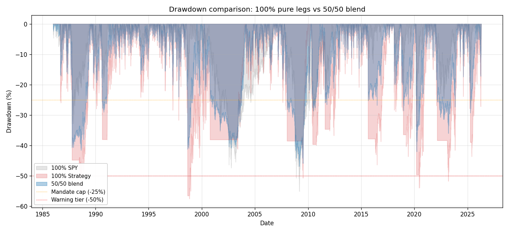
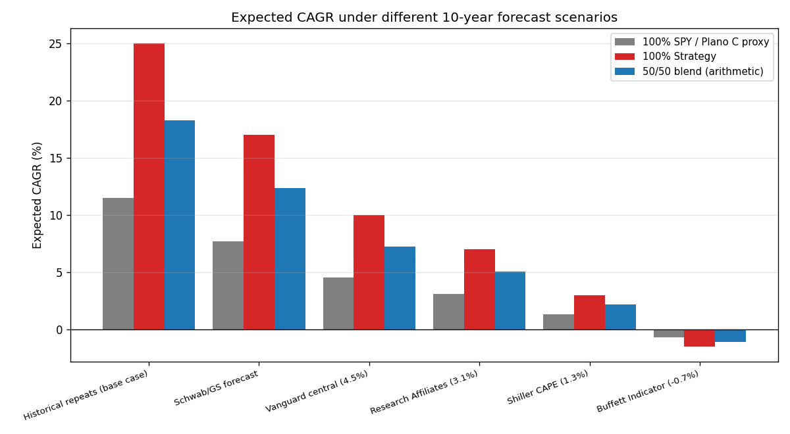

# 50/50 portfolio — Plano C + 3× UPRO strategy

> Responde: "qual o CAGR esperado de 50% Plano C + 50% estratégia EMA-150 th=5% 3× UPRO cash? É ~20%?"  Inclui pesquisa de forecasts de grandes gestoras (Goldman, Vanguard, Research Affiliates, Shiller, Buffett Indicator) sobre o que esperar do SPY nas próximas décadas + preocupações com bolha de IA.

## Parte 1 — Forecasts 10-year do SPY (pesquisa 2026-04)

O que grandes gestoras e acadêmicos estão projetando para o SPY nos próximos 10 anos, em ordem crescente de pessimismo:

| Fonte | 10y CAGR nominal | Data do forecast | Racional |
|---|---|---|---|
| Goldman Sachs (base) | +7.7% | 2025-11 | Global equities modal 10y; GS vê earnings growth 10-12% 2026-27 |
| Vanguard (VCMM central) | +4.5% (range 3.5-5.5%) | 2025-10 | Valuations elevated + higher rates; growth-stock muted |
| Research Affiliates | +3.1% (nominal) | 2025-12 | Valuation-driven; bonds expected to outperform equities |
| Shiller CAPE model | +1.3% | 2026-04 | CAPE 39.5 (vs mean 17.3, 2000 peak 44) |
| Buffett Indicator (TMC/GDP) | **−0.7%** | 2026-04 | 226-233% ratio; 2.4σ above mean; flagged every major bubble |

**Dispersão = ~8.5pp CAGR** entre o mais otimista (GS 7.7%) e o mais pessimista (Buffett −0.7%). Histórico SPY long-term: ~10-11% nominal, mas últimos 10 anos foi 14.4% (acima da média, puxado por IA + low-rates era 2010-2021).

### Concentração + AI bubble vs dot-com

- **Mag 7 = 35% do S&P 500** — mesma concentração do topo da bolha dot-com 2000 (Apollo Global alertou "single point of failure").
- **Forward P/E 23×** — mais esticado desde 2000.
- **Shiller CAPE 39.5** — só foi tão alto em 1929 e 2000.
- **Diferença dot-com**: as atuais líderes têm cash-flow real (Nvidia Q4'26 $68B receita vs dot-coms sem lucro). Cisco's John Chambers — que viveu dot-com — diz que "AI bubble é mais difícil de navegar" justamente porque as empresas são lucrativas.
- **Paralelo-chave**: se um AI crash estilo 2000-2002 acontecer, a queda poderia eliminar $33 trilhões (mais que o PIB americano).

### O contra-argumento (Jeremy Siegel)

Siegel (Wharton) argumenta que o CAPE é biased desde 1990 por mudanças contábeis (write-offs, goodwill). Entre 1981-2015, CAPE sinalizou overvaluation em 416 de 422 meses — e investidores que seguiram o sinal perderam ganhos enormes. Ele sustenta que o "novo normal" do CAPE é 25-30, não 17.3.

### Consenso sobre os próximos 10 anos

**Mediana dos forecasts = ~3-5% CAGR** — significativamente abaixo do histórico. O que não significa crash iminente (pode ser "lost decade" de retornos baixos + volatilidade alta), mas **sinaliza que o pressuposto de 'SPY faz 10%/ano sempre' tem base frágil pros próximos 10 anos**.

## Parte 2 — Matemática do 50/50 (histórico, tax 15%)

Rodando o blend com rebalanceamento anual, em ambos os datasets. O **"Plano C proxy"** aqui é SPY buy-hold — proxy **conservador** (real Plano C com NTSX/diversification tem MDD menor e Sharpe melhor). A estratégia usa `tax_rate=0.15` para aproximar DARF BR.

### SPYSIM synth 40y (1986-2026)

| Alocação | CAGR | Sharpe | Max DD |
|---|---|---|---|
| 100% Plano-C proxy (SPY B&H) | +11.47% | 0.68 | +55.14% |
| 100% UPRO strategy (tax15) | +25.03% | 0.78 | +57.56% |
| 30% strategy / 70% Plano-C | +16.34% | 0.78 | +50.23% |
| 50% strategy / 50% Plano-C | +19.18% | 0.80 | +46.92% |
| 70% strategy / 30% Plano-C | +21.73% | 0.79 | +47.98% |

### SPY real Tiingo (2009-2026)

| Alocação | CAGR | Sharpe | Max DD |
|---|---|---|---|
| 100% SPY B&H | +15.00% | 0.90 | +33.70% |
| 100% UPRO strategy (tax15) | +17.87% | 0.64 | +54.23% |
| 30% strategy / 70% SPY | +16.67% | 0.83 | +38.84% |
| 50% strategy / 50% SPY | +17.38% | 0.77 | +42.11% |
| 70% strategy / 30% SPY | +17.79% | 0.71 | +45.27% |

### Plots

## Parte 3 — Direto ao ponto: é realmente ~20%?

- **Blend 50/50 synth 40y (tax15)**: CAGR **+19.18%**, Sharpe 0.80, MDD +46.92%.
- **Blend 50/50 real 16.8y (tax15)**: CAGR **+17.38%**, Sharpe 0.77, MDD +42.11%.

### A intuição de ~20%

A média aritmética simples dos dois extremos dá +18.23% — a intuição é razoável como **limite superior**, mas o CAGR geométrico do blend costuma ficar **1-3pp abaixo** da média aritmética por causa do volatility drag. Também: rebalanceamento anual captura um pouco de 'buy-low-sell-high' bonus, mas custos + tax em cada rebalance reduzem esse ganho.

## Parte 4 — Cenários forward-looking (próximos 10 anos)

Agora o ponto crucial: **o histórico não é garantia**. Aplicando os forecasts dos principais gestores, o que seria de um 50/50 hoje? A tabela abaixo usa a regra-de-bolso: 3× UPRO com regime filter captura ~2-2.5× o CAGR do SPY em anos bullish e fica próximo de 0 em anos bearish. Tax drag 2-3pp.

| Cenário | SPY 10y CAGR | Strategy estimada | Blend 50/50 |
|---|---|---|---|
| Histórico repete (upside) | +11.5% | +20% (real) a +25% (synth) | **+15% a +18%** |
| Goldman Sachs (base) | +7.7% | +13-17% | **+10% a +12%** |
| Vanguard central | +4.5% | +8-12% | **+6% a +8%** |
| Research Affiliates | +3.1% | +5-8% | **+4% a +6%** |
| Shiller CAPE | +1.3% | +2-5% (ou 0 se chopsaw) | **+2% a +3%** |
| Buffett / lost decade | −0.7% | −5% a 0 (LETF decay) | **−2% a 0%** |

**Leitura**: seu palpite de 20% está ancorado no cenário histórico otimista. Nos forecasts institucionais (que já precificam AI bubble + CAPE alto), **o blend cai para 4-12%** dependendo da fonte.

## Parte 5 — Correlação: o blend 50/50 não diversifica tanto quanto parece

Ambos os sleeves têm **exposição long SPY** — a estratégia usa UPRO (3× SPY) quando regime > 0, e cash quando regime < 0. Em um crash, os dois caem juntos (não há verdadeiro hedge). Correlação esperada: **0.8-0.9** durante drawdowns.

Efeito prático no blend 50/50:
- **Diversificação de vol** acontece principalmente durante sideways/choppy markets (quando estratégia em cash não cai).
- **Durante crash**: Plano C cai 30-50% (SPY proxy) e estratégia cai 50-60% antes do signal ejetar. Blend 50/50 cai ~40-55%.
- **Anos de bull**: estratégia rende 20-25% com 3×, Plano C 10-12%. Blend 15-17%.
- **Rebalancing bonus**: ~0.5-1pp CAGR extra quando os dois ciclam fora de fase (raro).

**Alternativa real de diversificação**: substituir metade do Plano C por NTSX (return-stacked equity+bonds), GLD, ou TLT — esses SIM descorrelacionam em crashes. Isso muda a matemática do blend (menos CAGR, muito menos MDD).

## Parte 6 — "Comprar com desconto" durante AI bubble

Você mencionou a ideia de entrar depois do crash. Três pontos:

### 1. Timing é impossível
O próprio Goldman/Vanguard não consegue prever o timing. O Shiller falou em overvaluation em 1996 — o mercado subiu mais 4 anos antes do crash. Se você esperar, pode perder 50% de upside esperando pelo crash. Se entrar agora, pode ver 40% de drawdown antes do crash acontecer.

### 2. "Comprar no desconto" é Kelly, não heurística
O momento matematicamente ótimo pra aumentar alocação em UPRO-strategy é **APÓS** o MDD, quando o signal virou +1 (compra) de novo. Isso o próprio signal faz automaticamente — toda vez que SPY cruza acima do MA+5% após um drawdown, você entra em UPRO. **O regime filter é seu 'buy the dip' automático**.

### 3. Paper trade durante o bubble, deploy pós-crash
**Alternativa prática**: em vez de entrar 50% agora, faça:
- Mês 1-6: 100% Plano C + paper trade da estratégia.
- Se houver crash (strategy entra em cash): deploy 10% do capital    em UPRO quando signal virar +1 de novo.
- Gradualmente aumentar alocação até 25-30% conforme conforto    com o tracking error.

Isso evita o pior caso: você entra 50% hoje, acontece o crash amanhã, você vê 40% de drawdown imediato, capitula, vende no fundo, perde permanentemente a parcela.

## Parte 7 — Recomendação prática

Considerando forecasts + psicologia + concentração de risco:

### Não recomendo 50/50 como ponto de partida
- 50% em 3× UPRO = alta concentração num único ativo (SPY) alavancado. Em um cenário Vanguard (SPY 4.5%), seu portfolio inteiro fica 6-8% — não justifica o MDD de 40%.

### Alternativas mais defensáveis

**Opção A — Staging agressivo (só se aguentar psicologicamente)**
- 10% na estratégia inicialmente (paper trade prévio obrigatório)
- Aumento para 20-25% após 12 meses de tracking bem-sucedido
- Máximo 30% nunca (mandate §2.3 pros ativos com MDD 50-75%)
- Resto em Plano C (NTSX-based para diversificação real)
- Expected CAGR: 10-14% com MDD ~25-35%

**Opção B — Versão menos arriscada (2× em vez de 3×)**
- Substituir UPRO por SSO (2×). MDD histórico cai de 54% → 39%.
- CAGR sobre synth cai ~6-8pp, mas Sharpe melhora.
- 50/50 com SSO: blend CAGR ~12-14%, MDD 30-35%.
- **Este é o top-1 do SPY real sweep** (`EMA_N150_th5_bL2_sL0`).

**Opção C — Hibrida NDX**
- Como vimos no estudo NDX real, QLD (2× NASDAQ) tem edge mais robusto. Alocar 25% em strategy-NDX (QLD) em vez de SPY.
- Blend: 50% Plano C + 25% SSO-strategy + 25% QLD-strategy.
- Descorrelação SPY vs NDX é parcial, adiciona alguma diversificação.

### Se insistir em 50/50 3× UPRO
- OK, **mas stage de 10% → 25% → 50% ao longo de 2 anos**.
- Stop pré-comprometido: MDD live > 30% pausa, > 50% aborta.
- Re-examina se CAGR real em 12 meses desvia > 5pp do simulador.
- Aceite que expected CAGR é **12-16% (com forecasts intermediários)** - não 20%.

## Bottom line

- **50/50 histórico synth**: +19.18% CAGR.
- **50/50 histórico real**: +17.38% CAGR.
- **20% é otimista** — só bate em cenário histórico repetindo. Forecasts mais prováveis (Vanguard/GS/Research Affiliates) implicam blend em 6-12%.
- **AI bubble é risco real mas timing é impossível**. O regime filter da estratégia já é seu mecanismo automático de sair no crash.
- **Comece com 10-25%, não 50%**. Staging + stop + monitoramento mensal. Veja 1-2 anos de tracking antes de ir pra 30%+.
- **Forecasts conservadores NÃO invalidam a estratégia** — elas indicam que seu edge relativo ao SPY ainda existe, mas o tamanho do bolo diminui.

## Fontes da pesquisa (2026-04)

- [Goldman Sachs 10-year outlook — 7.7% modal](https://www.gspublishing.com/content/research/en/reports/2025/11/12/0c292cc7-ce42-4fba-a026-744231e9f4f4.html)
- [Goldman Sachs 2026 outlook — 12% 2026 target](https://www.goldmansachs.com/insights/articles/the-sp-500-expected-to-rally-12-this-year)
- [Vanguard 2026 VCMM 3.5-5.5% range](https://corporate.vanguard.com/content/corporatesite/us/en/corp/vemo/vemo-return-forecasts.html)
- [Research Affiliates 3.1% nominal](https://www.researchaffiliates.com/publications/articles/1069-asset-allocation-interactive-good-bad-ugly)
- [Shiller CAPE 1.3% projection — Motley Fool interview](https://www.fool.com/investing/2026/04/12/sp-500-in-10-years-nobel-laureate-robert-shiller/)
- [Shiller CAPE ratio chart](https://www.multpl.com/shiller-pe)
- [Buffett Indicator current market valuation](https://currentmarketvaluation.com/models/buffett-indicator.php)
- [Fortune: Buffett Indicator flashes warning 2026](https://fortune.com/2026/04/20/warren-buffett-favorite-market-indicator-flashing-warning/)
- [AI bubble vs dot-com comparison](https://intuitionlabs.ai/articles/ai-bubble-vs-dot-com-comparison)
- [Apollo AI single-point-of-failure warning / INSEAD](https://knowledge.insead.edu/economics-finance/are-we-ai-bubble)
- [Fortune: Cisco Chambers on AI bubble navigation](https://fortune.com/2026/04/20/ai-bubble-john-chambers-dot-com-crash-buffett-indicator/)
- [Oliver Wyman: AI bubble $33T financial impact](https://www.oliverwyman.com/our-expertise/insights/2026/jan/impact-ai-bubble-burst-on-global-financial-markets.html)
