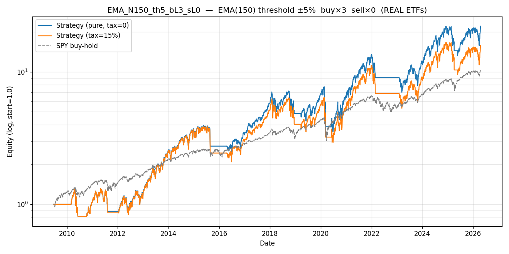

# Config EMA_N150_th5_bL3_sL0 — rank 4/384  (REAL SPY (S&P 500))

> Real-ETF validation of the SPYSIM synth study. Buy leg uses **real Tiingo returns**; sell leg is cash or synth inverse (inverse LETFs absent from cache). Educational — not production.

## Parameters

| param | value | source |
|---|---|---|
| MA filter | EMA | `[leverage_for_the_long_run, p.8]` |
| lookback | 150 bars | `[leverage_for_the_long_run, p.14, Table 6]` |
| threshold | ±5% | `[leverage_for_the_long_run, p.11]` |
| buy leg | ×3 = **UPRO** (real Tiingo) | Tiingo storage |
| sell leg | ×0 = cash (0.0% annual) | synth via `[p.16, fn.22]` if <0 |
| annual fee (synth sell only) | 0.95% | `[p.16, fn.23]` |
| switch cost | 15 bps/transition | mirror `letf_rotation.py` |

## Metrics — pure vs tax=15% vs SPY buy-hold

| metric | pure | tax=15% | SPY B&H | tax drag |
|---|---|---|---|---|
| CAGR | +20.25% | +17.87% | +15.00% | +2.38% |
| Sharpe | 0.70 | 0.64 | 0.90 | 0.06 |
| Max Drawdown | +54.23% | +54.23% | +33.70% | — |
| Calmar | 0.37 | 0.33 | 0.45 | — |
| Sortino | 0.94 | 0.85 | 1.27 | — |
| Volatility | +35.98% | +36.60% | +17.15% | — |
| n_switches | 15 | 15 | 0 | — |

*Tax drag = +2.38% CAGR = 11.8% of the pure edge.*

## Gates (informational; evaluated on PURE sweep, signal returns = real SPY)

| gate | verdict | citation |
|---|---|---|
| G1 PBO < 0.5 | PASS | `[advances_fin_ml, p.208-211]` |
| G2 DSR p < 0.05 | FAIL | `[advances_fin_ml, p.222-223]` |
| G3 Walk-Forward 6/8 + MDD<25% | FAIL | `[advances_fin_ml, ch.12]` |
| G4 OOS 70/30 Sharpe > 0 | PASS | `mandate §5` |
| G5 FWD stress post-2020 Sharpe > 0 | PASS | `mandate §5` |
| G6 Bootstrap 99.9% CI low > 0 | FAIL | `[advances_fin_ml, p.196-202]` |
| G7 Cross-lib ±3pp CAGR | FAIL | `[advances_fin_ml, p.31-34]` |

**Gates passed: 3/7**

## Trade summary (regime blocks)

- **Total trades**: 16 (8 long, 8 short/cash)
- **Long-leg profitable**: 6/8 (75.0%)
- **Short-leg profitable**: 0/8 (0.0%)
- **Avg hold — long**: 414 bars (1.6 years)
- **Avg hold — short/cash**: 96 bars (0.4 years)
- **Cumulative tax paid (tax=15%)**: 1.8342 (absolute equity units)

See `trades.csv` for the complete regime-block ledger.

## Plot

---

*Real-data source: Tiingo daily prices for UPRO (buy) + SPY (signal). Inverse LETFs absent from cache → synth fallback for sell_leverage < 0.*