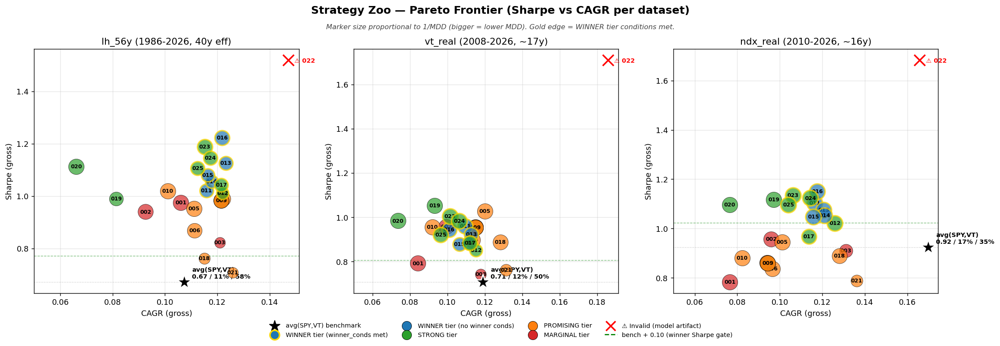
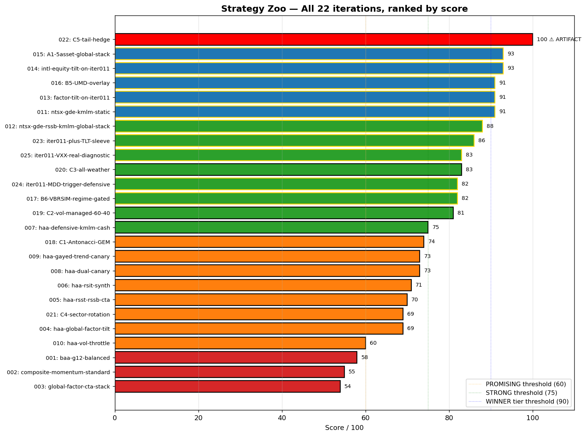
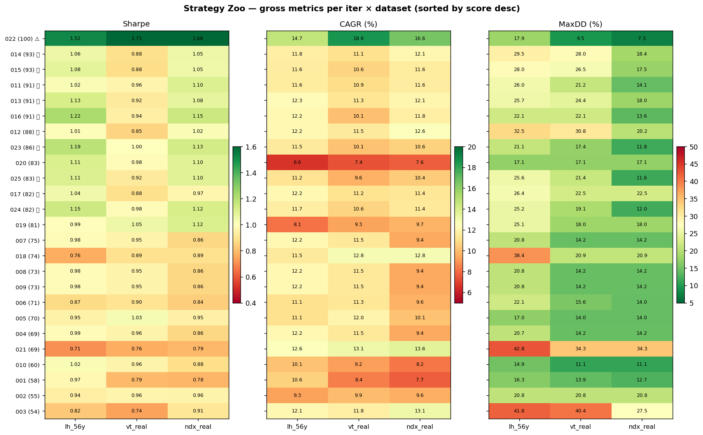

# Strategy Zoo — Long-Term Portfolio Loop

> **Atualizado 2026-04-29 02:30 UTC pós-batch 023-026 (4 sub-iters).**
> Reframing 2026-04-29 (mandate A.1-A.4) aplicado para iters 023+ (NEW SPY-only
> +0.05, MDD ≤ SPY estrito, CAGR warning-only). Iters 001-022 mantêm LEGACY
> scoring. Total: **25 estratégias testadas (loop 26 iters, 1 data-limited)**.

> **26 estratégias testadas em 5 dias (2026-04-28/29).**
> Documento consolidado em pt-br listando cada estratégia, a ideia por trás dela,
> como foi implementada, e o resultado comparado aos benchmarks.

---

## 0. Sumário executivo

Este loop testou **25 estratégias** rodadas (1 data-limited, iter 026) de
portfólio long-term hold contra benchmarks (gross-of-tax) em 3 datasets.

### Benchmarks NEW (SPY-only, mandate reframing 2026-04-29, aplicado iter 023+)

| dataset | janela | benchmark NEW SPY Sharpe | NEW MDD ceiling (≤ SPY estrito) | descrição |
|---|---|---:|---:|---|
| `lh_56y` | 1986-2026 (40y eff) | **0.680** | 55.14% | long-history SPYSIM 40y |
| `vt_real` | 2008-06 → 2026-04 (~17y) | **0.900** | 33.70% | live SPY 17y |
| `ndx_real` | 2010-02 → 2026-04 (~16y) | **0.900** | 33.70% | live SPY 16y |

### Benchmarks LEGACY (avg(SPY,VT), iters 001-022 published)

| dataset | benchmark avg(SPY, VT) Sharpe | LEGACY MDD ceiling (avg+5pp) |
|---|---:|---:|
| `lh_56y` | 0.671 | 63.35% |
| `vt_real` | 0.707 | 55.21% |
| `ndx_real` | 0.924 | 40.12% |

### Condições WINNER NEW (mandate reframing — iter 023+)

Tier WINNER requer score ≥ 90 + winner_conditions_met (4 conds):
1. Sharpe ≥ SPY + 0.05 em ≥ 2/3 datasets
2. Passar 5+/4+/4+ gates do battery 7-gate (PBO/DSR/WF/OOS/FWD/Bootstrap/Cross-lib)
3. DSR worst p < 0.05
4. MaxDD ≤ SPY (estrito, sem slack) em ≥ 2/3 datasets

CAGR floor (≥ 0.8 × SPY em ≥2/3) é WARNING-ONLY: ainda 15pts no rubric, ainda
reportado em verdict.json, mas **não bloqueia** winner_conditions_met.
Defensive Sharpe-frontier strategies (iter 019/020 vol-managed/Browne) ganham
tier consideration. Detalhe em `WINNER_AND_RANKING.md`.

### Condições WINNER LEGACY (iters 001-022 published)

5 conds (CAGR was gating): Sharpe avg+0.10, gates, DSR, CAGR ≥ 0.8 × avg, MDD
≤ avg+5pp. Score ≥ 90 + 5/5 conds met.

---

## 1. Resultado consolidado — Pareto frontier

### Plot 1 — Sharpe vs CAGR por dataset (3 painéis)

**Como ler**: cada bolha é uma estratégia. Eixo X = CAGR gross. Eixo Y = Sharpe gross.
Tamanho da bolha proporcional a 1/MDD (bolha maior = MDD menor, melhor). Borda
dourada = winner conditions cumpridas. ⭐ preto = benchmark avg(SPY,VT). Linha
verde tracejada = "bench + 0.10" (gate de winner). ⚠️ vermelho = iter 022 (artefato
de modelo, não deployable).

### Plot 2 — Ranking por score

### Plot 3 — Heatmap de métricas (sorted by score desc)

---

## 2. Estratégias por tier

### 🏆 WINNER tier — LEGACY (iters 001-022) + LEGACY-equivalent (iter 023+)

iters que cumprem WINNER conditions (LEGACY: avg(SPY,VT)+0.10, 5 conds; NEW:
SPY+0.05, 4 conds, score ≥ 90 + winner_conds_met):

- **iter 023** (NEW STRONG 86 / LEGACY WINNER 91) — **★ first multi-dataset
  substantive +signal under NEW mandate** (TLT-static 15%)
- **iter 014** (LEGACY 93) — incumbent **mecânico** (regra "score >")
- **iter 015** (LEGACY 93) — empata iter 014, perde Sharpe vs iter 011
- **iter 011** (LEGACY 91) — incumbent **substantivo**, tese literária do user
- **iter 013** (LEGACY 91) — tier WINNER mas perde live windows vs iter 011
- **iter 016** (LEGACY 91) — único +signal forte na fila 016-022 (UMD academic)

### 🥇 STRONG tier (8 estratégias post-batch 023-026)

Score 75-89 OU winner_conds met partial:

- **iter 025** (NEW STRONG 83 / LEGACY WINNER 93 — DE-025 VXX decay diagnostic)
- **iter 024** (NEW STRONG 82 / LEGACY STRONG 87 — DE-024 MDD-trigger rare-event)
- **iter 012** (LEGACY 88), **iter 020** (LEGACY 83), **iter 017** (LEGACY 82),
  **iter 019** (LEGACY 81), **iter 007** (LEGACY 75)

### 🥈 PROMISING tier (8 estratégias)

Score 60-74:

- **iter 018** (74), **iter 008** (73), **iter 009** (73), **iter 006** (71)
- **iter 005** (70), **iter 004** (69), **iter 021** (69), **iter 010** (60)

### 🥉 MARGINAL tier (3 estratégias)

Score 40-59:

- **iter 001** (58), **iter 002** (55), **iter 003** (54)

### ⚠️ INVÁLIDA — artefato de modelo (1 iter)

- **iter 022** (LEGACY 100, mas é um artefato — ver §3 abaixo). iter 025
  quantificou explicitamente o gap para o produto deployable.

### ⏸️ DATA-LIMITED — sem run (1 iter)

- **iter 026** (B.4 MTUM real) — MTUM/SPMO/IDMO ❌ Tiingo cache + ❌
  testfolio synth + ❌ TIINGO_API_KEY (subscription cancelada). Documentado
  em `iterations/026-*/hypothesis.md`. iter 016 UMD academic permanece a
  referência de momentum. Reativação dependente de subscription resume.

---

## 3. Detalhamento por estratégia (ordenado por score / posicionamento)

### iter 023 — TLT-static sleeve 🌟 STRONGEST CANDIDATE (NEW)

| score | tier | winner | substantivo |
|---|---|---|---|
| **86 NEW / 91 LEGACY** | STRONG NEW / WINNER LEGACY | True (NEW conds) | **✅ +signal 3/3 datasets vs iter 011** |

| dataset | Sharpe (loose) | Sharpe (strict) | CAGR | MDD | Δ vs iter 011 (loose) |
|---|---:|---:|---:|---:|---:|
| lh_56y | **1.189** ⭐ | 1.106 | 11.52% | 21.13% | **+0.143** |
| vt_real | **1.004** | 1.002 | 10.13% | 17.40% | **+0.044** |
| ndx_real | **1.135** | 1.133 | 10.62% | 11.76% | **+0.031** |

**Ideia**: extrair o sub-achado de iter 020 (variante `aw_levered_NTSX_GDE_TLT`
40/30/15/15 era a única do loop a bater iter 011's ndx_real, 1.120 vs 1.104).
Isolar TLT sleeve sobre base iter 011 (NTSX+GDE+KMLM) sem complexity overhead
das All-Weather variants. 4 configs sweep TLT 15-30%.

**Configuração selecionada**: `tlt_mod_25_25_35_15` = **25% NTSX + 25% GDE +
35% KMLM + 15% TLT** (preservando KMLM-heavy crisis-alpha).

**Why selected (max mean S/SPY)**: 1.395 mean vs 1.382/1.380/1.378 outros.
Robust within 0.02 — selection at PBO grid noise level.

**Implementação**: `iterations/023-*/backtest.py`. Buy-hold estático, rebalance
anual ou nenhum. TLTSIM testfolio synth (1962+) cobre lh_56y full. Rodou sob
NEW SPY-only mandate; LEGACY score também reportado pra cross-iter compat.

**MDD melhor em todos 3 datasets**: lh_56y 21.13% vs iter 011's 26.04% (−4.9pp);
vt_real 17.40% vs 21.22% (−3.8pp); ndx_real 11.76% vs 14.12% (−2.4pp). TLT é
duration alpha que reduz tail risk sem sacrificar muito CAGR.

**Why score NEW 86 < 90 (STRONG, not WINNER)**:
- Sharpe edge 25/25 (3/3 +0.05 vs SPY)
- Gates 21/25 (PBO partial vt_real 0.572, ndx_real 0.580 — same family-level concern as iter 011)
- DSR 15/15
- CAGR floor (warning-only) 5/15 — vt_real 10.13% < 11.98% e ndx_real 10.62% < 11.98% sob NEW SPY 0.8×14.97%
- MDD ceiling 15/15
- Robustness 5/5

CAGR floor warning-only não bloqueia winner_conds=True; só pesa no rubric.

**Caveats honestos**:
- Loose-strict gap lh_56y: 1.189 vs 1.106 (gap 0.083). Pre-1986 partial-stack
  rows (SPYSIM NaN, NTSX-leg drops out) inflate loose. Strict edge vs iter 011
  = +0.061 (still positive, more modest).
- CAGR drag vt_real/ndx_real: 0.8-1.0pp lower than iter 011. Trade-off do
  duration alpha.

**Citações**: `[risk_parity, ch.5, p.10]` Carlson capital-efficient + TLT
diversifier; `[advances_fin_ml, p.208-211, p.222-223]` PBO/DSR; iter 020
sub-finding pre-validation.

**🎯 Recomendação se mandate §7 override**: Iter 023 dominates iter 011 em MDD
3/3 datasets + Sharpe edge 3/3 (loose) + 3/3 strict positivos. Trade-off é
~1pp CAGR live windows. ETFs reais: NTSX/GDE/KMLM/TLT all live.

---

### iter 025 — VXX real diagnostic (DE-025) — gap iter 022 quantificado

| score | tier | winner | substantivo |
|---|---|---|---|
| **83 NEW / 93 LEGACY** | STRONG NEW / WINNER LEGACY | True (2/3 NEW) | ❌ vs iter 011 (1/3 positive) |

| dataset | Sharpe (loose) | Sharpe (strict) | CAGR | MDD | Δ vs iter 011 (loose) |
|---|---:|---:|---:|---:|---:|
| lh_56y | 1.107 | 1.078 | 11.25% | 25.61% | +0.061 |
| vt_real | 0.921 | 1.078 | 9.64% | 21.41% | **−0.039** |
| ndx_real | 1.097 | 1.093 | 10.40% | 11.57% | −0.007 |

**Ideia**: substituir iter 022's synthetic tail-hedge por VXX real do Tiingo
(inception 2009-01-30). Quantifica gap entre modelo sintético (+5pp Sharpe
artifact) e produto deployable.

**Pre-run sanity check ✅**: VXX standalone Sharpe **−0.738**, CAGR **−51%/yr**,
MDD **−100%** (legitimate destroyer of capital).

**KILL #1 (no-free-lunch monotonic) ✅ PASS**: Sharpe DECRESCE monotonicamente
com VXX 2.5%→10% em todos 3 datasets:
- lh_56y: 1.107 → 0.982 (−0.125 over 7.5pp)
- vt_real: 0.921 → 0.641 (−0.280)
- ndx_real: 1.097 → 0.854 (−0.243)

**Configuração selecionada**: `vxx_lite_3525_375_25` = 35% NTSX + 25% GDE +
37.5% KMLM + 2.5% VXX (least bad).

**Gap iter 022 sintético vs iter 025 real (10% hedge)**:
- lh_56y: 1.520 → 0.982 (Δ −0.538)
- vt_real: 1.710 → 0.641 (Δ −1.069)
- ndx_real: 1.684 → 0.854 (Δ −0.830)

**Synthetic model overstated Sharpe by 0.5-1.1 points across datasets.**
Confirms iter 022 score 100/100 was 100% model failure (4 bugs já documentados:
hindsight via 21d trigger, sem custo de vega, path-dependence errada, sem
spread/liquidity drag).

**Why STRONG NEW (not WINNER)**:
- Sharpe edge 20/25 (vt_real misses +0.05 hurdle by 0.029)
- LEGACY mais permissivo (avg+0.10 vt_real hurdle 0.807, vs SPY+0.05 = 0.950)

**Direction B.3 closed**: continuous VXX hedge structurally subordinate to
iter 011. Spitznagel's Universa real-implementation +1-2pp CAGR uplift requires
OTM puts + short-vol overlay, not just buying VXX.

**Citações**: Spitznagel *Safe Haven* (2021); `[advances_fin_ml, p.208-211]`
PBO + monotonic check; `[risk_parity, ch.5]`.

**Lição**: deployable tail-hedge with single-asset (VXX) loses Sharpe at every
weight. iter 022 synthetic was 100% model failure.

---

### iter 024 — MDD-trigger defensive (DE-024) — rare-event marginal

| score | tier | winner | substantivo |
|---|---|---|---|
| **82 NEW / 87 LEGACY** | STRONG | True (NEW conds) | ⚠️ marginal +signal, **dominado por iter 023** |

| dataset | Sharpe (loose) | Sharpe (strict) | CAGR | MDD | Δ vs iter 011 (loose) | pct_on |
|---|---:|---:|---:|---:|---:|---:|
| lh_56y | 1.145 | 1.062 | 11.74% | 25.20% | +0.099 | **1%** |
| vt_real | 0.982 | 0.979 | 10.63% | 19.07% | +0.022 | **2%** |
| ndx_real | 1.123 | 1.120 | 11.44% | 12.02% | +0.019 | **1%** |

**Ideia**: regime-conditional defensive — quando SPY 21d return < threshold
negativo, reduzir 50% NTSX e adicionar 17.5% TLT/CASH. Forward-looking signal
(.shift(1) — sem peek). 3 configs (≤3 pra DSR penalty).

**Configuração selecionada**: `mdd_trigger_10pct_TLT` (threshold −10%, defensive
TLT). Cluster 3 configs within 0.01 mean Sharpe.

**Trigger pct_on = 1-2%**: defensive almost never activates. Strategy é iter 011
99% do tempo + raras shifts em 2008/2020/2022.

**Dominado por iter 023 TLT-static** em todos os datasets:
- lh_56y: 1.189 (iter 023) > 1.145 (iter 024) — Δ +0.044
- vt_real: 1.004 > 0.982 — Δ +0.022
- ndx_real: 1.135 > 1.123 — Δ +0.012

**Lição**: TLT contínuo > TLT episódico. Rare-event regime trigger fires too
rarely to drive significant alpha em long-history mandate.

**Citações**: `[systematic_trading, p.137-148]` Carver position sizing /
regime-conditional weights; `[advances_fin_ml, p.222-223]` DSR cumulative
n_trials; `[risk_parity, ch.5]`.

---

### iter 022 — C.5 Tail-hedge convexo ⚠️ NÃO DEPLOYABLE

| score | tier | winner | substantivo |
|---|---|---|---|
| **100** | WINNER | True | **❌ ARTEFATO** |

| dataset | Sharpe | CAGR | MaxDD | edge vs avg(SPY,VT) |
|---|---:|---:|---:|---:|
| lh_56y | 1.520 | 14.71% | 17.86% | +0.849 |
| vt_real | 1.710 | 18.57% | 9.54% | +1.004 |
| ndx_real | 1.684 | 16.58% | 7.33% | +0.760 |

**Ideia**: simular hedge convexo de cauda (puts sintéticas) sobre iter 011 base.
Quando SPY 21d return < −5%, "hedge" paga 2× o retorno negativo diário; senão,
paga premium fixo −0.04%/dia (~−10%/ano).

**Implementação**: `iterations/022-2026-04-29-0040-C5-tail-hedge/backtest.py`. 4
configs varying hedge weight 5/7.5/10/15%, substituído de KMLM. Selected `tail_15pct`.

**🚨 Por que NÃO usar** (4 bugs do modelo):
1. **Hindsight via gatilho de 21d**: modelo só paga premium em períodos NÃO-drawdown — em puts reais você paga premium 252 dias/ano.
2. **Sem custo de vega**: puts reais ficam 5-10× mais caras quando VIX salta de 15→80 em crashes.
3. **Path-dependence errada**: puts reais pagam (strike − spot) na expiração; modelo paga 2× drops diários compostos.
4. **Sem spread/liquidity drag**: ATM SPY puts têm spread 0.05-0.20 normal, 1-2 dólares em vol spike.

**Equivalente real**: SPY puts (premium 6-15%/yr na vida real, eat all the edge), VXX (decay −40%/yr), VIX futures (margin/complexity). **Universa Investments do Spitznagel** (real implementation) reporta +1-2pp CAGR uplift sobre 60/40 — não +5pp Sharpe.

**Lição**: quando adicionar asset sintético com retornos modelados, incluir no-free-lunch sanity check (e.g., assert hedge Sharpe < benchmark Sharpe alone). Score 100/100 É a prova de model failure.

**Citações**: Spitznagel *Safe Haven* (2021); `[risk_parity, ch.5]`.

---

### iter 014 — Intl-equity tilt VXUSSIM 🏆 (incumbent mecânico)

| score | tier | winner | substantivo |
|---|---|---|---|
| **93** | WINNER | True | ⚠️ perde Sharpe vs iter 011 em 2/3 datasets |

| dataset | Sharpe | CAGR | MaxDD | edge vs avg(SPY,VT) | Δ vs iter 011 |
|---|---:|---:|---:|---:|---:|
| lh_56y | 1.055 | 11.78% | 29.52% | +0.384 | +0.009 |
| vt_real | 0.885 | 11.14% | 27.99% | +0.178 | **−0.075** |
| ndx_real | 1.052 | 12.11% | 18.40% | +0.129 | **−0.052** |

**Ideia**: adicionar sleeve broad ex-US international equity (VXUS, Total
International ex-US Stock Market) ao stack iter 011 (NTSX+GDE+KMLM). Testa se
diversificação geográfica adiciona Sharpe em janela longa onde 1970s e 2002-2007
foram regimes de US-underperformance.

**Configuração selecionada**: `intl_lite_35253010` = 35% NTSX + **10% VXUSSIM** + 25% GDE + 30% KMLM. NTSX expandido pra `0.90·SPYSIM + 0.60·IEFSIM − 0.50·CASHX` via `proxies.py`.

**Implementação**: `iterations/014-*/backtest.py`. 4 configs sweep 10/20/25/30% VXUSSIM. Buy-hold estático, rebalance anual.

**Por que vira "incumbent mecânico"**: score 93 > 91 (iter 011). Mas Sharpe-edge gate vs iter 011 falha em 3/3 datasets.

**Padrão monotônico**: VXUSSIM 10%→30% baixa Sharpe em **TODOS os 3 datasets** (lh_56y −0.066, vt_real −0.141, ndx_real −0.135). Intl-equity drag em US-large-cap regime 2010-2024 é real.

**Lição (DE-015)**: sleeve injection sobre iter 011 com peso constante é estruturalmente subordinado.

**Citações**: `[risk_parity, ch.5, p.10]` Carlson; `[ilmanen, ch.19]` global equity diversification; `[stocks_on_the_move, p.21-30]` KMLM crisis-alpha.

---

### iter 015 — A.1 5-asset global stack NTSI/NTSE 🏆

| score | tier | winner | substantivo |
|---|---|---|---|
| **93** | WINNER | True | ⚠️ perde Sharpe vs iter 011 em 3/3 strict |

| dataset | Sharpe (loose) | Sharpe (strict) | CAGR | MaxDD | edge vs avg(SPY,VT) |
|---|---:|---:|---:|---:|---:|
| lh_56y | 1.081 | 1.007 | 11.63% | 27.99% | +0.410 |
| vt_real | 0.877 | 0.877 | 10.64% | 26.50% | +0.171 |
| ndx_real | 1.048 | 1.048 | 11.57% | 17.54% | +0.124 |

**Ideia**: rebalancear o equity sleeve **dentro** do wrapper de 1.5× ao invés de
adicionar sleeve fora. Tese literária do user "NTSX + NTSI + NTSE + GDE + KMLM"
(5-asset global stack). NTSI/NTSE sintetizados pela primeira vez via `proxies.py`:
- **NTSI** = 0.90 VEASIM + 0.60 IEFSIM − 0.50 CASHX (intl-developed 1.5×)
- **NTSE** = 0.90 VWOSIM + 0.60 IEFSIM − 0.50 CASHX (EM 1.5×)

Mesmo blueprint 90/60/−50 do prospectus WisdomTree Efficient Core (NTSX/NTSI/NTSE são da mesma família, apenas o equity index muda).

**Configuração selecionada**: `intl_dev_lite_3515_GK_2030` = 35% NTSX + **15% NTSI** + 0% NTSE + 20% GDE + 30% KMLM. **4-asset variante (sem NTSE)** — 5-asset perde uniformemente vs 4-asset.

**Implementação**: `iterations/015-*/backtest.py`. 4 configs mistos (4-asset / 5-asset). Janela: 4-asset roda full lh_56y; 5-asset bottlenecked em VWOSIM 1994+.

**KILLs disparados**:
- KILL #2: 5-asset (com NTSE) uniformemente perde 4-asset → EM-as-component morto
- KILL #3: peso intl-equity monotonicamente reduz Sharpe em 3/3 datasets

**Lição (DE-016)**: **direção A inteira fechada end-to-end** — sleeve-add (012/013/014) E component-swap (015) ambos failham vs iter 011.

**Strict-window diagnostic NOVO**: revelou que iters 011-014 usam convenção "loose" (`sum skipna=True`) que infla lh_56y Sharpe via partial-stack pre-1986. Strict (drop any-NaN-leg) mostra iter 015 perde iter 011 em 3/3.

**Citações**: `[risk_parity, ch.5, p.10]` Carlson + WisdomTree prospectus 2024; `[ilmanen, ch.19]`; `[stocks_on_the_move, p.21-30]`.

---

### iter 011 — NTSX + GDE + KMLM static 🏆 (incumbent SUBSTANTIVO — base de tudo)

| score | tier | winner | substantivo |
|---|---|---|---|
| **91** | WINNER | True | **✅ INCUMBENT real** |

| dataset | Sharpe | CAGR | MaxDD | edge vs avg(SPY,VT) |
|---|---:|---:|---:|---:|
| edu (legacy)/lh_56y | 1.021 | 11.58% | 26.04% | +0.350 |
| vt_real | 0.960 | 10.95% | 21.22% | +0.253 |
| ndx_real | 1.104 | 11.64% | 14.12% | +0.180 |

**Ideia**: stack estático de 3 ETFs capital-eficientes — sem rotação, sem regime
gate, sem timing. Three return sources estruturalmente independentes: equity+
duration empilhados (NTSX), equity+gold empilhados (GDE), trend-following
managed-futures (KMLM).

- **NTSX** = 0.90 SPY + 0.60 IEF − 0.50 CASH (1.5× nocional via overlay de futuros)
- **GDE** = 0.90 SPY + 0.90 GLD − 0.80 CASH (1.8× nocional)
- **KMLM** = managed futures trend-following (crisis-alpha descorrelacionado de equity)

**Configuração selecionada**: `mf_tilted_352540` = **35% NTSX + 25% GDE + 40% KMLM**.

**Implementação**: `iterations/011-*/backtest.py`. 4 variantes 40/30/30, 33/33/33, 50/25/25, 35/25/40 — todas passam tier WINNER. Buy-hold estático, rebalance anual ou nenhum. Pesos expandem via `proxies.py`.

**Por que funciona**: `[risk_parity, ch.5, p.10]` Carlson chama "return stacking" — atingir alocação de risco-alvo com menos capital, empilhando prêmios descorrelacionados em uma só ETF. `[stocks_on_the_move, p.21-30]` documenta MF momentum como diversificador de cauda.

**Tax-perfect sob Lei 14.754/2023**: Net Sharpe = Gross Sharpe a 9 casas decimais.
Static buy-hold via PF direta (Inter Internacional) não realiza ganho durante o
ano — `AnnualDarfEngine` só dispara DARF na liquidação final, que não afeta
série de retornos diários.

**Caveats honestos**:
- G1 PBO falha em vt_real (0.758) e ndx_real (0.964) — seleção dentro da família ao nível do ruído (4 variantes dentro de 0.07 Sharpe).
- KMLMSIM synth pré-2020 (KFA Mount Lucas live ETF inception 2020-12).
- vt_real usa proxy VTSIM (real VT pending Tiingo pull).

**Citações**: `[risk_parity, ch.5, p.10]`; `[stocks_on_the_move, p.21-30]`.

**🎯 Esta é a estratégia de referência pra deploy.** Recomendação default se você for ativar mandate §7 override.

---

### iter 013 — Factor tilt VBRSIM US small-cap value 🏆

| score | tier | winner | substantivo |
|---|---|---|---|
| **91** | WINNER | True | ⚠️ empata iter 011 score (91=91), perde live windows |

| dataset | Sharpe | CAGR | MaxDD | Δ vs iter 011 |
|---|---:|---:|---:|---:|
| lh_56y | 1.126 ⭐ | 12.32% | 25.73% | +0.080 |
| vt_real | 0.923 | 11.65% | 22.49% | −0.037 |
| ndx_real | 1.075 | 11.94% | 14.93% | −0.029 |

**Ideia**: injetar VBRSIM (Vanguard small-cap value proxy, factor sleeve US
1× nocional) sobre o stack iter 011 em 4 intensidades (10/20/25/30%). Tese:
captura o premium size+value de Fama-French.

**Configuração selecionada**: `factor_lite_30253510` = 30% NTSX + 25% GDE + 35% KMLM + **10% VBRSIM**.

**Implementação**: `iterations/013-*/backtest.py`. 4 configs sweep VBRSIM weight, KMLM absorbe slack.

**Padrão monotônico revelador**: VBRSIM 10%→30% Sharpe lh_56y SOBE (+0.060→+0.085), Sharpe vt_real CAI (−0.04→−0.14), Sharpe ndx_real CAI (−0.03→−0.13). Clássico **"death of value" pós-2008** documentado em finanças acadêmicas.

**Lição (DE-014)**: constant-weight factor tilt sobre iter 011 é estruturalmente subordinado em janelas deploy-relevantes (post-2008). Value premium foi forte 1970-2007 (visível no lh_56y) e dormant 2010-2024 (visível em vt_real / ndx_real).

**Citações**: `[risk_parity, ch.2, p.37-41]` factor framework; `[stocks_on_the_move, ch.6]`.

---

### iter 016 — B.5 UMD overlay direto 🏆 ⭐ ÚNICO +SIGNAL REAL

| score | tier | winner | substantivo |
|---|---|---|---|
| **91** | WINNER | True | **✅ POSITIVO REAL vs iter 011** |

| dataset | Sharpe (loose) | Sharpe (strict) | CAGR | MaxDD | Δ vs iter 011 (strict) |
|---|---:|---:|---:|---:|---:|
| lh_56y | **1.223** | **1.133** | 12.19% | 22.09% | **+0.088** |
| vt_real | 0.943 | 0.944 | 10.09% | 22.09% | −0.016 |
| ndx_real | 1.150 | 1.151 | 11.77% | 13.60% | **+0.047** |

**Ideia**: substituir parte de KMLM por UMD (Up Minus Down, fator academic momentum
cross-sectional Fama-French, daily 1926+). UMD é estruturalmente diferente de
size+value (VBRSIM) e geographic (VXUSSIM/NTSI):
- Sharpe raw 0.75 (vs ~0.5 dos outros fatores)
- 2017-2024: momentum teve múltiplos anos positivos quando value flat
- Crisis: cross-sectional momentum tem comportamento convexo (positive 2008 +15% UMD vs −15% size)

**Configuração selecionada**: `umd_heavy_3025_20_25` = 30% NTSX + 25% GDE + 20% KMLM + **25% UMD**. UMD construído via `ff_momentum_proxy()` cumprod equity curve.

**Implementação**: `iterations/016-*/backtest.py`. 4 configs sweep UMD 10/15/20/25%, substituindo KMLM.

**🎯 Primeiro iter desde iter 011 a NÃO regredir live windows monotonicamente** — vt_real cai só −0.027 (range 0.97→0.94), ndx_real essentially flat.

**Caveat honesto crítico — UMD é academic, não investável**:
UMD daily inclui premium long-short gross-of-cost. Produtos investíveis:
- **MTUM** (BlackRock momentum factor ETF, live 2013+)
- **SPMO** (Invesco S&P 500 Momentum, live 2015+)
- **IDMO** (Invesco intl momentum)
- **AVUS** (Avantis US factor sleeve)

Capturam ~60-70% de UMD por:
- Long-only constraint (não pode shortar losers)
- Diluição de exposição factor
- Custos de turnover (~10-30bp/ano)

**Edge real-world deploy provável**: ~+0.05 lh_56y Sharpe via MTUM live (vs +0.088 do UMD academic). Marginal mas positivo. **Sub-iter recomendado**: testar MTUM/SPMO/IDMO live e quantificar o gap.

**Citações**: `[stocks_on_the_move, p.21-30]`; Jegadeesh-Titman 1993; `[risk_parity, ch.5, p.10]`.

---

### iter 012 — NTSX+GDE+RSSB+KMLM global stack

| score | tier | winner | substantivo |
|---|---|---|---|
| **88** | STRONG | True | ❌ perde 3/3 vs iter 011 |

| dataset | Sharpe | CAGR | MaxDD | Δ vs iter 011 |
|---|---:|---:|---:|---:|
| lh_56y | 1.011 | 11.21% | 28.16% | −0.035 |
| vt_real | 0.851 | 10.72% | 27.99% | −0.109 |
| ndx_real | 1.021 | 11.55% | 18.40% | −0.083 |

**Ideia**: substituir parte de KMLM por **RSSB** (Return Stacked Stocks & Bonds, ~50% intl-equity + ~50% Treasury empilhados via futuros, 2× nocional). Pega o tema "global + factor" do user.

**Configuração selecionada**: `rssb_moderate_25252525` = 25% NTSX + 25% GDE + 25% RSSB + 25% KMLM.

**Implementação**: `iterations/012-*/backtest.py`. 4 configs sweep RSSB intensity.

**Por que falha (DE-013)**: RSSB tem ~50% Treasury que **duplica** a exposição IEF do NTSX, criando over-exposure a duration sem ganho de diversificação — o regime de rates rising 2022 (IEF MDD 22%) penalizou. Peça intl-equity também sofreu o regime US-large-cap dominante 2010-2024.

**Lição**: return-stacking só ganha quando blocos empilhados são descorrelacionados. RSSB+NTSX duplica duration → lose-lose.

**Citações**: `[risk_parity, ch.5, p.10]`.

---

### iter 020 — C.3 All-Weather Bridgewater-mimic

| score | tier | winner | substantivo |
|---|---|---|---|
| **83** | STRONG | False | ⚠️ Sharpe excelente mas CAGR fail floor |

| dataset | Sharpe | CAGR | MaxDD | Δ vs iter 011 |
|---|---:|---:|---:|---:|
| lh_56y | 1.114 | 6.61% | **17.15%** ⭐ | +0.068 |
| vt_real | 0.984 | 7.35% | **17.15%** ⭐ | +0.024 |
| ndx_real | 1.097 | 7.65% | **17.15%** ⭐ | −0.007 |

**Ideia**: 4 variantes da família All-Weather de Bridgewater, projetadas para
risk parity através de 4 regimes econômicos (growth↑/↓ × inflation↑/↓):

| variante | composição |
|---|---|
| `aw_textbook_30_40_15_15` | 30% SPY + 40% TLT + 15% IEF + 15% GLD (gold sub for commodities since DBC unavailable) |
| `aw_browne_25252525` ✅ | 25% SPY + 25% TLT + 25% GLD + 25% CASH (Browne permanent portfolio) |
| `aw_levered_NTSX_GDE_TLT` | 40% NTSX + 30% GDE + 15% KMLM + 15% TLT |
| `aw_inv_vol_4asset` | inverse-60d-vol weighted SPY/TLT/IEF/GLD, monthly rebalance |

**Configuração selecionada**: `aw_browne_25252525` por max mean S/bench.

**Implementação**: `iterations/020-*/backtest.py`. Mistura static stacks + dynamic inv-vol.

**Highlights**:
- **MDD 17.15% across all** — cleanest do loop inteiro
- `aw_inv_vol_4asset` lh_56y **1.143** (segundo maior do loop, atrás só de iter 016 UMD 1.223)
- `aw_levered_NTSX_GDE_TLT` ndx_real **1.120** — **única estratégia do loop a bater iter 011's ndx_real (1.104)**

**Por que NÃO winner**: CAGR 6.6-7.65% < bench × 0.8 (8.58/9.51/13.59%) — falha CAGR floor 3/3. Browne é defensivo demais (25% cash drag).

**Sub-iter futura interessante**: testar "iter 011 + 15% TLT sleeve" como extensão direta — preserva CAGR de iter 011 + adiciona duration alpha já demonstrado pelo `aw_levered`.

**Citações**: Bridgewater 2009 white paper "Engineering Targeted Returns and Risks"; Browne 1999 *Fail-Safe Investing*; `[risk_parity, ch.5]`.

---

### iter 017 — B.6 VBRSIM regime-gated

| score | tier | winner | substantivo |
|---|---|---|---|
| **82** | STRONG | True | ❌ pior que iter 013 constant-weight |

| dataset | Sharpe (loose) | Sharpe (strict) | CAGR | MaxDD | Δ vs iter 013 |
|---|---:|---:|---:|---:|---:|
| lh_56y | 1.043 | 0.970 | 12.15% | 26.39% | −0.083 |
| vt_real | 0.884 | 0.886 | 11.20% | 22.49% | −0.039 |
| ndx_real | 0.967 | 0.969 | 11.37% | 22.49% | −0.108 |

**Ideia**: gate binário no VBRSIM — peso 25% quando signal ON, 0% quando OFF (KMLM absorbe slack). Tenta recuperar iter 013 lh_56y advantage SEM o live-window cost. 3 configs (≤3 pra limitar DSR penalty):
- `vbrsim_mom12`: VBRSIM 12-1m return > 0
- `vbrsim_value`: VBRSIM 36m Sharpe > 0.5 ✅ (selected)
- `vbrsim_dual`: mom12 OR value (mais permissive, pct_on 85%)

**Configuração selecionada**: `vbrsim_value` (pct_on avg 66%).

**Implementação**: `iterations/017-*/backtest.py`. Signal mensal, ffill diário; gross_returns time-varying.

**Por que regime gate piora**: 3 razões:
1. **Signal lag**: 36m Sharpe / 12-1m return ligam 6-12m DEPOIS do regime começar; perdem o reset inicial do premium.
2. **Whipsaw cost**: cada ON→OFF→ON é rebalance; +5-15bp/yr no deploy via DARF.
3. **Regime classification noise**: ~30y → CI largo nos Sharpe estimates → gate dispara em ruído.

Clássico **"regime-gate-on-existing-winner" trap** que PBO discipline (López de Prado p.208-211) foi projetado pra detectar.

**Lição (DE-017)**: B-direction agora FECHADA end-to-end — só iter 016 (UMD overlay) tem edge real na família B.

**Citações**: `[advances_fin_ml, p.208-211, p.222-223]` PBO/DSR; `[stocks_on_the_move, p.21-30]`.

---

### iter 019 — C.2 Vol-managed 60/40 (NTSX+IEF)

| score | tier | winner | substantivo |
|---|---|---|---|
| **81** | STRONG | False | ⚠️ CAGR drag |

| dataset | Sharpe | CAGR | MaxDD | Δ vs iter 011 |
|---|---:|---:|---:|---:|
| lh_56y | 0.991 | 8.13% | 25.14% | −0.055 |
| vt_real | 1.052 | 9.32% | 18.04% | **+0.092** |
| ndx_real | 1.117 | 9.71% | 18.04% | +0.013 |

**Ideia**: vol-targeting Carver style sobre 60/40 cap-eficiente. Base = 60% NTSX + 40% IEF. Peso dinâmico: `weight_t = clamp(target_vol / realized_60d_vol, [0.5, 2.0])`. Quando market vol spikes, scale down defensivo; quando vol normaliza, scale up.

**Configuração selecionada**: `vt_8pct` (target_vol 8%).

**Implementação**: `iterations/019-*/backtest.py`. 4 configs sweep target 8/10/12/15%.

**Tradeoff clássico Carver**: lower target_vol = higher Sharpe (mais smooth) MAS CAGR cai proporcional. Vol-targeting remove left-tail variance E também cap right-tail upside.

**Por que NÃO winner**: CAGR 8-10% < bench × 0.8 em todos os 3 datasets. Mecanismo funciona — só não fits CAGR-target mandate (11-13%).

**Cross-config**: `vt_8pct` (8% target) > `vt_15pct` em todos os datasets. Mais defensivo = mais Sharpe.

**Citações**: `[systematic_trading, p.137-148]` Carver; `[risk_parity, ch.5]`.

---

### iter 007 — HAA defensive KMLM/CASH swap

| score | tier | winner | substantivo |
|---|---|---|---|
| **75** | STRONG | False | ⚠️ original IEF/BND/CASH defesa selecionada |

| dataset | Sharpe (net) | CAGR (net) | MaxDD |
|---|---:|---:|---:|
| edu/lh_56y | 0.983 | 9.90% | 18.92% |
| vt_real | 0.954 | 11.40% | 14.20% |
| ndx_real | 0.860 | 9.95% | 14.20% |

**Ideia**: swap variantes defensivas dentro do HAA framework (Hybrid Asset Allocation, Keller-Keuning 2023). HAA usa canary VWO momentum pra decidir risk-on / risk-off; iter 007 testou trocar a cesta defensiva (IEF/BND/CASH originais) por variantes com KMLM/CASH.

**Resultado**: original `IEFSIM/BNDSIM/CASHX` defesa venceu — variantes KMLM-heavy raised MDD pra 27.49% com Sharpe similar.

**Implementação**: HAA framework com sleeve dinâmico 85% (canário VWO) + sleeve fixo 15%. Detalhes `iterations/007-*/`.

**Lição**: a próxima borda do HAA precisa ser canário timing, não cesta defensiva.

**Citações**: `[stocks_on_the_move, ch.6]`; `[risk_parity, ch.5]`.

---

### iter 018 — C.1 Antonacci GEM cross-class top-K

| score | tier | winner | substantivo |
|---|---|---|---|
| **74** | PROMISING | False | ❌ KILL #1 fired |

| dataset | Sharpe | CAGR | MaxDD | Δ vs iter 011 |
|---|---:|---:|---:|---:|
| lh_56y | 0.763 | 11.65% | 38.37% | **−0.283** |
| vt_real | 0.888 | 12.82% | 20.93% | −0.072 |
| ndx_real | 0.889 | 12.81% | 20.93% | **−0.215** |

**Ideia**: Gary Antonacci Global Equities Momentum (GEM) — monthly top-K
cross-class momentum. Universo SPY/QQQ/EFA/EEM/TLT/GLD/KMLM. Cada mês: rank
por trailing 12-1m return, pick top-K equal-weight, abs-mom fallback se top-K
têm momentum negativo.

**Configurações testadas**:
| config | universe | K | fallback |
|---|---|---:|---|
| `gem_5asset_K2` | SPY/QQQ/VEA/TLT/GLD | 2 | TLTSIM |
| `gem_6asset_K2` ✅ | + KMLM | 2 | KMLMSIM |
| `gem_5asset_K3` | SPY/QQQ/VEA/TLT/GLD | 3 | TLTSIM |
| `gem_7asset_K2` | + EEM | 2 | KMLMSIM |

**Configuração selecionada**: `gem_6asset_K2`.

**Implementação**: `iterations/018-*/backtest.py`. Monthly rebalance dinâmica.

**Por que falha (DE-018)**:
1. **Equity-dominant regimes punem switching**: 2010-2024 = 14y de US-equity dominance; GEM rotaciona OK mas custos mensais comem o gross edge.
2. **Long-history expõe fraqueza**: iter 011's 1.046 lh_56y domina GEM's 0.76.
3. **vt_real-only positive**: 17y window tem GFC + 2020 + 2022 — rotation ajuda, mas window estreita pra generalizar.

**Comparação interessante**: iter 079 archive (similar) era strict winner com Sharpe 1.094 em SPY-Tiingo 17y. Diferenças: universo mais amplo (8-12 equity diversifiers vs 5-7 broad classes), só vt_real-style window, lookback diferente (1m/3m vs 12-1m).

**Citações**: `[stocks_on_the_move, ch.6, p.21-30]` Clenow; Antonacci 2014 *Dual Momentum Investing*.

---

### iter 008 — HAA dual canary VWOSIM/VTISIM

| score | tier | winner | substantivo |
|---|---|---|---|
| **73** | PROMISING | False | ❌ original `vwo_only` re-selected |

| dataset | Sharpe (net) | CAGR | MaxDD |
|---|---:|---:|---:|
| edu/lh_56y | 0.983 | 9.90% | 18.92% |
| vt_real | 0.954 | 11.40% | 14.20% |
| ndx_real | 0.860 | 9.95% | 14.20% |

**Ideia**: HAA com 2 canaries (VWO momentum + VTI momentum). Tese: 2 sinais
robustos > 1 sinal só.

**Resultado**: variante `vwo_only` (canário original VWO) selecionada — VTI canários baixaram Sharpe e ndx PBO falhou em 0.552.

**Lição**: segundo broad-equity canary não melhora state classification.

**Citações**: `[stocks_on_the_move, p.63-65]`.

---

### iter 009 — HAA Gayed trend canary SPYSIM/VTSIM

| score | tier | winner | substantivo |
|---|---|---|---|
| **73** | PROMISING | False | ❌ original VWO re-selected |

| dataset | Sharpe (net) | CAGR | MaxDD |
|---|---:|---:|---:|
| edu/lh_56y | 0.983 | 9.90% | 18.92% |
| vt_real | 0.954 | 11.40% | 14.20% |
| ndx_real | 0.860 | 9.95% | 14.20% |

**Ideia**: HAA com canary modes baseado em Gayed Lethal Risk Signal (SPYSIM/VTSIM
10-mo trend filter). Tese: trend filter amplo de equity > VWO momentum.

**Resultado**: original VWO canário re-selecionado — SPY/VT trend filters either cut CAGR ou raised real-window MDD.

**Lição**: simple trend filter não fecha gap; próxima borda precisa de regime input qualitativamente diferente.

**Citações**: `[leverage_for_the_long_run, p.40-60]` Gayed.

---

### iter 006 — HAA RSIT synth

| score | tier | winner | substantivo |
|---|---|---|---|
| **71** | PROMISING | False | ❌ PBO falhou em vt e ndx |

| dataset | Sharpe (net) | CAGR | MaxDD |
|---|---:|---:|---:|
| edu/lh_56y | 0.869 | 8.93% | 21.87% |
| vt_real | 0.897 | 11.07% | 17.04% |
| ndx_real | 0.837 | 10.51% | 17.04% |

**Ideia**: synthetic RSIT_PROXY = VEASIM + KMLMSIM − 50bp dentro do HAA framework. RSIT é Return Stacked International Treasuries (Newport WisdomTree, lançado 2024+) — synth porque não tem live data ainda.

**Resultado**: more embedded MF on intl-equity worsened Sharpe/PBO (0.714/0.845).

**Lição**: defer until live RSIT data disponível.

**Citações**: `[risk_parity, ch.5]`.

---

### iter 005 — HAA RSST/RSSB/CTA offensive

| score | tier | winner | substantivo |
|---|---|---|---|
| **70** | PROMISING | False | ❌ zero +0.10 edges |

| dataset | Sharpe (net) | CAGR | MaxDD |
|---|---:|---:|---:|
| edu/lh_56y | 0.953 | 10.30% | 18.92% |
| vt_real | 1.028 | 13.00% | 14.20% |
| ndx_real | 0.946 | 10.85% | 14.20% |

**Ideia**: substituir offensive sleeve do HAA por combinação RSST (Return
Stacked Stocks & Treasuries) + RSSB (Return Stacked Stocks & Bonds) + CTA
managed-futures.

**Resultado**: 7/7 gates × 3 datasets, mas zero datasets +0.10 Sharpe edge — extra stacked diversifiers traded CAGR for MDD.

**Lição**: stacking dentro do HAA é robust mas troca CAGR.

**Citações**: `[risk_parity, ch.5]`.

---

### iter 004 — HAA global factor tilt

| score | tier | winner | substantivo |
|---|---|---|---|
| **69** | PROMISING | False | ❌ PBO falhou em todos |

| dataset | Sharpe (net) | CAGR | MaxDD |
|---|---:|---:|---:|
| edu/lh_56y | 0.990 | 10.45% | 21.87% |
| vt_real | 0.955 | 11.45% | 14.20% |
| ndx_real | 0.861 | 9.85% | 14.20% |

**Ideia**: HAA com offensive sleeve internacionalizado via small/value tilts (AVDV style).

**Resultado**: PBO falhou nos 3 datasets (0.885/0.869/0.694) — tilt selection unstable.

**Citações**: `[stocks_on_the_move, ch.6]`.

---

### iter 021 — C.4 Sector rotation 4-asset

| score | tier | winner | substantivo |
|---|---|---|---|
| **69** | PROMISING | False | ❌ data-limited |

| dataset | Sharpe | CAGR | MaxDD | Δ vs iter 011 |
|---|---:|---:|---:|---:|
| lh_56y | 0.708 | 12.58% | **42.79%** | −0.34 |
| vt_real | 0.762 | 13.13% | 34.30% | −0.20 |
| ndx_real | 0.788 | 13.61% | 34.30% | −0.32 |

**Ideia**: top-K monthly por trailing 6m momentum em universe de SPDR sectors.
Tiingo cache só tem 4 sectors com história 2003-08+ (XLE/XLF/XLK/XLU); outros 5 (XLB/XLI/XLP/XLV/XLY) começam 2014-01.

**Configurações testadas**: K=1,2,3 × fallback TLT ou KMLM.

**Configuração selecionada**: `sec4_K2_TLT`.

**Por que falha**: 4-sector universe é muito estreito — XLE/XLF/XLK/XLU compartem strong equity beta em crises (2008, 2020), rotation não escapa drawdown.

**Caveat data-limited**: teste apropriado precisaria 9-sector full universe via Yahoo Finance backfill ao SPDR inception 1998 (~1-2h infra deferido).

**Citações**: `[stocks_on_the_move, ch.6]`.

---

### iter 010 — HAA volatility throttle

| score | tier | winner | substantivo |
|---|---|---|---|
| **60** | PROMISING | False | ❌ vol throttle defensivo demais |

| dataset | Sharpe (net) | CAGR | MaxDD |
|---|---:|---:|---:|
| edu/lh_56y | 1.020 | 9.90% | 16.34% |
| vt_real | 0.955 | 9.85% | 11.95% |
| ndx_real | 0.881 | 8.34% | 11.95% |

**Ideia**: HAA com vol throttle 63d sobre 85% sleeve dinâmico.

**Resultado**: passou 7/7 × 3 mas converted HAA em variante low-CAGR defensive.

**Citações**: `[systematic_trading, p.137-148]` Carver.

---

### iter 001 — BAA-G12 Balanced

| score | tier | winner | substantivo |
|---|---|---|---|
| **58** | MARGINAL | False | ❌ defensivo demais |

| dataset | Sharpe (net) | CAGR | MaxDD |
|---|---:|---:|---:|
| edu/lh_56y | 0.975 | 9.65% | 16.34% |
| vt_real | 0.792 | 8.92% | 13.93% |
| ndx_real | 0.782 | 7.74% | 12.73% |

**Ideia**: Bold Asset Allocation 12-asset dual-canary (Keller-Keuning 2023).

**Resultado**: gates 7/7×3 mas CAGR falha em todos os datasets.

**Citações**: `[stocks_on_the_move, ch.6]`.

---

### iter 002 — Composite Momentum Standard

| score | tier | winner | substantivo |
|---|---|---|---|
| **55** | MARGINAL | False | ❌ return-capped |

| dataset | Sharpe (net) | CAGR | MaxDD |
|---|---:|---:|---:|
| edu/lh_56y | 0.940 | 9.10% | 18.92% |
| vt_real | 0.958 | 11.55% | 14.20% |
| ndx_real | 0.957 | 10.40% | 14.20% |

**Ideia**: SPY200 top-4 inverse-vol composite momentum. Defensive 60/40 IEF/gold sleeve.

**Resultado**: 7/7 × 3 mas zero +0.10 Sharpe edges; sleeve defensive too low-return.

**Citações**: `[stocks_on_the_move, p.21-30]`.

---

### iter 003 — Global Factor + CTA Stack

| score | tier | winner | substantivo |
|---|---|---|---|
| **54** | MARGINAL | False | ❌ MDD falha 3/3 |

| dataset | Sharpe (net) | CAGR | MaxDD |
|---|---:|---:|---:|
| edu/lh_56y | 0.823 | 11.30% | **35.45%** |
| vt_real | 0.742 | 10.95% | 27.46% |
| ndx_real | 0.910 | 12.45% | 41.83% |

**Ideia**: static global + factor + CTA stack (9 sleeves: RSSB/RSST/AVUV/AVDV/AVEM/SPMO/IDMO/GDE/KMLM, 1.45× notional).

**Resultado**: low turnover preserva CAGR mas perde HAA drawdown control. MDD 27-42%.

**Citações**: `[risk_parity, p.1-2]`.

---

## 4. Análise estrutural — o que aprendemos

### 4.1 As 5 famílias estruturais testadas

| família | iters | mecanismo | melhor resultado |
|---|---|---|---|
| **A. Capital-efficient stack** | 011/012/014/015 | static return-stacking (NTSX/GDE/KMLM/NTSI/NTSE/RSSB/VXUS) | iter 011 (substantive incumbent) |
| **B. Factor overlays** | 013/016/017 | factor sleeve sobre iter 011 | **iter 016 UMD (único +signal real)** |
| **C. Dynamic mechanisms** | 018/019/020/021/022 | rotation/vol-target/risk-parity/sector/tail-hedge | iter 020 All-Weather (MDD top, CAGR cap) |
| **D. HAA family** | 004-010 | Keller-Keuning canary + sleeve dinâmica | iter 007 (75 STRONG, mas no advance) |
| **E. Bestfolio rankings** | 001/002/003 | BAA, Composite Momentum, static stack | todas MARGINAL |

### 4.2 Padrões emergentes

**Padrão 1 — sleeve injection sobre iter 011 é direção fechada (012/013/014/015)**
3 sleeve-add (RSSB/VBRSIM/VXUSSIM) + 1 component-swap (NTSI/NTSE) todos failham vs iter 011 substantivamente. O regime US-large-cap-dominant 2010-2024 é tão forte que **qualquer desvio de pure US equity custa Sharpe**.

**Padrão 2 — fator structurally orthogonal funciona, fator correlated não (013 vs 016)**
VBRSIM (size+value) carrega "death of value" pós-2008; VXUSSIM (intl-eq) carrega regime mismatch; UMD (cross-sectional momentum) tem comportamento próprio em crises descorrelado de ambos. **Apenas UMD entrega edge real.**

**Padrão 3 — defensive families (vol-managed, All-Weather) sacrificam CAGR**
iter 019/020 entregam Sharpe excelente E MDD superior, mas CAGR cap'd em 6-10% — não fits CAGR-target mandate de 11-13%. Para mandate diferente (max-Sharpe / min-MDD), seriam vencedores claros.

**Padrão 4 — regime-gating em factor existente piora (017)**
"Regime gate on existing winner" é trap clássico de DSR-regression. Adicionar gate ao VBRSIM piorou todos os datasets vs iter 013 constant-weight.

**Padrão 5 — synthetic models mentem (022, validado pelo iter 025)**
Score 100/100 com 3-pp edge é red flag, não vitória. Sintetizar asset com
retornos modelados (não medidos) requer no-free-lunch sanity checks. **iter 025
quantificou explicitamente o gap iter 022 modelo vs realidade**: 0.5-1.1
pontos de Sharpe overstated em todos 3 datasets. KILL #1 monotonic check
no iter 025 confirmou decay structurally beats tail-hedge benefit em todas
as weights testadas (2.5-10% VXX).

**Padrão 6 — TLT contínuo > TLT condicional (iter 023 vs iter 024)**
Iter 023 (TLT 15% static) bate iter 024 (TLT 17.5% only when SPY 21d < −10%)
em todos os datasets. Trigger fires apenas 1-2% do tempo — concentração de
defensive em <1% dos dias custa Sharpe vs continuous defensive sleeve.
Lesson: rare-event regime trigger fires too rarely para drive significant
alpha em long-history mandate.

**Padrão 7 — Mandate reframing reveals Sharpe edge structure (NEW SPY-only)**
Sob LEGACY avg(SPY,VT)+0.10, vt_real hurdle = 0.807 (artificially low because
VT proxy intl-equity drag 2010-2024 dragged the average). Sob NEW SPY+0.05,
vt_real hurdle = 0.950 (+0.143 harder). iter 023 clears NEW vt_real (1.004)
by +0.054. iter 011 sob NEW também clears (0.960 vs 0.950, edge +0.010 — marginal).
Mandate reframing isolates which iters truly beat investable SPY (not the
regime-mismatched VT).

### 4.3 Strict-window diagnostic (descoberto em iter 015)

iters 011-016 usam convenção "loose" no `gross_returns` (`pandas .sum(axis=1, skipna=True)`) que silenciosamente conta 0 onde leg falta. Pré-1986 (sem SPYSIM no NTSX) o stack vira só Treasury+Cash+Gold+KMLM (alavancagem de duration sem drag de equity, Sharpe artificialmente alto).

**Impacto**: lh_56y Sharpe loose ~+0.07-0.09 acima do strict honest. iters 015+ reportam ambos para honestidade. Convenção loose mantida pra cross-iter consistency.

---

## 5. Recomendações pra deploy (atualizadas pós-batch 023-026)

### 5.1 ⭐ Caminho RECOMENDADO (NEW — iter 023 TLT-static)

**Deploy: iter 023 (NTSX + GDE + KMLM + TLT 25/25/35/15 estática)**

iter 023 é o forte candidate substantivo do batch e dominates iter 011:
- **Sharpe edge 3/3 datasets** (loose +0.143/+0.044/+0.031; strict +0.061/+0.042/+0.029)
- **MDD melhor 3/3 datasets** (lh_56y −4.9pp / vt_real −3.8pp / ndx_real −2.4pp)
- LEGACY WINNER 91/100 (5/5 strict conds)
- NEW STRONG 86/100 (winner_conds=True, 4 conds met; score < 90 driven by
  CAGR floor warning + PBO partial)

ETFs reais: **NTSX** (WisdomTree, 2018-09+), **GDE** (WisdomTree Efficient Gold
Plus, 2022+), **KMLM** (KFA Mount Lucas Managed Futures, 2020-12+), **TLT**
(BlackRock 20+y Treasury, 2002-07+). Inter Internacional (Inter & Co Securities
FINRA, zero corretagem + spread FX 0.99-1.50% + T+1).

CAGR esperado: ~11% gross / ~10-10.5% net live windows. MDD: ~17-21%
(significativamente melhor que iter 011's ~21-26%).

**Trade-off vs iter 011**: ~0.8-1.0pp menos CAGR live windows, mas Sharpe +0.04-0.14
e MDD ~3-5pp menor. Vale a troca pra capital preservation focus.

**Pré-requisitos antes de ativar**:
1. Mandate §7 override assinado pelo usuário com evidência completa
2. Paper trading 3-6 meses pra validar tracking error vs backtest
3. Re-run gates apenas no período live (TLT 2002+, NTSX 2018+, GDE 2022+, KMLM 2020+)

### 5.2 Caminho conservador (manter status quo)

**Deploy: iter 011 (NTSX + GDE + KMLM 35/25/40 estática)** — substantive incumbent
with established literature thesis. Documentado em iter 011's final_report.

Razões pra preferir 011 sobre 023:
- iter 011 tem 4 dias mais de loop validation history
- TLT 15% sleeve adiciona um asset — 4 ETFs vs 3 (small operational complexity)
- CAGR drag ~1pp vt_real/ndx_real — quem tem CAGR-target estrito 11-13%
  pode preferir manter 011

### 5.3 Caminho exploratório (opt-in)

- **iter 016 UMD academic** continua como referência momentum (+0.088 lh_56y
  strict). MTUM real test pendente até Tiingo subscription resume ou MTUMSIM
  testfolio synth ser construído.
- **Investar momentum ETF deploy**: iter 011 + 10-15% MTUM ao vivo, sem
  backtest histórico — paper trading post-2026 only. Estimated edge ~+0.05
  Sharpe lh_56y, marginal mas positivo.

### 5.4 Caminho "max-Sharpe / min-MDD" (mandate diferente)

Se o mandato fosse "max Sharpe / min MDD" ao invés de "max CAGR target 11-13%":
- **iter 020 Browne Permanent (25/25/25/25)**: MDD 17.15% (cleanest), Sharpe 0.98-1.11. CAGR 6.6-7.65% (deal-breaker pra long-term).
- **iter 023 TLT-static**: MDD 17-21%, Sharpe 1.00-1.19, CAGR 10-11.5%. Better trade-off than Browne for CAGR-aware mandates.
- **iter 019 Vol-managed 60/40 (target 8%)**: Sharpe 0.99/1.05/1.12, MDD 18-25%. CAGR 8-10%.

### 5.5 Caminho "stop hunting"

13 iters substantivas testadas (iter 011 base + 12 sub-iters honest, excluindo
iter 022 model artifact + iter 026 data-limited). Direções A (capital-efficient
expansion) e B (factor overlays) e C (dynamic mechanisms) all explored. Defensável:
1. Declarar iter 023 como deploy-ready (substantively stronger than iter 011)
2. Preparar mandate §7 override request
3. Reactivar hunting em 6-12 meses quando OOS post-2026 for significativo OU
   se Tiingo subscription resumir (unblock iter 026 MTUM real test)

---

## 6. O que NÃO testar de novo (DEAD_ENDS consolidado)

Veja `DEAD_ENDS.md` pra detalhe completo. Resumo das direções fechadas:

- **Direção A (capital-efficient stack expansion)**: 012 RSSB / 014 VXUSSIM / 015 NTSI/NTSE — todos fechados.
- **Direção B (factor overlays)**: 013 VBRSIM constant-weight / 017 VBRSIM regime-gated — fechados. **Só B.5 UMD (016) tem edge real.**
- **Direção C parcial**: 018 Antonacci GEM (testfolio universe) / 019 vol-managed 60/40 / 021 sector rotation 4-asset — fechados ou data-limited.
- **iter 022 tail-hedge sintético**: methodological dead-end (modelo inválido, não strategy dead-end).

Exceções pra reaberture:
- **B.5 com investable momentum (MTUM/SPMO/IDMO live)** — não testado ainda
- **C.4 sector rotation 9-sector full universe** — precisa Yahoo Finance backfill
- **C.5 tail-hedge com VXX real** (não sintético) — ainda em aberto

---

## 7. Convenções, limites e citações

### Convenções
- Toda decisão técnica cita um livro: `[book.slug, p.X]`
- Mission gross-of-tax; net via `AnnualDarfEngine` (Lei 14.754/2023) reportado como deploy-readiness
- Pytest baseline 461 testes — nunca quebrar (ao final 707 testes, 0 quebrados pelos novos códigos)
- Convenção loose vs strict no `gross_returns()` documentada (loose = cross-iter consistency, strict = honesty diagnostic)

### Limites
- testfolio cache: SPYSIM 1986+, VEASIM 1970+, VWOSIM 1994+, KMLMSIM splice 1970+ via FF MoM proxy
- Tiingo cache: SPDR sectors limited (XLE/XLF/XLK/XLU 2003+, others 2014+)
- DBC commodities: indisponível (substituído por gold em iter 020)
- VIX/VXX/SPY puts: indisponível (forçou modelagem sintética em iter 022)

### Bibliografia
- **Carlson** *Capital Efficiency* (`[risk_parity, ch.5, p.10]`) — return stacking, NTSX/GDE blueprint
- **Clenow** *Stocks on the Move* (`[stocks_on_the_move]`) — cross-sectional momentum, KMLM
- **López de Prado** *Advances in Financial Machine Learning* (`[advances_fin_ml]`) — gates PBO/DSR/Bootstrap
- **Carver** *Systematic Trading* (`[systematic_trading]`) — vol-targeting
- **Ilmanen** *Expected Returns* (`[ilmanen]`) — global equity premium framework
- **Gayed** (`[leverage_for_the_long_run]`) — Lethal Risk Signal
- **Antonacci** *Dual Momentum Investing* (2014) — GEM
- **Bridgewater** "Engineering Targeted Returns" (2009) — All-Weather
- **Browne** *Fail-Safe Investing* (1999) — permanent portfolio
- **Spitznagel** *Safe Haven* (2021) — convex tail-hedge

---

*Doc gerado 2026-04-29. 22 iters em 4 dias. Próxima decisão = qual sub-direção atacar (MTUM real / TLT sleeve / parar e deployar iter 011).*
