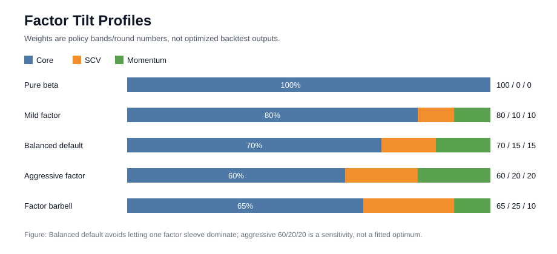
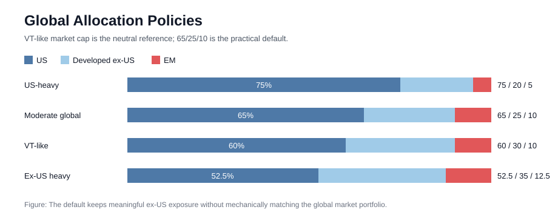
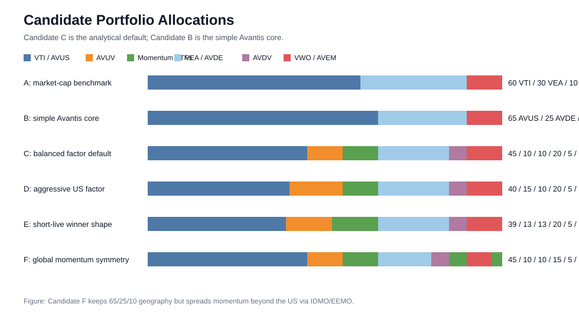

# Long-Term Factor Core: ETF Core, Factor Tilt And Global Allocation

Status: comparative analytical memo. This is not deployment authorization, paper-trade labeling, mandate override, or tax/legal advice.

Date: 2026-06-14.

## Executive View

The long-term core should remain a simple passive/factor-tilted equity portfolio. RSC is still useful as a research reference for diversification and drawdown control, but it is not the cleaner long-term core because it depends on return-stacked wrappers, managed-futures proxies, long-duration bonds and financing mechanics. Those implementation layers are useful hypotheses, not a default patrimonial core `[systematic_trading, p.185-188]`, `[advances_fin_ml, p.208-211]`.

Between pure market-cap beta and Avantis-style factor-aware beta, the analytical default is Avantis-style core if the investor accepts moderate tracking error and higher expense ratios. The reason is not the short live-window win by itself; the reason is that the implementation remains buy-and-hold equity exposure while adding systematic value/profitability/size-aware tilts that are recognized factor families `[ml_for_algo_trading, ch.7 p.190-191]`.

The base global allocation should not blindly copy VT, but VT is the neutral reference. A practical range is `60-70% US / 20-30% developed ex-US / 5-15% EM`; the analytical default is `65% US / 25% developed ex-US / 10% EM`. This keeps the portfolio close enough to global diversification while intentionally retaining a moderate US tilt for market depth, profitability concentration, liquidity and implementation simplicity `[systematic_trading, p.42]`, `[systematic_trading, p.170-171]`.

## Evidence From This Study

The short live Testfol.io comparison confirmed the user's observation: `60% AVUS / 20% AVUV / 20% SPMO` beat the RSC-US tracking payload from `2022-03-17` to `2026-06-12`. Yearly rebalance produced terminal wealth `1.916` for the factor mix versus `1.703` for RSC tracking, or `1.125x` relative wealth. Monthly rebalance produced `1.919` versus `1.650`, or `1.163x` relative wealth.

This is implementation evidence, not validation. A sub-5-year window is a regime sample; it cannot settle long-horizon expected returns and must not be used to optimize weights or rebalance frequency `[advances_fin_ml, p.208-211]`, `[testing_tuning, p.327-335]`.

The clean inference is narrow: over the available live ETF window, a simple factor core worked better than the RSC tracking expression, mostly because SPMO was strong. The broader decision must still rely on robustness, implementation risk, factor rationale and behavioral tolerability `[stocks_on_the_move, p.58-60]`, `[stocks_on_the_move, p.63-65]`.

## ETF Core Comparison

The relevant decision is not "Avantis is always better than Vanguard." The decision is whether the core should be pure market-cap beta or a low-turnover, diversified, factor-aware active ETF wrapper.

| Region | Market-cap core | Factor-aware core | Analytical read |
|---|---|---|---|
| US | `VTI` | `AVUS` | `VTI` is the clean beta benchmark. `AVUS` is the preferred implementable core if modest active/factor risk is acceptable. |
| Developed ex-US | `VEA` | `AVDE` | `VEA` is the clean developed-market beta benchmark. `AVDE` is preferred when using one systematic manager stack globally. |
| Emerging markets | `VWO` | `AVEM` | `VWO` is the clean EM beta benchmark. `AVEM` is preferred only if the investor accepts higher active risk and EM implementation uncertainty. |
| US small-cap value | `VBR` or similar | `AVUV` | Use as a tilt sleeve, not as the whole US core. |
| Developed ex-US small-cap value | no perfect broad cheap analog | `AVDV` | Use as a modest international SCV tilt if accepting liquidity and tracking-error risk. |
| US momentum | `SPMO` | `SPMO` | Use as a US-only momentum sleeve, not as a global core substitute. |
| Developed ex-US momentum | no pure beta analog | `IDMO` | Valid symmetry sleeve, but should be a sensitivity until tested against AVDE/AVDV. |
| EM momentum | no pure beta analog | `EEMO` | Valid symmetry sleeve, but should be smaller because EM implementation risk is higher. |

All rows above are strategic exposure choices, not fitted performance choices. Market-cap ETFs are retained as benchmarks because any factor-aware implementation must be judged against plain beta, while Avantis-style sleeves are candidates because size/value/profitability and momentum are recognized factor families with known regime and overfit risks `[ml_for_algo_trading, ch.7 p.190-191]`, `[stocks_on_the_move, p.58-60]`, `[testing_tuning, p.327-335]`.

### AVUS Versus VTI

`VTI` is the purer benchmark. It is appropriate if the only goal is ultra-low-cost US total market exposure with almost no active-manager judgment.

`AVUS` is more suitable for a factor-tilted core because it still covers the broad US market but adds active systematic weighting around valuation and profitability. The issuer states that Avantis ETFs combine indexing traits, namely low fees, broad diversification and tax efficiency, with daily active oversight and valuation-aware security selection. AVUS itself is an actively managed ETF and cites the Russell 3000 as the reference benchmark, representing approximately 98% of the investable US equity market. Its net expense ratio was shown as `0.15%` on the issuer page accessed on 2026-06-14.

Analytical conclusion: choose `VTI` for pure beta; choose `AVUS` for default factor-aware US core. The choice is strategic exposure, not a backtest winner selection `[ml_for_algo_trading, ch.7 p.190-191]`, `[testing_tuning, p.327-335]`.

### AVDE Versus VEA

`VEA` is the purer developed ex-US benchmark. It is appropriate if the desired exposure is broad market-cap developed markets with minimal active risk.

`AVDE` is more suitable if the US sleeve uses Avantis and the investor wants the same expected-return framework globally. The issuer describes AVDE as an actively managed ETF and references MSCI World ex-USA IMI, which covers large, mid and small caps across developed markets ex-US. Its net expense ratio was shown as `0.23%` on the issuer page accessed on 2026-06-14.

Analytical conclusion: choose `VEA` for pure beta; choose `AVDE` for factor-aware developed ex-US core. The international sleeve should be sized for diversification, not because recent US underperformance or outperformance predicts the next regime `[systematic_trading, p.170-171]`, `[advances_fin_ml, p.208-211]`.

### AVEM Versus VWO

`VWO` is the purer EM benchmark. It is appropriate if the target is cheap broad emerging-market beta and the investor wants to minimize active-manager risk.

`AVEM` is more suitable if the investor wants valuation/profitability-aware selection in the least efficient major equity region. The issuer describes AVEM as an actively managed ETF and references MSCI Emerging Markets IMI, covering large, mid and small caps across emerging markets. Its net expense ratio was shown as `0.33%` on the issuer page accessed on 2026-06-14.

Analytical conclusion: choose `AVEM` only if the investor is comfortable with the highest uncertainty sleeve in the portfolio. EM should usually remain `5-15%` of equity allocation unless there is a separate mandate for market-cap global neutrality. This cap is a portfolio-construction guardrail, not an optimized parameter `[testing_tuning, p.327-335]`, `[advances_fin_ml, p.298-299]`.

### AVUV And AVDV As SCV Tilts

Small-cap value is not a replacement for core equity. It is a concentrated factor sleeve with higher volatility, deeper tracking error and long underperformance risk. AVUV and AVDV are better treated as explicit tilts inside a broader core.

AVUV references Russell 2000 Value and was shown with net expense ratio `0.25%` on the issuer page accessed on 2026-06-14. AVDV references MSCI World ex-USA Small Cap and was shown with net expense ratio `0.36%` on the issuer page accessed on 2026-06-14.

Analytical conclusion: SCV tilt is legitimate, but the weight should be modest and pre-registered. The reason to own it is factor exposure, not recent relative performance `[ml_for_algo_trading, ch.7 p.190-191]`, `[testing_tuning, p.327-335]`.

### SPMO As Momentum Tilt

Momentum is a real empirical effect, but it is not a free core replacement. It remains equity-beta-heavy, can crowd into the same winners as the market, and can break down in bear regimes when equity correlations rise. Clenow's momentum framework treats momentum as a systematic equity selection process and explicitly warns that momentum/diversification can fail in bear markets `[stocks_on_the_move, p.58-60]`, `[stocks_on_the_move, p.63-65]`.

Analytical conclusion: SPMO can be included as a US momentum tilt. It should not be extrapolated from 2022-2026 into a dominant sleeve, because the strongest recent contributor is exactly the sleeve most vulnerable to regime reversal and performance-chasing bias `[evidence_based_ta, p.88-96]`, `[testing_tuning, p.327-335]`.

### Why Not IDMO And EEMO?

There is no conceptual reason to restrict momentum to the US. If the portfolio includes `SPMO` because momentum is a rewarded factor, then `IDMO` and `EEMO` are legitimate candidates for developed ex-US and EM momentum exposure. The better question is sizing and default status, not permission.

They were not in the first default for three reasons. First, the live Testfol.io evidence we actually ran was the user's US `AVUS/AVUV/SPMO` payload; we did not test a global `IDMO/EEMO` version yet. Second, the non-US sleeves already use Avantis factor-aware cores (`AVDE`, `AVEM`) plus `AVDV`, so adding momentum everywhere increases total active/factor tracking error. Third, EM momentum is the least clean implementation sleeve: higher country/currency/liquidity risk, more turnover sensitivity, and larger regime-dependence. Momentum works best as a disciplined sleeve; it should not become a post-hoc answer to every region `[stocks_on_the_move, p.63-65]`, `[systematic_trading, p.170-171]`, `[testing_tuning, p.327-335]`.

Analytical conclusion: include `IDMO` and `EEMO` as a global momentum sensitivity. Do not make them the default until a fixed-weight global case is tested. If used, fund them by reducing `AVDE` and `AVEM`, not by raising total equity risk or reducing the US/core discipline `[advances_fin_ml, p.208-211]`, `[testing_tuning, p.327-335]`.

## Factor Tilt Proportions

The tilt decision should be stated as bands, not optimized weights. The 2022-2026 result makes `60/20/20` interesting, but using the same short sample to choose the final weights would be overfit-prone `[testing_tuning, p.327-335]`, `[advances_fin_ml, p.208-211]`.

| Profile | Core | SCV | Momentum | When it fits |
|---|---:|---:|---:|---|
| Pure beta | 100% | 0% | 0% | Lowest tracking error and simplest benchmark discipline. |
| Mild factor | 80% | 10% | 10% | Best for investors who regret underperformance quickly. |
| Balanced factor | 70% | 15% | 15% | Analytical default for long horizon with moderate tracking-error tolerance. |
| Aggressive factor | 60% | 20% | 20% | Acceptable only if tracking error and multi-year factor droughts are behaviorally tolerable. |
| Factor barbell | 60-70% | 20-30% | 0-10% | For investors who trust value/profitability more than momentum. |

The analytical default is `70% core / 15% SCV / 15% momentum` at the equity-portfolio level. It is materially factor-tilted but does not let a single factor sleeve dominate the experience. The more aggressive `60/20/20` is a valid test case and has now beaten RSC in the short live window, but it should remain an aggressive variant until a long-history proxy study is complete `[testing_tuning, p.327-335]`, `[machine_trading, p.47-49]`.

Figure 1: factor tilts should be policy bands. The balanced default is a middle ground between benchmark discipline and meaningful factor exposure.

## Global Allocation

VT or ACWI market cap is the neutral benchmark, not necessarily the portfolio to copy exactly. Current global equity market-cap proxies are roughly US-majority, with the US around the low-to-mid 60% range depending on index, date and treatment of free float. A fully VT-like allocation is therefore approximately `60-65% US / 35-40% ex-US`.

The argument for global allocation is diversification across currencies, sectors, valuation regimes and political risk. The argument against full market-cap neutrality is that international equity can correlate highly with US equity during crises, and adding more assets does not automatically improve portfolio robustness when correlations are unstable and estimation error is high `[systematic_trading, p.170-171]`, `[advances_fin_ml, p.298-299]`.

| Global policy | US | Developed ex-US | EM | Analytical read |
|---|---:|---:|---:|---|
| US-heavy | 75% | 20% | 5% | Simpler, less currency/geopolitical exposure, but meaningfully underweights global markets. |
| Moderate global | 65% | 25% | 10% | Default balance between global diversification and US implementation quality. |
| VT-like | 60% | 30% | 10% | Closest simple approximation to global market-cap weight. |
| Ex-US heavy | 50-55% | 30-35% | 10-15% | Only for an explicit valuation/home-bias reversal thesis. |

The analytical default is `65% US / 25% developed ex-US / 10% EM`. It is not the theoretical market portfolio; it is a practical global equity core. It remains close enough to VT-like exposure while avoiding a mechanical allocation to regions where implementation frictions, governance, currency and benchmark composition are less favorable `[systematic_trading, p.42]`, `[systematic_trading, p.170-171]`, `[testing_tuning, p.327-335]`.

Figure 2: `65/25/10` is the practical default. It remains globally diversified without pretending that VT market cap is the only valid allocation.

## Candidate Portfolios

These are analytical candidates, not final mandate allocations. The weights are round numbers to preserve discipline and avoid pretending that a backtest can estimate a precise optimum `[testing_tuning, p.327-335]`.

### Candidate A: Pure Market-Cap Benchmark

| ETF | Weight | Role |
|---|---:|---|
| `VTI` | 60% | US broad market beta. |
| `VEA` | 30% | Developed ex-US broad market beta. |
| `VWO` | 10% | Emerging-market broad beta. |

Use this as the benchmark portfolio. It is the cleanest answer if the priority is cost, transparency, and lowest active regret `[testing_tuning, p.327-335]`.

### Candidate B: Simple Avantis Core

| ETF | Weight | Role |
|---|---:|---|
| `AVUS` | 65% | US factor-aware core. |
| `AVDE` | 25% | Developed ex-US factor-aware core. |
| `AVEM` | 10% | Emerging-market factor-aware core. |

Use this as the simplest investable long-term factor core. It has no explicit SCV or momentum satellites, so tracking error versus market-cap benchmarks should be lower than the more tilted portfolios `[ml_for_algo_trading, ch.7 p.190-191]`, `[systematic_trading, p.170-171]`.

### Candidate C: Balanced Global Factor Core

| ETF | Weight | Role |
|---|---:|---|
| `AVUS` | 45% | US core. |
| `AVUV` | 10% | US SCV tilt. |
| `SPMO` | 10% | US momentum tilt. |
| `AVDE` | 20% | Developed ex-US core. |
| `AVDV` | 5% | Developed ex-US SCV tilt. |
| `AVEM` | 10% | EM core. |

This is the analytical default if the investor wants meaningful factor exposure without making the portfolio depend on one factor. Geography is `65% US / 25% developed ex-US / 10% EM`. Within the US sleeve, it is approximately `69% core / 15% SCV / 15% momentum` `[ml_for_algo_trading, ch.7 p.190-191]`, `[stocks_on_the_move, p.63-65]`, `[testing_tuning, p.327-335]`.

### Candidate D: Aggressive US Factor Tilt

| ETF | Weight | Role |
|---|---:|---|
| `AVUS` | 40% | US core. |
| `AVUV` | 15% | US SCV tilt. |
| `SPMO` | 10% | US momentum tilt. |
| `AVDE` | 20% | Developed ex-US core. |
| `AVDV` | 5% | Developed ex-US SCV tilt. |
| `AVEM` | 10% | EM core. |

This is for higher tracking-error tolerance. It makes the US sleeve approximately `62% core / 23% SCV / 15% momentum`, while keeping global geography at `65/25/10`. It should not be selected just because AVUV/SPMO recently looked good `[evidence_based_ta, p.88-96]`, `[testing_tuning, p.327-335]`.

### Candidate E: Short-Live Winner Recast Globally

| ETF | Weight | Role |
|---|---:|---|
| `AVUS` | 39% | US core. |
| `AVUV` | 13% | US SCV tilt. |
| `SPMO` | 13% | US momentum tilt. |
| `AVDE` | 20% | Developed ex-US core. |
| `AVDV` | 5% | Developed ex-US SCV tilt. |
| `AVEM` | 10% | EM core. |

This keeps the US sleeve close to the tested `60/20/20` proportion while adding global exposure. It is the best candidate for continuity with the Testfol.io result, but it is less conservative than Candidate C and should be treated as a sensitivity until proxy-long evidence exists `[advances_fin_ml, p.208-211]`, `[testing_tuning, p.327-335]`.

### Candidate F: Global Momentum Symmetry Sensitivity

| ETF | Weight | Role |
|---|---:|---|
| `AVUS` | 45% | US core. |
| `AVUV` | 10% | US SCV tilt. |
| `SPMO` | 10% | US momentum tilt. |
| `AVDE` | 15% | Developed ex-US core, reduced to fund `IDMO`. |
| `AVDV` | 5% | Developed ex-US SCV tilt. |
| `IDMO` | 5% | Developed ex-US momentum tilt. |
| `AVEM` | 7% | EM core, reduced to fund `EEMO`. |
| `EEMO` | 3% | EM momentum tilt, capped for implementation risk. |

This keeps geography at `65% US / 25% developed ex-US / 10% EM`, but makes momentum global instead of US-only. It is the most internally symmetric factor design, but not the default because it adds two more ETFs and increases non-US active risk before a long-history proxy case has been run `[stocks_on_the_move, p.58-60]`, `[stocks_on_the_move, p.63-65]`, `[testing_tuning, p.327-335]`.

Figure 3: Candidate C keeps the same global geography as Candidate B, but adds controlled SCV and US momentum sleeves. Candidate F shows the symmetric global-momentum version with `IDMO/EEMO`.

## Decision Matrix

| Objective | Best candidate | Why |
|---|---|---|
| Lowest active regret | Candidate A | Pure market-cap beta is easiest to benchmark and explain. |
| Simplest factor-aware implementation | Candidate B | Three ETFs, global, no satellite sleeves. |
| Balanced long-term default | Candidate C | Factor-aware, globally diversified, moderate tilt. |
| Higher expected factor premium | Candidate D | More SCV concentration, higher tracking-error risk. |
| Preserve short-live winning shape | Candidate E | Closest to `60/20/20` US result, but more performance-chasing risk. |
| Global momentum symmetry | Candidate F | Adds `IDMO/EEMO`, but should be validated before becoming default. |

## Analytical Conclusion

The most suitable long-term portfolio is not RSC and not a fully optimized factor mix. It is a globally diversified factor-aware equity core.

The clean default is Candidate C: `45% AVUS / 10% AVUV / 10% SPMO / 20% AVDE / 5% AVDV / 10% AVEM`. It balances three constraints: stay close to global equity beta, add persistent factor exposures, and avoid making the portfolio too dependent on the recent SPMO-led window `[ml_for_algo_trading, ch.7 p.190-191]`, `[stocks_on_the_move, p.63-65]`, `[testing_tuning, p.327-335]`.

If simplicity beats tilt precision, use Candidate B. If benchmark discipline beats factor conviction, use Candidate A. Candidate D, E and F should be treated as higher-conviction variants, not defaults `[testing_tuning, p.327-335]`, `[advances_fin_ml, p.208-211]`.

## Final Suggestion

If forced to choose one portfolio today for long-term use, my suggestion is Candidate C:

| ETF | Weight | Reason |
|---|---:|---|
| `AVUS` | 45% | Main US factor-aware core. |
| `AVUV` | 10% | Explicit US small-cap value/profitability tilt. |
| `SPMO` | 10% | Explicit US momentum tilt, capped to avoid performance chasing. |
| `AVDE` | 20% | Developed ex-US factor-aware core. |
| `AVDV` | 5% | Modest developed ex-US SCV tilt. |
| `AVEM` | 10% | Emerging-market factor-aware sleeve, capped for implementation risk. |

This is not the maximum-return candidate. It is the best balance between implementation simplicity, global diversification, factor exposure and behavioral robustness. It uses `65% US / 25% developed ex-US / 10% EM`, and it keeps the factor tilt moderate rather than copying the short-window `60/20/20` US winner wholesale `[ml_for_algo_trading, ch.7 p.190-191]`, `[stocks_on_the_move, p.63-65]`, `[testing_tuning, p.327-335]`.

If the priority is simplicity over factor precision, use Candidate B: `65% AVUS / 25% AVDE / 10% AVEM`. If the priority is benchmark purity and lowest active regret, use Candidate A: `60% VTI / 30% VEA / 10% VWO`. If the priority is factor symmetry, Candidate F is the right sensitivity: `45% AVUS / 10% AVUV / 10% SPMO / 15% AVDE / 5% AVDV / 5% IDMO / 7% AVEM / 3% EEMO`. I would not use RSC as the long-term core; at most it remains a separate research-only diversifier/satellite candidate until a long-history proxy and implementation study justify otherwise `[systematic_trading, p.185-188]`, `[advances_fin_ml, p.208-211]`.

## What Would Change This View

The conclusion should be revisited if a proxy-long study shows that a different fixed factor mix dominates across multiple decades and regimes without relying on optimized weights. It should also be revisited if live ETF liquidity, tax treatment, broker availability or expense ratios change materially.

Until then, the portfolio should be chosen by explicit tolerance for tracking error, not by the best recent backtest row `[testing_tuning, p.327-335]`, `[advances_fin_ml, p.208-211]`.

## Source Notes

Issuer pages checked on 2026-06-14: Avantis pages for `AVUS`, `AVUV`, `AVDE`, `AVDV`, `AVEM`; Vanguard product pages for `VTI`, `VEA`, `VWO`, `VT`; iShares `ACWI`; Invesco pages for `SPMO`, `IDMO`, `EEMO`; iShares `IMTM` was also checked as an alternate developed ex-US momentum implementation. Dynamic issuer pages may require manual fact-sheet confirmation before execution.
