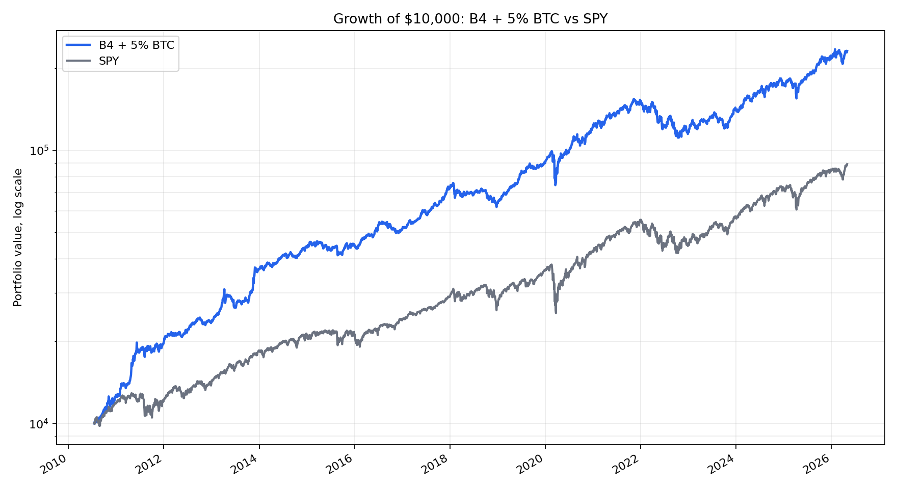
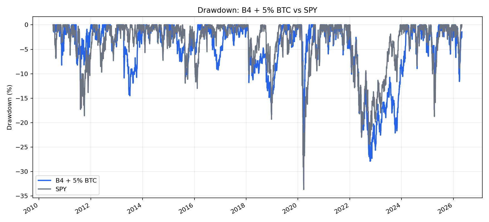
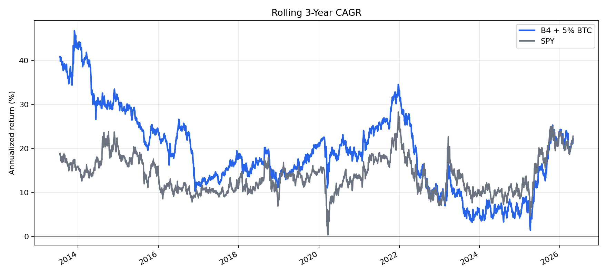
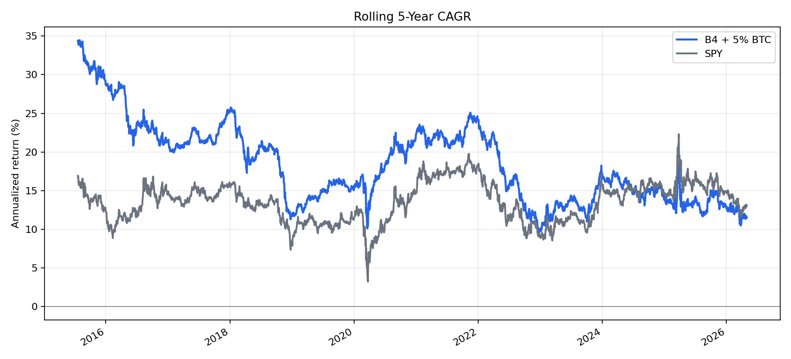
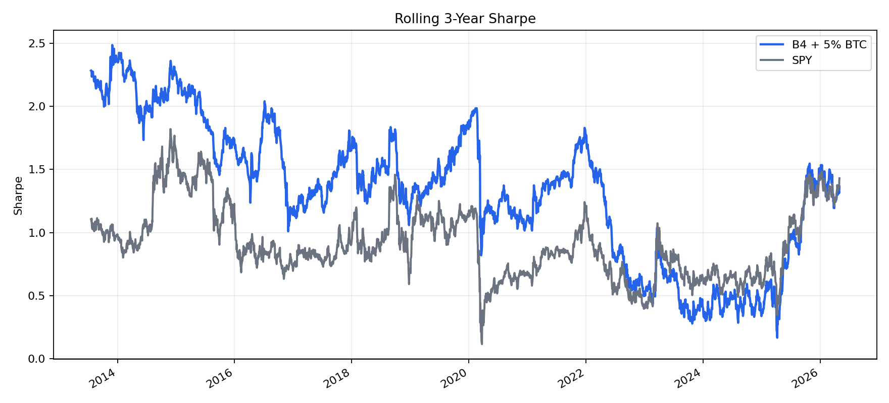

# Live Strategy - B4 + 5% Bitcoin Satellite

**Status:** live-candidate selected by user on 2026-05-03.  
**Allocation:** 25% NTSX / 25% GDE / 25% RSST / 20% ZROZ / 5% BTC.  
**Backtest source:** iter 047, testfol.io API, monthly rebalance, dividends reinvested, explicit ETF drag.  
**Window:** 2010-07-19 to 2026-05-01, constrained by `BTCSIM` availability.  
**Important:** this is a user-approved speculative satellite decision, not a pure gate-equivalent replacement for the older B4 core.

---

## 1. Executive Decision

The selected live strategy is the corrected B4 capital-efficient static stack with a 5% Bitcoin sleeve funded from ZROZ:

| sleeve | weight | role |
|---|---:|---|
| NTSX | 25% | US equity + intermediate Treasury futures stack |
| GDE | 25% | US equity + gold futures stack |
| RSST | 25% | US equity + managed futures stack |
| ZROZ | 20% | long-duration zero-coupon Treasury convexity sleeve |
| BTC | 5% | capped speculative monetary-asset satellite |

The live rule is deliberately simple: buy and hold, rebalance primarily with monthly contributions, and avoid tactical signals. The design follows the project's repeated finding that static capital-efficient stacks were more robust than tactical/meta variants after realistic cadence, expense ratios and overfit checks.

---

## 2. Why This Strategy Was Chosen

The core reason is not that Bitcoin had the best historical return. It did. The reason is that a small BTC sleeve improved the already-selected B4 structure without replacing the diversified core.

In the BTC-constrained test window:

| strategy | CAGR | MDD | Sharpe | terminal value, $10k start |
|---|---:|---:|---:|---:|
| B4 + 5% BTC from ZROZ | 22.01% | -27.90% | 1.311 | $230,926 |
| B4 base | 13.55% | -26.42% | 0.911 | $74,310 |
| SPY | 14.86% | -33.70% | 0.814 | $89,051 |

The chosen 5% BTC version is aggressive but still bounded. It improved CAGR and Sharpe materially versus SPY and B4 base while keeping max drawdown below SPY in this sample. The max drawdown worsened by 1.48pp versus B4 base, so this is not strict B4 dominance; it is an explicit risk-budget choice.

Why fund BTC from ZROZ:

| funding source | result |
|---|---|
| BTC from ZROZ | best practical trade-off; preserves NTSX/GDE/RSST return-stacked core |
| BTC from NTSX | similar CAGR, but removes core equity/Treasury stack |
| BTC from RSST | worsens MDD more; removes managed-futures crisis-alpha |

---

## 3. Performance Plots

These plots are generated from saved iter 047 testfol.io daily curves. They compare the selected strategy against SPY over the common `BTCSIM` window.











Plot script: `iterations/047-2026-05-03-bitcoin-sleeve-b4/make_live_strategy_plots.py`.

---

## 4. Why Not The Other Strategies

The study tested many candidates. This document keeps the review short because the detailed audit already lives in the per-iteration reports.

| family | reason not selected |
|---|---|
| SPY only | simpler, but lower Sharpe and higher MDD than selected strategy in iter 047 |
| B4 without BTC | cleaner retirement core, but gave up too much CAGR after user accepted a BTC satellite |
| 2.5% BTC | cleaner and more retirement-compatible, but user explicitly selected 5% risk budget |
| 10% BTC | excellent backtest, but too dependent on Bitcoin's early adoption path |
| TQQQ / UPRO / NDX regime gates | failed long-window stress; drawdowns remained unacceptable, especially including dotcom-style regimes |
| HFEA / LETF-heavy stacks | high CAGR but path-dependent and behaviorally fragile; 2022 and 2000-2002 are binding risks |
| global/factor tilts | tested in iter 046; did not improve B4 without worsening MDD |
| walk-forward optimized weights | iter 043 showed static weights beat rolling max-Sharpe optimization; re-fitting added overfit risk |
| B4 regime overlay without LETF | promising research, but not default yet; after-tax edge is small and still needs full gate/OOS treatment |
| B4 + LETF risk-on overlay | higher CAGR, but worse drawdown and lower risk-adjusted return versus the cleaner no-LETF overlay |

The practical conclusion is that simple static stacking won the core decision, and BTC won only as a small capped satellite.

### 4.1 Post-Selection Overlay Review

After the live-candidate decision, iters 048-051 tested whether B4 should be replaced by a tactical overlay or by LETF risk-on variants. The answer is no for the default allocation.

| approach | net CAGR | MDD | Sharpe | conclusion |
|---|---:|---:|---:|---|
| B4 static forced monthly | 12.18% | -30.88% | 0.880 | conservative tax baseline; real contribution-only implementation may be better than this forced-monthly model |
| B4 overlay without LETF | 12.35% | -28.00% | 0.901 | best risk-adjusted overlay hypothesis, but edge is modest and not full gate-equivalent |
| QLD 5% risk-on overlay | 12.87% | -28.92% | 0.900 | best LETF by Sharpe; adds CAGR but fails to improve Sharpe/MDD versus no-LETF overlay |
| TQQQ 45% risk-on overlay | 16.78% | -44.64% | 0.742 | best LETF by CAGR; materially different risk profile, not a core replacement |

Interpretation: the no-LETF overlay is worth keeping on the research watchlist, but it does not yet justify replacing static B4 as the default live implementation. The LETF overlays mostly buy extra return by adding effective equity beta in risk-on states; they do not improve the quality of the allocation under the selected Sharpe/MDD discipline. This follows the same anti-overfit discipline used throughout the project: a tactical variant should clear a pre-declared risk-adjusted hurdle before replacing a simpler static allocation `[advances_fin_ml, p.208-211]`, and LETF trend exposure remains path-dependent even when motivated by LRS-style moving-average gates `[leverage_for_the_long_run, ch.3-4, p.40-60]`.

---

## 5. Anti-Overfit Positioning

The original project uses seven hard anti-overfit gates. The gate framework exists because financial data is limited, non-stationary, and easy to overfit; Chan warns that financial machine-learning/backtest rules can work extremely well in-sample and fail forward when the distribution changes `[machine_trading, p.83-84, ch.4]`.

| gate | purpose | threshold used in project |
|---|---|---|
| G1 PBO | probability of backtest overfit via CSCV | `< 0.5` `[advances_fin_ml, p.208-211]` |
| G2 DSR | Deflated Sharpe adjusted for trials | `p < 0.05` `[advances_fin_ml, p.222-223]` |
| G3 Walk-forward | rolling robustness under stress windows | `>= 6/8` windows |
| G4 OOS 70/30 | single holdout sanity | test Sharpe > 0 |
| G5 FWD stress | recent forward stress, especially post-2020 | Sharpe > 0 |
| G6 Bootstrap CI | 99.9% lower confidence bound | CI low > 0 `[advances_fin_ml, p.196-202]` |
| G7 Cross-library | implementation risk check | CAGR delta <= 3pp `[advances_fin_ml, p.31-34]` |

How this strategy fits the gates:

| component | gate interpretation |
|---|---|
| B4 static core | supported by the prior static-stack audit, adversarial community tests, monthly/ER reruns and walk-forward weight-drift test |
| BTC sleeve | review-only, not full gate-equivalent; PBO/DSR/WF/bootstrap were not recomputed for BTC as a new full strategy |
| selected 5% size | explicit user risk-budget choice, not an optimized parameter from a wide grid |

This matters. The document does not claim that 5% BTC is statistically proven in the same sense as a full gate-passing tactical strategy. It claims that a small, capped BTC sleeve is economically acceptable after the user chose to accept the crypto-specific risk.

---

## 6. Bitcoin Thesis And Risk

The BTC sleeve is included as a scarce monetary-asset satellite, not as a crypto venture basket.

External research alignment:

| source | takeaway used here |
|---|---|
| BlackRock, `Bitcoin: A Unique Diversifier` | Bitcoin is scarce, non-sovereign and potentially diversifying, but volatile, speculative and not a complete investment program |
| Fidelity Digital Assets, `Bitcoin First Revisited` | Bitcoin should be evaluated separately from other digital assets; BTC is monetary/store-of-value, while non-BTC assets have more venture-like properties |
| iShares, `Bitcoin vs. Ethereum` | Bitcoin and Ethereum have distinct return drivers; BTC is monetary scarcity, ETH is programmable application/platform exposure |
| Chainalysis 2025 Crypto Crime Trends | crypto adoption coexists with hacks, scams, illicit flows and professionalized crime infrastructure |
| Coinbase institutional outlooks | near-term crypto price action is strongly macro/liquidity/flow dependent; ETF/stablecoin flows and technical support matter |

BTC-specific caveats:

| risk | live implication |
|---|---|
| adoption-path risk | 2010+ backtest starts after Bitcoin survived its earliest failure modes |
| volatility | BTC can fall 70-80% standalone; sleeve must stay capped |
| custody/wrapper risk | ETF wrapper reduces private-key burden but introduces trust/issuer/product structure risk |
| exchange/venue risk | Chan explicitly notes historical Bitcoin exchange failures from theft/hacks `[machine_trading, p.202, ch.7]` |
| regulation/tax | treatment depends on vehicle and jurisdiction; must be checked before execution |
| protocol/technology | network governance, security, quantum and implementation risks are not zero |

---

## 7. Live Implementation

Preferred vehicle order:

| preference | vehicle | reason |
|---|---|---|
| 1 | spot BTC ETF/ETP available at broker | simplest custody and tax reporting |
| 2 | direct BTC at high-quality regulated exchange/custodian | more pure exposure, more operational burden |
| 3 | futures-based BTC ETF | only fallback; roll/structure costs can diverge from spot |

ETF availability must be checked before execution. For the non-BTC sleeves, the real ETF mapping is:

| backtest sleeve | live ETF |
|---|---|
| NTSX | NTSX |
| GDE | GDE |
| RSST | RSST |
| ZROZ | ZROZ |
| BTC | preferably spot BTC ETF/ETP or direct BTC, depending on broker availability |

Target allocation in live:

```text
NTSX 25%
GDE  25%
RSST 25%
ZROZ 20%
BTC   5%
```

---

## 8. Rebalancing Policy With Monthly Contributions

The live rebalance policy is lazy rebalancing: use new monthly deposits to buy whichever sleeve is most underweight. Avoid selling unless drift becomes large. This is aligned with Bogleheads' rebalancing guidance that contributions can be used to restore target weights while reducing turnover and taxable events: https://www.bogleheads.org/wiki/Rebalancing

Monthly process:

| step | action |
|---|---|
| 1 | update current market value of NTSX, GDE, RSST, ZROZ and BTC |
| 2 | compute target dollars from total portfolio value after new cash |
| 3 | rank sleeves by dollar shortfall versus target |
| 4 | use the monthly contribution to buy the most underweight sleeve first |
| 5 | only place sell orders if contribution-only rebalancing cannot fix large drift |

Forced rebalance bands:

| sleeve | target | contribution-only zone | forced-review zone |
|---|---:|---:|---:|
| NTSX | 25% | buy if underweight | review if <15% or >35% |
| GDE | 25% | buy if underweight | review if <15% or >35% |
| RSST | 25% | buy if underweight | review if <15% or >35% |
| ZROZ | 20% | buy if underweight | review if <10% or >30% |
| BTC | 5% | buy if underweight | trim-review if >7.5%; add-review if <2.5% |

BTC special rule:

The BTC sleeve is capped because the thesis is satellite, not portfolio takeover. If BTC rises above 7.5%, stop buying BTC and direct all contributions to non-BTC sleeves until BTC falls back near target. If BTC exceeds 10%, sell down to 5-7.5% unless there is an explicit user override at that time.

Tax principle:

Contribution-only rebalancing defers taxable realization. Forced sells are allowed only when risk drift becomes more important than tax deferral. This is especially important for BTC because a large run-up can make the sleeve dominate portfolio risk even if the dollar value feels like a win.

---

## 9. Live Monitoring Rules

This is not a tactical strategy. Monitoring is for risk control and implementation quality, not signal generation.

| cadence | check |
|---|---|
| monthly | weights, contribution deployment, BTC cap |
| quarterly | ETF availability/liquidity/spreads, tracking sanity versus expected sleeve behavior |
| annually | tax reporting, realized gains, whether bands still match risk tolerance |
| extraordinary | ETF closure, regulatory change, crypto custody event, RSST/ZROZ liquidity issue |

Do not add new signals such as BTC moving average, SPY 200d, macro timing, or ETH rotation without starting a new study. Changing rules after seeing live performance is the easiest way to reintroduce overfit.

---

## 10. Final Position

The selected live portfolio is defensible because the core came from a broad static-stack search, the BTC addition was sized as a capped satellite, and the implementation uses simple monthly contribution rebalancing instead of tactical turnover.

The honest caveat is equally important: the 5% BTC sleeve is not proven by the same full gate battery as the original static core. It is a conscious risk-budget decision. If live execution proceeds, the correct posture is disciplined implementation, no parameter tinkering, and strict BTC cap enforcement.
