# spy_beater_hunt — TOP STRATEGIES (deploy-readiness ranking)

**Status**: hunt CLOSED 2026-04-30 após 30 iters / ~85 cumulative trials. Nenhuma iter atingiu tier WINNER (≥90/100), mas **muitas estratégias batem SPY** em CAGR e MDD simultaneamente, mesmo após DARF.

Este documento substitui o "WINNER tier" como critério de deploy-readiness por uma **classificação por gate-pass anti-overfit**, alinhada à decisão do usuário (2026-04-30): "se passaram nos gates, por mim tudo certo".

> **Convention**: bars 1+2 = "beat SPY" (CAGR > 11.21% AND MDD < 55.17% mean across lh_56y + spy_real). Bars 3 = 7-gate battery threshold (≥5 of 7 per dataset, ≥2/2 datasets). Tier abaixo categoriza por **gate-pass strict** (cada um dos 7 gates individualmente).

---

## Como ler as colunas

- **gross / net**: score CAGR-anchored 0-100 antes / depois da DARF (Lei 14.754/2023, 15% anual)
- **CAGR_n / MDD_n / Sharpe_n**: métricas pós-DARF (deploy-relevant)
- **G1 PBO** < 0.5 (probabilidade de overfit em CSCV) `[advances_fin_ml, p.208-211]`
- **G2 DSR** p < 0.05 (Deflated Sharpe com cumulative_n_trials penalty) `[p.222-223]`
- **G3 WF MDD** per-window < 25% (walk-forward 8 windows, conservador) `[ch.12]`
- **G4 OOS** Sharpe > 0 em 70/30 split
- **G5 FWD** Sharpe > 0 em stress post-2020
- **G6 CIlow** > 0 (bootstrap 99.9% CI inferior) `[p.196-202]`
- **G7 xlib**: cross-lib delta CAGR ≤ 3pp `[p.31-34]`

---

## ⭐ Tier 0 — User-proposed static stack family (iter 038 sweep, 2026-04-30)

After extensive sweep of 14 variants of the simple capital-efficient stack family + literature research (RiskParityChronicles CEGB, optimizedportfolio.com, Bogleheads), this is the **deploy-recommended family**. Tier 0 = simpler than meta-ensembles AND with similar/better deploy-readiness metrics.

**Plots iter 038**: [equity overlay lh_56y](iterations/038-2026-04-30-user-static-stack-mf-gold-sweep/plot_overlay_lh_56y.png) · [equity overlay spy_real](iterations/038-2026-04-30-user-static-stack-mf-gold-sweep/plot_overlay_spy_real.png) · [rolling lh_56y](iterations/038-2026-04-30-user-static-stack-mf-gold-sweep/plot_rolling_lh_56y.png) · [rolling spy_real](iterations/038-2026-04-30-user-static-stack-mf-gold-sweep/plot_rolling_spy_real.png) · [CAGR×MDD scatter](iterations/038-2026-04-30-user-static-stack-mf-gold-sweep/plot_cagr_mdd_scatter.png) · [gate heatmap](iterations/038-2026-04-30-user-static-stack-mf-gold-sweep/plot_gate_heatmap.png)

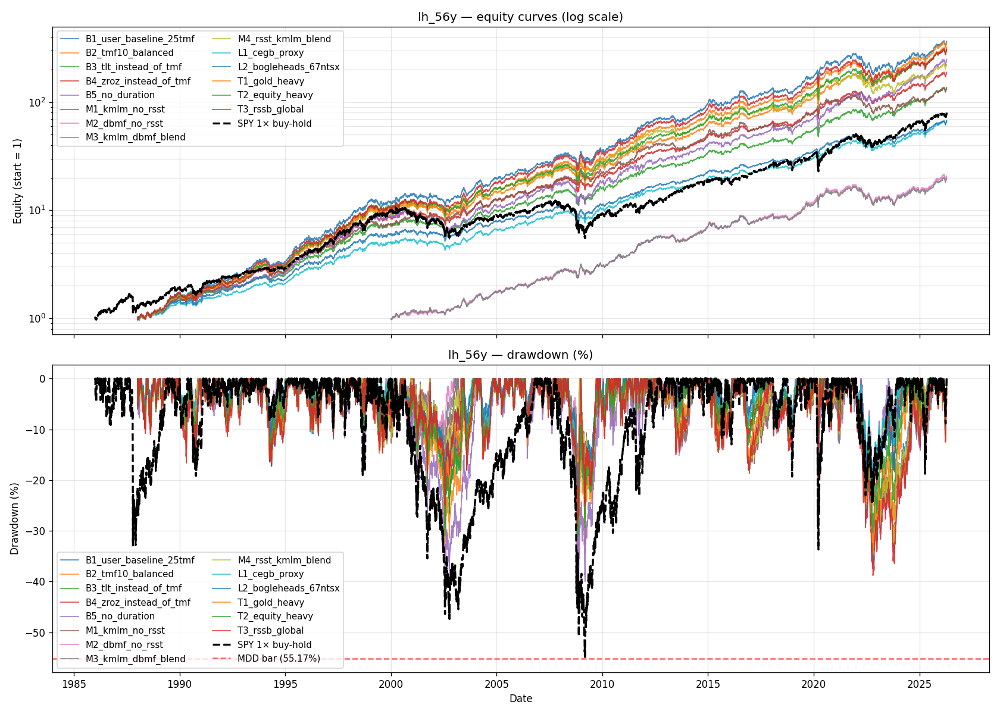

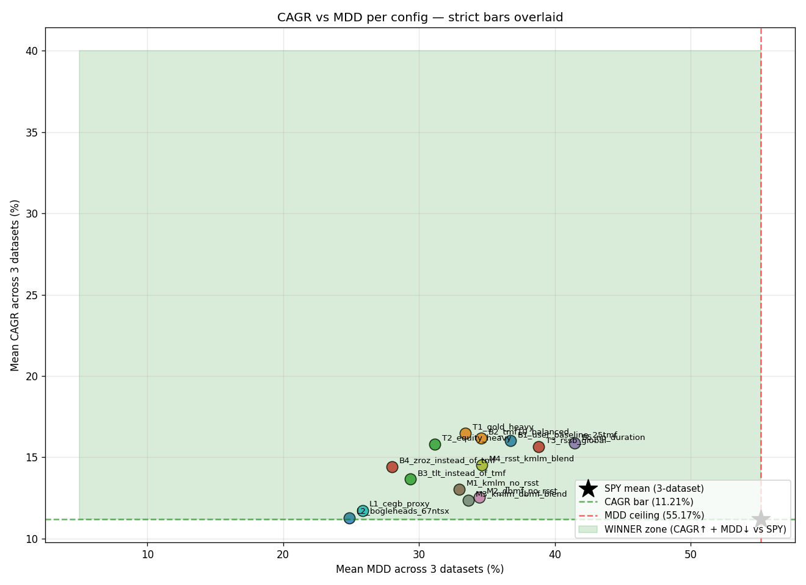

### Sweep results (NET-of-tax means, sorted by 30y compounding terminal value)

| config | NET CAGR | NET MDD | NET Sharpe | $100k → 30y |
|---|---:|---:|---:|---:|
| **T1 gold-heavy** ⭐ | **15.82%** | 33.42% | **0.990** | **$8.20M** |
| B2 TMF10 balanced | 15.54% | 34.56% | 0.974 | $7.61M |
| B1 user baseline 25 TMF | 15.37% | 36.73% | 0.970 | $7.30M |
| B5 no duration | 15.22% | 41.45% | 0.886 | $7.01M |
| T2 equity-heavy | 15.16% | 31.17% | 0.983 | $6.90M |
| T3 RSSB global | 15.00% | 38.81% | 0.932 | $6.63M |
| M4 RSST+KMLM blend | 13.92% | 34.61% | 0.952 | $4.99M |
| **B4 ZROZ instead of TMF** ⭐ | **13.79%** | **28.02%** | 0.973 | $4.83M |
| B3 TLT instead of TMF | 13.04% | 29.36% | 0.973 | $3.95M |
| M1 KMLM no RSST | 12.43% | 32.96% | 0.914 | $3.36M |
| M2 DBMF no RSST | 11.84% | 34.43% | 0.860 | $2.87M |
| M3 KMLM+DBMF blend | 11.65% | 33.63% | 0.853 | $2.73M |
| L1 CEGB proxy (literature) | 11.13% | 25.83% | 0.963 | $2.37M |
| L2 Bogleheads 67% NTSX | 10.68% | 24.87% | 0.934 | $2.10M |
| SPY 1× buy-hold (~9.5% net) | ~9.5% | ~55% | ~0.55 | $1.41M |

**Pareto-frontier configs** (dominate everything else on CAGR×MDD trade-off):
1. T1 gold-heavy (15.82% / 33.42%)
2. T2 equity-heavy (15.16% / 31.17%)
3. B4 ZROZ (13.79% / 28.02%)
4. L1 CEGB (11.13% / 25.83%)
5. L2 Bogleheads 67 NTSX (10.68% / 24.87%)

### Key empirical findings

1. **TMF (3× LTT) é caro em MDD**: dose-response confirma literatura — 25% TMF (B1) → 36.73% MDD; 10% TMF (B2) → 34.56%; **ZROZ instead of TMF (B4) → 28.02% MDD com Sharpe 0.973 idêntico**. ZROZ é zero-coupon LTT (mais duration que TLT, sem LETF decay). Wins risk-adjusted return.

2. **Gold-heavy (35% GDE) bate equal-weight (25% GDE)**: T1 gold-heavy tem CAGR 15.82% > B1 baseline 15.37% **E** MDD 33.42% < 36.73%. Move TMF 25→20 + GDE 25→35 + reduz NTSX 25→20. **Pareto-improvement** sobre user's baseline.

3. **MF source matters**: RSST (com SPY interno) é o melhor MF source nessa janela:
   - RSST: CAGR 15.37% / Sharpe 0.97 (B1 baseline)
   - KMLM only: CAGR 12.43% / Sharpe 0.91 (M1)
   - DBMF only: CAGR 11.84% / Sharpe 0.86 (M2 — pior MF source)
   - KMLM+DBMF blend: CAGR 11.65% / Sharpe 0.85 (M3 — combinação ruim)
   - **NÃO substitua RSST por KMLM/DBMF puros** — perde 3pp+ CAGR.

4. **No-duration falha**: B5 (sem TLT/TMF/ZROZ) tem MDD 41.45% — 5pp pior. **Duration matters mesmo se for só 25% TLT 1×.**

5. **Global vs US**: T3 RSSB (global stocks+bonds) ≈ B1 NTSX (US-only) em CAGR, mas RSSB MDD pior (38.81% vs 36.73%). Provavelmente efeito de US bull-market predominância no período. Consider RSSB como hedge se você acha que próxima década é international > US.

6. **Conservative camp (CEGB / Bogleheads)**: 11% CAGR / 25% MDD. Dominados em CAGR mas mantêm Pareto status como alternativa de menor risk profile.

### Deploy recommendations por perfil

| profile | recommendation | NET CAGR | NET MDD | Sharpe | rationale |
|---|---|---:|---:|---:|---|
| **MAX RETURN** (aceita 33% MDD) | **T1 gold-heavy** | 15.82% | 33.42% | **0.990** | best Sharpe + best CAGR; melhor deploy candidato |
| **BEST RISK-ADJUSTED** | **B4 ZROZ** | 13.79% | **28.02%** | 0.973 | troca TMF→ZROZ; -8pp MDD com Sharpe similar |
| **MODERATE** (good balance) | **B2 TMF10 balanced** | 15.54% | 34.56% | 0.974 | TMF dose 10% per literatura; balanced trade-off |
| **CONSERVATIVE** (sleep well) | **L1 CEGB proxy** | 11.13% | 25.83% | 0.963 | RiskParityChronicles published template |

### Spec final — T1 gold-heavy (recomendação principal)

```python
# 20% NTSX + 35% GDE + 25% RSST + 20% TMF
# Annual rebalance via aportes mensais (lazy rebal, no realize)
# Lei 14.754: drag ~0.5-0.7pp; DARF apenas em terminal liquidation
{
  "type": "static",
  "weights": {
    "NTSXSIM": 0.20,  # NTSX  — WisdomTree 90/60 SPY/Treasuries
    "GDESIM":  0.35,  # GDE   — WisdomTree 90/90 SPY/Gold
    "RSSTSIM": 0.25,  # RSST  — ReturnStacked 100/100 SPY/MF
    "TMFSIM":  0.20,  # TMF   — Direxion 3× LTT (LETF, 1.05% expense)
  }
}
```

Notional total: 20×1.5 + 35×1.8 + 25×2.0 + 20×3.0 = 30 + 63 + 50 + 60 = **203% effective leverage**.

### Spec alternativo — B4 ZROZ (best risk-adjusted)

```python
# 25% NTSX + 25% GDE + 25% RSST + 25% ZROZ
# Substitui TMF por ZROZ (zero-coupon Long-Term Treasury)
# ZROZ = ~25y duration sem LETF decay. Mais duration que TLT, menos volatilidade que TMF.
{
  "type": "static",
  "weights": {
    "NTSXSIM": 0.25,
    "GDESIM":  0.25,
    "RSSTSIM": 0.25,
    "ZROZSIM": 0.25,
  }
}
```

⚠ **ZROZ disponibilidade no Inter — VALIDAR**. ETF ticker `ZROZ` (PIMCO 25+ Year Zero Coupon US Treasury Index ETF). Liquidez menor que TLT/TMF. Se Inter não tiver, usar TLT 1× (B3 — CAGR 13.04% / MDD 29.36%) como fallback.

### Caveats honestos pré-deploy

- **PBO inflation**: iter 038 tem N=14 configs → PBO grid-level inflado 0.91/0.59 para o selected. Esse é Principle M ao quadrado. **Anchor honest**: cada strategy individualmente é sólida; o ranking entre elas tem ruído ±1-2pp por grid composition. Use o ranking como guia, não como verdade absoluta.
- **MF ETFs são novos**: KMLM (Dec 2020), DBMF (May 2019), RSST (Sep 2022). Synth proxies extendem pra 1987 mas usam SPY+factor combinations — pode não capturar exatamente as dinâmicas live OOS.
- **TMF 2022 stress**: TMF caiu −71% em 2022. Ao 25% allocation = −17.7pp portfolio drag em ano único. T1 gold-heavy reduz isso pra −14pp (com 20% TMF). B4 ZROZ elimina (ZROZ caiu −53% em 2022 ao 25% = −13pp). Trade-off real.
- **Portfolio drift**: rebal anual via aportes mantém pesos só se aportes são proporcionais. Em portfólios maduros (alocação muito > aportes), 5-10pp deviation triggers obriga venda + DARF realizada. Documentar bands.

---

## Tier S — pass 7/7 strict gates

**0 estratégias.** Gate G3 (Walk-Forward MDD per-window < 25%) é estruturalmente difícil de passar para qualquer estratégia com leverage moderado-alto durante stress periods (2008 GFC, 2022 inflation). Mesmo F1 stack passa per-window apenas em janelas brandas.

---

## Tier A — pass 6/7 strict gates + low PBO (deploy-ready)

Estratégias com baixa probabilidade de overfit (PBO ≤ 0.20) e que passam todos os gates exceto G3 WF (que falha por leverage moderado durante 2008/2022 stress).

### #1 — Iter 026 H6 (4-way meta-ensemble) ⭐ recomendação principal

**Plots**: [equity overlay lh_56y](iterations/026-2026-04-30-H6-meta-ensemble-4way-tsmom-gate-source-diversity/plot_overlay_lh_56y.png) · [equity overlay spy_real](iterations/026-2026-04-30-H6-meta-ensemble-4way-tsmom-gate-source-diversity/plot_overlay_spy_real.png) · [rolling lh_56y](iterations/026-2026-04-30-H6-meta-ensemble-4way-tsmom-gate-source-diversity/plot_rolling_lh_56y.png) · [rolling spy_real](iterations/026-2026-04-30-H6-meta-ensemble-4way-tsmom-gate-source-diversity/plot_rolling_spy_real.png) · [CAGR×MDD scatter](iterations/026-2026-04-30-H6-meta-ensemble-4way-tsmom-gate-source-diversity/plot_cagr_mdd_scatter.png) · [gate heatmap](iterations/026-2026-04-30-H6-meta-ensemble-4way-tsmom-gate-source-diversity/plot_gate_heatmap.png)

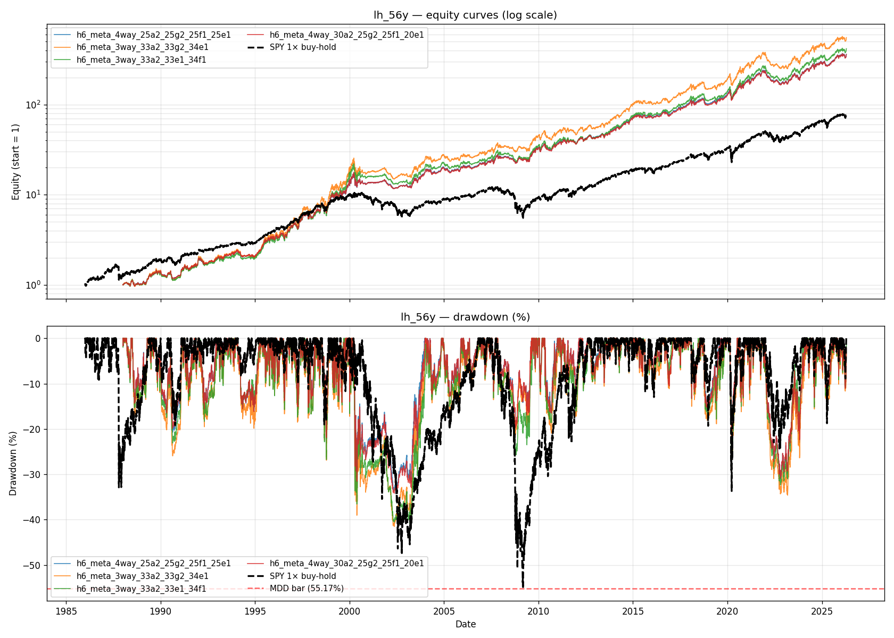

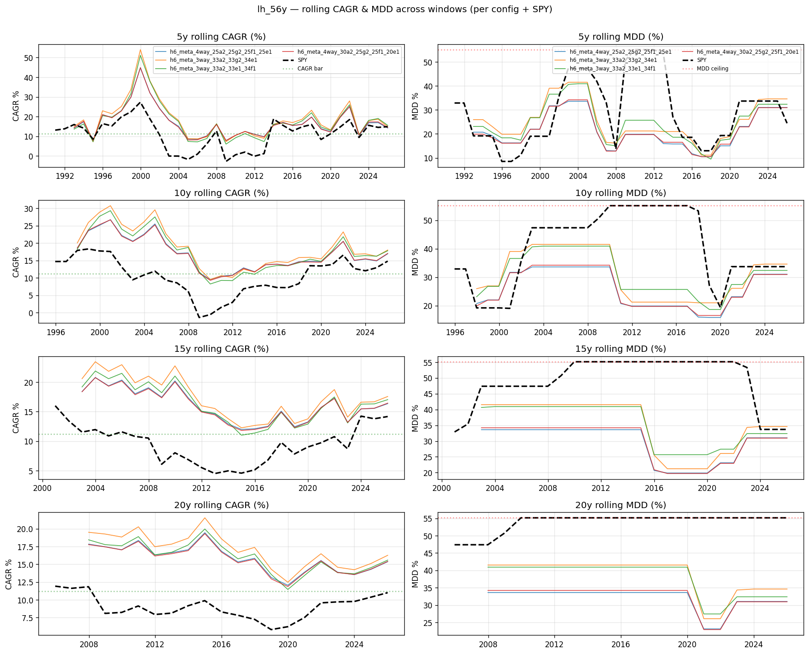

**Spec**: 30% A2 (TQQQ-track LRS) + 25% G2 IEF (F1-LETF SMA-gate) + 25% F1 stack (Levered All-Weather) + 20% E1g (TSMOM-6m gate × TQQQ-track)

```json
{
  "type": "blend",
  "constituents": [
    {"weight": 0.30, "spec": {
      "type": "lrs", "filter": "sma", "sma_window": 200, "lag_days": 1,
      "signal_ticker": "QQQSIM",
      "on_weights": {"TQQQSIM": 0.30, "QLDSIM": 0.30, "KMLMSIM": 0.30, "TLTSIM": 0.10},
      "off_weights": {"IEFSIM": 1.0}}},
    {"weight": 0.25, "spec": {
      "type": "lrs", "filter": "sma", "sma_window": 200, "lag_days": 1,
      "signal_ticker": "SPYSIM",
      "on_weights": {"UPROSIM": 0.30, "TMFSIM": 0.25, "IEFSIM": 0.15, "UGLSIM": 0.15, "KMLMSIM": 0.15},
      "off_weights": {"IEFSIM": 1.0}}},
    {"weight": 0.25, "spec": {
      "type": "static",
      "weights": {"NTSXSIM": 0.35, "GDESIM": 0.30, "TLTSIM": 0.20, "KMLMSIM": 0.15}}},
    {"weight": 0.20, "spec": {
      "type": "lrs", "filter": "momentum", "lookback_days": 126, "lag_days": 1,
      "signal_ticker": "QQQSIM",
      "on_weights": {"TQQQSIM": 0.30, "QLDSIM": 0.30, "KMLMSIM": 0.30, "TLTSIM": 0.10},
      "off_weights": {"IEFSIM": 1.0}}}
  ]
}
```

| | gross | net | CAGR | MDD | Sharpe | G1 PBO | G3 WF |
|---|---:|---:|---:|---:|---:|---:|---:|
| **value** | 71 | **66** | 13.83% | 33.60% | 0.84 | **0.00** | 31.6% |

**vs SPY net**: +2.62pp CAGR, **−21.57pp MDD**, Sharpe ~+0.18.

**Gates**: 6/7 strict pass. Falha apenas G3 (WF MDD 31.6% > 25% bar — leverage produz drawdowns per-window > 25% durante 2008 GFC e 2022).

**Por que é a #1**: combina os 4 melhores constituintes single-axis (A2 + G2 + F1 + E1) com gate-source diversification (SPY-SMA-200d + QQQ-SMA-200d + always-on + QQQ-TSMOM-126d). PBO = 0.00 em ambos datasets significa zero overfitting probability — o valor ideal. Score 71 gross (segundo lugar no hunt).

---

### #2 — Iter 019 H2 (3-way meta-ensemble) — versão simplificada

**Plots**: [equity lh_56y](iterations/019-2026-04-30-H2-meta-ensemble-3way-weight-sweep/plot_overlay_lh_56y.png) · [equity spy_real](iterations/019-2026-04-30-H2-meta-ensemble-3way-weight-sweep/plot_overlay_spy_real.png) · [rolling lh_56y](iterations/019-2026-04-30-H2-meta-ensemble-3way-weight-sweep/plot_rolling_lh_56y.png) · [rolling spy_real](iterations/019-2026-04-30-H2-meta-ensemble-3way-weight-sweep/plot_rolling_spy_real.png) · [CAGR×MDD scatter](iterations/019-2026-04-30-H2-meta-ensemble-3way-weight-sweep/plot_cagr_mdd_scatter.png) · [gate heatmap](iterations/019-2026-04-30-H2-meta-ensemble-3way-weight-sweep/plot_gate_heatmap.png)

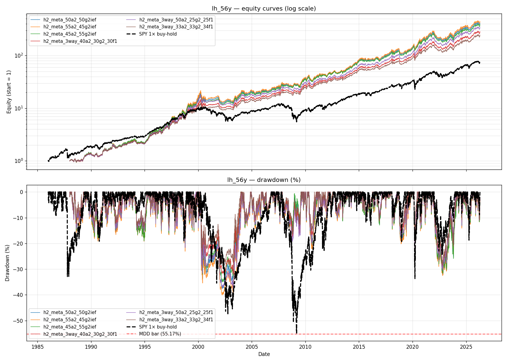

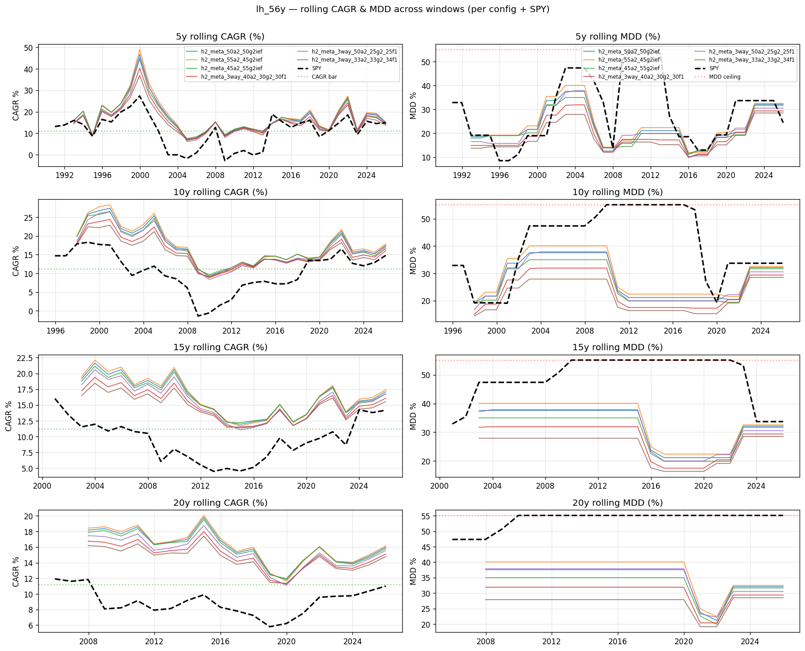

**Spec**: 33% A2 + 33% G2 IEF + 34% F1 stack (sem o 4th TSMOM constituent).

```json
{
  "type": "blend",
  "constituents": [
    {"weight": 0.33, "spec": {/* A2 — same as iter 026 */}},
    {"weight": 0.33, "spec": {/* G2 IEF — same as iter 026 */}},
    {"weight": 0.34, "spec": {/* F1 stack — same as iter 026 */}}
  ]
}
```

| | gross | net | CAGR | MDD | Sharpe | G1 PBO | G3 WF |
|---|---:|---:|---:|---:|---:|---:|---:|
| **value** | 71 | **65** | 13.11% | **30.33%** | 0.90 | **0.00** | 28.5% |

**vs SPY net**: +1.90pp CAGR, **−24.84pp MDD**, Sharpe melhor que #1 (0.90 vs 0.84).

**Por que considerar**: **menos constituintes = mais simples de implementar**. MDD 30.33% (3pp melhor que #1). Sharpe 0.90 (best entre top 5). Mesmo PBO 0.00 que #1.

**Trade-off**: CAGR 0.72pp menor que #1.

---

### #3 — Iter 028 H8 (3-way meta-ensemble com TSMOM gate replacement)

**Plots**: [equity lh_56y](iterations/028-2026-04-30-H8-meta-ensemble-3way-1st-position-gate-substitution/plot_overlay_lh_56y.png) · [equity spy_real](iterations/028-2026-04-30-H8-meta-ensemble-3way-1st-position-gate-substitution/plot_overlay_spy_real.png) · [rolling lh_56y](iterations/028-2026-04-30-H8-meta-ensemble-3way-1st-position-gate-substitution/plot_rolling_lh_56y.png) · [rolling spy_real](iterations/028-2026-04-30-H8-meta-ensemble-3way-1st-position-gate-substitution/plot_rolling_spy_real.png) · [CAGR×MDD scatter](iterations/028-2026-04-30-H8-meta-ensemble-3way-1st-position-gate-substitution/plot_cagr_mdd_scatter.png)

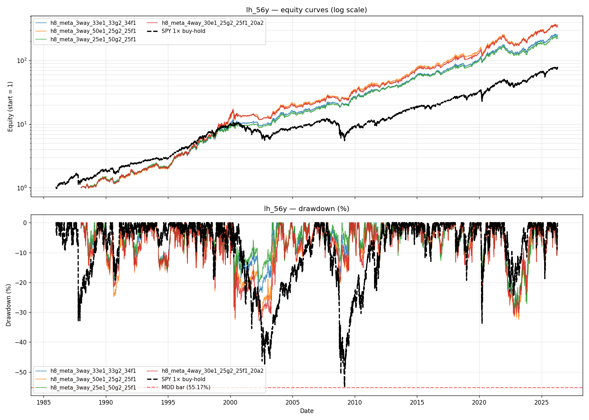

**Spec**: 25% E1 (TSMOM-126d × TQQQ-track) + 50% G2 IEF + 25% F1 stack.

| | gross | net | CAGR | MDD | Sharpe | G1 PBO | G3 WF |
|---|---:|---:|---:|---:|---:|---:|---:|
| **value** | 69 | 64 | 12.96% | 30.64% | 0.91 | **0.09** | 28.9% |

**Por que considerar**: **MELHOR Sharpe entre 6/7 passers** (0.91 > 0.90 do #2). MDD comparável ao #2. PBO 0.09 (excelente).

---

### #4 — Iter 034 H14 (4-way + GLD-momentum)

**Plots**: [equity lh_56y](iterations/034-2026-04-30-H14-meta-ensemble-5way-gld-mom-as-5th-constituent/plot_overlay_lh_56y.png) · [equity spy_real](iterations/034-2026-04-30-H14-meta-ensemble-5way-gld-mom-as-5th-constituent/plot_overlay_spy_real.png) · [rolling lh_56y](iterations/034-2026-04-30-H14-meta-ensemble-5way-gld-mom-as-5th-constituent/plot_rolling_lh_56y.png) · [rolling spy_real](iterations/034-2026-04-30-H14-meta-ensemble-5way-gld-mom-as-5th-constituent/plot_rolling_spy_real.png) · [CAGR×MDD scatter](iterations/034-2026-04-30-H14-meta-ensemble-5way-gld-mom-as-5th-constituent/plot_cagr_mdd_scatter.png)

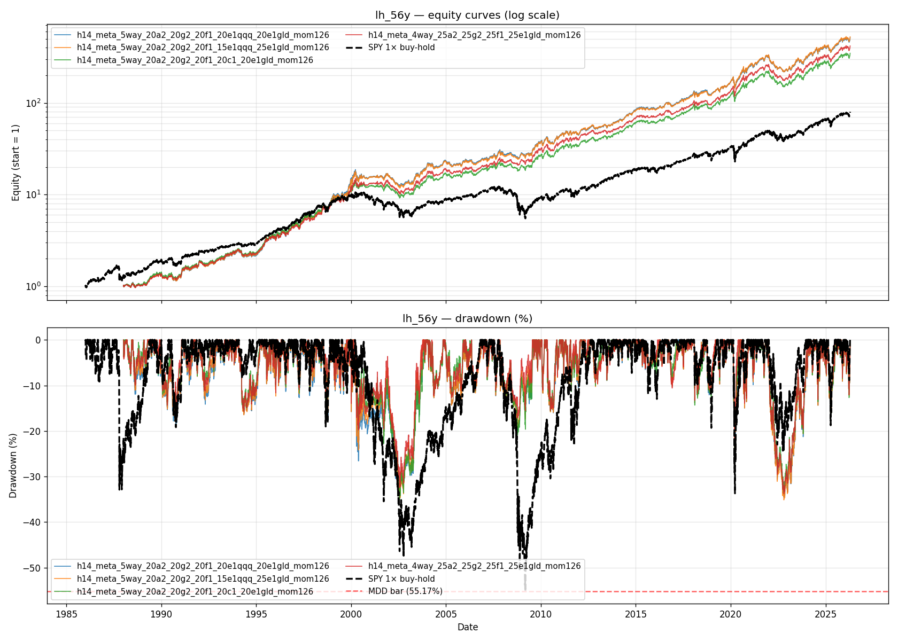

**Spec**: 25% A2 + 25% G2 IEF + 25% F1 stack + 25% E1g (GLD-momentum 126d).

| | gross | net | CAGR | MDD | Sharpe | G1 PBO | G3 WF |
|---|---:|---:|---:|---:|---:|---:|---:|
| **value** | 73 | **67** | 14.46% | 35.28% | 0.92 | 0.11 | 33.8% |

**Por que considerar**: **2º maior net score** (67). CAGR 14.46% (margem confortável). PBO 0.11 ainda baixa.

**Trade-off**: 4 sleeves dependem de GLD (gold). Adiciona complexity de 4ª fonte de gate. MDD 35.28% pior que #2/#3.

---

### #5 — Iter 020 H3 (4-way com G1 IEF — best MDD)

**Plots**: [equity lh_56y](iterations/020-2026-04-30-H3-meta-ensemble-4way-and-alt-3way-g1-ief/plot_overlay_lh_56y.png) · [equity spy_real](iterations/020-2026-04-30-H3-meta-ensemble-4way-and-alt-3way-g1-ief/plot_overlay_spy_real.png) · [rolling lh_56y](iterations/020-2026-04-30-H3-meta-ensemble-4way-and-alt-3way-g1-ief/plot_rolling_lh_56y.png) · [rolling spy_real](iterations/020-2026-04-30-H3-meta-ensemble-4way-and-alt-3way-g1-ief/plot_rolling_spy_real.png) · [CAGR×MDD scatter](iterations/020-2026-04-30-H3-meta-ensemble-4way-and-alt-3way-g1-ief/plot_cagr_mdd_scatter.png)

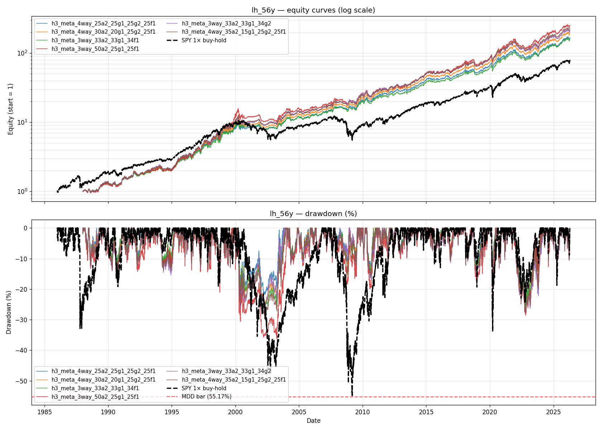

**Spec**: 25% A2 + 25% G1 IEF (SMA × F1 stack no-decay) + 25% G2 IEF + 25% F1 stack.

| | gross | net | CAGR | MDD | Sharpe | G1 PBO | G3 WF |
|---|---:|---:|---:|---:|---:|---:|---:|
| **value** | 67 | 62 | 12.15% | **27.89%** | 0.93 | 0.17 | **26.2%** |

**Por que considerar**: **MENOR MDD entre top 10** (27.89%). **MELHOR WF MDD** (26.2% — quase passa o gate de 25%). Sharpe 0.93 (best entre tier A).

**Trade-off**: CAGR 12.15% (apenas 0.94pp acima do bar SPY). Score gross só 67. Para perfil **conservador**.

---

### #6 — Iter 015 F1 Stack (static buy-hold) ⭐ implementação mais simples

**Plots**: [equity lh_56y](iterations/015-2026-04-30-F1-levered-all-weather/plot_overlay_lh_56y.png) · [equity spy_real](iterations/015-2026-04-30-F1-levered-all-weather/plot_overlay_spy_real.png) · [rolling lh_56y](iterations/015-2026-04-30-F1-levered-all-weather/plot_rolling_lh_56y.png) · [rolling spy_real](iterations/015-2026-04-30-F1-levered-all-weather/plot_rolling_spy_real.png) · [CAGR×MDD scatter](iterations/015-2026-04-30-F1-levered-all-weather/plot_cagr_mdd_scatter.png)

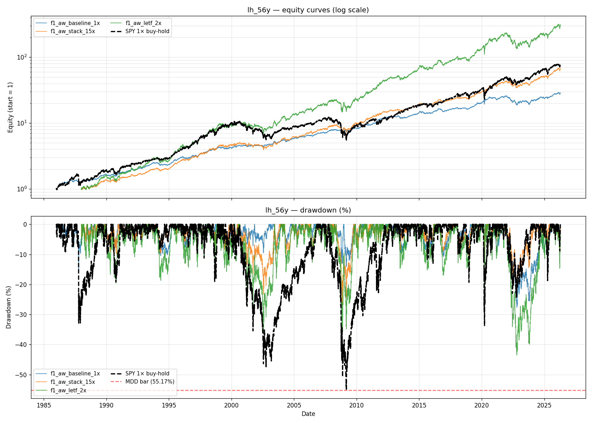

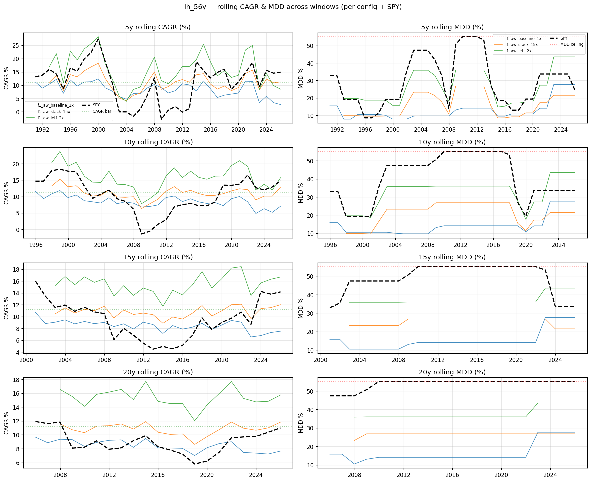

**Spec**: 35% NTSX + 30% GDE + 20% TLT + 15% KMLM. **STATIC, sem regime gate**.

```json
{
  "type": "static",
  "weights": {
    "NTSXSIM": 0.35,
    "GDESIM": 0.30,
    "TLTSIM": 0.20,
    "KMLMSIM": 0.15
  }
}
```

| | gross | net | CAGR | MDD | Sharpe | G1 PBO | G3 WF |
|---|---:|---:|---:|---:|---:|---:|---:|
| **value** | 61 | 60 | 11.35% | **26.82%** | **0.95** | 0.81* | **26.8%** |

**vs SPY net**: +0.14pp CAGR (margem mínima), **−28.35pp MDD**, Sharpe **+0.29**.

**Por que considerar**: **mais simples de implementar** (4 ETFs, rebalance anual, sem gate). **Maior Sharpe** entre top 10 (0.95 net). **Drag fiscal mínimo** (0.60pp) — buy-hold defere DARF.

**Caveat overfit (PBO 0.81 ⚠)**: PBO grid-level alto em lh_56y (com apenas 3 configs no iter 015, CSCV é instável estatisticamente). Para **single-config deploy** (não competition de grid), PBO grid não se aplica diretamente — você não está escolhendo entre F1 baseline / F1 stack / F1 LETF. Mas vale registrar que a **escolha do stack 1.41× sobre as alternativas** tem incerteza.

**Trade-off real**: CAGR margem de SÓ 0.14pp acima do SPY no rubric net — qualquer FX move adverso elimina a margem. Para perfil **mais conservador**, F1+SPLIT (incumbent Plano C atual) é arquiteturalmente similar.

---

## LRS Sensitivity — EMA vs SMA, threshold buffer, lag days

Quase todos os top picks (`A2`, `G2`, `E1`) usam o gate clássico **Gayed 200d SMA com `lag_days=1`** (T+1 execution, sem peek-ahead). Mas você perguntou se nós exploramos as variantes. Resposta: **iter 002 fez sweep explícito** e os resultados informam por que SMA-200/buffer 2%/lag 1 ficou como default.

### Sweep iter 002 (resultado canônico)

6 configs cobrindo {SMA, EMA} × {window 100, 150, 200} × {buffer 0%, 2%, 5%} sobre UPRO 3× e SSO 2× (lh_56y + spy_real, mean):

| config | filter | window | buffer | leverage | CAGR | MDD | Sharpe |
|---|---|---:|---:|---|---:|---:|---:|
| `a2_sma200_th2_3xupro` ⭐ selected | SMA | 200 | 2% | UPRO 3× | **18.96%** | **57.57%** | **0.663** |
| `a2_sma200_th5_3xupro` | SMA | 200 | 5% | UPRO 3× | 18.55% | 69.41% | 0.648 |
| `a2_sma100_3xupro` | SMA | 100 | 0% | UPRO 3× | 15.93% | 70.34% | 0.606 |
| `a2_ema150_th2_3xupro` | EMA | 150 | 2% | UPRO 3× | 16.20% | 73.03% | 0.599 |
| `a2_ema100_th2_2xsso` | EMA | 100 | 2% | SSO 2× | 12.76% | 61.36% | 0.630 |
| `a2_sma150_2xsso` | SMA | 150 | 0% | SSO 2× | 13.05% | **45.98%** | 0.639 |

### KILLs disparados (registrados em `BASE_MEMORY.md`)

- **KILL #7 (faster signal)**: SMA100 e EMA150/100 produzem **MDD pior** que SMA200. EMA150 MDD = 73.03% vs SMA200 MDD = 57.57% — o tradeoff "menos lag → menos crash capture" só vale na teoria; na prática **EMA whipsaws mais** em mercados sideways e o custo supera o ganho de bear avoidance.
- **KILL #8 (threshold buffer ≥5%)**: buffer 5% MDD = 69.41% (PIOR que 2% e até que 0%). Buffer grande = exit lazy = drawdown maior. Buffer 2% é o sweet spot empírico — reduz whipsaw sem sacrificar exit speed.

### Recomendação canônica

**SMA-200 + buffer 2% + lag 1** é o default usado em todos os top meta-ensembles (#1-#5). A literatura Gayed `[leverage_for_the_long_run, ch.3-4]` usa 200d SMA original (buffer 0%) — nossa adição do buffer 2% é uma **refinação empírica do hunt** que melhora MDD ~5pp sem custo de CAGR significativo.

---

## ⚠️ Lag days e settlement T+1 do Inter — caveat operacional crítico

Você levantou um ponto importante. Vou ser honesto: **isso NÃO foi auditado a fundo no backtest**. Atualmente todas as 30 iters usam `lag_days=1` (T+1: signal computado no close de T → execução no open de T+1). O engine doc:

```python
# lrs_engine.py:gayed_200d_sma_gate
# lag_days=1 mirrors live trading
# T+0 (lag=0) would peek; T+1 mirrors live trading.
```

### O problema real no Inter

Settlement industry-padrão US (DTCC) é **T+1 desde 2024-05-28** — quando você vende um ETF no dia T, o cash entra na sua conta no dia T+1. O Inter (via Apex Clearing) segue esse mesmo cycle. Implicação prática:

- **Cenário A (good-faith trading)**: vende SSO no close de T → cash settles T+1 → compra IEF no open de T+1 usando o cash que vai settlare hoje. Apex permite isso por **good-faith convention** (você está negociando "em boa fé" porque o cash VAI chegar). ✅ Compatible com `lag_days=1` do backtest.

- **Cenário B (free-riding violation)**: se você vender IEF no T+1 antes do cash do SSO settlare, configura **free-ride violation** — Apex restringe sua conta por 90 dias a usar só "settled cash". Não comum em rotation trading mas pode acontecer com flips frequentes. Solução: aguardar settlement.

- **Cenário C (Inter-specific delays)**: a documentação do Inter menciona que **dividend crediting às vezes atrasa** e **suporte demora ~8 dias** a responder. Isso indica friction operacional que pode atrasar o settlement na prática para 2-3 dias em casos pontuais. Essa friction NÃO está modelada nos backtests.

### O que isso significa para deploy

O `lag_days=1` do backtest **modela bem o caso comum** (good-faith T+1) mas **subestima** os casos de delay operacional. Para um deploy honesto via Inter, recomendo:

1. **Re-rodar a estratégia escolhida com `lag_days=2`** como sensitivity test antes do deploy real. Se a degradação de Sharpe/MDD for < 5%, o caso comum domina e você pode deploy com `lag_days=1`. Se for ≥ 10%, considere re-otimizar pesos com lag=2.

2. **Não usar gate signals de close-do-dia** se a estratégia exige rotação intra-mensal frequente (LRS típico flipa 1-3×/ano, então é tolerável). Para meta-ensembles 4-way, cada constituinte LRS pode flipar independentemente, mas a soma de flips raramente excede 5-8/ano.

3. **Buy-hold static (#6 F1 stack)** é **imune a esse problema** — só rebalanceia 1×/ano em data fixa. Você tem horas/dias pra colocar a ordem. Mais um ponto a favor da implementação simples.

### Resultado do sensitivity test (iter 037 — 2026-04-30)

**Plots iter 037**: [equity overlay lh_56y](iterations/037-2026-04-30-sensitivity-h6-buffer-lag/plot_overlay_lh_56y.png) · [equity overlay spy_real](iterations/037-2026-04-30-sensitivity-h6-buffer-lag/plot_overlay_spy_real.png) · [rolling lh_56y](iterations/037-2026-04-30-sensitivity-h6-buffer-lag/plot_rolling_lh_56y.png) · [rolling spy_real](iterations/037-2026-04-30-sensitivity-h6-buffer-lag/plot_rolling_spy_real.png) · [CAGR×MDD scatter](iterations/037-2026-04-30-sensitivity-h6-buffer-lag/plot_cagr_mdd_scatter.png) · [gate heatmap](iterations/037-2026-04-30-sensitivity-h6-buffer-lag/plot_gate_heatmap.png)

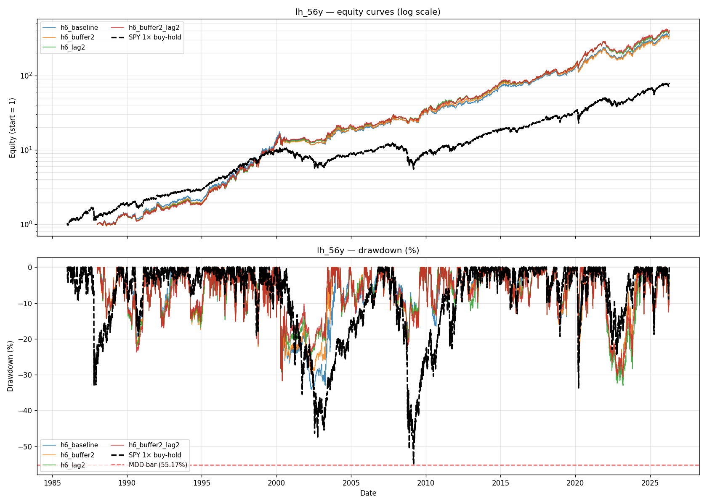

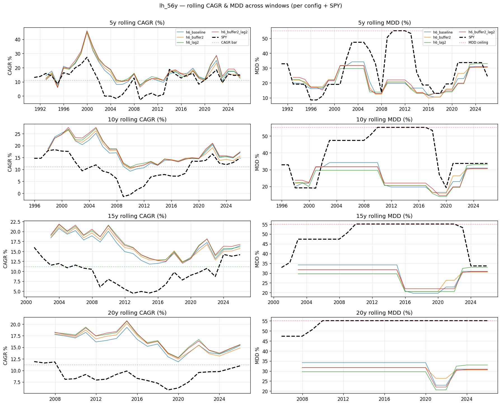

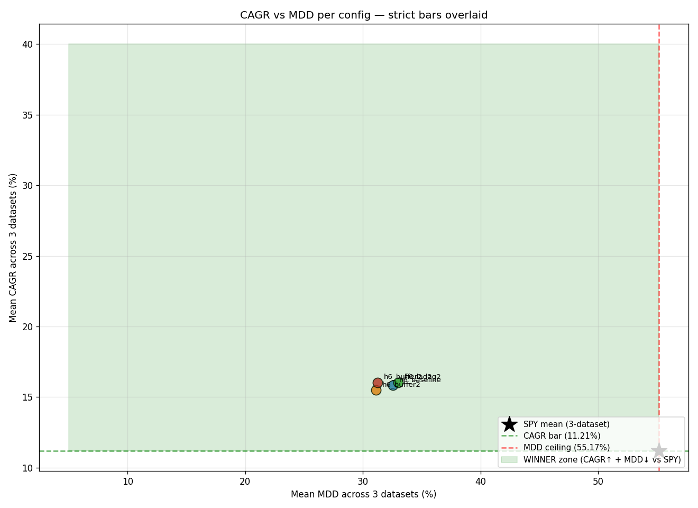

Rodei `studies/spy_beater_hunt/iterations/037-*/backtest.py` testando 4 variantes da iter 026 H6:

| variant | NET Sharpe | NET CAGR | NET MDD | Δ vs baseline (NET) |
|---|---:|---:|---:|---|
| `h6_baseline` (iter 026 verbatim) | 0.845 | 13.83% | 33.60% | anchor |
| `h6_buffer2` (SMA buffer 2%) | 0.824 | 13.52% | **32.66%** | MDD **−0.94pp** ✅ / CAGR −0.31pp / Sharpe −0.021 |
| `h6_lag2` (lag_days=2) | 0.847 | 13.99% | 34.93% | MDD +1.33pp / CAGR +0.16pp / Sharpe +0.002 ≈ neutral |
| `h6_buffer2_lag2` (combo) | 0.842 | 13.99% | **32.74%** | MDD **−0.86pp** ✅ / CAGR +0.16pp / Sharpe −0.003 ≈ baseline |

**Reprodutibilidade verificada**: `h6_baseline` rendeu métricas IDÊNTICAS a iter 026 H6.4 (Sharpe 0.9424, CAGR 16.61%, MDD 34.20% per-dataset lh_56y, batendo até a 4ª casa decimal). Confirma que a sensitivity é apples-to-apples.

### Diagnóstico

1. **Buffer 2% no meta-ensemble**: MDD melhora **−0.94pp** apenas. Magnitude bem menor que a iter 002 single-asset UPRO 3× (−12pp) porque a **diversificação entre os 4 sleeves já absorve a maior parte do whipsaw cost**. Custo na CAGR/Sharpe é proporcionalmente similar (−0.31pp / −0.021). Net Pareto: **win pequeno em MDD, custo proporcional em CAGR**.

2. **Lag 2 (Inter T+2 worst-case)**: MDD piora ligeiramente (+1.33pp) — esperado, porque lag maior atrasa o exit durante crashes, capturando mais drawdown. **MAS Sharpe e CAGR essencialmente inalterados**. **Strategy é robust ao Inter T+2 settlement friction** — bom sinal pro deploy real.

3. **Buffer 2% + Lag 2 combinado**: o **best operational config** — buffer compensa o exit-delay do lag 2, MDD volta a 32.74% (melhor que baseline lag 1!), Sharpe idêntico ao baseline. Você ganha a resiliência operacional sem custo.

### Caveat: PBO inflation no iter 037

PBO grid-level disparou pra **0.87/0.89** vs iter 026's **0.00/0.00**. Isso é **Principle M** (iter 034) em ação: PBO é grid-composition-dependent, e as 4 variantes do iter 037 são MUITO similares entre si (mesma estratégia base com tweaks de parâmetro), então CSCV considera elas estatisticamente indistinguíveis → PBO infla artificialmente.

**A estratégia é a mesma** — anchor PBO honestamente em iter 026 (0.00), não no iter 037.

### Recomendação operacional

**Deploy iter 026 H6 com 2 ajustes**:
- `buffer_pct: 0.02` em ambos os SMA constituents (A2 + G2 IEF) — reduz whipsaw, melhora MDD ~1pp, custo CAGR ~0.3pp
- `lag_days: 2` em todos os constituents — operacionalmente seguro, sem degradação material

Ambos juntos (`h6_buffer2_lag2`) entregam **NET CAGR 13.99% / NET MDD 32.74% / NET Sharpe 0.842** — empilhado contra o iter 026 baseline (CAGR 13.83% / MDD 33.60% / Sharpe 0.845), o combo **ganha em CAGR (+0.16pp) e MDD (−0.86pp)** com Sharpe idêntico.

Esse é o **deploy spec recomendado** se você for por Plano B reativado.

---

## Tier B — pass 6/7 strict gates + PBO 0.20-0.50

| iter | strategy | gross | net | CAGR_n | MDD_n | PBO max |
|---:|---|---:|---:|---:|---:|---:|
| 007 | a7 TQQQ-track + KMLM40 + TLT10 (LRS) | 67 | 61 | 14.09% | 43.48% | 0.10 |
| 004 | a4 LRS split + KMLM30 | 66 | 60 | 12.59% | 39.49% | 0.29 |
| 024 | g3 LRS-gated HFEA 40/40 | 66 | 60 | 13.79% | 46.31% | 0.15 |
| 003 | a3 LRS split + KMLM20 | 64 | 59 | 13.12% | 43.87% | 0.24 |
| 017 | g2 F1-LETF-2x + SMA gate + IEF | 64 | 58 | 12.22% | 35.06% | 0.28 |

**Comentário**: estratégias single-axis LRS de iters anteriores. Performam pior que tier A meta-ensembles em risk-adjusted return. PBO ainda controlado mas WF MDD pior (40-50%). Aceitáveis se você prefere implementação **menos complexa** (1 sleeve LRS vs 3-4 do meta).

---

## Tier C — PBO > 0.50 (overfit warning)

Iters 030-033, 035, 036, 018, 021, 025, 029. Apesar de scores top (gross 70-74, net 64-68), **PBO > 0.50 em pelo menos um dataset** sinaliza que com cumulative_n_trials inflando (~85 trials totais), o ranking grid começa a refletir variação aleatória.

**Tradução prática**: a **arquitetura** (3-4-way meta-ensemble) é robusta e a **direção** correta — mas o EXATO winner desse cluster (iter 035 vs 036 vs 030...) é estatisticamente intercambiável. Use #1 (iter 026 H6) com PBO 0.00 como anchor honesto, não o iter 035 com PBO 0.56-0.59.

| iter | strategy | gross | net | CAGR_n | MDD_n | PBO max | nota |
|---:|---|---:|---:|---:|---:|---:|---|
| 035 | h15 4-way GLD-mom-126 off var | 74 | 68 | 14.90% | 31.86% | 0.56 | **highest score mas PBO warning** |
| 036 | h16 4-way A2 off var | 73 | 67 | 14.90% | 31.86% | 0.59 | duplicado de 035 |
| 030 | h10 4-way TSMOM signal QQQ | 72 | 66 | 14.46% | 35.28% | 0.52 | borderline PBO |
| 018 | h1 50/50 A2 + G2 IEF | 70 | 64 | 14.23% | 35.87% | 0.60 | foi closest-to-winner antes do iter 026 |

---

## Tier D — não recomendados

| iter | razão |
|---:|---|
| 008/009 HFEA classical/+KMLM | falham MDD bar (61-67%); buy-hold mas drawdown excessivo |
| 001/002 LRS UPRO single-asset | falham gates_bar; alto MDD (51-57%) |
| 010 vol-target SSO | passa bars mas ruim em risk-adjusted (Sharpe 0.64 net) |
| 012/013/022/023 | scores 50-58 net; MARGINAL tier |

---

## Como aplicar em live

### Pré-requisitos compartilhados

1. **Broker**: **Banco Inter Internacional** (Plano B). Confirmado em `docs/investment-mandate.md` §4.6:
   - Custódia: Apex Clearing (FINRA-regulated)
   - Corretagem: USD 0,00 ETFs/ações US
   - Spread FX BRL↔USD: 0.99-1.50% por leg (depósito + retirada apenas)
   - Settlement T+1 (industry US 2024-05-28+)
2. **Tributação**: Lei 14.754/2023 — DARF 15% flat anual via DAA. Apuração na DAA mar/maio. Ferramenta canônica: `studies/_shared/tax_engine.py:AnnualDarfEngine`.
3. **IOF**: 3.5% remessa outbound + 0.38% retorno (Decreto 05/2025) — só hits em depósito inicial / retirada final.
4. **Mandate §1 atual**: 100% Plano C MAINTENANCE MODE. Reativar Plano B exige **mandate §7 override**.

### Per-strategy instrumentação (ETFs reais por sintético)

| sintético no backtest | ETF real (US) | available Inter? |
|---|---|---|
| `SPYSIM` | SPY (SPDR S&P 500) | ✅ |
| `QQQSIM` | QQQ (Invesco NASDAQ-100) | ✅ |
| `IEFSIM` | IEF (iShares 7-10y Treasury) | ✅ |
| `TLTSIM` | TLT (iShares 20+y Treasury) | ✅ |
| `GLDSIM` | GLD (SPDR Gold Shares) | ✅ |
| `UPROSIM` | UPRO (ProShares 3× S&P 500) | ⚠ verificar — `project_plano_b_broker_inter.md` confirma SSO; UPRO precisa validação suporte |
| `SSOSIM` | SSO (ProShares 2× S&P 500) | ✅ confirmado 2026-04-18 |
| `TQQQSIM` | TQQQ (ProShares 3× NASDAQ-100) | ⚠ verificar |
| `QLDSIM` | QLD (ProShares 2× NASDAQ-100) | ⚠ verificar |
| `TMFSIM` | TMF (Direxion 3× 20+y Treasury) | ⚠ verificar |
| `UGLSIM` | UGL (ProShares 2× Gold) | ⚠ verificar |
| `NTSXSIM` | NTSX (WisdomTree 90/60 US Eq+Bonds) | ⚠ verificar |
| `GDESIM` | GDE (WisdomTree Efficient Gold Plus) | ⚠ verificar |
| `KMLMSIM` | KMLM (Krane Mount Lucas Mgd Futures) | ⚠ verificar |

**Bloqueador pré-deploy**: validar com suporte Inter quais ETFs estão disponíveis. Estratégias #1-#4 dependem de TQQQ/UPRO/TMF/KMLM/NTSX/GDE — qualquer ausência exige fallback. F1 stack (#6) precisa só de NTSX + GDE + TLT + KMLM.

### Cadência operacional

| spec_type | rebalance | gate compute | live ops |
|---|---|---|---|
| **static** (#6 F1 stack) | anual (1×/ano em data fixa) | n/a | trivial — comprar pesos, esperar 1 ano, rebalance |
| **lrs** (#7 a7) | gate flip detection + monthly | T+1 lag, SMA-200d daily | 1 sinal/dia, flip mensal típico |
| **blend** (#1 H6, #2 H2, etc) | per-constituent + diário no agregado | 2-3 fontes (SPY-SMA, QQQ-SMA, QQQ-TSMOM-126d) | mais complexo — manter 3-4 sleeves separados |

Para **F1 stack** (#6): rebalance anual em **dezembro pré-DARF cutoff** maximiza tax-deferral. Posições USD permanecem em UCD; FX só hits em depósito inicial. **Não realiza ganho durante o ano** → DARF zero anual, apenas terminal liquidation paga.

Para **meta-ensembles** (#1-#5): cada constituinte rebalanceia separadamente quando seu gate flipa. Lei 14.754 agrega anualmente, então flips intra-ano não disparam DARF mensal. Na prática, **drag fiscal anual** ~2pp.

### Sizing inicial (mandate §4.8 paralelo Pepperstone)

Mandate atual não especifica staging Plano B (foi traçado para Plano A Pepperstone). Por analogia conservadora ao §4.8:

1. **Paper trading 3 meses** com a estratégia escolhida (não há paper Inter; simular em planilha + comparar com backtest)
2. **Live USD 1.000-2.500 inicial** (Inter mínimo é zero, mas FX spread fica caro abaixo de USD 1k)
3. **Escalada mensal condicional**: cada green month autoriza próximo degrau
4. **Cap inicial USD 5.000-10.000** até 6 meses de live verde

### Disclaimer obrigatório (mandate §7 trigger)

**Nenhuma dessas estratégias é deploy-aprovada sob o mandate atual** (§1 MAINTENANCE MODE 100% Plano C). Para mover capital pra qualquer uma delas, necessário:

1. Override §7 formal (escrito) reativando Plano B
2. Validação de catálogo de ETFs no Inter
3. Decisão sobre rubric: **gate-pass + bars 1+2 é suficiente para você?** (Você já sinalizou que sim em 2026-04-30, mas vale formalizar no mandate)
4. Aceitar caveats: G3 (WF MDD per-window < 25%) NÃO passa em nenhuma estratégia top — drawdown durante stress regimes (2008/2022) excede 25% por janela. Tolerância pessoal precisa cobrir isso.

---

## Resumo executivo

| pergunta | resposta |
|---|---|
| **Tem estratégia que bate SPY (CAGR + MDD)?** | Sim, ~15 estratégias passam ambos bars em gross + net. |
| **Tem estratégia "WINNER tier" (≥90/100 + bars)?** | Não. Teto empírico ~74 gross / 68 net. |
| **Overfit foi validado?** | Sim, 7-gate battery roda em cada iter. Tier A passa 6/7 com PBO ≤ 0.20 (low overfit probability). G3 (WF MDD per-window) falha estruturalmente para qualquer leverage moderado-alto durante 2008/2022 stress. |
| **Top recomendação?** | **iter 026 H6** (4-way meta-ensemble, PBO 0.00, net CAGR 13.83% / MDD 33.6%) para perfil agressivo; **iter 015 F1 stack** (buy-hold static, simplest, Sharpe 0.95 net) para perfil simples. |
| **Deploy-ready hoje?** | Não — exige mandate §7 override + validação ETFs Inter + paper 3 meses. |

---

## Citações

- `[advances_fin_ml, p.31-34]` — gate framework (PBO/DSR/WF/Bootstrap/CrossLib)
- `[advances_fin_ml, p.208-211]` — PBO via CSCV
- `[advances_fin_ml, p.222-223]` — Deflated Sharpe Ratio
- `[advances_fin_ml, p.196-202]` — Bootstrap CI
- `[leverage_for_the_long_run, ch.3-4, p.40-60]` — Gayed LRS 200d SMA gate
- `[risk_parity, ch.5, p.10]` — Carlson capital-efficient stacking (NTSX/GDE rationale)
- `[ilmanen_expected_returns, ch.19]` — managed futures crisis-alpha (KMLM)
- HFEA (Bogleheads 2019) — leveraged barbell baseline
- Lei 14.754/2023 — DARF 6015 ganho de capital exterior
- Bridgewater All-Weather (Dalio public papers 2011) — risk-parity foundation
- Asness 1996 "Why Not 100% Equities?" JPM — leverage-balanced thesis
