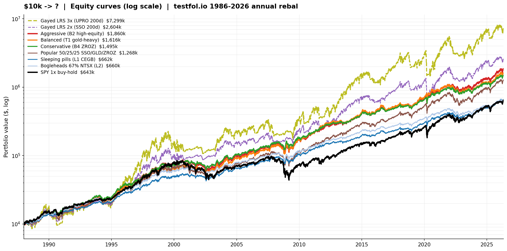
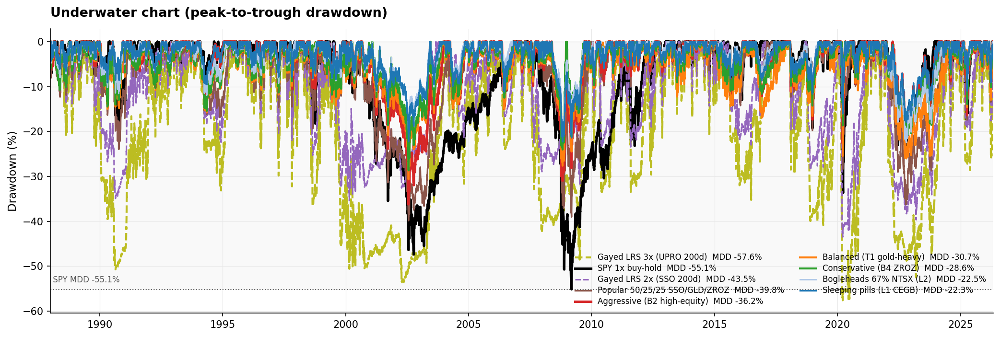
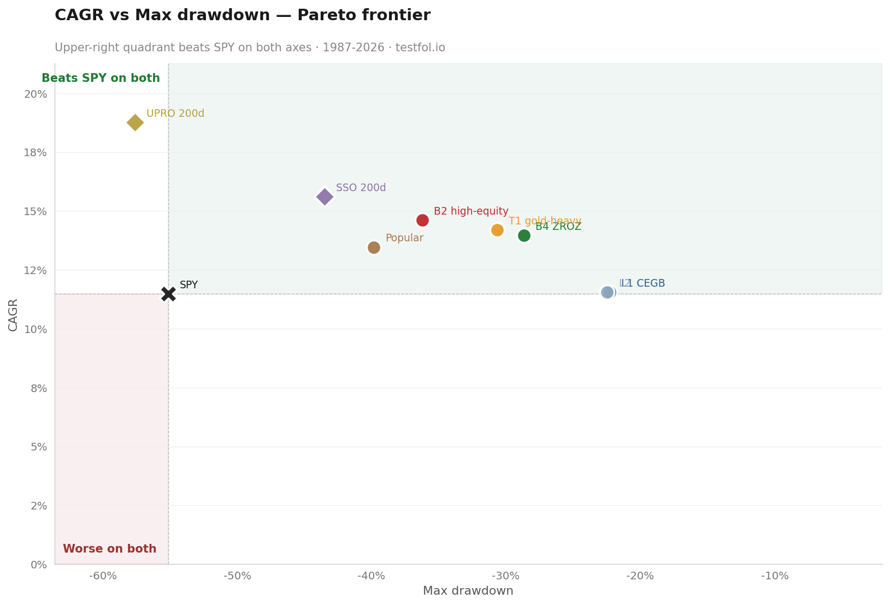

# Anyone got a portfolio that beats SPY on BOTH CAGR AND Max DD? Here's my best shot — challenge me.

I've been backtesting capital-efficient stacks for the last few weeks. Best 4 candidates I found, vs the obvious benchmarks (SPY, SSO/UPRO buy-hold, Gayed LRS, popular 50/25/25 SSO/GLD/ZROZ). All on testfol.io, common start 1987-12-31 → 2026-04-30, annual rebal, dividends reinvested, full SIM proxies for newer ETFs.

**My question to the sub: anyone running something that beats my top 4 on _both_ axes (higher CAGR AND lower Max DD than SPY)? I'd love to be proven wrong.**

---

## The 9 portfolios

| # | name | weights |
|---|---|---|
| 1 | **Aggressive (B2)** | 30% NTSX + 30% GDE + 30% RSST + 10% TMF |
| 2 | **Balanced (T1)** | 20% NTSX + 35% GDE + 25% RSST + 20% TMF |
| 3 | **Conservative (B4)** | 25% NTSX + 25% GDE + 25% RSST + 25% ZROZ |
| 4 | **Sleeping pills (L1 CEGB)** | 40% NTSX + 25% GDE + 17.5% KMLM + 17.5% TLT |
| 5 | Popular 50/25/25 | 50% SSO + 25% GLD + 25% ZROZ |
| 6 | SPY 1× | 100% SPY |
| 7 | SSO 2× buy-hold | 100% SSO |
| 8 | UPRO 3× buy-hold | 100% UPRO |
| 9 | Gayed LRS 2× / 3× | SPY > 200d SMA → SSO/UPRO else IEF |

---

## Results (testfol.io, ~38y window, sorted by Sharpe)

| portfolio | CAGR | Max DD | Sharpe | $10k → today |
|---|---:|---:|---:|---:|
| 🟢 **Conservative (B4 ZROZ)** | 13.96% | **-28.65%** | **0.798** ⭐ | $1.50M |
| 🔵 **Sleeping pills (L1 CEGB)** | 11.56% | -22.27% | 0.782 | $662k |
| ⚪ Bogleheads 67% NTSX | 11.55% | -22.48% | 0.778 | $660k |
| 🔴 **Aggressive (B2)** | **14.61%** | -36.21% | 0.772 | **$1.86M** |
| 🟠 **Balanced (T1)** | 14.19% | -30.66% | 0.744 | $1.62M |
| Popular 50/25/25 SSO/GLD/ZROZ | 13.47% | -39.84% | 0.637 | $1.27M |
| Gayed LRS 2× (SSO 200d) | 15.62% | -43.49% | 0.595 | $2.60M |
| Gayed LRS 3× (UPRO 200d) | **18.77%** | -57.59% | 0.575 | $7.30M |
| SPY 1× buy-hold | 11.48% | -55.14% | 0.528 | $643k |
| SSO 2× buy-hold | 14.59% | -88.67% | 0.476 | **$5.95M** ‡ |
| UPRO 3× buy-hold | 14.92% | **-98.29%** | 0.475 | $6.49M ‡ |

‡ SSO/UPRO buy-hold show high terminal but **−88% / −98% drawdowns make this unholdable in practice** — anyone who held UPRO 1×→0.017× through 2008 either had iron stomach or sold out. The Sharpe captures this brutally (0.47).

---

## What this looks like

**Equity curves** ($10k start, log scale):



**Drawdowns** (the part that hurts):



**CAGR vs Max DD** (upper-right = beats SPY on both):



---

## The question

I'm seeing 4 portfolios in the **upper-right quadrant** of the scatter (CAGR > SPY AND |MaxDD| < SPY). All static, all annual rebal, no signals.

**Anyone hold something not on this list that lands in that quadrant?**

I'm specifically curious about:
- Different MF blends (CTA? simplify managed futures combos?)
- Different duration handling (DBLTX? VGLT? TLTW with covered calls?)
- Modified risk-parity weights (different from CEGB)
- Capital-efficient ETFs I haven't considered (RSBT? RSSB? NTSI?)

Also genuinely curious if anyone has UPRO LRS variants with a smarter signal than 200d SMA that crosses the upper-right quadrant. I tested Gayed canonical and it lands in lower-right (better CAGR, worse MDD).

---

## Replicate on testfol.io

Set "Rebalance: Yearly", "Reinvest dividends: Yes", paste the SIM tickers below into the allocation builder. CASHX legs handle the implicit borrow cost on the leveraged sleeves.

```
Aggressive (B2):    57% SPYSIM  30% GDESIM  30% KMLMSIM  18% IEFSIM  10% TLTSIM?L=3&E=1.05  -45% CASHX
Balanced (T1):      43% SPYSIM  35% GDESIM  25% KMLMSIM  20% TLTSIM?L=3&E=1.05  12% IEFSIM  -35% CASHX
Conservative (B4):  47.5% SPYSIM  25% GDESIM  25% KMLMSIM  25% ZROZSIM  15% IEFSIM  -37.5% CASHX
Sleeping pills (L1): 36% SPYSIM  25% GDESIM  24% IEFSIM  17.5% KMLMSIM  17.5% TLTSIM  -20% CASHX
Bogleheads (L2):    60.3% SPYSIM  40.2% IEFSIM  11% GLDSIM  11% KMLMSIM  11% ZROZSIM  -33.5% CASHX
Popular 50/25/25:   50% SPYSIM?L=2&E=0.89  25% GLDSIM  25% ZROZSIM
```

The `SPYSIM?L=2&E=0.89` syntax tells testfol.io to apply daily 2× leverage with 0.89% expense (matches SSO mechanics). NTSX/GDE/RSST decompose into SPY + futures + cash via the standard 90/60, 90/90, 100/100 stacking formulas — that's why the SPY weights look high and there's a negative CASHX leg (it represents the implicit T-bill borrow funding the futures notional).

---

**Convince me there's something better. CAGR > SPY's 11.48%, Max DD < SPY's -55.14%, Sharpe > 0.78. Holding period 30 years. What do you got?**
