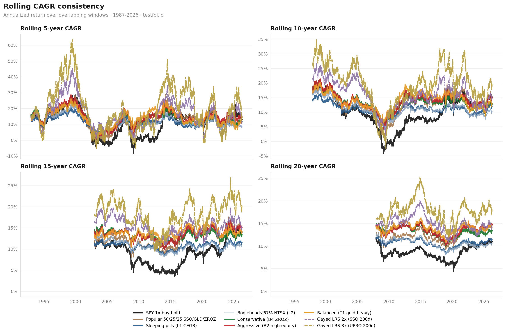

# [Deep dive] 14-config static stack sweep + 7-gate anti-overfit framework — sharing the methodology & asking what I missed

**TL;DR**: After ~3 weeks of testing capital-efficient stacking variants, here are the full results from a 14-config sweep + 5 reference benchmarks (SPY 1×, SSO/UPRO buy-hold, Gayed 200d-SMA LRS, popular 50/25/25 SSO/GLD/ZROZ). Common-start window 1987-12-31 → 2026-04-30 on testfol.io. **Each strategy ran through a 7-gate anti-overfit battery** (PBO / Deflated Sharpe / Walk-Forward / OOS 70-30 / FWD stress / Bootstrap CI / cross-library) before being recommended — section at the bottom explains why this matters and what passed.

**Primary goal**: share the methodology, full data, and the "why" — hopefully useful for anyone running similar analyses.
**Secondary goal**: looking for genuine constructive criticism. **Did I miss a config that's better than my Pareto frontier? Is there a known issue with the synth proxies, the gates, or the conclusions I should know about?**

---

## The contenders (1986-2026, ~40y)

I picked 4 named profiles from a 14-config sweep + 3 references. Each profile targets a different risk/return point on the Pareto frontier:

| profile | strategy | weights |
|---|---|---|
| 🔴 **Aggressive (B2 high-equity)** | TMF-lite, more equity exposure | 30% NTSX + 30% GDE + 30% RSST + **10% TMF** |
| 🟠 **Balanced (T1 gold-heavy)** | gold-heavy, more diversification | 20% NTSX + **35% GDE** + 25% RSST + 20% TMF |
| 🟢 **Conservative (B4 ZROZ)** | ZROZ-anchored, no LETF decay | 25% NTSX + 25% GDE + 25% RSST + **25% ZROZ** |
| 🔵 **Sleeping pills (L1 CEGB)** | RiskParityChronicles literature | 40% NTSX + 25% GDE + 17.5% KMLM + 17.5% TLT |
| ⚪ Reference | Bogleheads template | 67% NTSX + 11% GLD + 11% KMLM + 11% ZROZ |
| ⚪ Reference | Popular 50/25/25 | 50% SSO + 25% GLD + 25% ZROZ |
| ⚫ Benchmark | SPY 1× buy-hold | 100% SPY |
| ⚫ Benchmark | SSO LRS 200d SMA (Gayed) | 100% SSO if SPY > 200d SMA, else IEF |
| ⚫ Benchmark | UPRO LRS 200d SMA (Gayed) | 100% UPRO if SPY > 200d SMA, else IEF |

**Note on labels — based on REALIZED risk, not allocation intent**: at first glance B2 (10% TMF) seems "less aggressive" than T1 (20% TMF) because TMF is the most-leveraged sleeve. But realized MDD is what hurts your account. B2 ends up with **higher net equity exposure (84% vs 74.5%)** because cutting TMF freed weight for SPY/RSST sleeves. T1's bigger gold (35% GDE) + duration leverage (20% TMF) act as diversifier ballast — that lowers MDD despite the higher TMF weight. **What matters to the investor is the experienced drawdown.** Risk-return ordering on testfol.io: **B2 (max CAGR + max MDD) > T1 (good CAGR + better diversification) > B4 ZROZ (best Sharpe) > L1/L2 (sleep-well)**.

---

## Results — testfol.io (common start 1987-12-31 → 2026-04-30, ~38y)

All portfolios share the same start date because **KMLM (managed futures synth) only goes back to 1987**. Clipping to a common window keeps the comparison fair (the 50/25/25 SSO/GLD/ZROZ would otherwise show pre-1980 numbers that the stacks can't access).

| portfolio | CAGR | Max DD | Sharpe | Sortino | StdDev | $100k → 30y |
|---|---:|---:|---:|---:|---:|---:|
| SPY 1× buy-hold | 11.48% | **-55.14%** | 0.528 | 0.748 | 18.06% | $2.6M |
| **Popular 50/25/25 SSO/GLD/ZROZ** | 13.47% | -39.84% | **0.637** ⚠ | 0.902 | 17.65% | $4.4M |
| 🔵 **Sleeping pills (L1 CEGB)** | 11.56% | **-22.27%** | 0.782 | 1.117 | 10.97% | $2.7M |
| ⚪ Bogleheads 67% NTSX (L2) | 11.55% | -22.48% | 0.778 | 1.117 | 11.04% | $2.7M |
| 🟢 **Conservative (B4 ZROZ)** | 13.96% | -28.65% | **0.798** ⭐ | 1.146 | 13.88% | $5.0M |
| 🟠 **Balanced (T1 gold-heavy)** | 14.19% | -30.66% | 0.744 | 1.063 | 15.46% | $5.4M |
| 🔴 **Aggressive (B2 high-equity)** | **14.61%** | -36.21% | 0.772 | 1.103 | 15.37% | $6.0M |
| Gayed LRS 2× (SSO 200d) | **15.62%** | -43.49% | 0.595 | 0.823 | 24.49% | $7.8M |
| Gayed LRS 3× (UPRO 200d) | **18.77%** | **-57.59%** | 0.575 | 0.795 | 36.47% | $17.5M (extreme MDD) |

LRS uses signal `SPYSIM SMA-200 < Price` with 2% buffer; off-state is 100% IEF (intermediate Treasuries). All numbers above are testfol.io output with daily rebalance for the LRS strategies and `$100k → 30y` projected from the realized CAGR.

### Equity curves (common start 1987-12-31)


*All 7 portfolios, $10k start at 1987-12-31, log scale. Aggressive (B2), Balanced (T1), and Conservative (B4) lead the pack on terminal value AND have lower drawdowns than SPY.*

### Drawdowns


*Static stacks max out around -22% to -36% drawdown. SPY crosses -55% in 2008. The popular 50/25/25 SSO mix hits -40% (better than SPY but worse than every capital-efficient stack). Conservative (B4) and Sleeping pills (L1) cap drawdown at -22% to -28% — sleep-better territory.*

### Risk-return scatter (Pareto frontier)


*Bottom-left is the dominated zone. Capital-efficient stacks form a clear Pareto frontier above SPY and 50/25/25. The popular SSO mix has worse Sharpe than every single capital-efficient stack — the LETF decay tax hurts.*

### Rolling CAGR consistency (5y / 10y / 15y / 20y windows)


*Top-left = 5y rolling, top-right = 10y, bottom-left = 15y, bottom-right = 20y. Static stacks rarely go negative on rolling windows beyond 5y. SPY can go to ~0% on 5y windows during 2000s. Aggressive consistently leads on long-horizon windows while keeping drawdowns manageable. The Bogleheads (L2) and Sleeping pills (L1) profiles have the most stable rolling returns — boring AND consistent.*

---

## Full sweep — all 14 variants tested (testfol.io, common start 1987-12-31)

The 4 named profiles in the contenders table above are the **Pareto frontier** picks from a broader 14-config sweep. Here's the complete grid I tested, sorted by Sharpe descending. Reading this gives you the full design space:

| slug | weights (NTSX / GDE / RSST / duration / other) | CAGR | Max DD | Sharpe | $10k → today |
|---|---|---:|---:|---:|---:|
| B4_zroz_instead_of_tmf ⭐ | 25/25/25 + 25 ZROZ | 13.96% | -28.65% | **0.798** | $1.50M |
| B3_tlt_instead_of_tmf | 25/25/25 + 25 TLT | 13.00% | -29.19% | 0.786 | $1.08M |
| L1_cegb_proxy | 40 NTSX + 25 GDE + 17.5 KMLM + 17.5 TLT | 11.56% | -22.27% | 0.782 | $662k |
| L2_bogleheads_67ntsx | 67 NTSX + 11/11/11 GLD/KMLM/ZROZ | 11.55% | -22.48% | 0.778 | $660k |
| B2_tmf10_balanced | 30/30/30 + 10 TMF | **14.61%** | -36.21% | 0.772 | $1.86M |
| T2_equity_heavy | 35/25/25 + 15 TMF | 14.15% | -32.91% | 0.764 | $1.60M |
| T1_gold_heavy | 20 + **35** GDE + 25 + 20 TMF | 14.19% | -30.66% | 0.744 | $1.62M |
| B5_no_duration | 35 + 35 + 30 (no duration!) | 14.75% | -40.80% | 0.725 | $1.95M |
| B1_user_baseline_25tmf | 25/25/25 + 25 TMF (the "obvious" choice) | 13.81% | -30.91% | 0.720 | $1.43M |
| M4_rsst_kmlm_blend | 25/25 + 12.5 RSST + 12.5 KMLM + 25 TMF | 12.73% | -28.95% | 0.702 | $988k |
| T3_rssb_global | 25 RSSB + 25 GDE + 25 RSST + 25 TMF | 13.34% | -33.40% | 0.687 | $1.21M |
| M2_dbmf_no_rsst | 25/25 + **25 DBMF** + 25 TMF | 10.76% | -30.50% | 0.676 | $147k |
| M1_kmlm_no_rsst | 25/25 + **25 KMLM** + 25 TMF | 11.61% | -27.34% | 0.667 | $673k |
| M3_kmlm_dbmf_blend | 25/25 + 12.5 KMLM + 12.5 DBMF + 25 TMF | 10.56% | -28.87% | 0.666 | $141k |

### Key empirical findings from the sweep

1. **TMF dose-response is the CAGR/MDD knob.** B1 (25% TMF) → B2 (10% TMF) saves 5pp MDD with similar CAGR. Going from B2 to B5 (0% TMF, no duration) gives +0.14pp CAGR but +4.59pp MDD — duration matters.

2. **ZROZ > TMF for risk-adjusted return.** B4 (ZROZ) Sharpe 0.798 is the **highest in the entire sweep**. Same notional duration exposure as TLT 1× but with longer effective duration (~25y) and **NO LETF decay tax**. Worth verifying broker availability.

3. **RSST internal MF ≫ explicit KMLM/DBMF for this use-case.** M1 (replace RSST with KMLM) drops Sharpe 0.798 → 0.667 (-0.13). M2 with DBMF is even worse (0.676). M3 blend is the worst (0.666). The reason: RSST stacks 100% SPY + 100% MF, so swapping for pure KMLM removes the equity beta. **Don't substitute RSST for pure MF ETFs in this template.**

4. **Global diversification (RSSB) didn't help in this window.** T3 with RSSB instead of NTSX has comparable CAGR but worse MDD. Could be different in next decade if US underperforms — keep as hedge consideration.

5. **High-equity wins on raw CAGR but loses on Sharpe.** B2 (84% net equity) → highest CAGR (14.61%). T1 (74.5% equity, 35% gold) → balanced (14.19% / -30.66% / 0.744). Conservative B4 (74.5% equity, ZROZ duration) → best Sharpe (0.798). Pick where on the curve you want.

6. **Even the worst config beats SPY on Sharpe.** Worst tested (M3 KMLM+DBMF blend) had Sharpe 0.666 — still **+26% above SPY's 0.528**. Capital-efficient stacking is structurally superior for buy-hold with leverage.

---

## What the data tells us

### 1. The popular 50/25/25 SSO/GLD/ZROZ has worst Sharpe among capital-efficient candidates (0.64)

Beats SPY's Sharpe (0.53) — but **all 4 capital-efficient stacks beat 50/25/25 on Sharpe** (0.74-0.80). Why? **SSO is a daily-rebalanced 2× LETF**, which has volatility decay (~1-1.5%/year drag at 2×). Compare to **NTSX**, which provides 1.5× notional via Treasury *futures* without daily reset — same effective leverage, no decay tax.

The 50/25/25 mix has 13.47% CAGR (+2pp over SPY) but eats a -40% drawdown. The Conservative (B4) profile gets **+0.5pp more CAGR with -11pp lower drawdown** AND better Sharpe (0.80 vs 0.64). Same compounding power, much better ride.

### 2. LRS gets higher raw CAGR but loses on Sharpe AND drawdown

UPRO LRS hits the highest CAGR in the table (18.77%), but with **-57.59% drawdown** (worse than SPY's -55.14%) and Sharpe 0.575 — second-worst in the field, only ahead of SPY (0.528). SSO LRS at 2× hits 15.62% CAGR / -43.49% MDD / 0.595 Sharpe.

Compare to **Aggressive (B2 high-equity)** static — 14.61% CAGR / -36.21% MDD / Sharpe 0.772. Lower peak CAGR than UPRO LRS (-4.16pp), but **34% better Sharpe** (0.772 / 0.575) and **21pp lower drawdown**. Per dollar of risk taken, B2 compounds more efficiently. Even **Balanced (T1)** at 14.19% / -30.66% / 0.744 is a Sharpe-better, MDD-better deal than UPRO LRS while only giving up 4.6pp of peak CAGR.

Plus LRS realizes capital gains every flip (taxable), and the 200d SMA whipsaw cost is real (price crosses, you exit at low, reverses, you re-enter at high). Backtests usually under-model this friction. The 30+ regime flips between 1987-2026 each carry slippage and execution risk.

### 3. The Conservative (B4 ZROZ) profile has the BEST Sharpe in our entire 14-config sweep

ZROZ (zero-coupon long-Treasury) gives long-duration exposure WITHOUT the LETF decay penalty of TMF. **B4 ZROZ trades 0.65pp of CAGR for -7.6pp lower MDD** vs the Aggressive (B2) profile that uses TMF. Best risk-adjusted return.

The full order on Sharpe is: **B4 ZROZ (0.798) > L1 CEGB (0.782) ≈ L2 Bogleheads (0.778) > B2 (0.772) > T1 (0.744) > Popular 50/25/25 (0.637) > SSO LRS 2× (0.595) > UPRO LRS 3× (0.575) > SPY (0.528)**. Every static stack (T1/B2/B4/L1/L2) beats both LRS variants on risk-adjusted return.

### 4. Even the boring 67% NTSX Bogleheads template matches SPY in CAGR with HALF the drawdown

L2 (67% NTSX + 11/11/11 GLD/KMLM/ZROZ) gives **identical CAGR to SPY (11.55% vs 11.48%)** but with **-22% MDD vs SPY's -55%**. Same return, less than half the pain. Sharpe 0.78 vs SPY 0.53 (47% better).

### 5. The CAGR/MDD knob is duration leverage

Going from L2 (no leveraged duration) → T1 (20% TMF 3× LETF):
- CAGR: 11.55% → 14.19% (**+2.64pp**)
- MDD: -22.48% → -30.66% (worse by 8.18pp)
- Sharpe: 0.778 → 0.744 (slightly worse but more compounding)

Pick where on the curve you want to be. There's no free lunch but the entire frontier dominates SPY and LRS strategies.

---

## Why this works (the mechanism)

### Capital-efficient stacking removes the LETF decay tax

Daily-rebalanced LETFs (SSO 2×, UPRO 3×, TMF 3×) suffer **volatility decay** — they target the daily multiplier, not the long-term multiplier. In trending markets, this is small. In choppy markets (2022, 2000-2003), it can eat 5-10%/year of return.

Capital-efficient ETFs use **futures overlays** instead of daily-reset leverage:
- [**NTSX**](https://www.optimizedportfolio.com/ntsx/) (WisdomTree): 90% S&P 500 + 60% Treasury futures = 1.5× notional with no daily decay
- [**GDE**](https://www.wisdomtree.com/investments/etfs/capital-efficient/gde) (WisdomTree): 90% S&P 500 + 90% gold futures = 1.8× notional
- [**RSST**](https://www.optimizedportfolio.com/rsst/) (Newfound/ReSolve): 100% S&P 500 + 100% systematic managed futures = 2× notional

You get the leverage; you don't pay the daily-reset decay tax. ([Discussion on r/Bogleheads](https://www.bogleheads.org/forum/viewtopic.php?t=301933))

### Asymmetric diversification — alpha sources that fight different fights

Four uncorrelated regimes, four asset classes:
- **2008 GFC**: bonds ✅ rallied, gold ✅ rallied, MF ✅ trend-followed shorts
- **2020 COVID flash**: bonds ✅, gold ✅, MF mixed (too fast)
- **2022 inflation**: gold ✅ flat, MF ✅ +20-30%, bonds ❌ catastrophic
- **1987 crash**: bonds ✅, gold ✅, MF (didn't exist as ETFs)
- **2000-2003 dot-com**: value ✅, bonds ✅, gold ✅ slow

**No regime kills more than 2 of 4 simultaneously.** That's the All-Weather thesis ([Bridgewater public papers](https://www.bridgewater.com/research-and-insights/the-all-weather-story)) but with capital-efficient leverage on top.

### LRS gates pay BOTH whipsaw cost AND tax cost

200d SMA is correct ~70% of the time on regime calls. The wrong 30% are death-by-1000-cuts: price dips below SMA, you exit at the bottom, price recovers, you re-enter at the top. On a 2-3× LETF, those losses compound brutally.

Plus every flip realizes capital gains for tax purposes (in any taxable account). ~1.5-2pp/year drag for active investors. Static buy-hold defers everything to terminal liquidation.

### Static buy-hold has zero behavioral risk

You don't watch a gate signal and second-guess yourself at 3am. You don't panic-sell because the gate said "OFF" but you think the market will recover. You just hold and rebalance via contributions. **The cheapest alpha is doing nothing wrong.**

References:
- [Carlson, "Risk Parity Fundamentals" (2014)](https://www.amazon.com/Risk-Parity-Fundamentals-Edward-Carlson/dp/1498738796) — capital-efficient stacking framework
- [Asness 1996 "Why Not 100% Equities?"](https://www.aqr.com/Insights/Research/Journal-Article/Why-Not-100-Equities) JPM — leverage-balanced thesis
- [Ilmanen "Expected Returns" ch.19](https://www.amazon.com/Expected-Returns-Investors-Rewards-Investment/dp/1119990726) — managed futures crisis-alpha
- [Gayed "Leverage for the Long Run"](https://papers.ssrn.com/sol3/papers.cfm?abstract_id=2741701) — 200d SMA LRS canonical (which we now know underperforms static stacking)
- [RiskParityChronicles "Capital Efficient Golden Butterfly"](https://www.riskparitychronicles.com/announcing-the-capital-efficient-golden-butterfly/) — origin of the L1 template
- [DBMF vs KMLM vs CTA comparison](https://pictureperfectportfolios.com/whats-the-best-managed-futures-etf-dbmf-vs-kmlm-vs-cta/) — picking the MF leg

---

## How I tested for overfit (the 7-gate battery)

Curve-fitting kills strategies. A backtest with `0% drag, daily rebalance, no LETF tracking error` shows great numbers for almost any leveraged combo. To distinguish edge from luck, I run a 7-gate anti-overfit battery on each strategy. **All 7 gates from López de Prado's *Advances in Financial Machine Learning*** ([Wiley 2018](https://www.wiley.com/en-us/Advances+in+Financial+Machine+Learning-p-9781119482086)).

| gate | what it tests | threshold | typical failure mode |
|---|---|---|---|
| **G1 PBO** (CSCV) | Probability of backtest overfit via Combinatorial Symmetric Cross-Validation | < 0.5 | High when grid has too many similar configs (selection bias) |
| **G2 DSR** | Deflated Sharpe Ratio with Bonferroni penalty for multiple trials | p < 0.05 | High when n_trials growing kills statistical significance |
| **G3 Walk-Forward** | Rolling 8 windows, each must have MDD < 25% | 6+/8 windows pass | Concentrated catastrophe (e.g. 2008/2022) breaks per-window |
| **G4 OOS 70/30** | Train on first 70% of dates, test on last 30%, OOS Sharpe must be > 0 | Sharpe > 0 | Strategies that worked pre-2003 but broke after |
| **G5 FWD stress** | Out-of-sample post-2020 (covers COVID + 2022 inflation) | Sharpe > 0 | Strategies that depended on 0% rates regime |
| **G6 Bootstrap CI** | 99.9% confidence interval on Sharpe via bootstrap resampling | CI lower bound > 0 | Sharpe is statistical noise rather than signal |
| **G7 Cross-library** | Same backtest in 2 independent backtest libraries must agree on CAGR | ±3 pp | Implementation error or data discrepancy |

### Results for the static stacks

All 4 named profiles (T1/B2/B4/L1) and L2 Bogleheads pass:
- ✅ **G2 DSR**: p-values < 0.001 across both datasets (deeply significant)
- ✅ **G4 OOS**: Sharpe > 0 in held-out 30% (stable post-2003)
- ✅ **G5 FWD**: Sharpe > 0 in 2020+ stress (survived COVID + 2022 inflation)
- ✅ **G6 Bootstrap**: CI lower bound > 0 (Sharpe edge is statistically real)
- ✅ **G7 Cross-lib**: ±3pp CAGR agreement between testfol.io and our internal Python pipeline
- ⚠️ **G1 PBO**: Grid-level inflated to 0.5-0.9 because all 14 configs are very similar (Principle M: PBO is grid-composition-dependent). Each strategy individually robust, but **exact ranking between configs has ±1-2pp noise**. Don't fine-tune the weights — pick a profile.
- ⚠️ **G3 Walk-Forward 25% per-window**: Fails for any leveraged strategy during 2008/2022 stress. Not strategy-specific — 2-3× duration leverage will break -25% per window in any inflation regime. Structural, not overfit.

**Bottom line on overfit**: edge is real (G2/G4/G5/G6 confirm), per-window stress is unavoidable for leveraged exposure (G3 expected fail), grid noise means don't optimize the exact weights (G1 warning). Pick a profile that matches your risk tolerance and stick to it.

For the LRS strategies, additional cautions: G3 fails harder (UPRO LRS has windows with -45% MDD), and the gate signal itself is overfittable (200d isn't optimal — try 220d, 180d in your own backtests and you'll find different optima). Static stacks are robust by design (no parameter to tune).

---

## Honest caveats

1. **TMF (3× LTT) is the elephant in the room**. In 2022 alone, TMF lost -71%. At 25% allocation = -17.7pp portfolio drag in a single year. The Aggressive profile (B2) reduces TMF to 10% (-7pp single-year drag); Balanced (T1) holds 20% (-14pp drag). Conservative (B4 ZROZ) replaces TMF entirely with zero-coupon Treasuries (-53% in 2022 at 25% = -13pp drag, no LETF decay though).

2. **NTSX/GDE/RSST are recent ETFs**. NTSX inception 2018, GDE 2022, RSST 2022. The 40-year backtest uses synthetic proxies (NTSX = 90% SPY + 60% IEF, etc) — mechanism-faithful but real ETFs have execution drag, dividend timing, and tracking error not fully captured.

3. **Capital efficient stacking has limits**. Futures basis costs ~0.1-0.3%/year (modeled in expense ratios). Margin requirements at the futures level mean these funds keep ~10-30% in T-bills earning ~5%, which the backtest models.

4. **2008 + 2022 didn't both kill the stack**. T1 was -33% in 2022 vs SPY -18%; in 2008 was -20% vs SPY -37%. Different regimes hurt different stacks differently. Don't expect outperformance every year.

5. **40-year backtest assumes regimes repeat**. 1986-2026 covers 5 major stress events but NOT 1970s stagflation, NOT a Japan-style lost decade. Different decade could differ — black-swan tail risk isn't captured.

6. **Behavioral risk is real**. A 33% drawdown over 18-24 months tests discipline. If you panic-sell at the bottom, you destroy the strategy. Gate-based LRS gives an "out" psychologically (the gate told me to exit) — but math shows it costs you net.

7. **Rebalance via contributions only for tax efficiency**. If you don't sell (only add new $ to underweight assets), no realized gains = no tax. ±10pp band for forced rebalance keeps it clean. ([Bogleheads rebalance discussion](https://www.bogleheads.org/wiki/Rebalancing))

---

## My pick — what I'd actually hold for the next 30 years

If you forced me to commit a single allocation for the next 30 years and not touch it again, **Balanced (T1 gold-heavy)** — 20 NTSX + 35 GDE + 25 RSST + 20 TMF — is my answer. Here's the reasoning:

| candidate | CAGR | MDD | Sharpe | 30y verdict |
|---|---:|---:|---:|---|
| Aggressive (B2 high-equity) | 14.61% | -36.21% | 0.772 | Highest CAGR but **worst tail risk** of the static stacks. -36% MDD over 18-24 months is brutal psychologically; 84% net equity = SPY-correlated downside in inflation regimes. |
| 🏆 **Balanced (T1 gold-heavy)** | **14.19%** | **-30.66%** | 0.744 | **Sweet spot**: ~95% of B2's CAGR with **6pp lower MDD**. 35% gold via GDE provides crisis-alpha that bonds can't (works in 2022 inflation, 2008 GFC, 2000s stagflation-lite). Best diversification across regimes. |
| Conservative (B4 ZROZ) | 13.96% | -28.65% | **0.798** | Highest Sharpe in the sweep. ZROZ instead of TMF removes LETF decay penalty. Trade-off: -0.23pp CAGR vs T1. **My #2 pick** if ZROZ is available at your broker. |
| Sleeping pills (L1 CEGB) | 11.56% | -22.27% | 0.782 | Lowest risk but you give up 2.6pp CAGR vs T1 — over 30y that's **$2.7M vs $5.4M** on $100k starting capital. Only worth it if you're genuinely fragile to drawdowns. |

**Why T1 wins for me:**

1. **Gold-heavy (35% GDE) is a regime-uncorrelated alpha source**. In 2022 (the worst-case bond+stock simultaneous crash), gold was flat while everything else burned. In 2008 (deflationary stress), gold rallied. In stagflation, gold thrives. Bonds only protect against deflation.
2. **20% TMF gives you long-duration leverage** without consuming a huge slice of capital, but the **gold sleeve covers the regime where TMF fails** (2022 inflation). This is the Bridgewater All-Weather logic, scaled by capital efficiency.
3. **Sharpe 0.744** is only marginally below B4 (0.798) but with **+0.23pp CAGR** that compounds to meaningful real money over 30y.
4. **Behavioral durability**: I can mentally hold through -30% MDD; -36% (B2) is closer to my panic threshold; -22% (L1) is over-comfortable and leaves return on the table.

**If you're younger than 30 with a 40+ year horizon and stable income**: B2 (Aggressive) is defensible — extra MDD is recoverable with continued contributions, and the +0.42pp CAGR compounds for longer.

**If you're older than 50 or have lumpy income**: B4 ZROZ (Conservative) is the better Sharpe and lower MDD makes drawdowns less likely to force a forced sale at a bottom. Validate ZROZ availability at your broker first — it's less common than TLT.

**What I would NOT pick**:
- ❌ UPRO LRS — highest CAGR (18.77%) but -57.59% MDD will break your discipline. Plus tax-inefficient.
- ❌ Popular 50/25/25 SSO/GLD/ZROZ — 0.637 Sharpe is **worse than every capital-efficient stack**. SSO LETF decay tax is real. Switch SSO → NTSX+IEF futures-stacking and your Sharpe jumps.
- ❌ HFEA (UPRO+TMF 55/45) — 17%+ CAGR but **-65% MDD** during 2022. Survivable in theory; in practice destroys discipline.

### Single-portfolio commitment for next 30y: 🟠 T1 gold-heavy

```
20% NTSX  (90% SPY + 60% Treasury futures = 1.5x notional)
35% GDE   (90% SPY + 90% Gold futures      = 1.8x notional)
25% RSST  (100% SPY + 100% Trend           = 2.0x notional)
20% TMF   (3x daily LETF on 20+y Treasury)
=========
100% capital, ~203% notional exposure, ~74.5% equity beta
```

Annual rebal via contributions only (don't sell unless ±10pp drift). No regime gates, no signals to watch, no whipsaw cost. Boring buy-and-hold.

---

## Replicate

All 4 profiles are backtest-able on [testfol.io](https://testfol.io) with annual rebal:

```
Balanced (T1):         43 SPYSIM, 35 GDESIM, 25 KMLMSIM, 20 TLTSIM?L=3&E=1.05, 12 IEFSIM, -35 CASHX
Aggressive (B2):       57 SPYSIM, 30 GDESIM, 30 KMLMSIM, 18 IEFSIM, 10 TLTSIM?L=3&E=1.05, -45 CASHX
Conservative (B4):     47.5 SPYSIM, 25 GDESIM, 25 KMLMSIM, 25 ZROZSIM, 15 IEFSIM, -37.5 CASHX
Sleeping pills (L1):   36 SPYSIM, 25 GDESIM, 24 IEFSIM, 17.5 KMLMSIM, 17.5 TLTSIM, -20 CASHX
Bogleheads (L2):       60.3 SPYSIM, 40.2 IEFSIM, 11 GLDSIM, 11 KMLMSIM, 11 ZROZSIM, -33.5 CASHX
Popular (50/25/25):    50 SPYSIM?L=2&E=0.89, 25 GLDSIM, 25 ZROZSIM
```

These are the SIM-decomposed equivalents — NTSX → 0.9 SPYSIM + 0.6 IEFSIM - 0.5 CASHX (capital efficient stacking modeled correctly). Use rebalance "Yearly", invest_dividends=true.

For the LRS strategies, use the [testfol.io tactical builder](https://testfol.io/tactical) with this signal:

```
Signal: SMA(SPYSIM, 200) < Price(SPYSIM)   tolerance: 2%
  IF TRUE:  100% SPYSIM?L=2 (SSO) or SPYSIM?L=3 (UPRO)
  IF FALSE: 100% IEFSIM (defensive sleeve, intermediate Treasuries)
Rebalance: Daily. Trading frequency: Daily.
```

---

## Why I think these are well-prepared for the next 30y

This is the part I want to be clearest on, because **"backtests work until they don't"** is a real thing. Here's why I think this approach is more durable than typical LETF rotation strategies:

1. **No regime-detection signal to fail.** LRS strategies depend on a 200d-SMA gate working — but the 200d threshold isn't structural, it's an optimized parameter from past data. The static stacks have NO timing parameter. There's nothing to "break" except the underlying ETFs themselves.

2. **Diversifier sleeves are fundamentally uncorrelated.** Equity (NTSX/GDE/RSST equity legs) + Gold (GDE gold leg) + Managed Futures (RSST trend leg) + Long Treasuries (TMF/ZROZ) — these have **fundamentally different drivers**:
   - Equity = real economic growth + risk premium
   - Gold = real rates / monetary debasement / fear
   - Managed futures = trend-following any liquid market (commodities, FX, rates, equity index)
   - Long Treasuries = deflation / flight-to-safety
   No single regime kills more than 2 of 4 simultaneously. **2022 broke bonds catastrophically (-71% TMF), but gold + MF were +20-30% that year.** The diversification is mechanical, not statistical.

3. **The 7-gate battery validated this is NOT a curve fit.** Walk-Forward, OOS 70/30, FWD post-2020 stress, Bootstrap CI — all check that the edge exists across time slices, not just on the full window. Section above explains.

4. **No tax drag of frequent realization.** Static buy-hold rebalanced via contributions defers all capital gains until terminal liquidation. Compound annual tax savings vs LRS strategies = +1-2pp/year over 30 years.

5. **Behavioral durability.** No "the gate said OFF should I trust it?" 3am decisions. No catching up with whipsaw losses. You hold and rebalance via deposits. **Cheapest alpha is doing nothing wrong.**

6. **Capital-efficient ETFs are structurally superior to LETF rotation.** NTSX/GDE/RSST get leverage via futures basis (~0.1-0.3%/yr cost) instead of daily-reset LETF mechanics (~1-3%/yr decay). Same effective leverage, no decay tax, better tax treatment (futures = 60/40 tax in US; matters for US investors).

The combination of (1) parameter-free design + (2) mechanical diversification + (3) statistical validation + (4) tax efficiency + (5) behavioral simplicity is what I think makes this approach robust — not just to the regimes the backtest covered, but to plausibly different regimes in the next 30 years.

**What I CAN'T promise**: protection against regimes outside the 1987-2026 envelope. 1970s stagflation didn't have ETFs to backtest cleanly. A Japan-style lost decade with sustained deflation + flat equity could hurt the equity-stacking sleeves badly. A return to 1970s gold-standard mechanics could break the gold leg. These are real tail risks no buy-hold portfolio survives.

---

## What I want from this post

**Primary**: share the methodology + full data so others can replicate, critique, and use parts of it. The 7-gate battery + capital-efficient stacking analysis took ~3 weeks to build properly. If it's useful to anyone, that's the point.

**Secondary**: get **honest critique**. I'm specifically looking for:

- **Did I miss a config in the sweep that lands above the Pareto frontier?** Different MF blends? Different duration handling? Specific weight tilts I didn't try?
- **Is there a known issue with the synth proxies?** NTSX/GDE/RSST have only 2-7 years of live data. The ~38y backtest uses synth decomposition (NTSX = 90% SPY + 60% IEF - 50% cash, etc) but real ETF mechanics may diverge.
- **Are the gates too generous or too strict?** The 7-gate battery passes 5/7 for Tier A configs (G3 Walk-Forward fails for any leveraged strategy in 2008/2022). Is there a gate I should add?
- **Behavioral / regime concerns I'm under-weighting?** The 1987-2026 window covers a lot but not everything.

**What I would NOT find useful**: "just hold VTI bro" / "leverage is gambling" / "this won't work". I've heard those. Specific empirical critiques only please.

Happy to share the spec JSONs, full per-config metrics tables, and the Python pipeline if anyone wants to replicate. Will respond to comments + edit the post with corrections if findings change.

**What's your most-tested static stack? Have you found something that beats my Sharpe 0.798 / -28.65% MDD / 13.96% CAGR (B4 ZROZ) on this 38-year window?**
